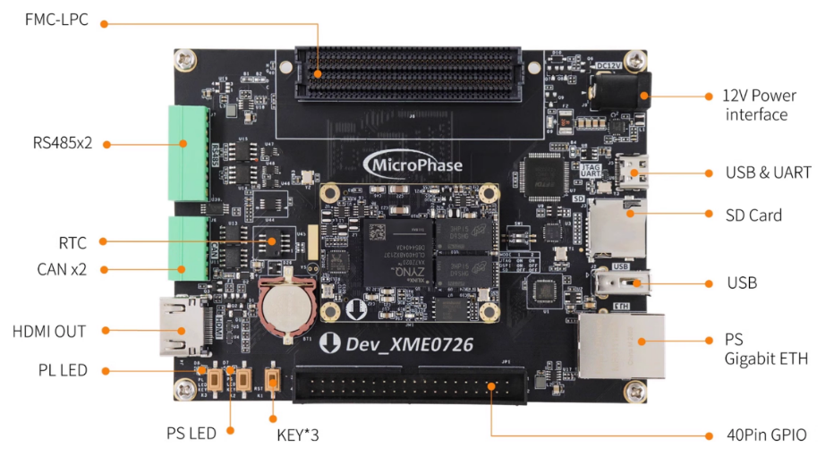
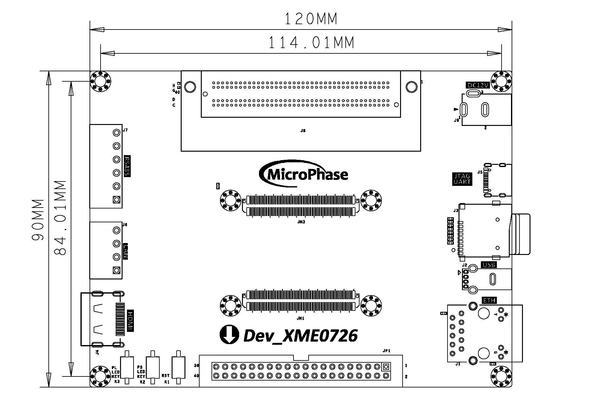
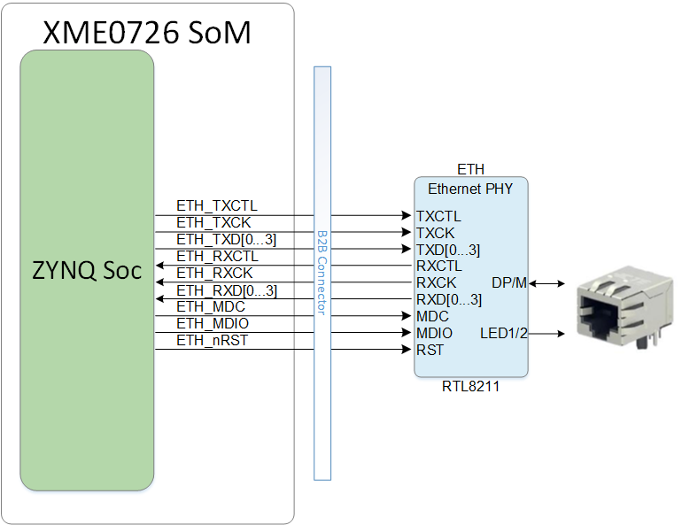
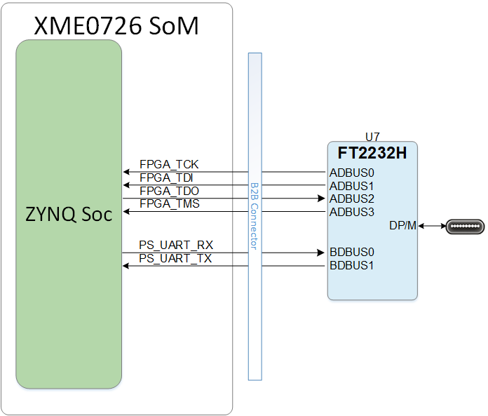
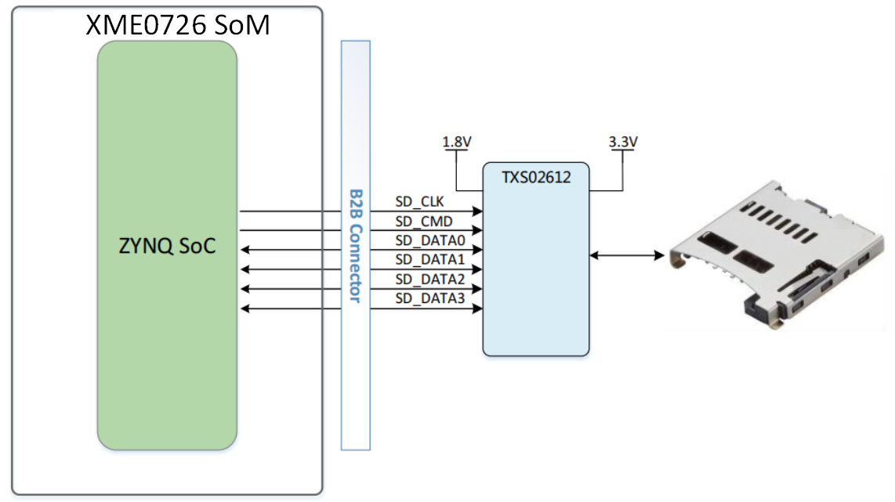
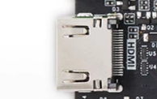

# **DEV_XME0726 用户手册**

[[English]](https://microphase-doc.readthedocs.io/en/latest/CARRIER_BOARD/DEV_XME0726/DEV_XME0726-Reference_Manual.html)

## 微信公众号：

## ●1. 概述

使用 DEV_XME0726，您可以快速测试、开发和评估微相科技的XME0726的功能。它为 XME0726 提供了多种接口，例如FMC-LPC、RS485、CAN、 HDMI TX、千兆以太网、USB Host 等。

### ○板卡布局

### ○资源特性

- 1 个USB JTAG&UART，无需额外的下载器
- 1 个千兆以太网，支持 10/100/1000M 网络传输速率
- 2 路 RS485接口
- 2 路CAN接口
- 1 个 HDMI TX，支持1080P@60Hz输出
- 2 个用户LED；1 个PS端，1 个PL端。
- 1 个PL端用户按键
- 1 个SD接口
- 1 个FMC-LPC接口
- 1 个USB OTG

### ○框图

### ○机械尺寸

## ●2. 功能资源

### ○千兆以太网

底板提供 1 个千兆以太网接口。ETH 的 PHY IC 集成在核心板上，ETH 通过MDI信号与核心板连接。有关 ETH PHY 的更多信息，请参考相应的核心板文档。

核心板与以太网 PHY 芯片的连接图:

### ○USB JTAG&UART

底板提供了一个 USB 转 JTAG&UART 接口，芯片为 FTDI FT2232H。USB 接口为 TYPEC USB。

UART 与 XME0726 的引脚连接分配表如下。

| 信号名称   | FPGA 引脚 | 说明          |
| ---------- | --------- | ------------- |
| PS_UART_RX | U2        | UART 接收信号 |
| PS_UART_TX | V2        | UART 发送信号 |

### ○复位

我们提供了一个按键（K1），可以用作 FPGA 上运行的设计的“复位”信号。

### ○Micro SD

底板提供了一个 Micro SD 接口，供用户访问 SD 卡存储器。

SDIO 信号与 ZYNQ 的 SDIO 连接。Bank 501 的 VCCIO 电压为 1.8V，而 SD 数据电压为 3.3V，因此使用 TXS02612 进行电平转换。

核心板与 SD 的连接图。

### ○HDMI

一个 HDMI 视频输出接口可以实现 1080P 图像以及视频输出。

### ○RS485

提供了2路RS485接口，可以用来进行485通信。接口通过MAX3485实现RS485和3.3V TTL电平的转换。RS485信号连接在BANK 13上，BANK 13电平为3.3V或其余由用户配置的电平，为确保RS485能正常工作，使用PCA9306DCUR进行电平转换。

| 信号名称       | FPGA 引脚 | 说明                |
| -------------- | --------- | ------------------- |
| PL_485_RXD0_LS | T20       | 第一路RS485接收端   |
| PL_485_TXD0_LS | V20       | 第一路RS485发送端   |
| PL_485_DE0_LS  | W20       | 第一路RS485发送使能 |
| PL_485_RXD1_LS | P18       | 第二路RS485接收端   |
| PL_485_TXD1_LS | N17       | 第二路RS485发送端   |
| PL_485_DE1_LS  | U20       | 第二路RS485发送使能 |

### ○CAN

提供了2路CAN接口，使用的芯片是TI的SN65HVD230。CAN信号连接到板卡的BANK 500。

| 信号名称   | FPGA 引脚 | 说明        |
| ---------- | --------- | ----------- |
| PS_CAN0_TX | MIO11     | CAN0 发送端 |
| PS_CAN0_RX | MIO10     | CAN0 接收端 |
| PS_CAN1_TX | MIO12     | CAN1 发送端 |
| PS_CAN1_RX | MIO13     | CAN1 接收端 |

### ○LED

提供了2个用户LED；一个 在PS 侧，一个在 PL 侧的用户 LED。当 FPGA 的相应引脚处于高电平时，LED 会亮起。

| 位置 | 信号名称 | 引脚号 |
| ---- | -------- | ------ |
| D7   | PS_LED   | B5     |
| D8   | GPIO1_8N | F17    |

### ○按键

我们提供了一个PL按键供用户使用。按键按下时，FPGA 的相应引脚将处于低电平。

| 位置 | 信号名称 | 引脚号 |
| ---- | -------- | ------ |
| K3   | GPIO1_8P | F16    |

### ○GPIO

底板提供了一个 IDC40 GPIO 扩展端口：JP1 ，可以连接到微相科技的模块或其他外设。**使用 IO 时，请确保连接的信号电压一致。**

| 引脚 | 信号名称  | 引脚号 | 引脚 | 信号名称  | 引脚号 |
| ---- | --------- | ------ | ---- | --------- | ------ |
| 1    | GPIO1_0P  | L14    | 2    | GPIO1_0N  | L15    |
| 3    | GPIO1_1P  | M14    | 4    | GPIO1_1N  | M15    |
| 5    | GPIO1_2P  | H15    | 6    | GPIO1_2N  | G15    |
| 7    | GPIO1_3P  | K16    | 8    | GPIO1_3N  | J16    |
| 9    | GPIO1_4P  | J18    | 10   | GPIO1_4N  | H18    |
| 11   | VCC_5V    |        | 12   | GND       |        |
| 13   | GPIO1_5P  | K14    | 14   | GPIO1_5N  | J14    |
| 15   | GPIO1_6P  | E17    | 16   | GPIO1_6N  | D18    |
| 17   | GPIO1_7P  | H16    | 18   | GPIO1_7N  | H17    |
| 19   | GPIO1_8P  | F16    | 20   | GPIO1_8N  | F17    |
| 21   | GPIO1_9P  | K19    | 22   | GPIO1_9N  | J19    |
| 23   | GPIO1_10P | G17    | 24   | GPIO1_10N | G18    |
| 25   | GPIO1_11P | C20    | 26   | GPIO1_11N | B20    |
| 27   | GPIO1_12P | E18    | 28   | GPIO1_12N | E19    |
| 29   | VCC_3V3   |        | 30   | GND       |        |
| 31   | GPIO1_13P | B19    | 32   | GPIO1_13N | A20    |
| 33   | GPIO1_14P | G19    | 34   | GPIO1_14N | G20    |
| 35   | GPIO1_15P | J20    | 36   | GPIO1_15N | H20    |
| 37   | GPIO1_16P | M19    | 38   | GPIO1_16N | M20    |
| 39   | GPIO1_17P | L19    | 40   | GPIO1_17N | L20    |

### ○电源

开发板需要 DC12V 电源。请使用指定的电源以避免损坏。

## ●3. 相关文档  

### ○XME0726

- [XME0726_用户手册](https://fpga-docs.microphase.cn/zh-cn/latest/SoM/XME0726/XME0726-Reference_Manual.html) (HTML)

- [XME0726_R10 原理图](https://swnatyr2ph.feishu.cn/file/SC2jb9N9goKYPdxtRgKcDXzenmh) (PDF)
- [XME0726_R10 走线长度](https://swnatyr2ph.feishu.cn/file/RzIZbW7y3ow0UYxRO6BcpQy9n4g) (PDF)
- [XME0726_R10 尺寸](https://swnatyr2ph.feishu.cn/file/CZwUbxJLbo3I30xRQhhckySDnof) (PDF) 
- [XME0726_R10 尺寸源文件](https://swnatyr2ph.feishu.cn/file/CZwUbxJLbo3I30xRQhhckySDnof) (DXF) 

### ○Dev_XME0726 

- [Dev_XME0726_R10 原理图](https://swnatyr2ph.feishu.cn/file/ZjEWbcSZ7oQiRsxASgvckJ2Xnwb) (PDF)
- [Dev_XME0726_R10 尺寸](https://swnatyr2ph.feishu.cn/file/L3PXb4KOqoXBOSxMrqDcdwxhnYq) (PDF)
- [Dev_XME0726_R10 尺寸源文件](https://swnatyr2ph.feishu.cn/file/DTwxbHI3yo4M3dxVCWxcR1FKnlc) (DXF)

