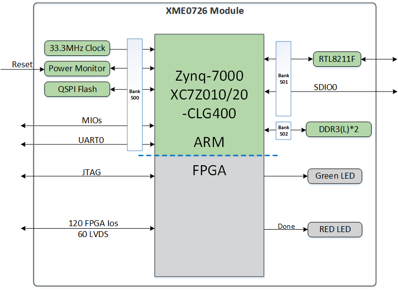

# **DEV_XME0726 Reference Manual**

[[中文]](https://microphase-doc.readthedocs.io/zh-cn/latest/CARRIER_BOARD/DEV_XME0726/DEV_XME0726-Reference_Manual.html)

## WeChat Public Number:

## ●1. Overview

With the DEV_XME0726, you can quickly test, develop, and evaluate the features of Microphase's XME0726. It provides multiple interfaces for XME0726, such as FMC-LPC, RS485, CAN, HDMI TX, Gigabit Ethernet, USB Host, and more.

### ○Board Layout

### ○Key Features

- 1 USB UART & JTAG interface

- 1 Gigabit Ethernet interface, supporting 10/100/1000 Mbps data rates

- 2 RS485 interfaces

- 2 CAN interfaces

- 1 HDMI TX interface, supporting 1080p@60Hz output

- 2 User LEDs: 1 on PS side, 1 on PL side

- 1 User key on PL side

- 1 SD card interface

- 1 FMC-LPC interface

- 1 USB OTG interface

### ○Block diagram

### ○Mechanical Spec

## ●2. Function Resources

### ○Giga ETH

The baseboard provides one Gigabit Ethernet interface. The Ethernet PHY IC is integrated on the core board, and the Ethernet is connected to the core board via MDI signals. For more information about the Ethernet PHY, please refer to the corresponding core board documentation.

Connection diagram between the core board and the Ethernet PHY chip:

### ○USB JTAG&UART

The carrier board provides a USB to UART and JTAG interface, the chip is FTDI FT2232H. The USB interface is TYPE-C.

The pin connection table between UART and XME0726 is as follows.

| Signal Name | FPGA Pin | Explain          |
| ----------- | -------- | ---------------- |
| PS_UART_RX  | U2       | UART data output |
| PS_UART_TX  | V2       | UART data input  |

### ○Reset

We provide a key (K1) that can be used as a ‘reset’ signal for designs running on FPGA.

### ○Micro SD

The board provides a Micro SD card interface, allowing users to access the SD card memory. 

The SDIO signals are connected to the ZYNQ's SDIO interface. The VCCIO voltage of Bank 501 is 1.8V, while the SD data voltage is 3.3V. Therefore, a TXS02612 level shifter is used for voltage translation.

Connection diagram between the core board and the SD interface:

### ○HDMI

An HDMI video output interface is provided, capable of 1080p image and video output.

### ○RS485

Two RS485 interfaces are provided for 485 communication. The interfaces use the MAX3485 to convert between RS485 and 3.3V TTL levels. The RS485 signals are connected to Bank 13, which operates at 3.3V or another user-configured I/O voltage. To ensure proper RS485 operation, the PCA9306DCUR level translator is used for voltage level shifting.

| Signal Name    | FPGA Pin | Explain                      |
| -------------- | -------- | ---------------------------- |
| PL_485_RXD0_LS | T20      | First RS485 Receiver         |
| PL_485_TXD0_LS | V20      | First RS485 Transmitter      |
| PL_485_DE0_LS  | W20      | First RS485 Transmit Enable  |
| PL_485_RXD1_LS | P18      | Second RS485 Receiver        |
| PL_485_TXD1_LS | N17      | Second RS485 Transmitter     |
| PL_485_DE1_LS  | U20      | Second RS485 Transmit Enable |

### ○CAN

Two CAN interfaces are provided, utilizing the SN65HVD230 transceiver from Texas Instruments. The CAN signals are connected to Bank 500 of the board.

| Signal Name | FPGA Pin | Explain          |
| ----------- | -------- | ---------------- |
| PS_CAN0_TX  | MIO11    | CAN0 Transmitter |
| PS_CAN0_RX  | MIO10    | CAN0 Receiver    |
| PS_CAN1_TX  | MIO12    | CAN1 Transmitter |
| PS_CAN1_RX  | MIO13    | CAN1 Receiver    |

### ○LED

Two user LEDs are provided: one on the PS side and one on the PL side. The LED lights up when the corresponding FPGA pin is at a high level.

| Position | **Signal Name** | **Pin Number** |
| -------- | --------------- | -------------- |
| D7       | PS_LED          | B5             |
| D8       | GPIO1_8N        | F17            |

### ○KEY

We provide one user button on the PL side. When the button is pressed, the corresponding FPGA pin will be at a low level.

| Position | **Signal Name** | **Pin Number** |
| -------- | --------------- | -------------- |
| K3       | GPIO1_8P        | F16            |

### ○GPIO

The baseboard provides one IDC40 GPIO expansion port: JP1, which can be connected to Microphase’s modules or other peripherals. **When using the IO, please ensure that the signal voltage levels are consistent.**

| Pin  | Signal Name | Pin Number | Pin  | Signal Name | Pin Number |
| ---- | ----------- | ---------- | ---- | ----------- | ---------- |
| 1    | GPIO1_0P    | L14        | 2    | GPIO1_0N    | L15        |
| 3    | GPIO1_1P    | M14        | 4    | GPIO1_1N    | M15        |
| 5    | GPIO1_2P    | H15        | 6    | GPIO1_2N    | G15        |
| 7    | GPIO1_3P    | K16        | 8    | GPIO1_3N    | J16        |
| 9    | GPIO1_4P    | J18        | 10   | GPIO1_4N    | H18        |
| 11   | VCC_5V      |            | 12   | GND         |            |
| 13   | GPIO1_5P    | K14        | 14   | GPIO1_5N    | J14        |
| 15   | GPIO1_6P    | E17        | 16   | GPIO1_6N    | D18        |
| 17   | GPIO1_7P    | H16        | 18   | GPIO1_7N    | H17        |
| 19   | GPIO1_8P    | F16        | 20   | GPIO1_8N    | F17        |
| 21   | GPIO1_9P    | K19        | 22   | GPIO1_9N    | J19        |
| 23   | GPIO1_10P   | G17        | 24   | GPIO1_10N   | G18        |
| 25   | GPIO1_11P   | C20        | 26   | GPIO1_11N   | B20        |
| 27   | GPIO1_12P   | E18        | 28   | GPIO1_12N   | E19        |
| 29   | VCC_3V3     |            | 30   | GND         |            |
| 31   | GPIO1_13P   | B19        | 32   | GPIO1_13N   | A20        |
| 33   | GPIO1_14P   | G19        | 34   | GPIO1_14N   | G20        |
| 35   | GPIO1_15P   | J20        | 36   | GPIO1_15N   | H20        |
| 37   | GPIO1_16P   | M19        | 38   | GPIO1_16N   | M20        |
| 39   | GPIO1_17P   | L19        | 40   | GPIO1_17N   | L20        |

### ○Power

The development board requires a 12V DC power supply. Please use the specified power adapter to avoid damage.

## ●3. Related Documents

### ○XME0726

- [XME0726_Reference Manual](https://fpga-docs.microphase.cn/en/latest/SoM/XME0726/XME0726-Reference_Manual.html) (HTML)
- [XME0726_R10 Schematic](https://github.com/MicroPhase/fpga-docs/blob/master/schematic/XME0726_R10.pdf) (PDF)
- [XME0726_R10 Dimensions](https://github.com/MicroPhase/fpga-docs/blob/master/mechanical/XME0726/XME0726_R10_Dimensions.pdf) (PDF)
- [XME0726_R10 Dimensions source file](https://github.com/MicroPhase/fpga-docs/blob/master/mechanical/XME0726/XME0726_R10_Dimensions_source_file.dxf) (DXF)

### ○Dev_XME0726 

- [Dev_XME0726_R10 Schematic](https://github.com/MicroPhase/fpga-docs/blob/master/schematic/Dev_XME0726_R10.pdf)(PDF)
- [Dev_XME0726_R10 Dimensions](https://github.com/MicroPhase/fpga-docs/blob/master/mechanical/XME0726/Dev_XME0726_R10_Dimensions.pdf)(PDF)
- [Dev_XME0726_R10 Board source file](https://github.com/MicroPhase/fpga-docs/blob/master/others/Dev_XME0726_R10_Board_source_file.BRD)(Brd)

