# **PE100 Reference Manual**

## Revision History

| Revision | Time       | Description   |
| :------- | :--------- | :------------ |
| Rev. 1.0 | 2024.11.22 | First Release |
|          |            |               |

## CopyRight Notice:

Copyright ©2024 by MicroPhase Technologies (Shanghai) Co. Ltd. All rights are reserved.

## WeChat Public Number:

## ●1. Overview

Using PE100, you can quickly test, develop, and evaluate the function of the Microphase's 5*6 XME series SoM. It provides various interfaces for XME series SoM, such as HDMI TX, Giga ETH, SFP ,PCIe 2.0 x1 and so on.

For now, it supports XME0712、XME0715 and XME0720. It is most recommended to use it with XME0715. The following is based on the XME0715 unless noted.

### ○Board Layout

### ○Key Features

- 1 PCIe x1
- 2 Giga ETH supports 10/100/1000M network transfer rate,1 for PS, 1 for PL
- 2 SFP
- 1 HDMI TX
- 1 USB UART
- 1 SD
- 2 40 pin Extension ports
- 1 JTAG debug port
- 1 system reset key, 2 user's key
- 4 user's LED

### ○Block diagram

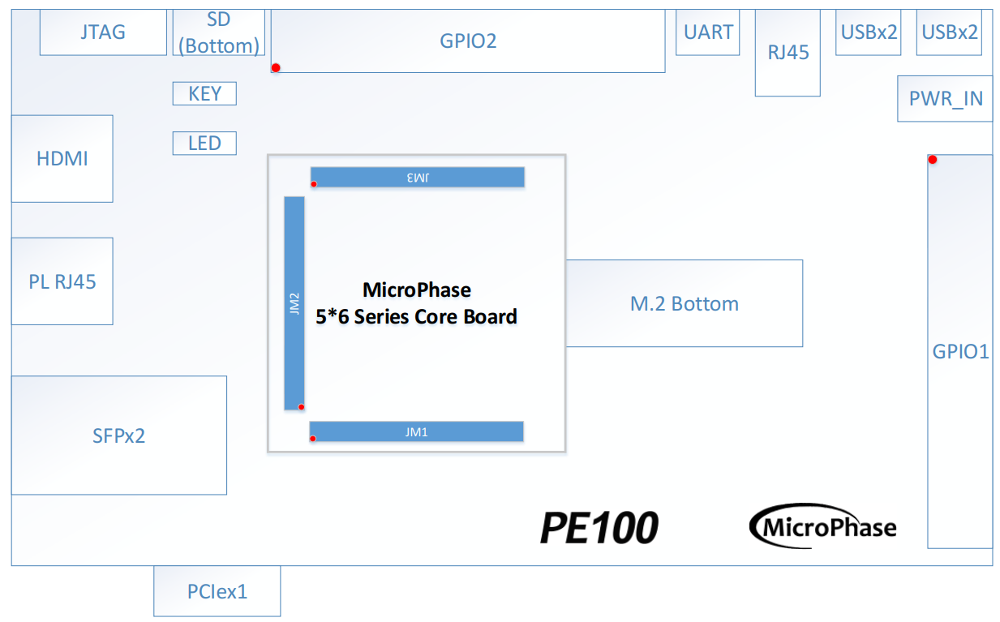

### ○Mechanical Spec

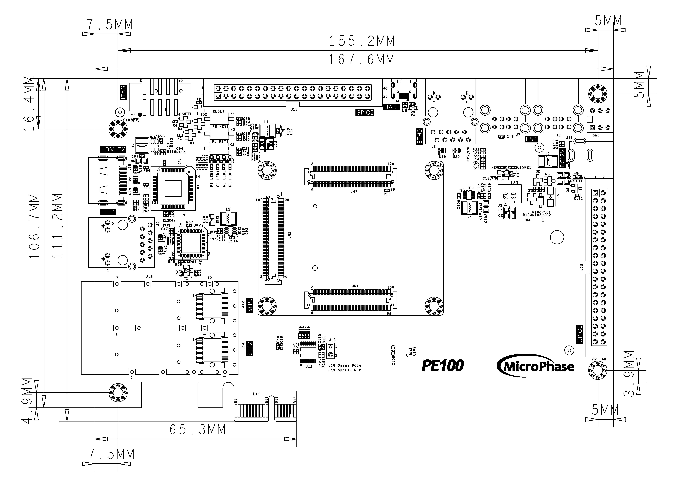

### ○Core Board Matching Description

✔️：Support

❌：Not support

⚠️ :  Pay attention when using

⭐ :  Not fully supported

| PE100    | XME0712-35T | XME0712-75T/100T/200T | XME0715    | XME0720    |
| -------- | ----------- | --------------------- | ---------- | ---------- |
| PCIE x1  | ✔️           | ✔️                     | ✔️          | ❌          |
| ETH0     | ❌           | ✔️                     | ✔️(PS side) | ✔️(PS side) |
| ETH1     | ✔️           | ✔️                     | ✔️          | ✔️          |
| HDMI TX  | ✔️           | ✔️                     | ✔️          | ✔️          |
| SFP x2   | ✔️           | ✔️                     | ✔️          | ❌          |
| USB-UART | ✔️           | ✔️                     | ✔️          | ✔️          |
| SD       | ❌           | ❌                     | ✔️(PS side) | ✔️(PS side) |
| GPIO1    | ✔️           | ✔️                     | ✔️          | ✔️          |
| GPIO2    | ⭐           | ✔️                     | ✔️          | ✔️          |

## ●2. Function Resources

### ○Giga ETH

The carrier board provides 2 Gigabit Ethernet interfaces. The phy IC of ETH0 is integrated in the core board. It's connected with core board according to the signs of MDI. More information of the ETH0 PHY, please reference the  corresponding core board document.

The PHY of ETH1 is Marvell Alaska 88E1512, connected to the core board via the RGMII interface. The 88E1512 is a robust PHY that supports RGMII to RJ45 and SGMII to RJ45, with MDI/MDIX and 10/100/1000 Mbps auto-negotiation capabilities. It supports RGMII to RJ45 and SGMII to RJ45, with MDI/MDIX and 10/100/1000M auto-negotiation.

Diagram of connecting the core board and two Ethernet phy chips.

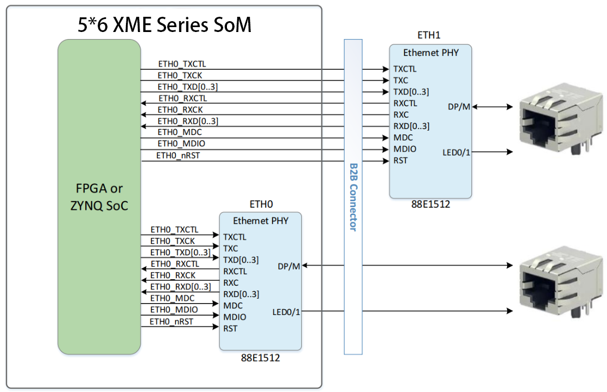

### ○USB HOST

PE100 provides four USB Hosts interfaces. **For XME0712, the USB Host is not supported.** The  USB 3320 is  integrated in the core board. The carrier board expansion four USB Host according to the USB HUB IC USB2514. The interface of USB host is TYPE-A, it can connected with different USB Slave peripheral, such as USB mouse, USB keyboard, USB WIFI and so on.

Diagram of connecting the core board and two Ethernet phy chips.

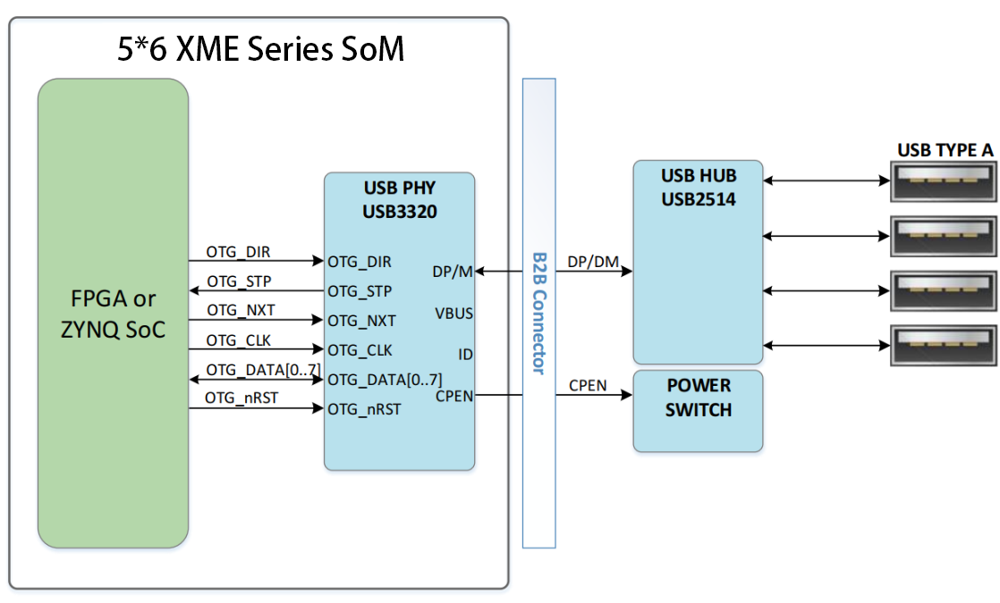

The pin connection assignment table for USB and XME0715 is as follows.

| Signal Name | FPGA Pin | Pin Name     | Explain                                |
| ----------- | -------- | ------------ | -------------------------------------- |
| OTG_NRST    | E18      | PS_MIO8_500  | OTG reset, low active                  |
| OTG_CLK     | A14      | PS_MIO36_501 | ULPI clock output                      |
| OTG_DATA0   | C16      | PS_MIO32_501 | ULPI bi-directional Data0              |
| OTG_DATA1   | G11      | PS_MIO33_501 | ULPI bi-directional Data1              |
| OTG_DATA2   | B11      | PS_MIO34_501 | ULPI bi-directional Data2              |
| OTG_DATA3   | F9       | PS_MIO35_501 | ULPI bi-directional Data3              |
| OTG_DATA4   | A11      | PS_MIO28_501 | ULPI bi-directional Data4              |
| OTG_DATA5   | B9       | PS_MIO37_501 | ULPI bi-directional Data5              |
| OTG_DATA6   | F10      | PS_MIO38_501 | ULPI bi-directional Data6              |
| OTG_DATA7   | C10      | PS_MI039_501 | ULPI bi-directional Data7              |
| OTG_DIR     | E15      | PS_MIO29_501 | Controls the direction of the data bus |
| OTG_NXT     | F14      | PS_MIO31_501 | OTG NXT signal                         |
| OTG_STP     | A12      | PS_MI030_501 | OTG STP signal                         |

### ○USB UART

The carrier board provides a USB to UART interface, the chip is Silicon Labs CP2102. The USB interface is Micro USB.

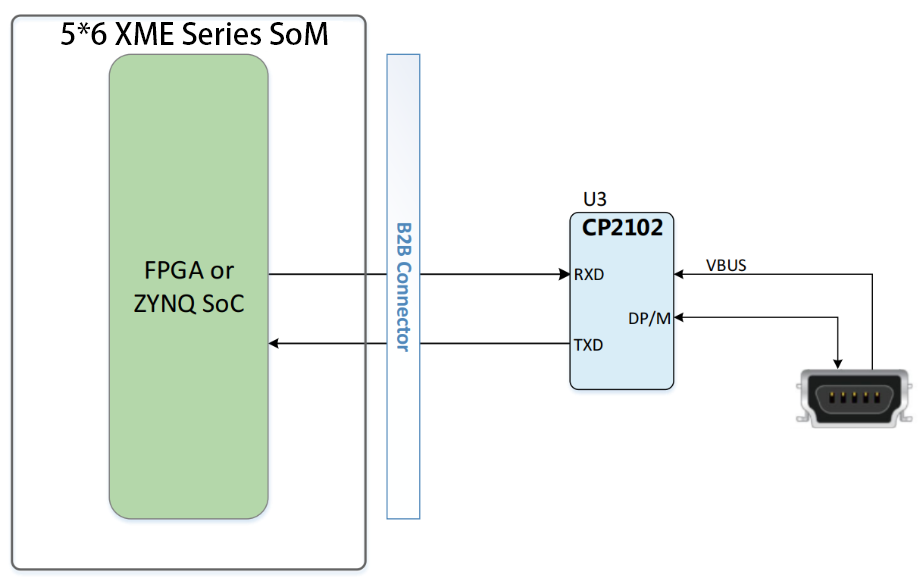

The pin connection assignment table for UART and XME0715 is as follows.

| Signal Name | FPGA Pin | Pin Name     | Explain              |
| ----------- | -------- | ------------ | -------------------- |
| UART_RX     | B17      | PS_MIO14_500 | UART Receive Signal  |
| UART_TX     | E17      | PS_MIO15_500 | UART Transmit Signal |

### ○JTAG

PE100 provides IDC10 JTAG interface. Through the JTAG port, users can download FPGA programs, curing FLASH programs, and online simulation. The JTAG circuit includes diode protection to ensure FPGA signal voltage compliance. However, users are advised to avoid hot-plugging to prevent potential chip damage.
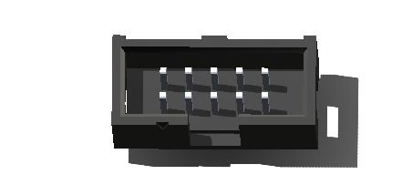

### ○Reset

We provide a key (K1) that can be used as a 'reset' signal for designs running on FPGA.

### ○Micro SD

PE100 provides a Micro SD interface for users to access the SD card memory. **For XME0712,SD is not support.** 

The SDIO sign connected with ZYNQ's SDIO. The VCCIO voltage of Bank 501 is 1.8V while the SD data voltage is 3.3V, thus using TXS02612 to conversion level.

Diagram of connecting the core board and SD.

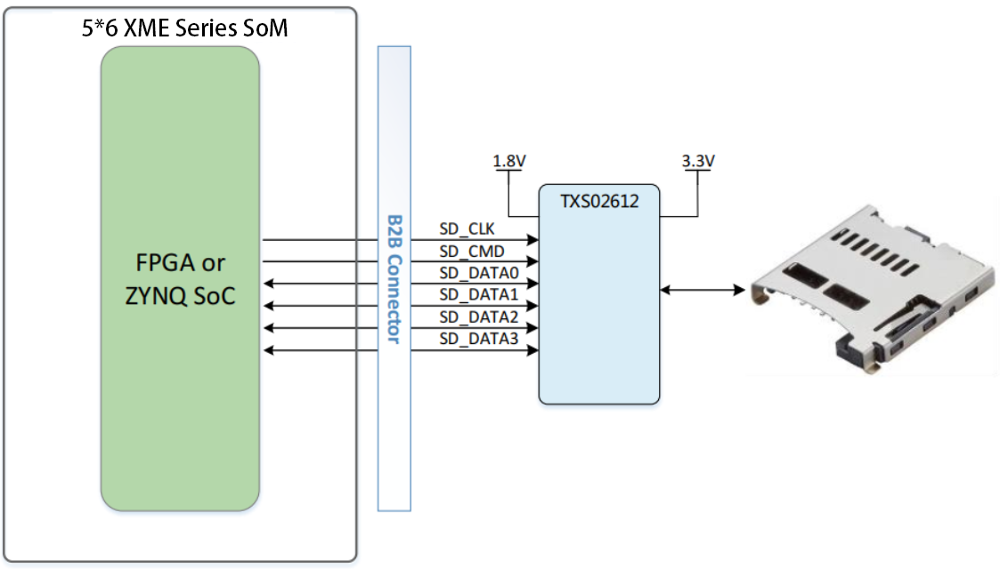

### ○SFP
PE100 provides two SFP interfaces, each SFP using one transceiver channel. According to it user can use SFP hot plug optical module to fibre optic data communications.

Each SFP interface includes the following signals:

- **Transceiver**: Provides one channel for data transmission up to 6.52 Gbps.
- **SMBUS (I2C)**: 3.3V signal for module management.
- **Control signals**: Includes status control.
- **Reference clock**: A 125 MHz differential clock from the carrier board.

Diagram of connecting the core board and SFP.

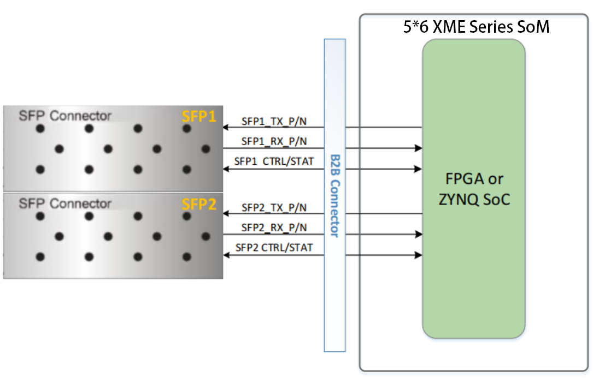

The physical diagram of the SFP interface on the carrier board is shown below.

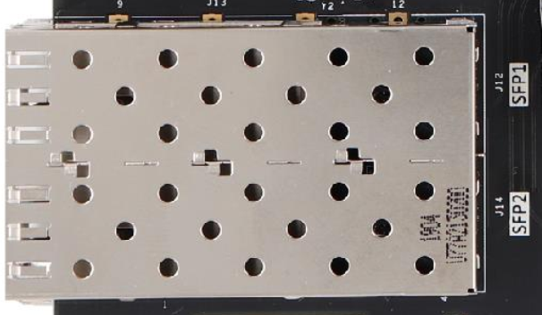

The pin connection assignment table for SFP1 and XME0715 is as follows.

| Signal Name    | FPGA Pin | Explain                                                      |
| -------------- | -------- | ------------------------------------------------------------ |
| SFP1_RX_N      | AB9      | ZYNQ/FPGA Transceiver Receive Data                           |
| SFP1_RX_P      | AA9      | ZYNQ/FPGA Transceiver Receive Data                           |
| SFP1_TX_N      | AB5      | ZYNQ/FPGA Transceiver Transmit data                          |
| SFP1_TX_P      | AA5      | ZYNQ/FPGA Transceiver Transmit data                          |
| SFP1_PRSNTN    | R5       | In-position status signal, pull-up, low means SFP module is in position |
| SFP1_RXLOS     | R4       | Rx LOS, pull-up, high means LOS signal                       |
| SFP1_SCL       | N3       | SMBUS (I2C) clock signal                                     |
| SFP1_SDA       | N4       | SMBUS (I2C) data signal                                      |
| SFP1_TXDISABLE | K5       | Tx_Disable, pull-up, send off when high                      |
| SFP1_TXFAULT   | J5       | Tx_Fault, pull-up, high for fault signal                     |

The pin connection assignment table for SFP2 and XME0715 is as follows.

| Signal Name    | FPGA Pin | Explain                                                      |
| -------------- | -------- | ------------------------------------------------------------ |
| SFP2_RX_N      | Y8       | ZYNQ/FPGA Transceiver Receive Data                           |
| SFP2_RX_P      | W8       | ZYNQ/FPGA Transceiver Receive Data                           |
| SFP2_TX_N      | Y4       | ZYNQ/FPGA Transceiver Transmit data                          |
| SFP2_TX_P      | W4       | ZYNQ/FPGA Transceiver Transmit data                          |
| SFP2_PRSNTN    | N8       | In-position status signal, pull-up, low means SFP module is in position |
| SFP2_RXLOS     | P8       | Rx LOS, pull-up, high means LOS signal                       |
| SFP2_SCL       | P5       | SMBUS (I2C) clock signal                                     |
| SFP2_SDA       | P6       | SMBUS (I2C) data signal                                      |
| SFP2_TXDISABLE | L4       | Tx_Disable, pull-up, send off when high                      |
| SFP2_TXFAULT   | L5       | Tx_Fault, pull-up, high for fault signal                     |

### ○HDMI

One HDMI video output interface can realize 1080P video images.

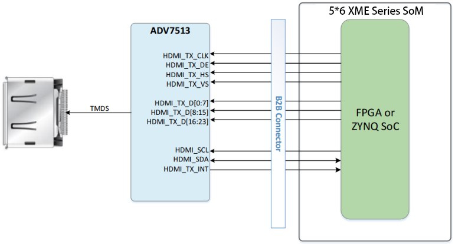

The physical diagram of the HDMI interface on the carrier board is shown below.

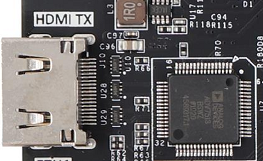

### ○PCIe
The PE100 carrier board is a standard PCI-Express card, it's mechanical dimensions meet the requirements of the standard PCle card electrical specification, it provides a standard PCle x4 slot card, and supports four TX channels and RX channels to PCle gold finger slots, single channel communication rate up to 5Gbps bandwidth, to meet the PCle Gen2 data transfer capacity. The PCIe reference clock is provided to the development board from the PCle slot of the PCle ROOT device (usually a PC) with a reference clock frequency of 100MHz.

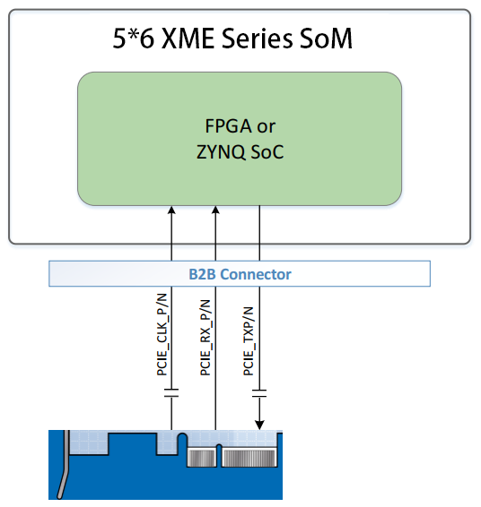

### ○LED

The PE100 includes five LEDs, a power indicator, a PS-controlled user LED, and three PL-controlled user LEDs. When the corresponding pin of the FPGA is in a low state, the LED is illuminated.

| Position | Signal Name | Pin Number |
| :------: | :---------: | :--------: |
|    D8    |   PS_LED1   |    G16     |
|    D9    |   PL_LED1   |     B7     |
|   D10    |   PL_LED2   |     B6     |
|   D11    |   PL_LED3   |     M7     |

### ○Key

We provide two keys for user to use. Once the key is pressed, the corresponding pin of the FPGA will be on the low level.

| Position | Signal Name | Pin Number |
| :------: | :---------: | :--------: |
|    K2    |   PS_KEY    |    C19     |
|    K3    |   PL_KEY    |     J1     |

### ○GPIO

The carrier board provides two IDC40 GPIO expansion ports, JP1 and JP2, which allow connection to Microphase Technology modules or additional peripherals. **When using the IOs, be sure to ensure that the voltage of the connected signal is consistent.**

**JP1:**  

| Pin  | Signal Name | Pin Number | Pin  | Signal Name | Pin Number |
| :--: | :---------: | :--------: | :--: | :---------: | :--------: |
|  1   |  GPIO1_0P   |    AA16    |  2   |  GPIO1_0N   |    AA17    |
|  3   |  GPIO1_1P   |    W17     |  4   |  GPIO1_1N   |    Y17     |
|  5   |  GPIO1_2P   |    AA19    |  6   |  GPIO1_2N   |    AA20    |
|  7   |  GPIO1_3P   |    V16     |  8   |  GPIO1_3N   |    W16     |
|  9   |  GPIO1_4P   |    AB18    |  10  |  GPIO1_4N   |    AB19    |
|  11  |   VCC_5V    |     -      |  12  |     GND     |     -      |
|  13  |  GPIO1_5P   |    U19     |  14  |  GPIO1_5N   |    V19     |
|  15  |  GPIO1_6P   |    AB21    |  16  |  GPIO1_6N   |    AB22    |
|  17  |  GPIO1_7P   |    V18     |  18  |  GPIO1_7N   |    W18     |
|  19  |  GPIO1_8P   |    U17     |  20  |  GPIO1_8N   |    U18     |
|  21  |  GPIO1_9P   |    Y18     |  22  |  GPIO1_9N   |    Y19     |
|  23  |  GPIO1_10P  |    AB13    |  24  |  GPIO1_10N  |    AB14    |
|  25  |  GPIO1_11P  |    R17     |  26  |  GPIO1_11N  |    T17     |
|  27  |  GPIO1_12P  |    V13     |  28  |  GPIO1_12N  |    V14     |
|  29  |   VCC_3V3   |     -      |  30  |     GND     |     -      |
|  31  |  GPIO1_13P  |    AA14    |  32  |  GPIO1_13N  |    AA15    |
|  33  |  GPIO1_14P  |    U11     |  34  |  GPIO1_14N  |    U12     |
|  35  |  GPIO1_15P  |    AA12    |  36  |  GPIO1_15N  |    AB12    |
|  37  |  GPIO1_16P  |    Y12     |  38  |  GPIO1_16N  |    Y13     |
|  39  |  GPIO1_17P  |    V11     |  40  |  GPIO1_17N  |    W11     |

**JP2**

| Pin  | Signal Name | Pin Number | Pin  | Signal Name | Pin Number |
| :--: | :---------: | :--------: | :--: | :---------: | :--------: |
|  1   |  GPIO2_0P   |     G8     |  2   |  GPIO2_0N   |     G7     |
|  3   |  GPIO2_1P   |     F5     |  4   |  GPIO2_1N   |     E5     |
|  5   |  GPIO2_2P   |     G6     |  6   |  GPIO2_2N   |     F6     |
|  7   |  GPIO2_3P   |     F7     |  8   |  GPIO2_3N   |     E7     |
|  9   |  GPIO2_4P   |     D7     |  10  |  GPIO2_4N   |     D6     |
|  11  |   VCC_5V    |     -      |  12  |     GND     |     -      |
|  13  |  GPIO2_5P   |     L6     |  14  |  GPIO2_5N   |     M6     |
|  15  |  GPIO2_6P   |     N1     |  16  |  GPIO2_6N   |     P1     |
|  17  |  GPIO2_7P   |     R3     |  18  |  GPIO2_7N   |     R2     |
|  19  |  GPIO2_8P   |     P3     |  20  |  GPIO2_8N   |     P2     |
|  21  |  GPIO2_9P   |     T2     |  22  |  GPIO2_9N   |     T1     |
|  23  |  GPIO2_10P  |     P7     |  24  |  GPIO2_10N  |     R7     |
|  25  |  GPIO2_11P  |     K7     |  26  |  GPIO2_11N  |     L7     |
|  27  |  GPIO2_12P  |     J8     |  28  |  GPIO2_12N  |     K8     |
|  29  |   VCC_3V3   |     -      |  30  |     GND     |     -      |
|  31  |  GPIO2_13P  |    AA11    |  32  |  GPIO2_13N  |    AB11    |
|  33  |  GPIO2_14P  |    U13     |  34  |  GPIO2_14N  |    U14     |
|  35  |  GPIO2_15P  |    V15     |  36  |  GPIO2_15N  |    W15     |
|  37  |  GPIO2_16P  |    AB16    |  38  |  GPIO2_16N  |    AB17    |
|  39  |  GPIO2_17P  |    W12     |  40  |  GPIO2_17N  |    W13     |

### ○Power

The development board requires a DC12V power supply. Please use the specified power supply to avoid damage. The development board also supports the power supply from the PCle interface. The structure of the power supply is as follows.

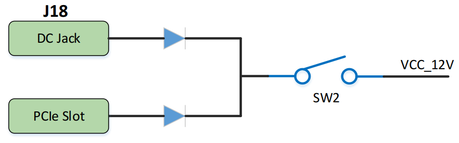

## ●3. Related Documents  

### ○PE100

- [PE100_R11 Schematic](https://github.com/MicroPhase/fpga-docs/blob/master/schematic/PE100_R11.pdf) (PDF)
- [PE100_R11 Dimensions](https://github.com/MicroPhase/fpga-docs/blob/master/mechanical/PE100/PE100_R11_Dimensions.pdf) (PDF)  
- [PE100_R11 Board source file](https://github.com/MicroPhase/fpga-docs/blob/master/mechanical/PE100/PE100_R11_Board_source_file.brd) (Brd)  

### ○Microphase's 5*6 XME Series SoM
- XME0712 Reference Manual(MD)-To be added
- XME0715 Reference Manual(MD)-To be added
- XME0720 Reference Manual(MD)-To be added