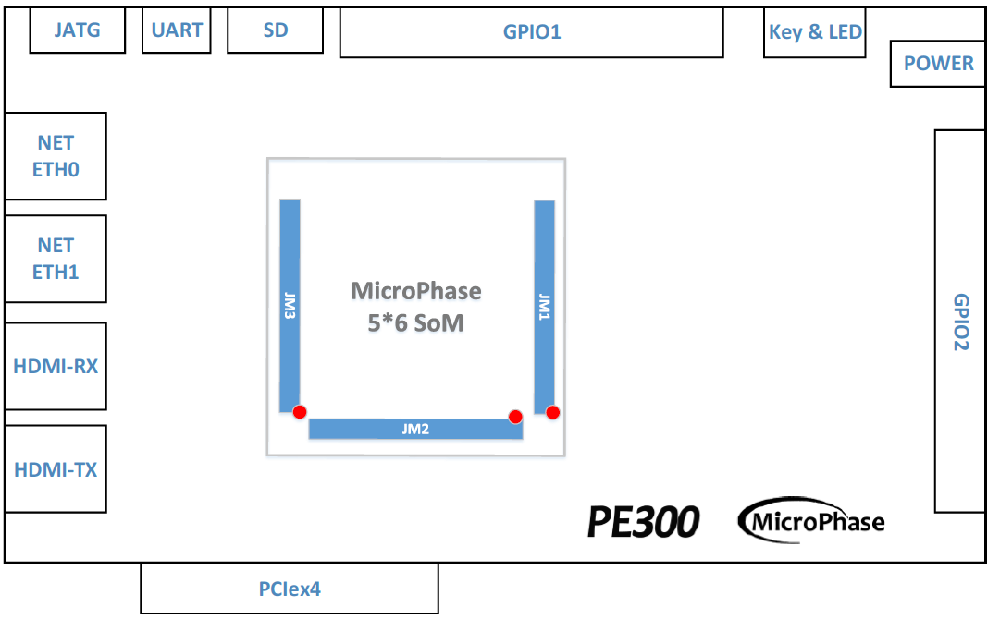

# **PE300 用户手册**

[English](https://microphase-doc.readthedocs.io/en/latest/CARRIER_BOARD/PE300/PE300-Reference_Manual.html)

## 微信公众号：

## ●1. 概述

使用 PE300，您可以快速测试、开发和评估微相科技的 5*6 XME 系列 SoM 的功能。它为 XME 系列 SoM 提供了多种接口，例如 HDMI TX、千兆以太网、SFP、PCIe 2.0 x4 等。

目前，它支持 XME0712、XME0715 和 XME0720。最推荐与 XME0712 一起使用。**在本文档除了特别说明到特定核心板型号的描述外，其它一律是以XME0712核心板来做说明。**

### ○板卡布局

### ○主要特性

- PCIE: 2.0x4。

- GPIO: 2x40 针扩展。

- USB JTAG: 1 个板载 JTAG 电路，可以直接通过 USB 线进行下载和仿真。

- HDMI: 1 个 HDMI 视频输入接口，1 个 HDMI 视频输出接口。

- 千兆以太网: 2x 10/100M/1000M 以太网 RJ-45 端口。

- USB: 1 个 USB UART 通信端口。

- SD: 1 个 SD 卡，仅支持 ZYNQ 核心板。

- JTAG: 调试接口。

- 按键: 2个用户按键。

- LED: 2 个用户 LED。

  **注：因核心板不同，以上接口可能不完全支持，使用时请确认细节。**

### ○框图

### ○机械尺寸

### ○核心板匹配说明

✔️：支持

❌：不支持

⚠️ : 使用需注意

⭐ : 不完全支持

| PE300    | XME0712-35T | XME0712-75T/100T/200T | XME0715  | XME0720  |
| -------- | ----------- | --------------------- | -------- | -------- |
| PCIe x4  | ✔️           | ✔️                     | ✔️        | ❌        |
| ETH0     | ❌           | ✔️                     | ✔️(PS 侧) | ✔️(PS 侧) |
| ETH1     | ✔️           | ✔️                     | ✔️        | ✔️        |
| HDMI TX  | ✔️           | ✔️                     | ✔️        | ✔️        |
| HDMI RX  | ✔️           | ✔️                     | ⭐        | ✔️        |
| USB-UART | ✔️           | ✔️                     | ✔️(PS 侧) | ✔️(PS 侧) |
| SD       | ❌           | ❌                     | ✔️        | ✔️        |
| GPIO1    | ✔️           | ✔️                     | ✔️        | ✔️        |
| GPIO2    | ⭐           | ✔️                     | ⭐        | ✔️        |

## ●2. 功能资源

### ○千兆以太网

底板提供 2 个千兆以太网接口。ETH0 的 PHY IC 集成在核心板上。它根据 MDI 的标记与核心板连接。有关 ETH0 PHY 的更多信息，请参考相应的核心板文档。**XME0712-35T不支持 ETH0。**

ETH1 的 PHY 是 Marvell Alaska 88E1512，通过 RGMII 接口与核心板连接。88E1512 是一个强大的 PHY，支持 RGMII 到 RJ45 和 SGMII 到 RJ45，具有 MDI/MDIX 和 10/100/1000 Mbps 自适应能力。它支持 RGMII 到 RJ45 和 SGMII 到 RJ45，具有 MDI/MDIX 和 10/100/1000M 自适应。

核心板与两个以太网 PHY 芯片的连接图。

### ○HDMI 输入端口

PE300 使用 Analog Devices 的 ADV7611 解码芯片，这是一款高质量的单输入 HDMI® 接收器。ADV7611 集成了一个符合 HDMI 标准的接收器，支持 HDMI 1.4a 规定的所有强制性 3D TV 格式，分辨率高达 1080P/60Hz 和 UXGA 60Hz。

ADV7611 具有一个音频输出端口，用于从 HDMI 流中提取和输出音频数据。HDMI 接收器配备了先进的静音控制器，以消除输出中的杂音。

数字音视频接口连接到 FPGA 的 IO 引脚，芯片的配置和管理 I2C 接口也连接到 FPGA 的 IO 引脚。FPGA 可以通过 I2C 接口对 ADV7611 进行编程，实现初始化和寄存器配置操作。连接图如下所示。

### ○HDMI 输出端口

PE300 使用 Analog 的 ADV7513 解码芯片提供 HDMI 输出，这是一款 165 MHz 的高清多媒体接口 (HDMI®) 发射器。数字视频接口包括一个兼容 HDMI v1.4/DVI v1.0 的发射器。支持所有 HDTV 格式。除了 HDMI V1.4 特定的功能（包括 3D 视频）外，ADV7513 还支持 x.v.Color™、高比特率 (HBR) 音频和可编程辅助视频信息 (AVI) InfoFrame 功能。ADV7513 内置 HDCP 支持，用于安全传输 HDCP v1.4 协议规定的受保护内容。

ADV7513 支持 S/PDIF 和 8 通道 I2S 音频格式。高保真 8 通道 I2S 接口可以传输高达 768 kHz 的立体声或 7.1 声道环绕声。S/PDIF 接口可以传输压缩音频，包括 Dolby® Digital、DTS® 和 THX®。

数字音视频接口连接到 FPGA 的 IO，芯片的配置管理 I2C 接口也连接到 FPGA 的 IO。FPGA 可以通过编程初始化 ADV7513 并配置寄存器，HDMI 接收和发送的 I2C 设置附加到一条总线上。连接图如下所示。

### ○UART

PE300 主板提供了一个 USB 转 UART 接口。使用 Silicon Labs CP2102GM 作为芯片。USB 接口为 Micro USB 接口。连接图如下所示。

### ○PCIE 端口

PE300 扩展板是一个标准的 PCI-Express 卡，其机械尺寸符合标准 PCIe 卡的电气规格，它提供了一个标准的 PCIe x4 插槽卡，并支持四个 TX 通道和 RX 通道到 PCIe 金手指插槽。单通道通信速率可达 5Gbps 带宽，满足 PCIe Gen 2 的数据传输能力。PCIe 参考时钟由 PCIe ROOT 设备（通常是 PC）的 PCIe 插槽提供给开发板。参考时钟频率为 100MHz。**对于 XME0720，不支持 PCIE。** 连接图如下所示。

### ○JTAG

PE300 提供了 IDC10 JTAG 接口。通过 JTAG 端口，用户可以下载 FPGA 程序、固化 FLASH 程序以及进行在线仿真。JTAG 电路包括二极管保护，以确保 FPGA 信号电压符合要求。然而，建议用户避免热插拔，以防止潜在的芯片损坏。

### ○Micro SD

PE300 提供了一个 Micro SD 接口，供用户访问 SD 卡存储器。**对于 XME0712，不支持 SD。**

SDIO 信号与 ZYNQ 的 SDIO 连接。Bank 501 的 VCCIO 电压为 1.8V，而 SD 数据电压为 3.3V，因此使用 TXS02612 进行电平转换。

核心板与 SD 的连接图。

### ○LED

PE300 包括三个 LED，一个电源指示灯和两个 PL 控制的用户 LED。当 FPGA 相应引脚处于低电平时，LED 会亮起。

| 位置 | 信号名称 | 引脚号 |
| ---- | -------- | ------ |
| D8   | PL_LED1  | R4     |
| D9   | PL_LED2  | R5     |

### ○GPIO

底板提供了两个 IDC40 GPIO 扩展端口，JP1 和 JP2，可以连接到微相科技的模块或其他外设。**使用 IO 时，请确保连接信号的电压一致。**

**JP1:**  

| 引脚 | 信号名称  | 引脚号 | 引脚 | 信号名称  | 引脚号 |
| ---- | --------- | ------ | ---- | --------- | ------ |
| 1    | GPIO1_0P  | B17    | 2    | GPIO1_0N  | B18    |
| 3    | GPIO1_1P  | G21    | 4    | GPIO1_1N  | G22    |
| 5    | GPIO1_2P  | C14    | 6    | GPIO1_2N  | C15    |
| 7    | GPIO1_3P  | B20    | 8    | GPIO1_3N  | A20    |
| 9    | GPIO1_4P  | A18    | 10   | GPIO1_4N  | A19    |
| 11   | VCC_5V    | -      | 12   | GND       | -      |
| 13   | GPIO1_5P  | E19    | 14   | GPIO1_5N  | D19    |
| 15   | GPIO1_6P  | F19    | 16   | GPIO1_6N  | F20    |
| 17   | GPIO1_7P  | F18    | 18   | GPIO1_7N  | E18    |
| 19   | GPIO1_8P  | C13    | 20   | GPIO1_8N  | B13    |
| 21   | GPIO1_9P  | D17    | 22   | GPIO1_9N  | C17    |
| 23   | GPIO1_10P | E16    | 24   | GPIO1_10N | D16    |
| 25   | GPIO1_11P | F13    | 26   | GPIO1_11N | F14    |
| 27   | GPIO1_12P | F16    | 28   | GPIO1_12N | E17    |
| 29   | VCC_3V3   | -      | 30   | GND       | -      |
| 31   | GPIO1_13P | E13    | 32   | GPIO1_13N | E14    |
| 33   | GPIO1_14P | B15    | 34   | GPIO1_14N | B16    |
| 35   | GPIO1_15P | D14    | 36   | GPIO1_15N | D15    |
| 37   | GPIO1_16P | A13    | 38   | GPIO1_16N | A14    |
| 39   | GPIO1_17P | A15    | 40   | GPIO1_17N | A16    |

**JP2:**  

| 引脚 | 信号名称  | 引脚号 | 引脚 | 信号名称  | 引脚号 |
| ---- | --------- | ------ | ---- | --------- | ------ |
| 1    | GPIO2_0P  | C18    | 2    | GPIO2_0N  | C19    |
| 3    | GPIO2_1P  | D20    | 4    | GPIO2_1N  | C20    |
| 5    | GPIO2_2P  | E21    | 6    | GPIO2_2N  | D21    |
| 7    | GPIO2_3P  | B21    | 8    | GPIO2_3N  | A21    |
| 9    | GPIO2_4P  | C22    | 10   | GPIO2_4N  | B22    |
| 11   | VCC_5V    | -      | 12   | GND       | -      |
| 13   | GPIO2_5P  | E22    | 14   | GPIO2_5N  | D22    |
| 15   | GPIO2_6P  | G17    | 16   | GPIO2_6N  | G18    |
| 17   | GPIO2_7P  | W14    | 18   | GPIO2_7N  | Y14    |
| 19   | GPIO2_8P  | AA15   | 20   | GPIO2_8N  | AB15   |
| 21   | GPIO2_9P  | J20    | 22   | GPIO2_9N  | J21    |
| 23   | GPIO2_10P | Y16    | 24   | GPIO2_10N | AA16   |
| 25   | GPIO2_11P | U15    | 26   | GPIO2_11N | V15    |
| 27   | GPIO2_12P | AB16   | 28   | GPIO2_12N | AB17   |
| 29   | VCC_3V3   | -      | 30   | GND       | -      |
| 31   | GPIO2_13P | T16    | 32   | GPIO2_13N | U16    |
| 33   | GPIO2_14P | W15    | 34   | GPIO2_14N | W16    |
| 35   | GPIO2_15P | Y13    | 36   | GPIO2_15N | AA14   |
| 37   | GPIO2_16P | T14    | 38   | GPIO2_16N | T15    |
| 39   | GPIO2_17P | V13    | 40   | GPIO2_17N | V14    |

### ○电源

开发板需要 DC12V 电源。请使用指定的电源以避免损坏。开发板还支持从 PCIe 接口供电。电源结构如下。

## ●3. 相关文档  

### ○PE300

- [PE300_R11 原理图](https://github.com/MicroPhase/fpga-docs/blob/master/schematic/PE300_R11.pdf) (PDF)
- [PE300_R11 尺寸](https://github.com/MicroPhase/fpga-docs/blob/master/mechanical/PE300/PE300_R11_Dimensions.pdf) (PDF)  
- [PE300_R11 板源文件](https://github.com/MicroPhase/fpga-docs/blob/master/others/PE300_R11_Board_source_file.brd) (Brd)  

### ○微相科技的 5*6 XME 系列 SoM

- [XME0712 用户手册](https://microphase-doc.readthedocs.io/en/latest/SoM/XME0712/XME0712-Reference_Manual.html)(HTML)
- [XME0715 用户手册](https://microphase-doc.readthedocs.io/en/latest/SoM/XME0715/XME0715-Reference_Manual.html)(HTML)
- [XME0720 用户手册](https://microphase-doc.readthedocs.io/en/latest/SoM/XME0720/XME0720-Reference_Manual.html)(HTML)
