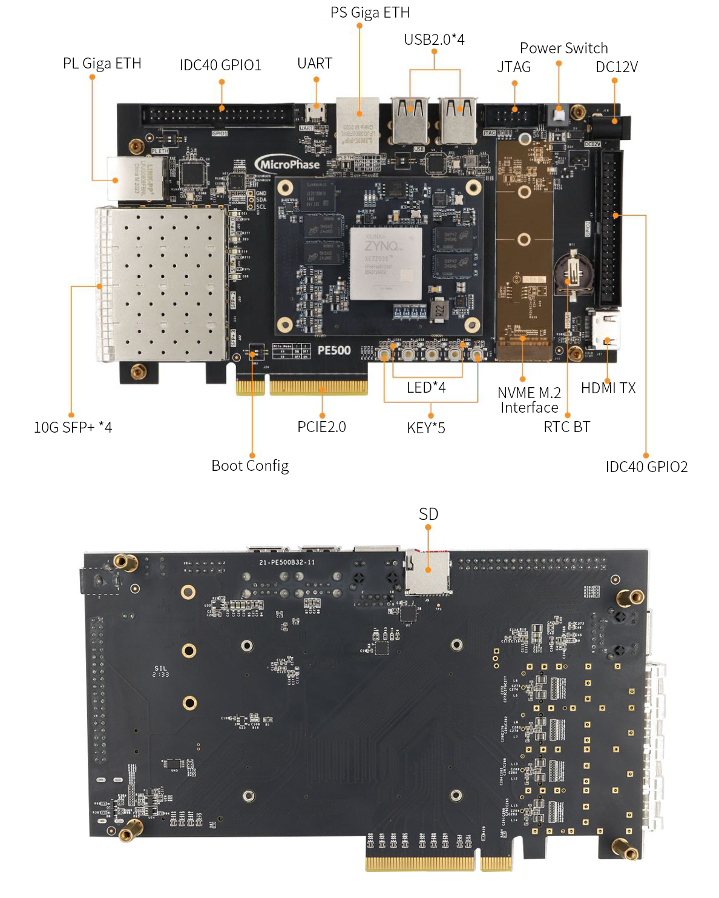
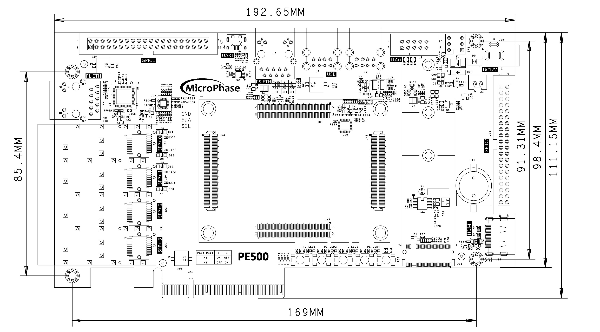
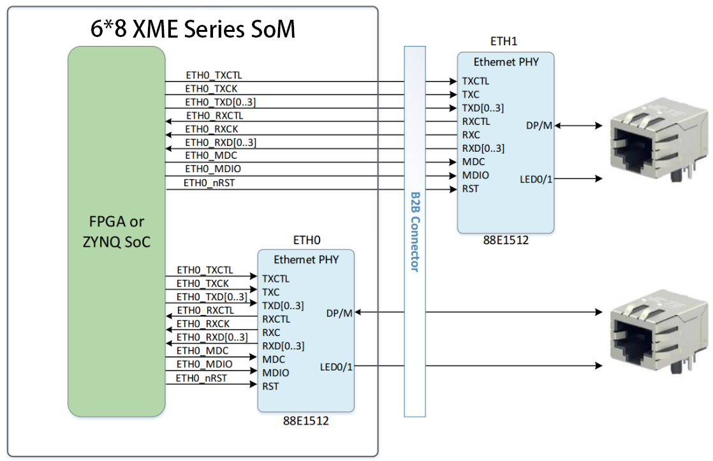
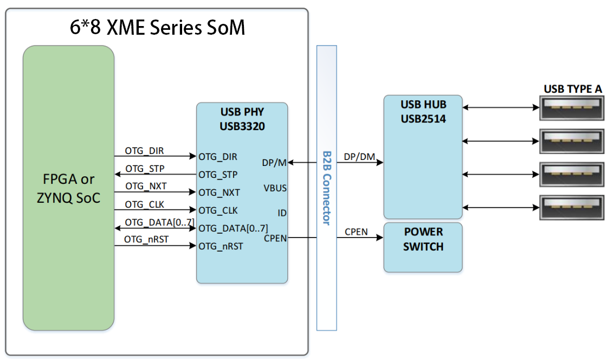
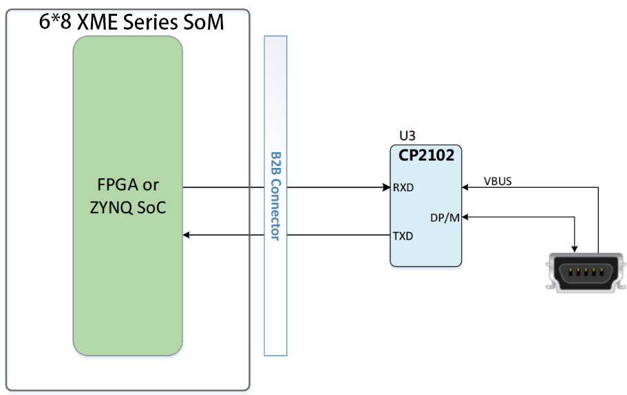
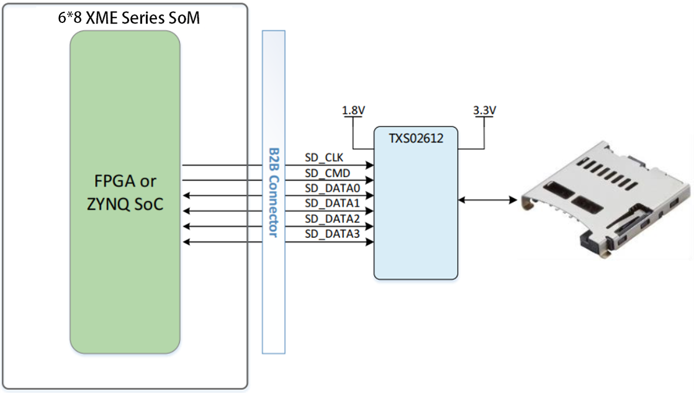
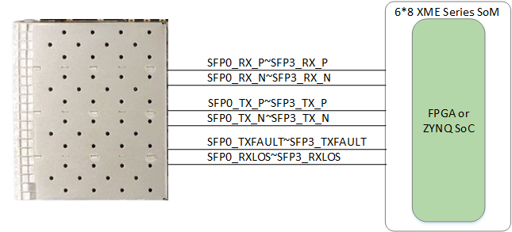
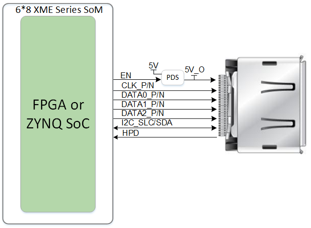
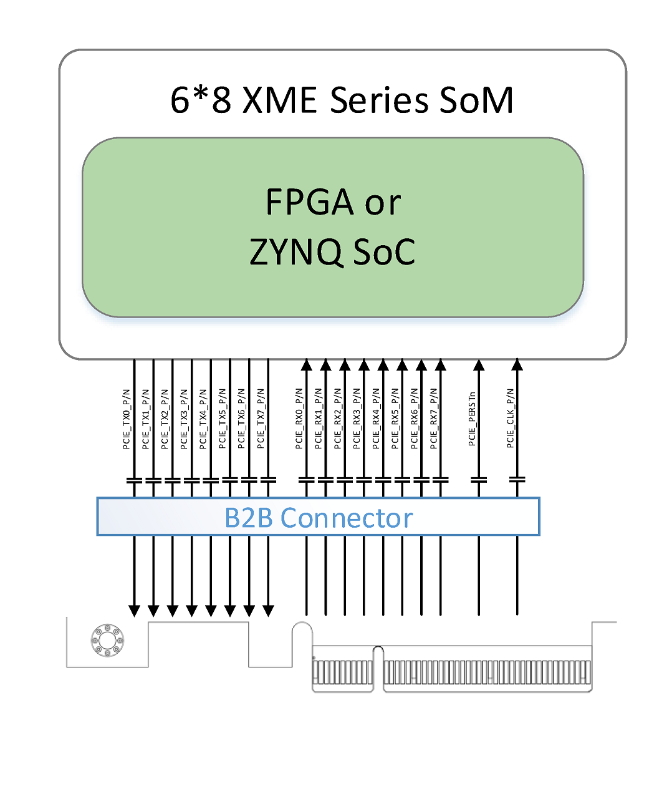
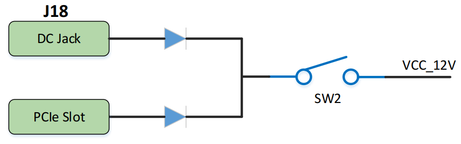

# **PE500 Reference Manual**

## Revision History

| Revision | Time       | Description   |
| :------- | :--------- | :------------ |
| Rev. 1.0 | 2024.12.21 | First Release |
|          |            |               |

## CopyRight Notice:

Copyright ©2024 by MicroPhase Technologies (Shanghai) Co. Ltd. All rights are reserved.

## WeChat Public Number:

## ●1. Overview

Using PE500, you can quickly test, develop, and evaluate the function of the Microphase's 6*8 XME series SoM. It provides various interfaces for XME series SoM, such as HDMI TX, Giga ETH, SFP ,PCIe 2.0 x1 and so on.

For now, it supports XME7035 XME7100. The following is based on the XME7100 unless noted.

### ○Board Layout

### ○Key Features

- 1 PCIe x1

- 2 Giga ETH supports 10/100/1000M network transfer rate,

  1 for PS, 1 for PL

- 4 SFP+

- 1 M.2 Interface

- 1 HDMI TX

- 1 Micro-USB UART

- 1 SD

- 2 40 pin Extension ports

- 1 JTAG debug port

- 4 USB2.0

- 1 system reset key, 4 user's keys

- 4 user's LEDs

### ○Block diagram

### ○Mechanical Spec

### ○Core Board Matching Description

✔️：Support

❌：Not support

⚠️ :  Pay attention when using

⭐ :  Not fully supported

| PE500          | XME7035 | XME7100 |
| -------------- | ------- | ------- |
| PCIE 2.0       | ⭐       | ✔️       |
| PS ETH         | ✔️       | ✔️       |
| PL ETH         | ✔️       | ✔️       |
| HDMI TX        | ✔️       | ✔️       |
| 4*SFP+         | ✔️       | ✔️       |
| M.2 Interface  | ❌       | ✔️       |
| Micro-USB UART | ✔️       | ✔️       |
| SD             | ✔️       | ✔️       |
| 4*USB2.0       | ✔️       | ✔️       |
| GPIO1          | ✔️       | ✔️       |
| GPIO2          | ❌       | ✔️       |

## ●2. Function Resources

### ○Giga ETH

The carrier board provides 2 Gigabit Ethernet interfaces. The phy IC of ETH0 is integrated in the core board. It's connected with core board according to the signs of MDI. More information of the ETH0 PHY, please reference the  corresponding core board document.

The PHY of ETH1 is Marvell Alaska 88E1512, connected to the core board via the RGMII interface. The 88E1512 is a robust PHY that supports RGMII to RJ45 and SGMII to RJ45, with MDI/MDIX and 10/100/1000 Mbps auto-negotiation capabilities. It supports RGMII to RJ45 and SGMII to RJ45, with MDI/MDIX and 10/100/1000M auto-negotiation.

Diagram of connecting the core board and two Ethernet phy chips.

### ○USB HOST

PE500 provides four USB Hosts interfaces. The  USB 3320 is  integrated in the core board. The carrier board expansion four USB Host according to the USB HUB IC USB2514. The interface of USB host is TYPE-A, it can connected with different USB Slave peripheral, such as USB mouse, USB keyboard, USB WIFI and so on.

Diagram of connecting the core board and two Ethernet phy chips.

The pin connection assignment table for USB and 7100 is as follows.

| Signal Name | FPGA Pin | Pin Name     | Explain                                |
| ----------- | -------- | ------------ | -------------------------------------- |
| OTG_NRST    | E18      | PS_MIO8_500  | OTG reset, low active                  |
| OTG_CLK     | A14      | PS_MIO36_501 | ULPI clock output                      |
| OTG_DATA0   | C16      | PS_MIO32_501 | ULPI bi-directional Data0              |
| OTG_DATA1   | G11      | PS_MIO33_501 | ULPI bi-directional Data1              |
| OTG_DATA2   | B11      | PS_MIO34_501 | ULPI bi-directional Data2              |
| OTG_DATA3   | F9       | PS_MIO35_501 | ULPI bi-directional Data3              |
| OTG_DATA4   | A11      | PS_MIO28_501 | ULPI bi-directional Data4              |
| OTG_DATA5   | B9       | PS_MIO37_501 | ULPI bi-directional Data5              |
| OTG_DATA6   | F10      | PS_MIO38_501 | ULPI bi-directional Data6              |
| OTG_DATA7   | C10      | PS_MI039_501 | ULPI bi-directional Data7              |
| OTG_DIR     | E15      | PS_MIO29_501 | Controls the direction of the data bus |
| OTG_NXT     | F14      | PS_MIO31_501 | OTG NXT signal                         |
| OTG_STP     | A12      | PS_MI030_501 | OTG STP signal                         |

### ○USB UART

The carrier board provides a USB to UART interface, the chip is Silicon Labs CP2102. The USB interface is Micro USB.

The pin connection assignment table for UART and XM7100 is as follows.

| Signal Name | FPGA Pin | Pin Name     | Explain              |
| ----------- | -------- | ------------ | -------------------- |
| UART_RX     | B22      | PS_MIO14_500 | UART Receive Signal  |
| UART_TX     | C22      | PS_MIO15_500 | UART Transmit Signal |

### ○JTAG

PE500 provides IDC10 JTAG interface. Through the JTAG port, users can download FPGA programs, curing FLASH programs, and online simulation. The JTAG circuit includes diode protection to ensure FPGA signal voltage compliance. However, users are advised to avoid hot-plugging to prevent potential chip damage.

### ○Reset

We provide a key (K1) that can be used as a 'reset' signal for designs running on FPGA.

### ○Micro SD

PE500 provides a Micro SD interface for users to access the SD card memory. 

The SDIO sign connected with ZYNQ's SDIO. The VCCIO voltage of Bank 501 is 1.8V while the SD data voltage is 3.3V, thus using TXS02612 to conversion level.

Diagram of connecting the core board and SD.

### ○SFP+
PE500 provides four SFP+ interfaces, each SFP+ using two transceiver channel. According to it user can use SFP+ hot plug optical module to fibre optic data communications.

Each SFP+ interface includes the following signals:

- **Transceiver**: Provides one channel for data transmission up to 10 Gbps.
- **SMBUS (I2C)**: 3.3V signal for module management.
- **Control signals**: Includes status control.
- **Reference clock**: A 125 MHz differential clock from the carrier board.

Diagram of connecting the core board and SFP.

The pin connection assignment table for SFP+ and XME7100 is as follows.

| FPGA Pin | XME7100 Signal Name | PE500 Signal Name | Explain                                                   | FPGA Pin | XME7100 Signal Name | PE500 Signal Name | Explain                                                    |
| -------- | ------------------- | ----------------- | --------------------------------------------------------- | -------- | ------------------- | ----------------- | ---------------------------------------------------------- |
| AK2      | MGT109_TX3_P        | SFP0_TX_P         | ZYNQ/FPGA Transceiver Transmit data                       | AE8      | MGT109_RX3_P        | SFP0_RX_P         | ZYNQ/FPGA Transceiver Receive Data                         |
| AK1      | MGT109_TX3_N        | SFP0_TX_N         | ZYNQ/FPGA Transceiver Transmit data                       | AE7      | MGT109_RX3_N        | SFP0_RX_N         | ZYNQ/FPGA Transceiver Receive Data                         |
| AJ4      | MGT109_TX2_P        | SFP1_TX_P         | ZYNQ/FPGA Transceiver Transmit data                       | AG8      | MGT109_RX2_P        | SFP1_RX_P         | ZYNQ/FPGA Transceiver Receive Data                         |
| AJ3      | MGT109_TX2_N        | SFP1_TX_N         | ZYNQ/FPGA Transceiver Transmit data                       | AG7      | MGT109_RX2_N        | SFP1_RX_N         | ZYNQ/FPGA Transceiver Receive Data                         |
| AK6      | MGT109_TX1_P        | SFP2_TX_P         | ZYNQ/FPGA Transceiver Transmit data                       | AJ8      | MGT109_RX1_P        | SFP2_RX_P         | ZYNQ/FPGA Transceiver Receive Data                         |
| AK5      | MGT109_TX1_N        | SFP2_TX_N         | ZYNQ/FPGA Transceiver Transmit data                       | AJ7      | MGT109_RX1_N        | SFP2_RX_N         | ZYNQ/FPGA Transceiver Receive Data                         |
| AK10     | MGT109_TX0_P        | SFP3_TX_P         | ZYNQ/FPGA Transceiver Receive Data                        | AH10     | MGT109_RX0_P        | SFP3_RX_P         | ZYNQ/FPGA Transceiver Receive Data                         |
| AK9      | MGT109_TX0_N        | SFP3_TX_N         | ZYNQ/FPGA  Transceiver Receive Data                       | AH9      | MGT109_RX0_N        | SFP3_RX_N         | ZYNQ/FPGA Transceiver Receive Data                         |
| AD16     | B10_L18_P           | SFP0_TXDISABLE    | Tx_Disable,  pull-up, send off when high                  | AF12     | B10_L7_N            | SFP0_RXLOS        | Rx  LOS, pull-up, high means LOS signal                    |
| AH14     | B10_L8_P            | SFP1_TXDISABLE    | Tx_Disable,  pull-up, send off when high                  | AH13     | B10_L8_N            | SFP1_RXLOS        | Rx  LOS, pull-up, high means LOS signal                    |
| AB15     | B10_L22_P           | SFP2_TXDISABLE    | Tx_Disable,  pull-up, send off when high                  | AB14     | B10_L22_N           | SFP2_RXLOS        | Rx  LOS, pull-up, high means LOS signal                    |
| AG12     | B10_L10_P           | SFP3_TXDISABLE    | Tx_Disable,  pull-up, send off when high                  | AH12     | B10_L10_N           | SFP3_RXLOS        | Rx  LOS, pull-up, high means LOS signal                    |
| AC13     | B10_L19_N           | SFP0_RS0          | Receiver  Signal Detect 0,low means valid signal detected | AE12     | B10_L7_P            | SFP0_RS1          | Receiver  Signal Detect 0,low means valid signal detected  |
| AD14     | B10_L9_P            | SFP1_RS0          | Receiver Signal Detect 0,low  means valid signal detected | AD13     | B10_L9_N            | SFP1_RS1          | Receiver Signal Detect 1 low means  valid signal detected, |
| AJ15     | B10_L5_P            | SFP1_SCL          | SMBUS (I2C)  clock signal                                 | AK15     | B10_L5_N            | SFP1_SDA          | SMBUS (I2C) data  signal                                   |
| AD15     | B10_L18_N           | SFP0_SCL          | SMBUS  (I2C) clock signal                                 | AC14     | B10_L19_P           | SFP0_SDA          | SMBUS  (I2C) data signal                                   |
| AJ14     | B10_L3_P            | SFP1_LED1         | SFP State LED                                             | AJ13     | B10_L3_N            | SFP1_LED2         | SFP  State LED                                             |
| AB12     | B10_L21_P           | SFP0_LED1         | SFP  State LED                                            | AC12     | B10_L21_N           | SFP0_LED2         | SFP  State LED                                             |

### ○HDMI

One HDMI video output interface can realize 1080P video images.

### ○PCIe
The PE500 carrier board is a standard PCI-Express card. Its mechanical dimensions comply with the PCIe card electrical specification. It is designed as a standard PCIe x8 slot card, supporting eight TX and RX channels through the PCIe gold fingers. Each channel achieves a maximum communication rate of up to 5 Gbps, meeting the PCIe Gen2 data transfer requirements. The PCIe reference clock, with a frequency of 100 MHz, is provided to the development board via the PCIe slot of the PCIe root device (typically a PC).

### ○LED

The PE500 includes five LEDs, a power indicator and four PL-controlled user LEDs. When the corresponding pin of the FPGA is in a low state, the LED is illuminated.

| Position | Signal Name | Pin Number |
| :------: | :---------: | :--------: |
|    D8    |   PL_LED1   |    AB21    |
|   D11    |   PL_LED2   |    AB22    |
|   D10    |   PL_LED3   |    AG22    |
|    D9    |   PL_LED4   |    AH22    |

### ○Key

We provide four keys for user to use. Once the key is pressed, the corresponding pin of the FPGA will be on the low level.

| Position | Signal Name | Pin Number |
| :------: | :---------: | :--------: |
|    K5    |   PL_KEY1   |    AJ20    |
|    K4    |   PL_KEY2   |    AK20    |
|    K3    |   PL_KEY3   |    AK17    |
|    K2    |   PL_KEY4   |    AK18    |

### ○GPIO

The carrier board provides two IDC40 GPIO expansion ports, JP1 and JP2, which allow connection to Microphase Technology modules or additional peripherals. **When using the IOs, be sure to ensure that the voltage of the connected signal is consistent.**

**JP1:**  

| Pin  | Signal Name | Pin Number | Pin  | Signal Name | Pin Number |
| :--: | :---------: | :--------: | :--: | :---------: | :--------: |
|  1   |  GPIO1_0P   |    AF15    |  2   |  GPIO1_0N   |    AG15    |
|  3   |  GPIO1_1P   |    AF14    |  4   |  GPIO1_1N   |    AG14    |
|  5   |  GPIO1_2P   |    AE13    |  6   |  GPIO1_2N   |    AF13    |
|  7   |  GPIO1_3P   |    AB17    |  8   |  GPIO1_3N   |    AB16    |
|  9   |  GPIO1_4P   |    AE16    |  10  |  GPIO1_4N   |    AE15    |
|  11  |   VCC_5V    |     -      |  12  |     GND     |     -      |
|  13  |  GPIO1_5P   |    AE18    |  14  |  GPIO1_5N   |    AE17    |
|  15  |  GPIO1_6P   |    AC17    |  16  |  GPIO1_6N   |    AC16    |
|  17  |  GPIO1_7P   |    AH19    |  18  |  GPIO1_7N   |    AJ19    |
|  19  |  GPIO1_8P   |    Y22     |  20  |  GPIO1_8N   |    Y23     |
|  21  |  GPIO1_9P   |    AD21    |  22  |  GPIO1_9N   |    AE21    |
|  23  |  GPIO1_10P  |    AF19    |  24  |  GPIO1_10N  |    AG19    |
|  25  |  GPIO1_11P  |    AA22    |  26  |  GPIO1_11N  |    AA23    |
|  27  |  GPIO1_12P  |    AE22    |  28  |  GPIO1_12N  |    AF22    |
|  29  |   VCC_3V3   |     -      |  30  |     GND     |     -      |
|  31  |  GPIO1_13P  |    AD23    |  32  |  GPIO1_13N  |    AE23    |
|  33  |  GPIO1_14P  |    AC22    |  34  |  GPIO1_14N  |    AC23    |
|  35  |  GPIO1_15P  |    AF23    |  36  |  GPIO1_15N  |    AF24    |
|  37  |  GPIO1_16P  |    AC24    |  38  |  GPIO1_16N  |    AD24    |
|  39  |  GPIO1_17P  |    AA24    |  40  |  GPIO1_17N  |    AB24    |

**JP2**

| Pin  | Signal Name | Pin Number | Pin  | Signal Name | Pin Number |
| :--: | :---------: | :--------: | :--: | :---------: | :--------: |
|  1   |  GPIO2_0P   |    R27     |  2   |  GPIO2_0N   |    T27     |
|  3   |  GPIO2_1P   |    U25     |  4   |  GPIO2_1N   |    V26     |
|  5   |  GPIO2_2P   |    T29     |  6   |  GPIO2_2N   |    U29     |
|  7   |  GPIO2_3P   |    U22     |  8   |  GPIO2_3N   |    V22     |
|  9   |  GPIO2_4P   |    P30     |  10  |  GPIO2_4N   |    R30     |
|  11  |   VCC_5V    |     -      |  12  |     GND     |     -      |
|  13  |  GPIO2_5P   |    N29     |  14  |  GPIO2_5N   |    P29     |
|  15  |  GPIO2_6P   |    T30     |  16  |  GPIO2_6N   |    U30     |
|  17  |  GPIO2_7P   |    R28     |  18  |  GPIO2_7N   |    T28     |
|  19  |  GPIO2_8P   |    W25     |  20  |  GPIO2_8N   |    W26     |
|  21  |  GPIO2_9P   |    U24     |  22  |  GPIO2_9N   |    V24     |
|  23  |  GPIO2_10P  |    R25     |  24  |  GPIO2_10N  |    R26     |
|  25  |  GPIO2_11P  |    U26     |  26  |  GPIO2_11N  |    U27     |
|  27  |  GPIO2_12P  |    P23     |  28  |  GPIO2_12N  |    P24     |
|  29  |   VCC_3V3   |     -      |  30  |     GND     |     -      |
|  31  |  GPIO2_13P  |    T22     |  32  |  GPIO2_13N  |    T23     |
|  33  |  GPIO2_14P  |    N26     |  34  |  GPIO2_14N  |    N27     |
|  35  |  GPIO2_15P  |    P25     |  36  |  GPIO2_15N  |    P26     |
|  37  |  GPIO2_16P  |    R22     |  38  |  GPIO2_16N  |    R23     |
|  39  |  GPIO2_17P  |    T24     |  40  |  GPIO2_17N  |    T25     |

### ○Power

The development board requires a DC12V power supply. Please use the specified power supply to avoid damage. The development board also supports the power supply from the PCle interface. The structure of the power supply is as follows.

## ●3. Related Documents  

### ○PE500

- [PE500_R10 Schematic](https://github.com/MicroPhase/fpga-docs/blob/master/schematic/PE500_R10.pdf) (PDF)
- [PE500_R10 Dimensions](https://github.com/MicroPhase/fpga-docs/blob/master/mechanical/PE500/PE500_R10_Dimensions.pdf) (PDF)  
- [PE500_R10 Board source file](https://github.com/MicroPhase/fpga-docs/blob/master/others/PE500_R10_Board_source_file.brd) (Brd)  

### ○Microphase's 6*8 XME Series SoM
- [XME7035 Reference Manual](https://documentation-of-microphase-fpga-board.readthedocs.io/en/latest/SoM/XME7035/XME7035-Reference_Manual.html)(HTML)
- [XME7100 Reference Manual](https://documentation-of-microphase-fpga-board.readthedocs.io/en/latest/SoM/XME7100/XME7100-Reference_Manual.html)(HTML)