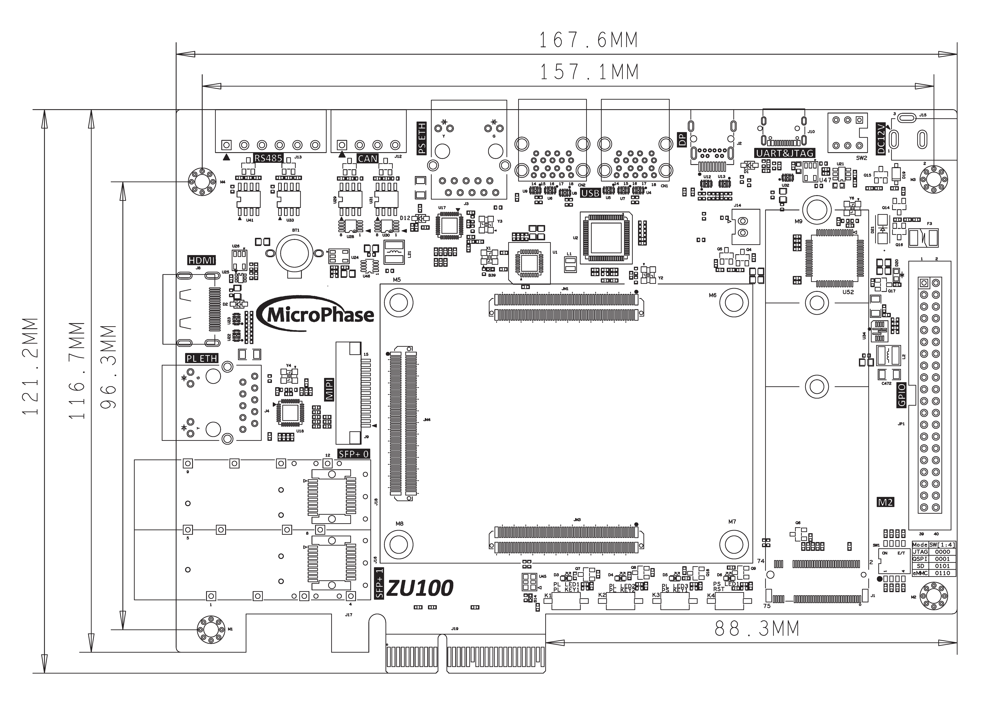
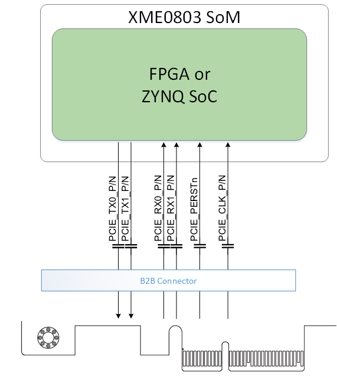
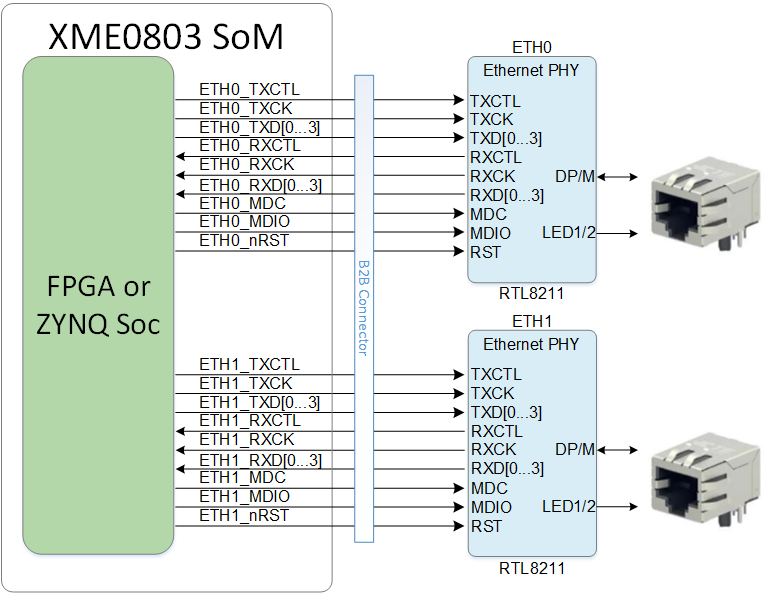
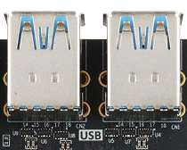
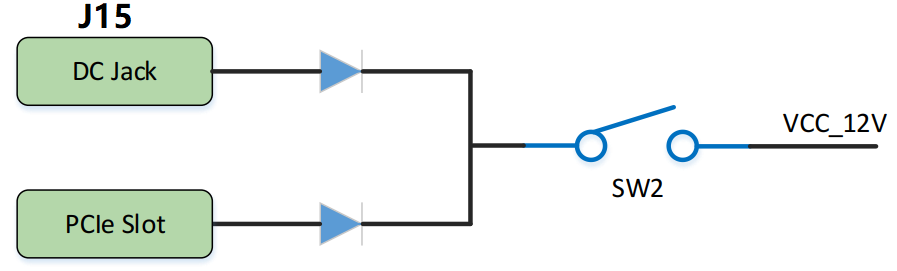

# **XPE_ZU100 用户手册**

[[English]](https://microphase-doc.readthedocs.io/en/latest/CARRIER_BOARD/XPE_ZU100/XPE_ZU100-Reference_Manual.html)

## 微信公众号：

## ●1. 概述

使用 XPE_ZU100，您可以快速测试、开发和评估 XME0803 的功能。它为 XME0803 提供了多种接口，如 HDMI TX、千兆以太网、SFP、PCIe 3.0 x2、USB3.0 x4 等。**以下内容基于 XME00803(4EV)，除非另有说明。**

### ○板卡布局

### ○资源特性

- 1 个 PCIe3.0 x2 接口

- 2 个千兆以太网接口，支持 10/100/1000M 网络传输速率，

  1 个用于 PS，1 个用于 PL

- 1 个 SFP x2 接口

- 1 个 USB3.0 x4 接口

- 1 个 NVME M.2 接口

- 1 个 2 通道 MIPI 接口

- 1 个 HDMI TX 接口

- 1 个 Mini DP 接口

- 1 个 RS485 x2 接口

- 1 个 CAN x2 接口

- 1 个 USB UART&JTAG 接口

- 1 个 SD 卡接口

- 1 个 40 针扩展接口

- 1 个系统复位按键，3 个用户按键

- 4 个用户 LED

  **注：因核心板不同，以上接口可能不完全支持，使用时请确认细节。**

### ○机械尺寸

### ○核心板匹配说明

✔️：支持

❌：不支持

⚠️ : 使用时需注意

⭐ : 不完全支持

| XPE_ZU100       | XME0803(3EG) | XME0803(4EV) |
| --------------- | ------------ | ------------ |
| PCIE3.0 x2      | ❌            | ✔️            |
| PS ETH          | ✔️            | ✔️            |
| PL ETH          | ✔️            | ✔️            |
| SFP x2          | ❌            | ✔️            |
| USB3.0 x4       | ✔️            | ✔️            |
| NVME M.2        | ✔️            | ✔️            |
| MIPI            | ✔️            | ✔️            |
| HDMI TX         | ✔️            | ✔️            |
| Mini DP         | ✔️            | ✔️            |
| RS485 x2        | ✔️            | ✔️            |
| CAN x2          | ✔️            | ✔️            |
| USB UART&JTAG   | ✔️            | ✔️            |
| SD              | ✔️            | ✔️            |
| 40-Pin 扩展接口 | ✔️            | ✔️            |

## ●2. 功能资源

### ○PCIe

XPE_ZU100 具有一个 PCIe x2 接口，支持 2 个 TX 和 RX 通道连接到 PCIe 边缘连接器。它支持 PCIe 3.0（向后兼容 2.0）数据通信。单个通道的通信速率高达 8 Gbps，满足 PCIe Gen 3 的数据传输能力。

PCIe 参考时钟由 PCIe ROOT 设备（通常是 PC）通过 PCIe 插槽提供给开发板。参考时钟频率为 100 MHz。

PCIe 接口的硬件连接图如下：

### ○千兆以太网

载板提供 2 个千兆以太网接口。ETH0通过MDI信号与核心板连接。有关 ETH0 PHY 的更多信息，请参考相应的核心板文档。

RTL8211F 芯片支持 10/100/1000M 网络传输速率，并通过 RGMII 接口与 Zynq7000 PS 系统的 MAC 层通信。它还支持 MDI/MDX 自适应、多种速率自适应、主/从自适应以及 MDIO 总线支持 PHY 寄存器管理。

核心板与两个以太网 PHY 芯片的连接图如下：

### ○SFP

ZU100 提供两个 SFP 接口，每个 SFP 使用一个收发器通道。用户可以使用 SFP 热插拔光模块进行光纤数据通信。

每个 SFP 接口包括以下信号：

- **收发器**：提供一个通道，数据传输速率高达 12.5 Gb/s。
- **SMBUS (I2C)**：3.3V 信号，用于模块管理。
- **控制信号**：包括状态控制。
- **参考时钟**：来自载板的 125 MHz 差分时钟。

### ○USB3.0

ZU100 具有四个 Type-A USB 3.0 Host端口，提供高达 5.0 Gb/s 的数据传输速度。USB 3.0 通过 PIPE3 接口连接，而 USB 2.0 通过 ULPI 接口连接到外部 USB3320C 芯片，实现 USB 3.0 和 USB 2.0 的高速数据通信。

### ○USB UART&JTAG

底板提供了一个 USB 转 UART 和 JTAG 接口，芯片为 FTDI FT2232H。USB 接口为 TYPE-C。

### ○NVME M.2

开发板配备了一个 PCIe x1 标准的 M.2 接口，用于连接 M.2 SSD，支持高达 6Gbps 的通信速度。M.2 接口使用 M 键槽，仅支持 PCIe，不支持 SATA。选择 SSD 时，用户必须选择基于 PCIe 的 SSD。PCIe 信号直接连接到 ZU15EG 的 BANK505 PS MGT 收发器，一个 TX 信号和一个 RX 信号作为差分信号连接到 MGT 的 LANE1。PCIe 时钟由 Si5332 芯片提供，频率为 100MHz。

### ○MIPI

板上的 MIPI CSI 端口是一个 15 针、1 mm 间距的顶部接触 FPC 连接器，设计用于连接 MIPI 接口摄像头。MIPI FPC 连接器的引脚排列与 Raspberry Pi 摄像头兼容。

MIPI CSI-2 接收器 IP 核可从 Xilinx 获取，并包含嵌入式 Linux 支持。它需要许可证才能使用，但可能可以从 Xilinx 免费获取评估许可证。

### ○HDMI TX

一个 HDMI 视频输出接口，可实现 1080P 视频图像。可配置为 HDMI 输入。

### ○Mini DP

1 个 mini DisplayPort 输出显示接口，用于视频图像显示。DisplayPort 数据传输通道由核心板上的 BANK505 PS MGT 直接驱动，MGT 信号以差分信号格式传输到 DP 连接器。DisplayPort 辅助通道连接到 PS 的 MIO 引脚。它支持最大输出 4K @30Hz 或 1080P @60Hz。

### ○电源

**请注意，XPE_ZU100 的电源输入为 +12V。我们建议使用 12V/2A 电源。**

### ○LED

XPE_ZU100 板提供了五个 LED，一个电源指示灯和四个用户 LED。当 FPGA 的相应引脚处于高电平时，LED 点亮。

| 位置 | 信号名称 | 引脚号 |
| ---- | -------- | ------ |
| D6   | PS_LED1  | H18    |
| D3   | PL_LED1  | E1     |
| D4   | PL_LED2  | D1     |
| D5   | PL_LED3  | G1     |

### ○按键

我们提供了三个按键供用户使用。按下按键时，FPGA 的相应引脚将变为低电平。

| 位置 | 信号名称 | 引脚号 |
| ---- | -------- | ------ |
| K3   | PS_KEY1  | H19    |
| K1   | PL_KEY1  | A2     |
| K2   | PL_KEY2  | A1     |

### ○GPIO

底板提供了一个 IDC40 GPIO 扩展接口 JP1，允许连接到微相科技的模块或其他外设。**使用 IO 时，请确保连接的信号电压一致。**

| 引脚 | 信号名称  | 引脚号 | 引脚 | 信号名称  | 引脚号 |
| ---- | --------- | ------ | ---- | --------- | ------ |
| 1    | GPIO1_0P  | AH12   | 2    | GPIO1_0N  | AH11   |
| 3    | GPIO1_1P  | AE12   | 4    | GPIO1_1N  | AF12   |
| 5    | GPIO1_2P  | AG10   | 6    | GPIO1_2N  | AH10   |
| 7    | GPIO1_3P  | W12    | 8    | GPIO1_3N  | W11    |
| 9    | GPIO1_4P  | AE15   | 10   | GPIO1_4N  | AE14   |
| 11   | VCC_5V    | -      | 12   | GND       | -      |
| 13   | GPIO1_5P  | W14    | 14   | GPIO1_5N  | W13    |
| 15   | GPIO1_6P  | AD15   | 16   | GPIO1_6N  | AD14   |
| 17   | GPIO1_7P  | AC14   | 18   | GPIO1_7N  | AC13   |
| 19   | GPIO1_8P  | AA13   | 20   | GPIO1_8N  | AB13   |
| 21   | GPIO1_9P  | AD11   | 22   | GPIO1_9N  | AD10   |
| 23   | GPIO1_10P | AA11   | 24   | GPIO1_10N | AA10   |
| 25   | GPIO1_11P | W10    | 26   | GPIO1_11N | Y10    |
| 27   | GPIO1_12P | Y12    | 28   | GPIO1_12N | AA12   |
| 29   | VCC_3V3   | -      | 30   | GND       | -      |
| 31   | GPIO1_13P | Y14    | 32   | GPIO1_13N | Y13    |
| 33   | GPIO1_14P | AG13   | 34   | GPIO1_14N | AH13   |
| 35   | GPIO1_15P | AG14   | 36   | GPIO1_15N | AH14   |
| 37   | GPIO1_16P | AE13   | 38   | GPIO1_16N | AF13   |
| 39   | GPIO1_17P | AB15   | 40   | GPIO1_17N | AB14   |

## ●3. 相关文档

### ○XPE-ZU100

- [XPE-ZU100_R40 原理图](https://github.com/MicroPhase/fpga-docs/blob/master/schematic/PE500_R10.pdf)(PDF)
- [XPE-ZU100_R40 尺寸](https://github.com/MicroPhase/fpga-docs/blob/master/mechanical/XPE-ZU100/PE500_R10_Dimensions.pdf)(PDF)
- [XPE-ZU100_R40 尺寸源文件](https://github.com/MicroPhase/fpga-docs/blob/master/mechanical/XPE-ZU100/XPE-ZU100_R40_Dimensions.dxf)(DXF)

### ○XME0803

- [XME0803_用户手册](https://microphase-doc.readthedocs.io/en/latest/SoM/XME0803/XME0803-Reference_Manual.html) (HTML)
- [XME0803_R20 原理图](https://github.com/MicroPhase/fpga-docs/blob/master/schematic/XME0803_R20.pdf) (PDF)
- [XME0803_R20 尺寸](https://github.com/MicroPhase/fpga-docs/blob/master/mechanical/XME0803/XME0803_R20_Dimensions.pdf) (PDF)  
- [XME0803_R20 尺寸源文件](https://github.com/MicroPhase/fpga-docs/blob/master/mechanical/XME0803/XME0803_R20_Dimensions_source_file.dxf) (DXF)
