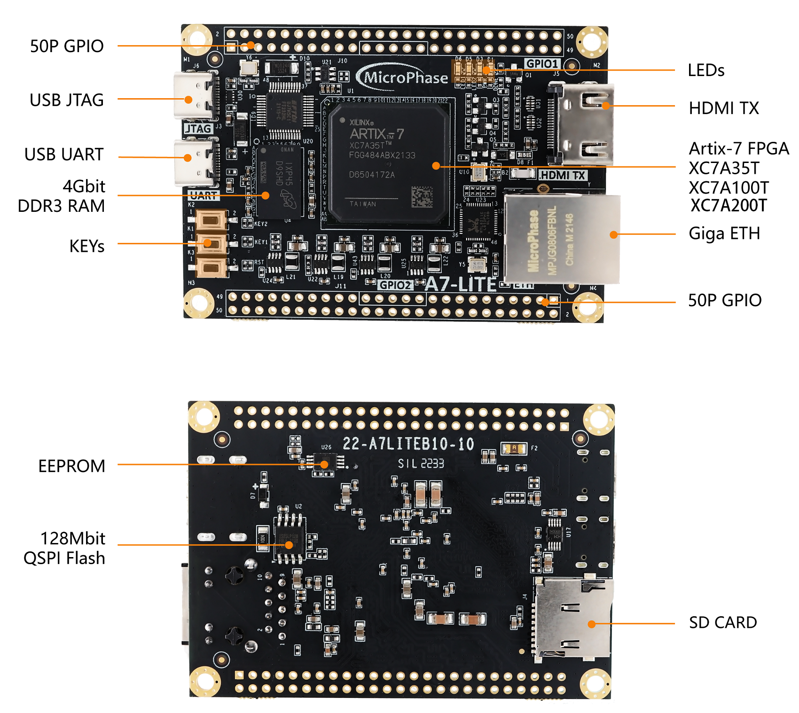
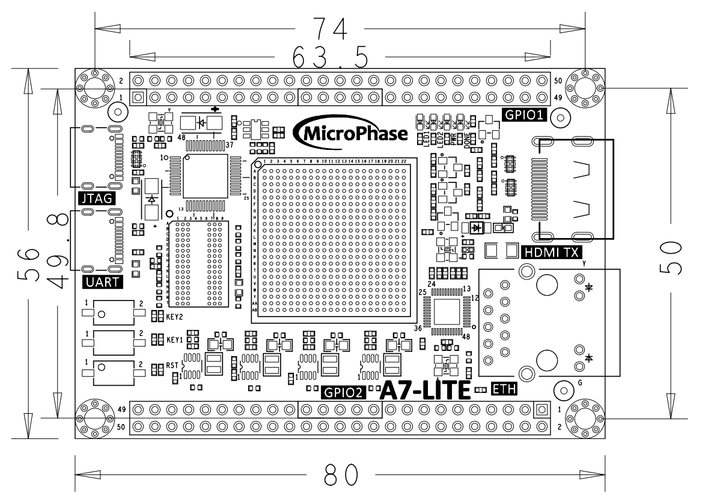
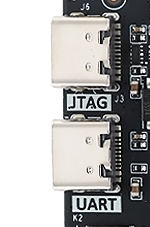

# **A7-LITE Reference Manual**

[中文](https://microphase-doc.readthedocs.io/zh-cn/latest/DEV_BOARD/A7-LITE/A7-Lite_Reference_Manual.html)

## Development Environment:

Vivado 2021.1 is from Xilinx website

<https://www.xilinx.com>

## WeChat Public Number:


## ●1. Overview

​	A7 Lite is a Commercial-grade SoM (System on Module) based on Xilinx Artix-7 (XC7A35T-2FGG484L, XC7A100T-2FGG484L and XC7A200T-2FGG484L) with up to 4Gb of DDR3/L SDRAM,128MB of SPI flash memory, Gigabit Ethernet PHY transceiver, a USB PHY transceiver and a simple way to support power.

​	It is not only suitable for software verification and software staff but also for hardware design and hardware developers. By fostering cooperation between software and hardware, it helps accelerate the project's development process.

### ○Board Layout



### ○Key Features

- Xilinx Artix-7 XC7A35T-2FGG484(35T Version Only)

  Xilinx Artix-7 XC7A100T-2FGG484(100T Version Only)

  Xilinx Artix-7 XC7A200T-2FGG484(200T Version Only)

- DDR3: 1 4Gbit,1066Mbs DDR3.

- KEY: 2 users key.

- LED: 2 users LED.

- GPIO: 2*50 pin expansion ports (2.54mm pitch).

- USB JTAG: 1 on board JTAG circuit, can debug and download the FPGA system through the USB cable.

- HDMI: 1 HDMI video output interface, can realize 1080P video image.

- PHY ETH: 10/100/1000M Ethernet RJ45 interface, which can be use for Ethernet data exchange or other application.

- SD Card: 1 SD Card is provided to store the operating system image and file system.

- USB UART:1 USB UART interface, using for serial communication with PC.

- CLOCK: 1 50Mhz active crystal oscillator provides a stable clock for the system.

### ○Block diagram


### ○**Mechanical Spec**



## ●2. Function Resources

### ○FPGA

- Logic Cells: 33,280(35T)

  &ensp;&ensp;&ensp;&ensp;&ensp;&ensp;&ensp;&ensp;&ensp;&ensp;&ensp;101,440(100T)

  &ensp;&ensp;&ensp;&ensp;&ensp;&ensp;&ensp;&ensp;&ensp;&ensp;&ensp;215,360(200T)

- Slices: 5,200(35T)

  &ensp;&ensp;&ensp;&ensp;&ensp;&ensp;15,850(100T)

  &ensp;&ensp;&ensp;&ensp;&ensp;&ensp;33,650(200T)

- CLB Flip-Flops: 41,600(35T)  
&ensp;&ensp;&ensp;&ensp;&ensp;&ensp;&ensp;&ensp;&ensp;&ensp;&ensp;&ensp;&ensp;&ensp;126,800(100T)  
&ensp;&ensp;&ensp;&ensp;&ensp;&ensp;&ensp;&ensp;&ensp;&ensp;&ensp;&ensp;&ensp;&ensp;269,200(200T)

- Maximum Distributed RAM(Kb): 400(35T)

  &ensp;&ensp;&ensp;&ensp;&ensp;&ensp;&ensp;&ensp;&ensp;&ensp;&ensp;&ensp;&ensp;&ensp;&ensp;&ensp;&ensp;&ensp;&ensp;&ensp;&ensp;&ensp;&ensp;&ensp;&ensp;&ensp;&ensp;&ensp;&ensp;&ensp;1,188(100T)

  &ensp;&ensp;&ensp;&ensp;&ensp;&ensp;&ensp;&ensp;&ensp;&ensp;&ensp;&ensp;&ensp;&ensp;&ensp;&ensp;&ensp;&ensp;&ensp;&ensp;&ensp;&ensp;&ensp;&ensp;&ensp;&ensp;&ensp;&ensp;&ensp;&ensp;2,888(200T)

- Block RAM/FIFO w/ ECC (36 Kb each): 50(35T)

  &ensp;&ensp;&ensp;&ensp;&ensp;&ensp;&ensp;&ensp;&ensp;&ensp;&ensp;&ensp;&ensp;&ensp;&ensp;&ensp;&ensp;&ensp;&ensp;&ensp;&ensp;&ensp;&ensp;&ensp;&ensp;&ensp;&ensp;&ensp;&ensp;&ensp;&ensp;&ensp;&ensp;&ensp;&ensp;135(100T)

  &ensp;&ensp;&ensp;&ensp;&ensp;&ensp;&ensp;&ensp;&ensp;&ensp;&ensp;&ensp;&ensp;&ensp;&ensp;&ensp;&ensp;&ensp;&ensp;&ensp;&ensp;&ensp;&ensp;&ensp;&ensp;&ensp;&ensp;&ensp;&ensp;&ensp;&ensp;&ensp;&ensp;&ensp;&ensp;365(200T)

- Total Block RAM (Kb): 1,800(35T)

  &ensp;&ensp;&ensp;&ensp;&ensp;&ensp;&ensp;&ensp;&ensp;&ensp;&ensp;&ensp;&ensp;&ensp;&ensp;&ensp;&ensp;&ensp;&ensp;&ensp;4,860(100T)

  &ensp;&ensp;&ensp;&ensp;&ensp;&ensp;&ensp;&ensp;&ensp;&ensp;&ensp;&ensp;&ensp;&ensp;&ensp;&ensp;&ensp;&ensp;&ensp;&ensp;13,140(200T)

- CMTs (1 MMCM + 1 PLL): 5(35T)  
&ensp;&ensp;&ensp;&ensp;&ensp;&ensp;&ensp;&ensp;&ensp;&ensp;&ensp;&ensp;&ensp;&ensp;&ensp;&ensp;&ensp;&ensp;&ensp;&ensp;  &ensp; &ensp; &ensp; &ensp;6(100T)  
&ensp; &ensp;  &ensp; &ensp;&ensp;&ensp;&ensp;&ensp;&ensp;&ensp;&ensp;&ensp;&ensp;&ensp;&ensp;&ensp;&ensp;&ensp;&ensp;&ensp;&ensp;&ensp;&ensp;&ensp;&ensp;10(200T)

- Maximum Single-Ended I/O:250(35T)

  &ensp; &ensp;  &ensp; &ensp;&ensp;&ensp;&ensp;&ensp;&ensp;&ensp;&ensp;&ensp;&ensp;&ensp;&ensp;&ensp;&ensp;&ensp;&ensp;&ensp;&ensp;&ensp;&ensp;&ensp;300(100T)
  
  &ensp; &ensp;  &ensp; &ensp;&ensp;&ensp;&ensp;&ensp;&ensp;&ensp;&ensp;&ensp;&ensp;&ensp;&ensp;&ensp;&ensp;&ensp;&ensp;&ensp;&ensp;&ensp;&ensp;&ensp;500(200T)
  
- Maximum Differential I/O Pairs: 120(35T)

  &ensp; &ensp;  &ensp; &ensp;&ensp;&ensp;&ensp;&ensp;&ensp;&ensp;&ensp;&ensp;&ensp;&ensp;&ensp;&ensp;&ensp;&ensp;&ensp;&ensp;&ensp;&ensp;&ensp;&ensp;&ensp;&ensp;&ensp;&ensp;144(100T)

  &ensp; &ensp;  &ensp; &ensp;&ensp;&ensp;&ensp;&ensp;&ensp;&ensp;&ensp;&ensp;&ensp;&ensp;&ensp;&ensp;&ensp;&ensp;&ensp;&ensp;&ensp;&ensp;&ensp;&ensp;&ensp;&ensp;&ensp;&ensp;240(200T)

- DSP Slices: 90(35T)

  &ensp;&ensp;&ensp;&ensp;&ensp;&ensp;&ensp;&ensp;&ensp;&ensp;&ensp;240(100T)

  &ensp;&ensp;&ensp;&ensp;&ensp;&ensp;&ensp;&ensp;&ensp;&ensp;&ensp;740(200T)

- PCIe® Gen2: 1

- Analog Mixed Signal (AMS) / XADC: 1

- Configuration AES / HMAC Blocks: 1

- GTP Transceivers (6.6 Gb/s Max Rate): 4(35T)

  &ensp;&ensp;&ensp;&ensp;&ensp;&ensp;&ensp;&ensp;&ensp;&ensp;&ensp;&ensp;&ensp;&ensp;&ensp;&ensp;&ensp;&ensp;&ensp;&ensp;&ensp;&ensp;&ensp;&ensp;&ensp;&ensp;&ensp;&ensp;&ensp;&ensp;&ensp;&ensp;&ensp;&ensp;8(100T)

  &ensp;&ensp;&ensp;&ensp;&ensp;&ensp;&ensp;&ensp;&ensp;&ensp;&ensp;&ensp;&ensp;&ensp;&ensp;&ensp;&ensp;&ensp;&ensp;&ensp;&ensp;&ensp;&ensp;&ensp;&ensp;&ensp;&ensp;&ensp;&ensp;&ensp;&ensp;&ensp;&ensp;&ensp;16(200T)

### ○DDR3

​	One on-board 16bit 512M DDR3/L SDRAM chips.

| Position |    Model    |   Capacity   | Factory |
| :------: | :---------: | :----------: | :-----: |
|    U4    | MT41K256M16 | 256M x 16bit | Micron  |

| Signal Name | Pin Number |  Signal Name   | Pin Number |
| :---------: | :--------: | :------------: | :--------: |
|   DDR3_A0   |     P1     |    DDR3_D0     |     B2     |
|   DDR3_A1   |     M6     |    DDR3_D1     |     F1     |
|   DDR3_A2   |     K3     |    DDR3_D2     |     B1     |
|   DDR3_A3   |     K4     |    DDR3_D3     |     D2     |
|   DDR3_A4   |     M5     |    DDR3_D4     |     C2     |
|   DDR3_A5   |     J6     |    DDR3_D5     |     F3     |
|   DDR3_A6   |     N2     |    DDR3_D6     |     A1     |
|   DDR3_A7   |     K6     |    DDR3_D7     |     G1     |
|   DDR3_A8   |     P2     |    DDR3_D8     |     J5     |
|   DDR3_A9   |     L1     |    DDR3_D9     |     G2     |
|  DDR3_A10   |     M2     |    DDR3_D10    |     K1     |
|  DDR3_A11   |     P6     |    DDR3_D11    |     G3     |
|  DDR3_A12   |     L4     |    DDR3_D12    |     H2     |
|  DDR3_A13   |     L5     |    DDR3_D13    |     H5     |
|  DDR3_A14   |     N5     |    DDR3_D14    |     J1     |
|  DDR3_BA0   |     J4     |    DDR3_D15    |     H4     |
|  DDR3_BA1   |     R1     |  DDR3_DQS_N 0  |     D1     |
|  DDR3_BA2   |     M1     |  DDR3_DQS_N 1  |     J2     |
|  DDR3_NCAS  |     N3     |  DDR3_DQS_P 0  |     E1     |
|  DDR3_CKE   |     N4     |  DDR3_DQS_P 1  |     K2     |
| DDR3_CLK_N  |     P4     | DDR3_DQS_N RST |     F4     |
| DDR3_CLK_P  |     P5     |    DDR3_ODT    |     L3     |
|  DDR3_NCS   |            |   DDR3_NRAS    |     M3     |
|  DDR3_DM0   |     E2     |    DDR3_NWE    |     L6     |
|  DDR3_DM1   |     H3     |                |            |

### ○Giga ETH

​	The RTL8211F chip supports 10/100/1000 M network transfer rate and communicates with he MAC layer of the Artix-7 through the RGMII interface. It supports MDI/MDX daptation, various speed adaptations, Master/Slave adaptation, and MDIO bus support for HY register management.

### ○USB UART

​	A USB to UART chip, the CH340, is provided for user connection to the host PC.

| Signal Name |   Pin Name   | Pin Number |     Explain      |
| :---------: | :----------: | :--------: | :--------------: |
|   UART_TX   | IO_L2N_T0_34 |     V2     | UART data output |
|   UART_RX   | IO_L2P_T0_34 |     U2     | UART data input  |

### ○USB JTAG

​	We integrated the JTAG download and debug circuit on the board that user can develop and debug through a USB cable.

### ○Quad-SPI Flash

​	The onboard 128M Quad-SPI Flash memory IS25L128F-JBLE-TR is used for the storage of the initial FPGA configuration, user applications and data.

| Position |     Model     | Capacity  | Factory |
| :------: | :-----------: | :-------: | :-----: |
|    U2    | IS25L128FJBLE | 128M Byte |  ISSI   |

### ○Clocks

​	A 50 MHz active crystal oscillator provides clocks for the system.

| Position | Signal Name | Frequency | Pin Number |
| :------: | :---------: | :-------: | :--------: |
|   U10    |   CLK_50M   |   50Mhz   |    J19     |

### ○Reset

​	A7 Lite provides a key (K3) which can be used as a 'reset' signal for designs running on FPGA.

### ○Micro SD

​	The board provide a Micro SD card interface to make user can access the SD card memory,BOOT programs for storing FPGA chips, Linux operating system kernels, file systems, and other user date files.

### ○HDMI

​	One HDMI video output interface can realize 1080P video image.

### ○LED

​	We provided two LEDs for user to use.

| Position | Signal Name | Pin Number | Explain |
| :------: | :---------: | :--------: | :-----: |
|    D6    |    LED1     |    M18     |  LED1   |
|    D5    |    LED2     |    N18     |  LED2   |

### ○Key

​	We provide two keys for user to use. 

| Position | Signal Name | Pin Number | Explain |
| :------: | :---------: | :--------: | :-----: |
|    K1    |    KEY1     |    AA1     |  KEY1   |
|    K2    |    KEY2     |     W1     |  KEY2   |

### ○GPIO

​	This device is equipped with a maximum of user IO pins that can be used for various ustom applications. All user IOs are length matched and can be used as differential pairs.

Description:

1. The IO level of JP1 defaults to 3.3V, but it can be adjusted by modifying the hardware.

```
Method: Remove B8, solder B9, and then input the required voltage level to VCCIO_A. The input range is 1.2V to 3.3V.
```

2. The IO level of JP2 is 3.3V.

**JP1:**

| Pin  | Signal Name | Pin Number | Pin  | Signal Name | Pin Number |
| ---- | :---------: | :--------: | :--: | :---------: | :--------: |
| 1    |  GPIO1_0P   |    F13     |  2   |  GPIO1_0N   |    F14     |
| 3    |  GPIO1_1P   |    E13     |  4   |  GPIO1_1N   |    E14     |
| 5    |  GPIO1_2P   |    D14     |  6   |  GPIO1_2N   |    D15     |
| 7    |  GPIO1_3P   |    E16     |  8   |  GPIO1_3N   |    D16     |
| 9    |  GPIO1_4P   |    D17     |  10  |  GPIO1_4N   |    C17     |
| 11   |   VCC_5V    |     -      |  12  |     GND     |     -      |
| 13   |  GPIO1_5P   |    C13     |  14  |  GPIO1_5N   |    B13     |
| 15   |  GPIO1_6P   |    A13     |  16  |  GPIO1_6N   |    A14     |
| 17   |  GPIO1_7P   |    C14     |  18  |  GPIO1_7N   |    C15     |
| 19   |  GPIO1_8P   |    A15     |  20  |  GPIO1_8N   |    A16     |
| 21   |  GPIO1_9P   |    B15     |  22  |  GPIO1_9N   |    B16     |
| 23   |  GPIO1_10P  |    F16     |  24  |  GPIO1_10N  |    E17     |
| 25   |  GPIO1_11P  |    A18     |  26  |  GPIO1_11N  |    A19     |
| 27   |  GPIO1_12P  |    B17     |  28  |  GPIO1_12N  |    B18     |
| 29   |   VCC_3V3   |     -      |  30  |     GND     |     -      |
| 31   |  GPIO1_13P  |    B20     |  32  |  GPIO1_13N  |    A20     |
| 33   |  GPIO1_14P  |    F19     |  34  |  GPIO1_14N  |    F20     |
| 35   |  GPIO1_15P  |    E19     |  36  |  GPIO1_15N  |    D19     |
| 37   |  GPIO1_16P  |    C18     |  38  |  GPIO1_16N  |    C19     |
| 39   |  GPIO1_17P  |    F18     |  40  |  GPIO1_17N  |    E18     |
| 41   |   VCCIO_A   |            |  42  |     GND     |     -      |
| 43   |  GPIO1_18P  |    D20     |  44  |  GPIO1_18N  |    C20     |
| 45   |  GPIO1_19P  |    B21     |  46  |  GPIO1_19N  |    A21     |
| 47   |  GPIO1_20P  |    D21     |  48  |  GPIO1_20N  |    G21     |
| 49   |  GPIO1_21P  |    C22     |  50  |  GPIO1_21N  |    B22     |

**JP2**

| Pin  | Signal Name | Pin Number | Pin  | Signal Name | Pin Number |
| :--: | :---------: | :--------: | :--: | :---------: | :--------: |
|  1   |  GPIO2_0P   |    W21     |  2   |  GPIO2_0N   |    W22     |
|  3   |  GPIO2_1P   |    N17     |  4   |  GPIO2_1N   |    P17     |
|  5   |  GPIO2_2P   |    P19     |  6   |  GPIO2_2N   |    R19     |
|  7   |  GPIO2_3P   |    R18     |  8   |  GPIO2_3N   |    T18     |
|  9   |  GPIO2_4P   |    T21     |  10  |  GPIO2_4N   |    U21     |
|  11  |   VCC_5V    |     -      |  12  |     GND     |     -      |
|  13  |  GPIO2_5P   |    U22     |  14  |  GPIO2_5N   |    V22     |
|  15  |  GPIO2_6P   |    Y21     |  16  |  GPIO2_6N   |    Y22     |
|  17  |  GPIO2_7P   |    AA20    |  18  |  GPIO2_7N   |    AA21    |
|  19  |  GPIO2_8P   |    AB21    |  20  |  GPIO2_8N   |    AB22    |
|  21  |  GPIO2_9P   |    AA19    |  22  |  GPIO2_9N   |    AB20    |
|  23  |  GPIO2_10P  |    U20     |  24  |  GPIO2_10N  |    V20     |
|  25  |  GPIO2_11P  |    Y18     |  26  |  GPIO2_11N  |    Y19     |
|  27  |  GPIO2_12P  |    W19     |  28  |  GPIO2_12N  |    W20     |
|  29  |   VCC_3V3   |     -      |  30  |     GND     |     -      |
|  31  |  GPIO2_13P  |    AA18    |  32  |  GPIO2_13N  |    AB18    |
|  33  |  GPIO2_14P  |    V18     |  34  |  GPIO2_14N  |    V19     |
|  35  |  GPIO2_15P  |    V17     |  36  |  GPIO2_15N  |    W17     |
|  37  |  GPIO2_16P  |    U17     |  38  |  GPIO2_16N  |    U18     |
|  39  |  GPIO2_17P  |    P14     |  40  |  GPIO2_17N  |    R14     |
|  41  |     NC      |     -      |  42  |     GND     |     -      |
|  43  |  GPIO2_18P  |    P16     |  44  |  GPIO2_18N  |    R17     |
|  45  |  GPIO2_19P  |    N13     |  46  |  GPIO2_19N  |    N14     |
|  47  |  GPIO2_20P  |    P15     |  48  |  GPIO2_20N  |    R16     |
|  49  |  GPIO2_21P  |    AB7     |  50  |  GPIO2_21N  |    AB6     |

### ○Power

​	The board is use the +5V supply from USB. 



## ●3.Related Documents 

- [A7-Lite_R11 Schematic](https://github.com/MicroPhase/fpga-docs/blob/master/schematic/A7-LITE_R11.pdf) (PDF)
- [A7-Lite_R11 Dimensions](https://github.com/MicroPhase/fpga-docs/blob/master/mechanical/A7-LITE/A7-LITE_R11_Dimensions.pdf) (PDF)  
- [A7-Lite_R11 Dimensions source file](https://github.com/MicroPhase/fpga-docs/blob/master/mechanical/A7-LITE/A7-LITE_R11__Dimensions.dxf) (DXF) 

