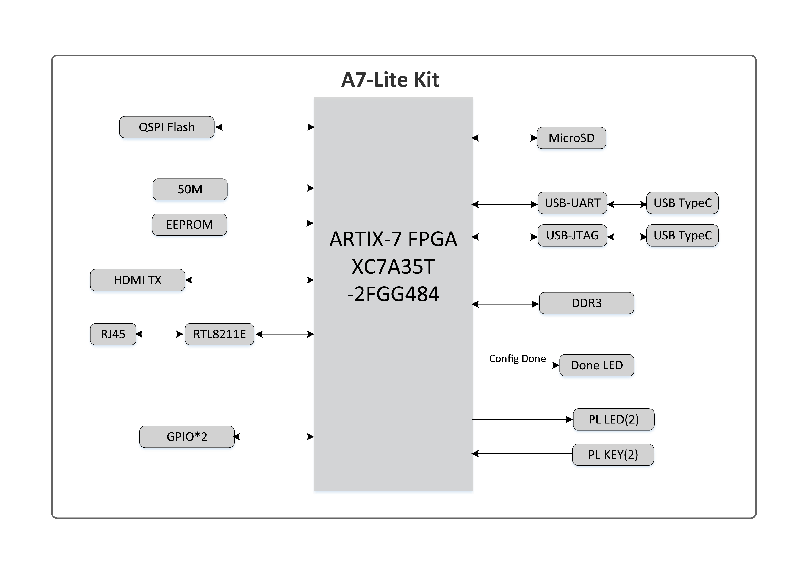
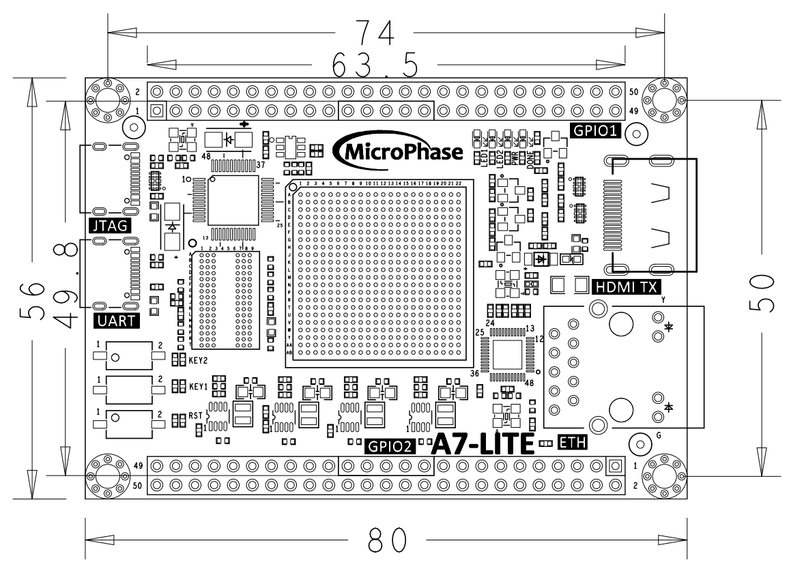
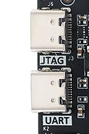

# **A7-LITE 用户手册**

[English](https://microphase-doc.readthedocs.io/en/latest/DEV_BOARD/A7-LITE/A7-Lite_Reference_Manual.html)

## 开发环境：

赛灵思Vivado 2021.1

<https://www.xilinx.com>

## 微信公众号：


## ●1. 概述

A7-Lite 是一款基于 Xilinx Artix-7（XC7A35T-2FGG484L、XC7A100T-2FGG484L 和 XC7A200T-2FGG484L）的商业级 SoC 开发板，配备高达 4Gb 的 DDR3/L SDRAM、128MB 的 SPI 闪存、千兆以太网 PHY 收发器、USB接口以及简单的供电方式。

### ○板卡布局


### ○资源特性

- Xilinx Artix-7 XC7A35T-2FGG484（仅 35T 版本）

  Xilinx Artix-7 XC7A100T-2FGG484（仅 100T 版本）

  Xilinx Artix-7 XC7A200T-2FGG484（仅 200T 版本）

- DDR3：1 个 4Gbit，1066Mbps DDR3。

- 按键：2 个用户按键。

- LED：2 个用户 LED。

- GPIO：2*50 针扩展接口（2.54mm 间距）。

- USB JTAG：1 个板载 JTAG 电路，可通过 USB 线调试和下载。

- HDMI：1 个 HDMI 输出（1080P@60Hz）。

- ETH：10/100/1000M 以太网 RJ45 接口，可用于以太网数据交换或其他应用。

- SD 卡：1 个 SD 卡接口，用于存储操作系统镜像和文件系统。

- USB UART：1 个 USB UART 接口，用于与 PC 进行串行通信。

- 时钟：1 个 50MHz 有源晶振，为系统提供稳定的时钟。

### ○系统框图



### ○机械尺寸



## ●2. 硬件资源

### ○FPGA

- Logic Cells: 33,280(35T)

  &ensp;&ensp;&ensp;&ensp;&ensp;&ensp;&ensp;&ensp;&ensp;&ensp;&ensp;101,440(100T)

  &ensp;&ensp;&ensp;&ensp;&ensp;&ensp;&ensp;&ensp;&ensp;&ensp;&ensp;215,360(200T)

- Slices: 5,200(35T)

  &ensp;&ensp;&ensp;&ensp;&ensp;&ensp;15,850(100T)

  &ensp;&ensp;&ensp;&ensp;&ensp;&ensp;33,650(200T)

- CLB Flip-Flops: 41,600(35T)  
  &ensp;&ensp;&ensp;&ensp;&ensp;&ensp;&ensp;&ensp;&ensp;&ensp;&ensp;&ensp;&ensp;&ensp;126,800(100T)  
  &ensp;&ensp;&ensp;&ensp;&ensp;&ensp;&ensp;&ensp;&ensp;&ensp;&ensp;&ensp;&ensp;&ensp;269,200(200T)

- Maximum Distributed RAM(Kb): 400(35T)

  &ensp;&ensp;&ensp;&ensp;&ensp;&ensp;&ensp;&ensp;&ensp;&ensp;&ensp;&ensp;&ensp;&ensp;&ensp;&ensp;&ensp;&ensp;&ensp;&ensp;&ensp;&ensp;&ensp;&ensp;&ensp;&ensp;&ensp;&ensp;&ensp;&ensp;1,188(100T)

  &ensp;&ensp;&ensp;&ensp;&ensp;&ensp;&ensp;&ensp;&ensp;&ensp;&ensp;&ensp;&ensp;&ensp;&ensp;&ensp;&ensp;&ensp;&ensp;&ensp;&ensp;&ensp;&ensp;&ensp;&ensp;&ensp;&ensp;&ensp;&ensp;&ensp;2,888(200T)

- Block RAM/FIFO w/ ECC (36 Kb each): 50(35T)

  &ensp;&ensp;&ensp;&ensp;&ensp;&ensp;&ensp;&ensp;&ensp;&ensp;&ensp;&ensp;&ensp;&ensp;&ensp;&ensp;&ensp;&ensp;&ensp;&ensp;&ensp;&ensp;&ensp;&ensp;&ensp;&ensp;&ensp;&ensp;&ensp;&ensp;&ensp;&ensp;&ensp;&ensp;&ensp;135(100T)

  &ensp;&ensp;&ensp;&ensp;&ensp;&ensp;&ensp;&ensp;&ensp;&ensp;&ensp;&ensp;&ensp;&ensp;&ensp;&ensp;&ensp;&ensp;&ensp;&ensp;&ensp;&ensp;&ensp;&ensp;&ensp;&ensp;&ensp;&ensp;&ensp;&ensp;&ensp;&ensp;&ensp;&ensp;&ensp;365(200T)

- Total Block RAM (Kb): 1,800(35T)

  &ensp;&ensp;&ensp;&ensp;&ensp;&ensp;&ensp;&ensp;&ensp;&ensp;&ensp;&ensp;&ensp;&ensp;&ensp;&ensp;&ensp;&ensp;&ensp;&ensp;4,860(100T)

  &ensp;&ensp;&ensp;&ensp;&ensp;&ensp;&ensp;&ensp;&ensp;&ensp;&ensp;&ensp;&ensp;&ensp;&ensp;&ensp;&ensp;&ensp;&ensp;&ensp;13,140(200T)

- CMTs (1 MMCM + 1 PLL): 5(35T)  
  &ensp;&ensp;&ensp;&ensp;&ensp;&ensp;&ensp;&ensp;&ensp;&ensp;&ensp;&ensp;&ensp;&ensp;&ensp;&ensp;&ensp;&ensp;&ensp;&ensp;  &ensp; &ensp; &ensp; &ensp;6(100T)  
  &ensp; &ensp;  &ensp; &ensp;&ensp;&ensp;&ensp;&ensp;&ensp;&ensp;&ensp;&ensp;&ensp;&ensp;&ensp;&ensp;&ensp;&ensp;&ensp;&ensp;&ensp;&ensp;&ensp;&ensp;&ensp;10(200T)

- Maximum Single-Ended I/O:250(35T)

  &ensp; &ensp;  &ensp; &ensp;&ensp;&ensp;&ensp;&ensp;&ensp;&ensp;&ensp;&ensp;&ensp;&ensp;&ensp;&ensp;&ensp;&ensp;&ensp;&ensp;&ensp;&ensp;&ensp;&ensp;300(100T)

  &ensp; &ensp;  &ensp; &ensp;&ensp;&ensp;&ensp;&ensp;&ensp;&ensp;&ensp;&ensp;&ensp;&ensp;&ensp;&ensp;&ensp;&ensp;&ensp;&ensp;&ensp;&ensp;&ensp;&ensp;500(200T)

- Maximum Differential I/O Pairs: 120(35T)

  &ensp; &ensp;  &ensp; &ensp;&ensp;&ensp;&ensp;&ensp;&ensp;&ensp;&ensp;&ensp;&ensp;&ensp;&ensp;&ensp;&ensp;&ensp;&ensp;&ensp;&ensp;&ensp;&ensp;&ensp;&ensp;&ensp;&ensp;&ensp;144(100T)

  &ensp; &ensp;  &ensp; &ensp;&ensp;&ensp;&ensp;&ensp;&ensp;&ensp;&ensp;&ensp;&ensp;&ensp;&ensp;&ensp;&ensp;&ensp;&ensp;&ensp;&ensp;&ensp;&ensp;&ensp;&ensp;&ensp;&ensp;&ensp;240(200T)

- DSP Slices: 90(35T)

  &ensp;&ensp;&ensp;&ensp;&ensp;&ensp;&ensp;&ensp;&ensp;&ensp;&ensp;240(100T)

  &ensp;&ensp;&ensp;&ensp;&ensp;&ensp;&ensp;&ensp;&ensp;&ensp;&ensp;740(200T)

- PCIe® Gen2: 1

- Analog Mixed Signal (AMS) / XADC: 1

- Configuration AES / HMAC Blocks: 1

- GTP Transceivers (6.6 Gb/s Max Rate): 4(35T)

  &ensp;&ensp;&ensp;&ensp;&ensp;&ensp;&ensp;&ensp;&ensp;&ensp;&ensp;&ensp;&ensp;&ensp;&ensp;&ensp;&ensp;&ensp;&ensp;&ensp;&ensp;&ensp;&ensp;&ensp;&ensp;&ensp;&ensp;&ensp;&ensp;&ensp;&ensp;&ensp;&ensp;&ensp;8(100T)

  &ensp;&ensp;&ensp;&ensp;&ensp;&ensp;&ensp;&ensp;&ensp;&ensp;&ensp;&ensp;&ensp;&ensp;&ensp;&ensp;&ensp;&ensp;&ensp;&ensp;&ensp;&ensp;&ensp;&ensp;&ensp;&ensp;&ensp;&ensp;&ensp;&ensp;&ensp;&ensp;&ensp;&ensp;16(200T)

### ○DDR3

板载一个 16bit 512M DDR3/L SDRAM 芯片。

| 位置 |    型号     |     容量     | 厂商 |
| :--: | :---------: | :----------: | :--: |
|  U4  | MT41K256M16 | 256M x 16bit | 美光 |

|  信号名称  | 引脚号 |    信号名称    | 引脚号 |
| :--------: | :----: | :------------: | :----: |
|  DDR3_A0   |   P1   |    DDR3_D0     |   B2   |
|  DDR3_A1   |   M6   |    DDR3_D1     |   F1   |
|  DDR3_A2   |   K3   |    DDR3_D2     |   B1   |
|  DDR3_A3   |   K4   |    DDR3_D3     |   D2   |
|  DDR3_A4   |   M5   |    DDR3_D4     |   C2   |
|  DDR3_A5   |   J6   |    DDR3_D5     |   F3   |
|  DDR3_A6   |   N2   |    DDR3_D6     |   A1   |
|  DDR3_A7   |   K6   |    DDR3_D7     |   G1   |
|  DDR3_A8   |   P2   |    DDR3_D8     |   J5   |
|  DDR3_A9   |   L1   |    DDR3_D9     |   G2   |
|  DDR3_A10  |   M2   |    DDR3_D10    |   K1   |
|  DDR3_A11  |   P6   |    DDR3_D11    |   G3   |
|  DDR3_A12  |   L4   |    DDR3_D12    |   H2   |
|  DDR3_A13  |   L5   |    DDR3_D13    |   H5   |
|  DDR3_A14  |   N5   |    DDR3_D14    |   J1   |
|  DDR3_BA0  |   J4   |    DDR3_D15    |   H4   |
|  DDR3_BA1  |   R1   |  DDR3_DQS_N 0  |   D1   |
|  DDR3_BA2  |   M1   |  DDR3_DQS_N 1  |   J2   |
| DDR3_NCAS  |   N3   |  DDR3_DQS_P 0  |   E1   |
|  DDR3_CKE  |   N4   |  DDR3_DQS_P 1  |   K2   |
| DDR3_CLK_N |   P4   | DDR3_DQS_N RST |   F4   |
| DDR3_CLK_P |   P5   |    DDR3_ODT    |   L3   |
|  DDR3_NCS  |        |   DDR3_NRAS    |   M3   |
|  DDR3_DM0  |   E2   |    DDR3_NWE    |   L6   |
|  DDR3_DM1  |   H3   |                |        |

### ○千兆以太网

RTL8211F 芯片支持 10/100/1000M 网络传输速率，并通过 RGMII 接口与 Artix-7 的 MAC 层通信。它支持 MDI/MDX 自适应、多种速率自适应、主/从自适应以及 MDIO 总线支持 HY 寄存器管理。

### ○USB UART

提供了一个 USB 转 UART 芯片 CH340，用于用户连接到主机 PC进行通信。

| 信号名称 |   引脚名称   | 引脚号 |     说明      |
| :------: | :----------: | :----: | :-----------: |
| UART_TX  | IO_L2N_T0_34 |   V2   | UART 数据输出 |
| UART_RX  | IO_L2P_T0_34 |   U2   | UART 数据输入 |

### ○USB JTAG

我们在板上集成了 JTAG 下载和调试电路，用户可以通过 USB线进行开发和调试。

### ○Quad-SPI Flash

板载 128M 四路 SPI 闪存 IS25L128F-JBLE-TR，用于存储 FPGA 的初始配置、用户应用程序和数据。

| 位置 |     型号      |   容量    | 厂商 |
| :--: | :-----------: | :-------: | :--: |
|  U2  | IS25L128FJBLE | 128M 字节 | ISSI |

### ○Clocks

一个 50MHz 的有源晶振为系统提供时钟。

| 位置 | 信号名称 | 频率  | 引脚号 |
| :--: | :------: | :---: | :----: |
| U10  | CLK_50M  | 50MHz |  J19   |

### ○复位

A7-Lite 提供了一个按键（K3），可用作 FPGA 上运行设计的“复位”信号。

### ○Micro SD

板卡提供了一个 Micro SD 卡接口，用户可以通过该接口访问 SD 卡存储器，存储 FPGA 芯片的 BOOT 程序、Linux 操作系统内核、文件系统和其他用户数据文件。

### ○HDMI

一个 HDMI 视频输出接口，可实现 1080P 视频图像。

### ○LED

我们提供了两个 LED 供用户使用。

| 位置 | 信号名称 | 引脚号 | 说明 |
| :--: | :------: | :----: | :--: |
|  D6  |   LED1   |  M18   | LED1 |
|  D5  |   LED2   |  N18   | LED2 |

### ○按键

我们提供了两个按键供用户使用。

| 位置 | 信号名称 | 引脚号 | 说明 |
| :--: | :------: | :----: | :--: |
|  K1  |   KEY1   |  AA1   | KEY1 |
|  K2  |   KEY2   |   W1   | KEY2 |

### ○GPIO

该开发板引出了大量的用户 IO ，可用于各种自定义应用。FPGA 引脚到连接器的走线经过等长差分处理，单端阻抗为 50 欧姆，差分阻抗为 100 欧姆。

说明：

1. JP1的IO电平默认为3.3V，但通过修改硬件可实现电平调整。

```
具体方法为：卸下B8，焊接B9，然后向VCCIO_A输入需要的电平。输入范围1.2-3.3V。
```
2. JP2的IO电平为3.3V。

**JP1:**

| 引脚 | 信号名称  | 引脚号 | 引脚 | 信号名称  | 引脚号 |
| ---- | :-------: | :----: | :--: | :-------: | :----: |
| 1    | GPIO1_0P  |  F13   |  2   | GPIO1_0N  |  F14   |
| 3    | GPIO1_1P  |  E13   |  4   | GPIO1_1N  |  E14   |
| 5    | GPIO1_2P  |  D14   |  6   | GPIO1_2N  |  D15   |
| 7    | GPIO1_3P  |  E16   |  8   | GPIO1_3N  |  D16   |
| 9    | GPIO1_4P  |  D17   |  10  | GPIO1_4N  |  C17   |
| 11   |  VCC_5V   |   -    |  12  |    GND    |   -    |
| 13   | GPIO1_5P  |  C13   |  14  | GPIO1_5N  |  B13   |
| 15   | GPIO1_6P  |  A13   |  16  | GPIO1_6N  |  A14   |
| 17   | GPIO1_7P  |  C14   |  18  | GPIO1_7N  |  C15   |
| 19   | GPIO1_8P  |  A15   |  20  | GPIO1_8N  |  A16   |
| 21   | GPIO1_9P  |  B15   |  22  | GPIO1_9N  |  B16   |
| 23   | GPIO1_10P |  F16   |  24  | GPIO1_10N |  E17   |
| 25   | GPIO1_11P |  A18   |  26  | GPIO1_11N |  A19   |
| 27   | GPIO1_12P |  B17   |  28  | GPIO1_12N |  B18   |
| 29   |  VCC_3V3  |   -    |  30  |    GND    |   -    |
| 31   | GPIO1_13P |  B20   |  32  | GPIO1_13N |  A20   |
| 33   | GPIO1_14P |  F19   |  34  | GPIO1_14N |  F20   |
| 35   | GPIO1_15P |  E19   |  36  | GPIO1_15N |  D19   |
| 37   | GPIO1_16P |  C18   |  38  | GPIO1_16N |  C19   |
| 39   | GPIO1_17P |  F18   |  40  | GPIO1_17N |  E18   |
| 41   |  VCCIO_A  |        |  42  |    GND    |   -    |
| 43   | GPIO1_18P |  D20   |  44  | GPIO1_18N |  C20   |
| 45   | GPIO1_19P |  B21   |  46  | GPIO1_19N |  A21   |
| 47   | GPIO1_20P |  D21   |  48  | GPIO1_20N |  G21   |
| 49   | GPIO1_21P |  C22   |  50  | GPIO1_21N |  B22   |

**JP2**

| 引脚 | 信号名称  | 引脚号 | 引脚 | 信号名称  | 引脚号 |
| :--: | :-------: | :----: | :--: | :-------: | :----: |
|  1   | GPIO2_0P  |  W21   |  2   | GPIO2_0N  |  W22   |
|  3   | GPIO2_1P  |  N17   |  4   | GPIO2_1N  |  P17   |
|  5   | GPIO2_2P  |  P19   |  6   | GPIO2_2N  |  R19   |
|  7   | GPIO2_3P  |  R18   |  8   | GPIO2_3N  |  T18   |
|  9   | GPIO2_4P  |  T21   |  10  | GPIO2_4N  |  U21   |
|  11  |  VCC_5V   |   -    |  12  |    GND    |   -    |
|  13  | GPIO2_5P  |  U22   |  14  | GPIO2_5N  |  V22   |
|  15  | GPIO2_6P  |  Y21   |  16  | GPIO2_6N  |  Y22   |
|  17  | GPIO2_7P  |  AA20  |  18  | GPIO2_7N  |  AA21  |
|  19  | GPIO2_8P  |  AB21  |  20  | GPIO2_8N  |  AB22  |
|  21  | GPIO2_9P  |  AA19  |  22  | GPIO2_9N  |  AB20  |
|  23  | GPIO2_10P |  U20   |  24  | GPIO2_10N |  V20   |
|  25  | GPIO2_11P |  Y18   |  26  | GPIO2_11N |  Y19   |
|  27  | GPIO2_12P |  W19   |  28  | GPIO2_12N |  W20   |
|  29  |  VCC_3V3  |   -    |  30  |    GND    |   -    |
|  31  | GPIO2_13P |  AA18  |  32  | GPIO2_13N |  AB18  |
|  33  | GPIO2_14P |  V18   |  34  | GPIO2_14N |  V19   |
|  35  | GPIO2_15P |  V17   |  36  | GPIO2_15N |  W17   |
|  37  | GPIO2_16P |  U17   |  38  | GPIO2_16N |  U18   |
|  39  | GPIO2_17P |  P14   |  40  | GPIO2_17N |  R14   |
|  41  |    NC     |   -    |  42  |    GND    |   -    |
|  43  | GPIO2_18P |  P16   |  44  | GPIO2_18N |  R17   |
|  45  | GPIO2_19P |  N13   |  46  | GPIO2_19N |  N14   |
|  47  | GPIO2_20P |  P15   |  48  | GPIO2_20N |  R16   |
|  49  | GPIO2_21P |  AB7   |  50  | GPIO2_21N |  AB6   |

### ○电源

本板通过USB接口5V供电。图示的两个USB接口都可以用于供电。



## ●3. 相关文档

- [A7-Lite_R11 原理图](https://github.com/MicroPhase/fpga-docs/blob/master/schematic/A7-LITE_R11.pdf) (PDF)
- [A7-Lite_R11 尺寸](https://github.com/MicroPhase/fpga-docs/blob/master/mechanical/A7-LITE/A7-LITE_R11_Dimensions.pdf) (PDF)  
- [A7-Lite_R11 尺寸源文件](https://github.com/MicroPhase/fpga-docs/blob/master/mechanical/A7-LITE/A7-LITE_R11__Dimensions.dxf) (DXF)
