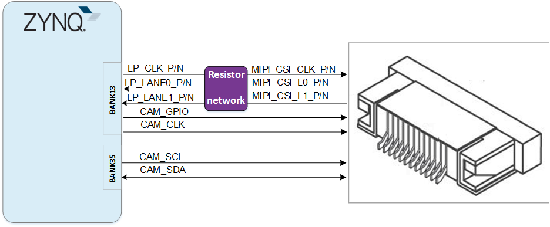

# **MIZAR-Z7 用户手册**

[[English]](https://microphase-doc.readthedocs.io/en/latest/DEV_BOARD/MIZAR-Z7/MIZAR-Z7_Reference_Manual.html)

## 开发环境：

赛灵思 Vivado 2018.3

<https://www.xilinx.com>

## 微信公众号：

## ●1. 概述

Mizar-Z7 是微相科技基于 Xilinx Zynq-7000 系列开发的商业级 SoC 开发板。它具有高达 8Gb 的 DDR3/L SDRAM、128MB QSPI FLASH、板载千兆以太网、USB OTG、UART 串口、HDMI 接口、MIPI-CSI 接口、Wi-Fi 和蓝牙，以及两个 40 针扩展接口。

### ○板卡布局

### ○资源特性

- Xilinx Zynq™ XC7Z010-1CLG400C（仅 7010 版本），  
  Xilinx Zynq™ XC7Z020-1CLG400C（仅 7020 版本）。  

- DDR3：512MB DDR3 RAM（仅 7010 版本），  
  &ensp;&ensp;&ensp;&ensp;&ensp;&ensp;1GB DDR3 RAM（仅 7020 版本）。  

- 闪存：256Mbit QSPI 闪存，8GB eMMC 闪存。  

- Wi-Fi/BT：1 通道 Wi-Fi 集成蓝牙，可用于无线传输、物联网应用。（仅 7020 版本）  

- MIPI CSI：1 个 MIPI CSI 接口，可用于摄像头应用。（仅 7020 版本）  

- 按键：6 个用户按键，2 个 PS 控制，4 个 PL 控制。  

- LED：6 个用户 LED，2 个 PS 控制，4 个 PL 控制。  

- GPIO：2 个 40 针扩展接口（2.54mm 间距），共 72 个 IO，48 个电压可调 IO，所有 IO 默认为 3.3V。  

- USB JTAG：1 个板载 JTAG 电路，可通过 USB 电缆调试和下载 ZYNQ 系统。  

- USB UART：1 个 USB UART 接口，用于与 PC 进行串行通信。  

- USB Host：1 个 USB Host，支持高速 USB 2.0 通信。  

- USB Slave：1 个 USB Slave，用于直接连接到主机设备。  

- HDMI：  
  HDMI1：HDMI 视频输出接口，可配置为 HDMI RX。  
  HDMI2：视频输入接口，可配置为 HDMI TX（仅 7020 版本）  

- PHY ETH：1 个 10/100 以太网 RJ45 接口，可用于以太网数据交换或其他应用。  

- SD 卡：1 个 SD 卡，用于存储操作系统镜像、文件系统和用户数据。  

- 时钟：1 个 33.33MHz 有源晶振为 PS 系统提供稳定时钟。  
  &ensp;&ensp;&ensp;&ensp;&ensp;&ensp;&ensp; 1 个 50MHz 有源晶振为 PL 逻辑提供额外时钟。

### ○系统框图

### ○机械尺寸

## ●2. 硬件资源

### ○FPGA

- 667 MHz dual-core Cortex-A9 processor  

- DDR3L memory controller with 8 DMA channels and 4   

- High Performance AXI3 Slave ports  

- High-bandwidth peripheral controllers: 1G Ethernet, USB 2.0, SDIO  

- Low-bandwidth peripheral controllers: SPI, UART, CAN, I2C  

- Programmable from JTAG, Quad-SPI flash, and microSD card  

- Programmable logic equivalent to Artix-7 FPGA  
  LUTs: 17,600 (7010)  
   	   &ensp;&ensp;&ensp;&ensp;&ensp;53,200(7020)  
  DSP Slices: 80 (7010)   
      	&ensp;&ensp;&ensp;&ensp;&ensp;&ensp;&ensp;&ensp;&ensp;&ensp;220 (7020)  
  Logic Cells: 28K (7010)  
  		  &ensp;&ensp;&ensp;&ensp;&ensp;&ensp;&ensp;&ensp;&ensp;&ensp;85K(7020)  
  Flip-Flops: 35,200 (7010)   
      	 &ensp;&ensp;&ensp;&ensp;&ensp;&ensp;&ensp;&ensp;&ensp;106,400 (7020)  
  Total Block RAM: 2.1Mb (7010)  
  &ensp;&ensp;&ensp;&ensp;&ensp;&ensp;&ensp;&ensp;&ensp;&ensp;&ensp;&ensp;&ensp;&ensp;&ensp;&ensp;4.9Mb (7020)  

- Analog Mixed Signal (AMS) / XADC:  2x 12 bit, MSPS ADCs with up to 17 Differential Inputs  

- Security: AES & SHA 256b Decryption & Authentication for Secure Programmable Logic Config

### ○DDR3

该模块集成了两个 16 位 DDR3 内存芯片：7010 版本一共为 512MB，7020 版本一共为 1GB。

| 信号名称      | 引脚号 | 信号名称       | 引脚号 |
| ------------- | ------ | -------------- | ------ |
| PS_DDR3_A0    | N2     | PS_DDR3_D9     | E3     |
| PS_DDR3_A1    | K2     | PS_DDR3_D10    | G3     |
| PS_DDR3_A2    | M3     | PS_DDR3_D11    | H3     |
| PS_DDR3_A3    | K3     | PS_DDR3_D12    | J3     |
| PS_DDR3_A4    | M4     | PS_DDR3_D13    | H2     |
| PS_DDR3_A5    | L1     | PS_DDR3_D14    | H1     |
| PS_DDR3_A6    | L4     | PS_DDR3_D15    | J1     |
| PS_DDR3_A7    | K4     | PS_DDR3_D16    | P1     |
| PS_DDR3_A8    | K1     | PS_DDR3_D17    | P3     |
| PS_DDR3_A9    | J4     | PS_DDR3_D18    | R3     |
| PS_DDR3_A10   | F5     | PS_DDR3_D19    | R1     |
| PS_DDR3_A11   | G4     | PS_DDR3_D20    | T4     |
| PS_DDR3_A12   | E4     | PS_DDR3_D21    | U4     |
| PS_DDR3_A13   | D4     | PS_DDR3_D22    | U2     |
| PS_DDR3_A14   | F4     | PS_DDR3_D23    | U3     |
| PS_DDR3_BA0   | L5     | PS_DDR3_D24    | V1     |
| PS_DDR3_BA1   | R4     | PS_DDR3_D25    | Y3     |
| PS_DDR3_BA2   | J5     | PS_DDR3_D26    | W1     |
| PS_DDR3_NCAS  | P5     | PS_DDR3_D27    | Y4     |
| PS_DDR3_CKE   | N3     | PS_DDR3_D28    | Y2     |
| PS_DDR3_CLK_N | M2     | PS_DDR3_D29    | W3     |
| PS_DDR3_CLK_P | L2     | PS_DDR3_D30    | V2     |
| PS_DDR3_NCS   | N1     | PS_DDR3_D31    | V3     |
| PS_DDR3_DM0   | A1     | PS_DDR3_DQS_N0 | B2     |
| PS_DDR3_DM1   | F1     | PS_DDR3_DQS_N1 | F2     |
| PS_DDR3_DM2   | T1     | PS_DDR3_DQS_N2 | T2     |
| PS_DDR3_DM3   | Y1     | PS_DDR3_DQS_N3 | W4     |
| PS_DDR3_D0    | C3     | PS_DDR3_DQS_P0 | C2     |
| PS_DDR3_D1    | B3     | PS_DDR3_DQS_P1 | G2     |
| PS_DDR3_D2    | A2     | PS_DDR3_DQS_P2 | R2     |
| PS_DDR3_D3    | A4     | PS_DDR3_DQS_P3 | W5     |
| PS_DDR3_D4    | D3     | PS_DDR3_NRST   | B4     |
| PS_DDR3_D5    | D1     | PS_DDR3_ODT    | N5     |
| PS_DDR3_D6    | C1     | PS_DDR3_NRAS   | P4     |
| PS_DDR3_D7    | E1     | PS_DDR3_NWE    | M5     |
| PS_DDR3_D8    | E2     |                |        |

### ○千兆以太网

RTL8211E 芯片支持 10/100/1000M 网络传输速率，并通过 RGMII 接口与 Zynq7000 PS 系统的 MAC 层通信。它支持 MDI/MDX 自适应、多种速率自适应、主/从自适应以及 MDIO 总线支持 PHY 寄存器管理。

### ○USB Host

板载的 USB2.0 收发器是 USB3320C-EZK，支持 ULPI 标准接口。它与 ZYNQ 的总线接口连接，以实现高速 USB2.0 Host 模式数据通信。

### ○USB UART

提供了一个 USB 转 UART 芯片 CH340，用于用户连接到主机 PC。

| 信号名称 | 引脚名称     | 引脚号 | 说明          |
| -------- | ------------ | ------ | ------------- |
| UART_TX  | PS_MIO15_500 | C5     | UART 数据输出 |
| UART_RX  | PS_MIO14_500 | C8     | UART 数据输入 |

### ○USB JTAG

我们在板上集成了 JTAG 下载和调试电路，用户可以通过 USB 电缆开发和调试 ZYNQ。

### ○启动配置

Mizar-Z7 提供三种启动模式：SD 卡启动、QSPI 启动和 JTAG 启动。用户可以通过拨动 SW4 拨码开关来改变模式引脚的电压以更改启动模式。

### ○Quad-SPI 闪存

板载 256M 四路 SPI 闪存 W25Q256FVEI，用于存储 FPGA 的初始配置、用户应用程序和数据。

| 位置 | 型号        | 容量      | 厂商 |
| ---- | ----------- | --------- | ---- |
| U3   | W25Q256FVEI | 256M 字节 | 华邦 |

### ○时钟

一个 33.33 MHz 的有源晶振为 PS 系统提供稳定时钟，而一个 50 MHz 的有源晶振为 PL 逻辑提供额外时钟。

| 位置 | 信号名称    | 频率      | 引脚号 |
| ---- | ----------- | --------- | ------ |
| Y1   | PS_CLK_33d3 | 33.333MHz | E7     |
| U19  | PL_CLK_50M  | 50MHz     | H16    |

### ○复位

提供了一个专用按键（K1），用于生成 FPGA 上运行设计的“复位”信号。

### ○Micro SD

板卡提供了一个 Micro SD 插槽接口，用于存储 ZYNQ 芯片的引导程序、Linux 操作系统内核、文件系统和用户数据。

### ○HDMI

#### HDMI1

一个 HDMI 视频输出接口，可实现 1080P 视频图像。可配置为 HDMI 输出。

#### HDMI2

**此 HDMI 接口仅支持 7020 版本，也可配置为 HDMI 输出。**

HDMI 和 ZYNQ 的连接图如下图所示。

### ○MIPI CSI

**此接口仅支持 7020 版本。**

Mizar-Z7 上的 MIPI CSI 端口是一个 15 针、1 mm 间距的顶部接触 FPC 连接器，设计用于连接 MIPI 接口摄像头。MIPI FPC 连接器的引脚排列与 Raspberry Pi 摄像头兼容。

MIPI CSI-2 总线连接到 ZYNQ PL IO，支持使用 Zynq 实现兼容的 D-PHY 接收器。该接口测试最高支持每通道 672 Mbps。根据 Zynq-7000 芯片规格，每通道最高支持 950 Mbps。

MIPI CSI-2 接收器 IP 内核可从 Xilinx 获得，包括嵌入式 Linux 支持。它需要许可证才能使用，但也有可能免费从 Xilinx 获得评估许可证。

### ○Wi-Fi

**此模块仅支持 7020 版本。**

Mizar Z7 提供 Wi-Fi 和 BLE 无线通信，系统开发时可通过 EMIO 接口连接 ARM 下的 BLE 来支持无线模块：

- Wi-Fi 802.11b/g/n  
- 蓝牙 V4.0

板上有两种天线，一种是陶瓷天线，另一种是 IPEX 天线，默认使用陶瓷天线，用户可以通过焊接电容 C127、C128 来选择使用哪种天线。

- PCM 接口主要用于蓝牙语音传输，本板上未连接。

### ○LED

我们提供了六个 LED 供用户使用。当 FPGA 的相应引脚处于低电平时，LED 点亮。

| 位置 | 信号名称 | FPGA 编号 | 引脚名称           |
| ---- | -------- | --------- | ------------------ |
| D4   | PS_LED1  | B13       | PS_MIO50_500       |
| D5   | PS_LED2  | B9        | PS_MIO51_501       |
| D6   | PL_LED1  | G14       | IO_0_35            |
| D7   | PL_LED2  | C20       | IO_L1P_T0_AD0P_35  |
| D8   | PL_LED3  | B20       | IO_L1N_T0_AD0N_35  |
| D9   | PL_LED4  | H17       | IO_L13N_T2_MRCC_35 |

### ○按键

我们提供了六个按键供用户使用。当按下按键时，相应的 FPGA 引脚变为低电平。

| 位置 | 信号名称 | 引脚号 | 引脚名称          |
| ---- | -------- | ------ | ----------------- |
| K2   | PS_KEY1  | E6     | PS_MIO40_500      |
| K3   | PS_KEY2  | B14    | PS_MIO47_501      |
| K4   | PL_KEY1  | R19    | IO_0_34           |
| K5   | PL_KEY2  | T19    | IO_25_34          |
| K6   | PL_KEY3  | J15    | IO_25_35          |
| K7   | PL_KEY4  | B19    | IO_L2P_T0_AD8P_35 |

### ○GPIO

本板提供了最多72个用户IO，可以用于各种自定义应用。

这些IO在出厂默认配置成3.3V，用户如想调整这些IO的电压，可以通过将0欧姆电阻选择贴装到R208,R209,R210上，来更改VCCIO34的电压，即可调整IO的电压。

**注意：R208,R209,R210只能贴一个。**

                              

调整 IO 电压和电阻焊接对应表如下：

| 电阻                   | BANK34 电压      | IO 电压                                 |
| ---------------------- | ---------------- | --------------------------------------- |
| R208                   | 3.3V             | 3.3V（默认状态）                        |
| R209                   | 2.5V             | 2.5V                                    |
| R210                   | 1.8V             | 1.8V                                    |
| 更换R205阻值，R208短接 | 0.6*(1+R205/10k) | 调整后的电压范围必须在 1.2V-3.3V 之间。 |

所有IO在PCB设计上都使用了差分走线，并进行了同组等长。

**JP1:**

| 引脚 | 信号名称  | FPGA 引脚号 | 引脚 | 信号名称  | FPGA 引脚号 |
| ---- | --------- | ----------- | ---- | --------- | ----------- |
| 1    | GPIO1_0P  | N18         | 2    | GPIO1_0N  | P19         |
| 3    | GPIO1_1P  | N17         | 4    | GPIO1_1N  | P18         |
| 5    | GPIO1_2P  | N20         | 6    | GPIO1_2N  | P20         |
| 7    | GPIO1_3P  | T17         | 8    | GPIO1_3N  | R18         |
| 9    | GPIO1_4P  | T20         | 10   | GPIO1_4N  | U20         |
| 11   | VCC_5V    | -           | 12   | GND       | -           |
| 13   | GPIO1_5P  | V20         | 14   | GPIO1_5N  | W20         |
| 15   | GPIO1_6P  | Y18         | 16   | GPIO1_6N  | Y19         |
| 17   | GPIO1_7P  | Y16         | 18   | GPIO1_7N  | Y17         |
| 19   | GPIO1_8P  | W18         | 20   | GPIO1_8N  | W19         |
| 21   | GPIO1_9P  | U18         | 22   | GPIO1_9N  | U19         |
| 23   | GPIO1_10P | V16         | 24   | GPIO1_10N | W16         |
| 25   | GPIO1_11P | V15         | 26   | GPIO1_11N | W15         |
| 27   | GPIO1_12P | W14         | 28   | GPIO1_12N | Y14         |
| 29   | VCC_3V3   | -           | 30   | GND       | -           |
| 31   | GPIO1_13P | U14         | 32   | GPIO1_13N | U15         |
| 33   | GPIO1_14P | U13         | 34   | GPIO1_14N | V13         |
| 35   | GPIO1_15P | V12         | 36   | GPIO1_15N | W13         |
| 37   | GPIO1_16P | T12         | 38   | GPIO1_16N | U12         |
| 39   | GPIO1_17P | T11         | 40   | GPIO1_17N | T10         |

**JP2:**

| 引脚 | 信号名称  | FPGA 引脚号 | 引脚 | 信号名称  | FPGA 引脚号 |
| ---- | --------- | ----------- | ---- | --------- | ----------- |
| 1    | GPIO2_0P  | J18         | 2    | GPIO2_0N  | H18         |
| 3    | GPIO2_1P  | G17         | 4    | GPIO2_1N  | G18         |
| 5    | GPIO2_2P  | K14         | 6    | GPIO2_2N  | J14         |
| 7    | GPIO2_3P  | H15         | 8    | GPIO2_3N  | G15         |
| 9    | GPIO2_4P  | J20         | 10   | GPIO2_4N  | H20         |
| 11   | VCC_5V    | -           | 12   | GND       | -           |
| 13   | GPIO2_5P  | L14         | 14   | GPIO2_5N  | L15         |
| 15   | GPIO2_6P  | K19         | 16   | GPIO2_6N  | J19         |
| 17   | GPIO2_7P  | K16         | 18   | GPIO2_7N  | J16         |
| 19   | GPIO2_8P  | L19         | 20   | GPIO2_8N  | L20         |
| 21   | GPIO2_9P  | L16         | 22   | GPIO2_9N  | L17         |
| 23   | GPIO2_10P | M14         | 24   | GPIO2_10N | M15         |
| 25   | GPIO2_11P | N15         | 26   | GPIO2_11N | N16         |
| 27   | GPIO2_12P | P15         | 28   | GPIO2_12N | P16         |
| 29   | VCC_3V3   | -           | 30   | GND       | -           |
| 31   | GPIO2_13P | R16         | 32   | GPIO2_13N | R17         |
| 33   | GPIO2_14P | V17         | 34   | GPIO2_14N | V18         |
| 35   | GPIO2_15P | T16         | 36   | GPIO2_15N | U17         |
| 37   | GPIO2_16P | T14         | 38   | GPIO2_16N | T15         |
| 39   | GPIO2_17P | P14         | 40   | GPIO2_17N | R14         |

### ○电源

板卡通过 DC 插孔由 +5V 电源供电。

## ●3. 相关文档

- [Mizar-Z7_R11 原理图](https://swnatyr2ph.feishu.cn/file/YO2gbb9W0oPK6KxnUwJcpLrPnpb) (PDF)
- [Mizar-Z7_R11 尺寸](https://swnatyr2ph.feishu.cn/file/DPvabETNrouEixx3TtWcmR2Enjb) (PDF)  
- [Mizar-Z7_R11 尺寸源文件](https://swnatyr2ph.feishu.cn/file/Obaobtz3jo0J0ZxPo23cqIcanDe) (DXF)
