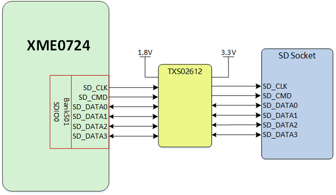

# **XME0724CB Reference Manual**

[中文](https://microphase-doc.readthedocs.io/zh-cn/latest/DEV_BOARD/XME0724CB/XME0724CB_Reference_Manual.html)

## Development Environment:

Vivado 2018.3 is from Xilinx website

<https://www.xilinx.com>

## WeChat Public Number:

## ●1. Overview

The XME0724CB is a commercial-grade dedicated carrier board designed for the evaluation of the XME0724 core board. It features the ZYNQ PS section, which includes a Gigabit Ethernet port, one USB Host port, a USB UART port, a TF card slot, and a CAN interface. The ZYNQ PL section is fully extended through GPIO ports. The baseboard supports Linux and provides comprehensive documentation, including complete source code packages for external interfaces, BSP (Board Support Package), drivers, and development tools. This offers developers a robust software development environment, significantly reducing the ZYNQ SoC XC7Z010/020 product development cycle and enabling faster time-to-market.

### ○Board Layout

### ○Key Features

- KEY: 2 user's keys, 1 PS control, 1 PL control.   

- GPIO: 2 40-Pin expansion ports (2.54mm pitch), each port provide 36 PL IOs   
&ensp;&ensp;&ensp; &ensp;&ensp;1 30-Pin expansion ports (2.54mm pitch), provide 20 PL IOs and 4 PS IOs.  
&ensp;&ensp;&ensp; &ensp;&ensp;All PL IOs are voltage-adjustable.

- JTAG:1 10 Pin JTAG interface.

- ETH:1 Gigabit Ethernet interface
- USB Host: 1 Type-A USB Host interface
- SD CARD: 1 SD Card interface
- USB UART: 1 TYPE-C USB UART interface
- CAN: 2 CAN interfaces

### ○Block diagram

### ○Mechanical Spec

### ○Giga ETH

The Ethernet PHY is integrated into the XME0724 core board, which provides an MDI interface, and an RJ45 interface is connected to the XME0724CB carrier board.

### ○USB Host

There is one USB2.0 HOST port on the XME0724CB.The USB port is a flat USB port (USB Type A), which can be used to connect to different USB Slave peripherals such as USB Mouse and USB Keyboard, USB WIFI, USB Camera and other peripherals.

### ○USB UART

USB to UART is used with CH340E, they are connected to PS Bank500 MIO14, MIO15 for providing serial communication between PC and ZYNQ.

### ○JTAG

XME0724CB provides IDC10 JTAG interface, users can connect the USB downloader to the JTAG port to download or emulate the program of ZYNQ, please avoid plugging and unplugging with electricity to avoid damaging the chip.

### ○BOOT Config

The XME0724CB provides three boot modes: SD card boot, QSPI boot, and JTAG boot. Users can change the boot mode by toggling the SW1 dip switch to change the voltage of the mode pin.

### ○Reset

​	We provide a key (K1) that can be used as a 'reset' signal for designs running on FPGA.

### ○Micro SD

The board provides a Micro SD card interface, allowing users to access  the SD card memory. It also provides storage for the ZYNQ chip’s  bootloader, Linux operating system kernels, file systems, and other user data files.

The SDIO signals are connected to the IO signals of ZYNQ's PS BANK501 (MIO40-MIO45). The VCCIO voltage of the BANK501 is 1.8V while the data level of the SD card is 3.3V, which requires a level shifter chip, TXS02612, to be connected to it.

### ○Key

We provide two keys for user to use. Once the key is pressed, it will be on the low level.

| Position |  Signal Name   | Pin Number | Explain |
| :------: | :------------: | :--------: | :-----: |
|    K2    |     PS_KEY     |     B5     | PS KEY  |
|    K3    | B35_L12_N_MRCC |    K18     | PL KEY  |

### ○CAN

Two TI SN65HVD230 CAN transceivers are provided on the base board and they are connected to PS Bank500 MIO10-MIO13. The core board is connected to the CAN chip as shown in the table below:

| CAN  Signal | SoM Pin | ZYNQ  Pin Name | ZYNQ  Pin Number |
| ----------- | ------- | -------------- | ---------------- |
| CAN0_RX     | Pin_146 | PS_MIO10_500   | E9               |
| CAN0_TX     | Pin_147 | PS_MIO11_500   | C6               |
| CAN1_TX     | Pin_148 | PS_MIO12_500   | D9               |
| CAN1_RX     | Pin_149 | PS_MIO13_500   | E8               |

CAN signals are connected to the J12 expansion port, and a 60.4 ohm terminating resistor can be added to the CAN signal line via a jumper. For CAN0, the terminating resistor can be added between Pin1 and Pin2; for CAN1, the terminating resistor can be added between Pin9 and Pin10.

| Explain        | Pin  | Pin  | Explain |
| -------------- | ---- | ---- | ------- |
| CAN0  Terminal | 1    | 2    | CANL0   |
| CANH0          | 3    | 4    | CANL0   |
| GND            | 5    | 6    | GND     |
| CANH1          | 7    | 8    | CANL1   |
| CAN1  Terminal | 9    | 10   | CANL1   |

### ○GPIO

The base board provides 3 expansion IO ports, 2 40-Pin expansion ports JP1 and JP2, a 30-Pin expansion port JP3, for users to expand more peripherals and interfaces, the default is not welded, users can weld their own double rows of rows of pins or rows of females according to the needs of the user. The 40 Pin expansion port provides 1 channel of 5V power supply, 1 channel of 3.3V power supply, 2 channels of ground and 36 channels of IO ports, while the 30-Pin expansion port provides 1 channel of 5V power supply, 1 channel of 3.3V power supply, 2 channels of ground and 24 channels of IO ports. Pay attention to the voltage of the IO when using, make sure that the voltage of the connected signal is consistent, if it is not consistent, you need to add an external level conversion chip, incorrect use will burn the ZYNQ main chip.

**JP1**

| Pin  | Signal Name | Pin Number | Pin  | Signal Name | Pin Number |
| :--: | :---------: | :--------: | :--: | :---------: | :--------: |
|  1   |  GPIO2_0P   |    J18     |  2   |  GPIO2_0N   |    H18     |
|  3   |  GPIO2_1P   |    E17     |  4   |  GPIO2_1N   |    D18     |
|  5   |  GPIO2_2P   |    E18     |  6   |  GPIO2_2N   |    E19     |
|  7   |  GPIO2_3P   |    C20     |  8   |  GPIO2_3N   |    B20     |
|  9   |  GPIO2_4P   |    K14     |  10  |  GPIO2_4N   |    J14     |
|  11  |   VCC_5V    |     -      |  12  |     GND     |     -      |
|  13  |  GPIO2_5P   |    B19     |  14  |  GPIO2_5N   |    A20     |
|  15  |  GPIO2_6P   |    H15     |  16  |  GPIO2_6N   |    G15     |
|  17  |  GPIO2_7P   |    F16     |  18  |  GPIO2_7N   |    F17     |
|  19  |  GPIO2_8P   |    D19     |  20  |  GPIO2_8N   |    D20     |
|  21  |  GPIO2_9P   |    L16     |  22  |  GPIO2_9N   |    L17     |
|  23  |  GPIO2_10P  |    F19     |  24  |  GPIO2_10N  |    F20     |
|  25  |  GPIO2_11P  |    G17     |  26  |  GPIO2_11N  |    G18     |
|  27  |  GPIO2_12P  |    G19     |  28  |  GPIO2_12N  |    G20     |
|  29  |   VCC_3V3   |     -      |  30  |     GND     |     -      |
|  31  |  GPIO2_13P  |    K19     |  32  |  GPIO2_13N  |    J19     |
|  33  |  GPIO2_14P  |    M17     |  34  |  GPIO2_14N  |    M18     |
|  35  |  GPIO2_15P  |    L19     |  36  |  GPIO2_15N  |    L20     |
|  37  |  GPIO2_16P  |    M19     |  38  |  GPIO2_16N  |    M20     |
|  39  |  GPIO2_17P  |    H16     |  40  |  GPIO2_17N  |    H17     |

**JP2**

| Pin  | Signal Name | Pin Number | Pin  | Signal Name | Pin Number |
| :--: | :---------: | :--------: | :--: | :---------: | :--------: |
|  1   |  GPIO1_0P   |    U18     |  2   |  GPIO1_0N   |    U19     |
|  3   |  GPIO1_1P   |    T20     |  4   |  GPIO1_1N   |    U20     |
|  5   |  GPIO1_2P   |    V20     |  6   |  GPIO1_2N   |    W20     |
|  7   |  GPIO1_3P   |    W18     |  8   |  GPIO1_3N   |    W19     |
|  9   |  GPIO1_4P   |    Y18     |  10  |  GPIO1_4N   |    Y19     |
|  11  |   VCC_5V    |     -      |  12  |     GND     |     -      |
|  13  |  GPIO1_5P   |    V17     |  14  |  GPIO1_5N   |    V18     |
|  15  |  GPIO1_6P   |    Y16     |  16  |  GPIO1_6N   |    Y17     |
|  17  |  GPIO1_7P   |    T16     |  18  |  GPIO1_7N   |    U17     |
|  19  |  GPIO1_8P   |    V16     |  20  |  GPIO1_8N   |    W16     |
|  21  |  GPIO1_9P   |    U14     |  22  |  GPIO1_9N   |    U15     |
|  23  |  GPIO1_10P  |    V15     |  24  |  GPIO1_10N  |    W15     |
|  25  |  GPIO1_11P  |    W14     |  26  |  GPIO1_11N  |    Y14     |
|  27  |  GPIO1_12P  |    T14     |  28  |  GPIO1_12N  |    T15     |
|  29  |   VCC_3V3   |     -      |  30  |     GND     |     -      |
|  31  |  GPIO1_13P  |    P14     |  32  |  GPIO1_13N  |    R14     |
|  33  |  GPIO1_14P  |    V12     |  34  |  GPIO1_14N  |    W13     |
|  35  |  GPIO1_15P  |    U13     |  36  |  GPIO1_15N  |    V13     |
|  37  |  GPIO1_16P  |    T12     |  38  |  GPIO1_16N  |    U12     |
|  39  |  GPIO1_17P  |    T11     |  40  |  GPIO1_17N  |    T10     |

**JP3**

| Pin  | Signal Name | Pin Number | Pin  | Signal Name | Pin Number |
| ---- | ----------- | ---------- | ---- | ----------- | ---------- |
| 1    | GPIO3_0P    | J20        | 2    | GPIO3_0N    | H20        |
| 3    | GPIO3_1P    | K16        | 4    | GPIO3_1N    | J16        |
| 5    | GPIO3_2P    | L14        | 6    | GPIO3_2N    | L15        |
| 7    | GPIO3_3P    | N15        | 8    | GPIO3_3N    | N16        |
| 9    | GPIO3_4P    | N18        | 10   | GPIO3_4N    | P19        |
| 11   | -           | -          | 12   | -           | -          |
| 13   | GPIO3_5P    | N20        | 14   | GPIO3_5N    | P20        |
| 15   | GPIO3_6P    | P15        | 16   | GPIO3_6N    | P16        |
| 17   | GPIO3_7P    | R16        | 18   | GPIO3_7N    | R17        |
| 19   | GPIO3_8P    | N17        | 20   | GPIO3_8N    | P18        |
| 21   | GPIO3_9P    | T17        | 22   | GPIO3_9N    | R18        |
| 23   | -           | -          | 24   | -           | -          |
| 25   | -           | -          | 26   | -           | -          |
| 27   | -           | -          | 28   | -           | -          |
| 29   | VCC_3V3     | -          | 30   | GND         | -          |

### ○Power

​	The board uses a +5V supply from USB. The Figure shows the USB can be used to provide power. 

## ●2.Related Documents 

### ○XME0724

- [XME0724 Reference Manual](https://microphase-doc.readthedocs.io/en/latest/SoM/XME0724/XME0724-Reference_Manual.html)(HTML)

- [XME0724_R30 Schematic](https://github.com/MicroPhase/fpga-docs/blob/master/schematic/XME0724_R30.pdf) (PDF)
- [XME0724_R30 Dimensions](https://github.com/MicroPhase/fpga-docs/blob/master/mechanical/XME0724/XME0724_R30_Dimensions.pdf) (PDF)  
- [XME0724_R30 Dimensions source file](https://github.com/MicroPhase/fpga-docs/blob/master/mechanical/XME0724/XME0724_R30_Dimensions_source_file.dxf) (DXF)  

### ○XME0724CB

- [XME0724CB_R21 Schematic](https://github.com/MicroPhase/fpga-docs/blob/master/schematic/XME0724CB_R21.pdf)(PDF)
- [XME0724CB_R21 Dimensions](https://github.com/MicroPhase/fpga-docs/blob/master/mechanical/XME0724/XME0724CB_R21_Dimensions.pdf)(PDF)
- [XME0724CB_R21 Board source file](https://github.com/MicroPhase/fpga-docs/blob/master/others/XME0724CB_R21_4C.brd)(Brd)

### ○XME0724CB-NET

- XME0724CB-NET Reference Manual(HTML)-To be added
- [XME0724CB-NET_R30 Schematic](https://github.com/MicroPhase/fpga-docs/blob/master/schematic/XME0724CB-NET_R30.pdf)(PDF)
- [XME0724CB-NET_R30 Dimensions](https://github.com/MicroPhase/fpga-docs/blob/master/mechanical/XME0724/XME0724CB-NET_R30_Dimensions.pdf)(PDF)
