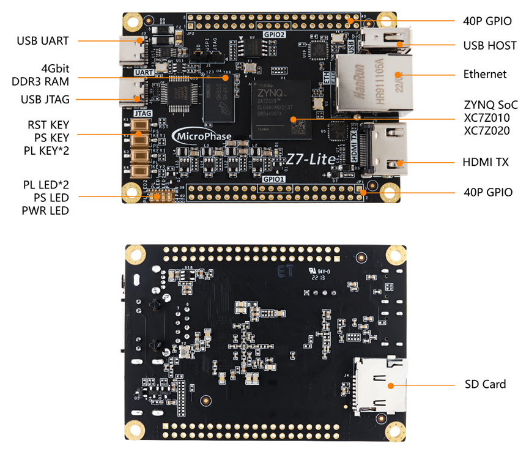
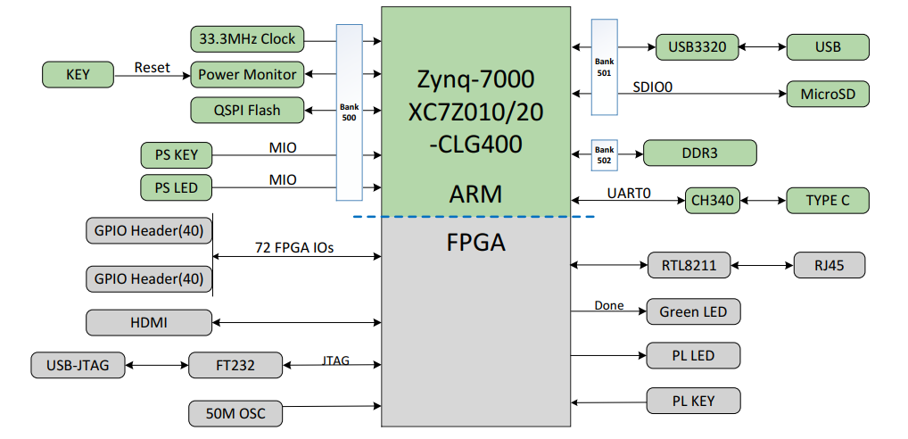
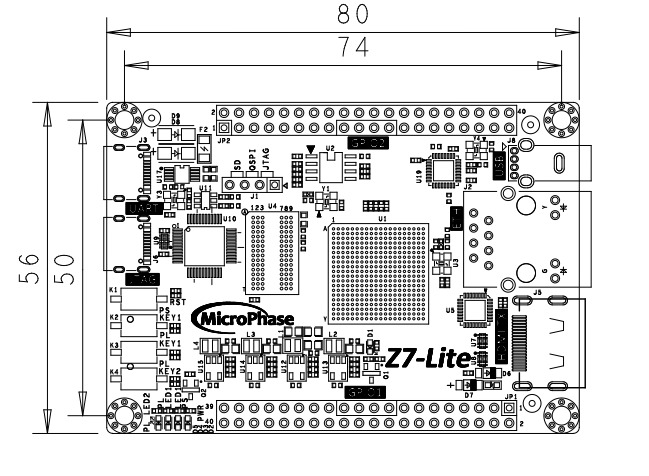
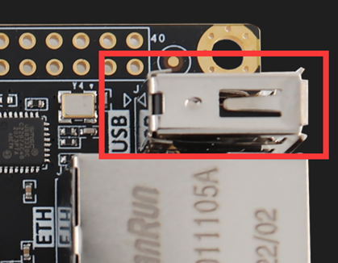
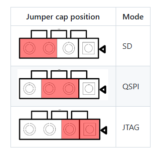
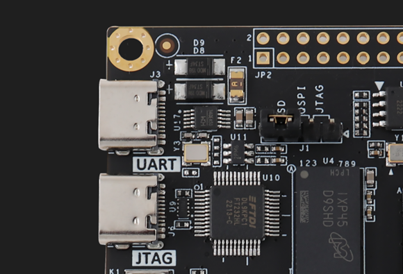

# **Z7-LITE 用户手册**

[[English]](https://microphase-doc.readthedocs.io/en/latest/DEV_BOARD/Z7-LITE/Z7-Lite_Reference_Manual.html)

## 开发环境：

赛灵思Vivado 2018.3 

<https://www.xilinx.com>

## 微信公众号：

## ●1. 概述

Z7 Lite 是一款基于 Xilinx Zynq-7000 SoC（XC7Z010 或 XC7Z020）的商业级SoC开发板，配备高达 4Gb 的 DDR3/L SDRAM、128MB SPI 闪存、千兆以太网 PHY 收发器、USB PHY 收发器以及简单的供电方式。可根据需求提供定制版本，定制需求可能需要满足最低订购量，请联系我们的销售团队获取更多信息：<sales@microphase.cn>。

### ○板卡布局

### ○资源特性

- Xilinx Zynq™ XC7Z010-1CLG400C（仅限 7010 版本），  
Xilinx Zynq™ XC7Z020-1CLG400C（仅限 7020 版本）。  

- DDR3：1 个 4Gbit DDR3（MT41J256M16HA-125:K 或等效型号）。  
- 按键：3 个用户按键，1 个 PS 控制，2 个 PL 控制。  
- LED：3 个用户 LED，1 个 PS 控制，2 个 PL 控制。  
- GPIO：2 个 40 针扩展端口（2.54mm 间距），72 个 3.3V 电压的 IO。  
- USB JTAG：1 个板载 JTAG 电路，可通过 USB 线调试和下载 。  
- HDMI：1 个 HDMI 视频输出接口（1080P@60Hz）。  
- PHY ETH：1 个 10/100 以太网 RJ45 接口，可用于以太网数据交换或其他应用。  
- USB Host：1 个 USB Host。  
- SD 卡：1 个 SD 卡，用于存储操作系统镜像和文件系统。  
- USB UART：1 个 USB UART 接口，用于与 PC 进行串行通信。  
- 时钟：1 个 33.33MHz 有源晶振，为 PS 系统提供稳定时钟。  
    &ensp;&ensp;&ensp;&ensp;&ensp;&ensp;&ensp; 1 个 50MHz 有源晶振，为 PL 逻辑提供额外时钟。  

### ○系统框图

### ○**机械尺寸**

## ●2. 硬件资源

### ○FPGA

- 667 MHz dual-core Cortex-A9 processor  
- DDR3L memory controller with 8 DMA channels and 4   

- High Performance AXI3 Slave ports  

- High-bandwidth peripheral controllers: 1G Ethernet, USB 2.0, SDIO  

- Low-bandwidth peripheral controllers: SPI, UART, CAN, I2C  

- Programmable from JTAG, Quad-SPI flash, and microSD card  

- Programmable logic equivalent to Artix-7 FPGA  
     LUTs: 17,600 (7010)  
        	   &ensp;&ensp;&ensp;&ensp;&ensp;53,200(7020)  
    DSP Slices: 80 (7010)   
        	&ensp;&ensp;&ensp;&ensp;&ensp;&ensp;&ensp;&ensp;&ensp;&ensp;220 (7020)  
    Logic Cells: 28K (7010)  
    		  &ensp;&ensp;&ensp;&ensp;&ensp;&ensp;&ensp;&ensp;&ensp;&ensp;85K(7020)  
    Flip-Flops: 35,200 (7010)   
        	 &ensp;&ensp;&ensp;&ensp;&ensp;&ensp;&ensp;&ensp;&ensp;106,400 (7020)  
    Total Block RAM: 2.1Mb (7010)  
    &ensp;&ensp;&ensp;&ensp;&ensp;&ensp;&ensp;&ensp;&ensp;&ensp;&ensp;&ensp;&ensp;&ensp;&ensp;&ensp;4.9Mb (7020)  

- Analog Mixed Signal (AMS) / XADC:  2x 12 bit, MSPS ADCs with up to 17 Differential Inputs  

- Security: AES & SHA 256b Decryption & Authentication for Secure Programmable Logic Config

### ○DDR3

板载 1 个 16bit 512M DDR3/L SDRAM 芯片。

| 位置 |    型号     |     容量     | 制造商 |
| :--: | :---------: | :----------: | :----: |
|  U4  | MT41K256M16 | 256M x 16bit | Micron |

| 信号名称      | 引脚编号 | 信号名称       | 引脚编号 |
| ------------- | -------- | -------------- | -------- |
| PS_DDR3_A0    | N2       | PS_DDR3_D0     | C3       |
| PS_DDR3_A1    | K2       | PS_DDR3_D1     | B3       |
| PS_DDR3_A2    | M3       | PS_DDR3_D2     | A2       |
| PS_DDR3_A3    | K3       | PS_DDR3_D3     | A4       |
| PS_DDR3_A4    | M4       | PS_DDR3_D4     | D3       |
| PS_DDR3_A5    | L1       | PS_DDR3_D5     | D1       |
| PS_DDR3_A6    | L4       | PS_DDR3_D6     | C1       |
| PS_DDR3_A7    | K4       | PS_DDR3_D7     | E1       |
| PS_DDR3_A8    | K1       | PS_DDR3_D8     | E2       |
| PS_DDR3_A9    | J4       | PS_DDR3_D9     | E3       |
| PS_DDR3_A10   | F5       | PS_DDR3_D10    | G3       |
| PS_DDR3_A11   | G4       | PS_DDR3_D11    | H3       |
| PS_DDR3_A12   | E4       | PS_DDR3_D12    | J3       |
| PS_DDR3_A13   | D4       | PS_DDR3_D13    | H2       |
| PS_DDR3_A14   | F4       | PS_DDR3_D14    | H1       |
| PS_DDR3_BA0   | L5       | PS_DDR3_D15    | J1       |
| PS_DDR3_BA1   | R4       | PS_DDR3_DQS_N0 | B2       |
| PS_DDR3_BA2   | J5       | PS_DDR3_DQS_N1 | F2       |
| PS_DDR3_NCAS  | P5       | PS_DDR3_DQS_P0 | C2       |
| PS_DDR3_CKE   | N3       | PS_DDR3_DQS_P1 | G2       |
| PS_DDR3_CLK_N | M2       | PS_DDR3_NRST   | B4       |
| PS_DDR3_CLK_P | L2       | PS_DDR3_ODT    | N5       |
| PS_DDR3_NCS   | N1       | PS_DDR3_NRAS   | P4       |
| PS_DDR3_DM0   | A1       | PS_DDR3_NWE    | M5       |
| PS_DDR3_DM1   | F1       |                |          |

### ○千兆以太网

RTL8201F 芯片支持 10/100M 网络传输速率，并通过 RGMII 接口与 Zynq7000 PS 系统的 MAC 层通信。它支持 MDI/MDX 自适应、多速率自适应、主/从自适应以及 MDIO 总线支持 PHY 寄存器管理。

### ○USB Host

板载 USB2.0 收发器为 USB3320C-EZK，支持 ULPI 标准接口。它与 ZYNQ 的总线接口连接，以实现高速 USB2.0 Host 模式数据通信。

### ○USB UART

提供了一个 USB 转 UART 芯片 CH340，用于用户连接到主机 PC。

| 信号名称 |   引脚名称   | 引脚编号 |     说明      |
| :------: | :----------: | :------: | :-----------: |
| UART_TX  | PS_MIO15_500 |    C5    | UART 数据输出 |
| UART_RX  | PS_MIO14_500 |    C8    | UART 数据输入 |

### ○USB JTAG

我们在板上集成了 JTAG 下载和调试电路，使用户能够通过 USB 电缆开发和调试 ZYNQ。

### ○启动配置

Z7-Lite 的启动设置包括 JTAG、QSPI 和 SD 模式，这些模式由 J1 的 MODE 输入信号控制。用户可以通过跳线帽更改模式。启动模式配置如下图所示。

### ○Quad-SPI 闪存

板载 128M Quad-SPI 闪存 W25Q128JVSIQ，用于存储 FPGA 初始配置、用户应用程序和数据。

| 位置 |     型号     |   容量    | 制造商 |
| :--: | :----------: | :-------: | :----: |
|  U2  | W25Q128JVSIQ | 128M 字节 |  华邦  |

### ○时钟

一个 33.33 MHz 有源晶振为 PS 系统提供稳定时钟，另一个 50 MHz 有源晶振为 PL 逻辑提供额外时钟。

| 位置 |  信号名称   |   频率    | 引脚编号 |
| :--: | :---------: | :-------: | :------: |
|  Y1  | PS_CLK_33d3 | 33.333MHz |    E7    |
|  U3  | PL_CLK_50M  |   50MHz   |   N18    |

### ○复位

我们提供了一个按键（K1），可用作 FPGA 上运行的设计的“复位”信号。

### ○Micro SD

板卡提供了一个 Micro SD 卡接口，允许用户访问 SD 卡存储器。它还提供了 ZYNQ 芯片的引导加载程序、Linux 操作系统内核、文件系统和其他用户数据文件的存储。

### ○HDMI

一个 HDMI 视频输出接口，可实现 1080P 视频图像。

### ○LED

我们提供了三个 LED 供用户使用。当 FPGA 的相应引脚处于低电平时，LED 会亮起。

| 位置 | 信号名称  | 引脚编号 |  说明   |
| :--: | :-------: | :------: | :-----: |
|  D3  |  PS_LED1  |    E6    | PS LED1 |
|  D4  |  PL_LED1  |   P15    | PL LED1 |
|  D5  | GPIO1_17N |   U12    | PL LED2 |

### ○按键

我们提供了三个按键供用户使用。按下按键时，它将处于低电平。

| 位置 | 信号名称  | 引脚编号 |  说明   |
| :--: | :-------: | :------: | :-----: |
|  K2  |  PS_KEY1  |    B5    | PS KEY1 |
|  K3  |  PL_KEY1  |   P16    | PL KEY1 |
|  K4  | GPIO1_17P |   T12    | PL KEY2 |

### ○GPIO

该开发板引出了大量的用户 IO ，可用于各种自定义应用。FPGA 引脚到连接器的走线经过等长差分处理，单端阻抗为 50 欧姆，差分阻抗为 100 欧姆。

**JP1:**

| 引脚 | 信号名称  | 引脚编号 | 引脚 | 信号名称  | 引脚编号 |
| :--: | :-------: | :------: | :--: | :-------: | :------: |
|  1   | GPIO1_0P  |   N17    |  2   | GPIO1_0N  |   P18    |
|  3   | GPIO1_1P  |   R16    |  4   | GPIO1_1N  |   R17    |
|  5   | GPIO1_2P  |   T16    |  6   | GPIO1_2N  |   U17    |
|  7   | GPIO1_3P  |   W18    |  8   | GPIO1_3N  |   W19    |
|  9   | GPIO1_4P  |   Y18    |  10  | GPIO1_4N  |   Y19    |
|  11  |  VCC_5V   |    \-    |  12  |    GND    |    \-    |
|  13  | GPIO1_5P  |   Y16    |  14  | GPIO1_5N  |   Y17    |
|  15  | GPIO1_6P  |   V17    |  16  | GPIO1_6N  |   V18    |
|  17  | GPIO1_7P  |   W14    |  18  | GPIO1_7N  |   Y14    |
|  19  | GPIO1_8P  |   V16    |  20  | GPIO1_8N  |   W16    |
|  21  | GPIO1_9P  |   T17    |  22  | GPIO1_9N  |   R18    |
|  23  | GPIO1_10P |   V12    |  24  | GPIO1_10N |   W13    |
|  25  | GPIO1_11P |   T14    |  26  | GPIO1_11N |   T15    |
|  27  | GPIO1_12P |   T11    |  28  | GPIO1_12N |   T10    |
|  29  |  VCC_3V3  |    \-    |  30  |    GND    |    \-    |
|  31  | GPIO1_13P |   V15    |  32  | GPIO1_13N |   W15    |
|  33  | GPIO1_14P |   P14    |  34  | GPIO1_14N |   R14    |
|  35  | GPIO1_15P |   U14    |  36  | GPIO1_15N |   U15    |
|  37  | GPIO1_16P |   U13    |  38  | GPIO1_16N |   V13    |
|  39  | GPIO1_17P |   T12    |  40  | GPIO1_17N |   U12    |

**JP2**  

| 引脚 | 信号名称  | 引脚编号 | 引脚 | 信号名称  | 引脚编号 |
| :--: | :-------: | :------: | :--: | :-------: | :------: |
|  1   | GPIO2_0P  |   L16    |  2   | GPIO2_0N  |   L17    |
|  3   | GPIO2_1P  |   H15    |  4   | GPIO2_1N  |   G15    |
|  5   | GPIO2_2P  |   F16    |  6   | GPIO2_2N  |   F17    |
|  7   | GPIO2_3P  |   E18    |  8   | GPIO2_3N  |   E19    |
|  9   | GPIO2_4P  |   B19    |  10  | GPIO2_4N  |   A20    |
|  11  |  VCC_5V   |    \-    |  12  |    GND    |    \-    |
|  13  | GPIO2_5P  |   D19    |  14  | GPIO2_5N  |   D20    |
|  15  | GPIO2_6P  |   E17    |  16  | GPIO2_6N  |   D18    |
|  17  | GPIO2_7P  |   H16    |  18  | GPIO2_7N  |   H17    |
|  19  | GPIO2_8P  |   G19    |  20  | GPIO2_8N  |   G20    |
|  21  | GPIO2_9P  |   J18    |  22  | GPIO2_9N  |   H18    |
|  23  | GPIO2_10P |   K16    |  24  | GPIO2_10N |   J16    |
|  25  | GPIO2_11P |   C20    |  26  | GPIO2_11N |   B20    |
|  27  | GPIO2_12P |   G17    |  28  | GPIO2_12N |   G18    |
|  29  |  VCC_3V3  |    \-    |  30  |    GND    |    \-    |
|  31  | GPIO2_13P |   L19    |  32  | GPIO2_13N |   L20    |
|  33  | GPIO2_14P |   F19    |  34  | GPIO2_14N |   F20    |
|  35  | GPIO2_15P |   M19    |  36  | GPIO2_15N |   M20    |
|  37  | GPIO2_16P |   K19    |  38  | GPIO2_16N |   J19    |
|  39  | GPIO2_17P |   J20    |  40  | GPIO2_17N |   H20    |

### ○电源

本板通过USB接口5V供电。图示的两个USB接口都可以用于供电。

## ●3. 相关文档 
- [Z7-Lite_R11 原理图](https://swnatyr2ph.feishu.cn/file/Ka2wbiF3hoHUFVxuvu4cEH4GnuR) (PDF)
- [Z7-Lite_R11 尺寸](https://swnatyr2ph.feishu.cn/file/SYtxb0NBPo8P9Wxwc2OcRDtdnXb) (PDF)  
- [Z7-Lite_R11 尺寸源文件](https://swnatyr2ph.feishu.cn/file/LsOnbJD3LoSD3uxNIXKcnt3cneh) (DXF)