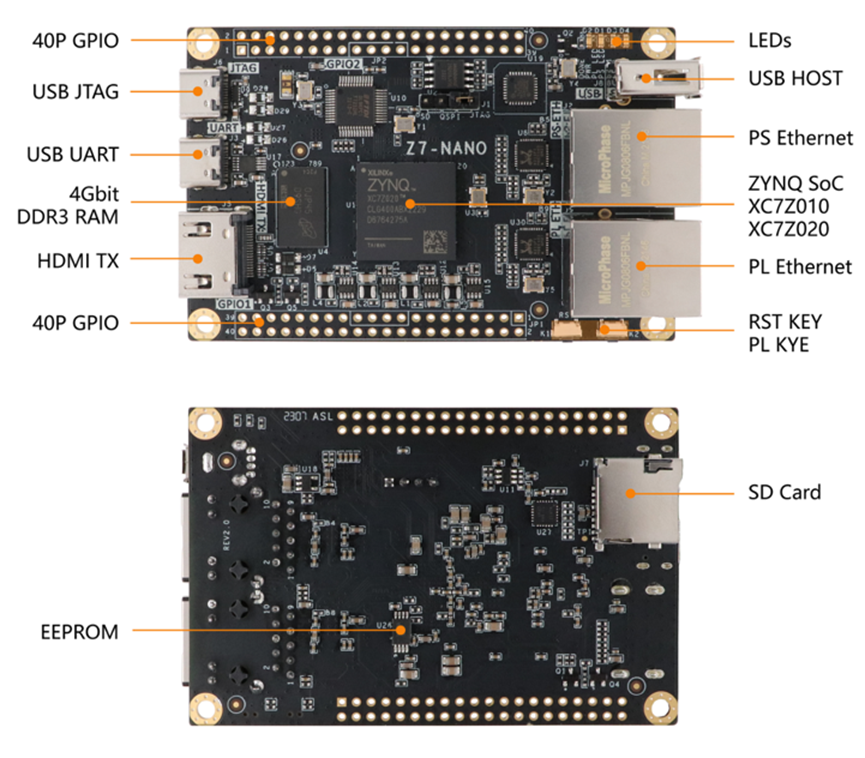
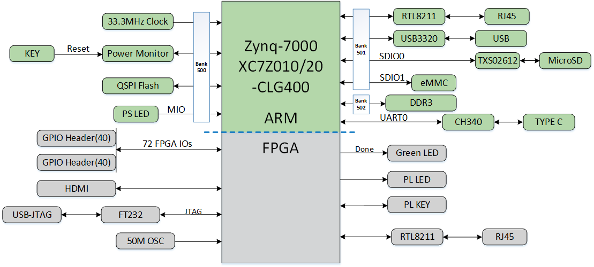
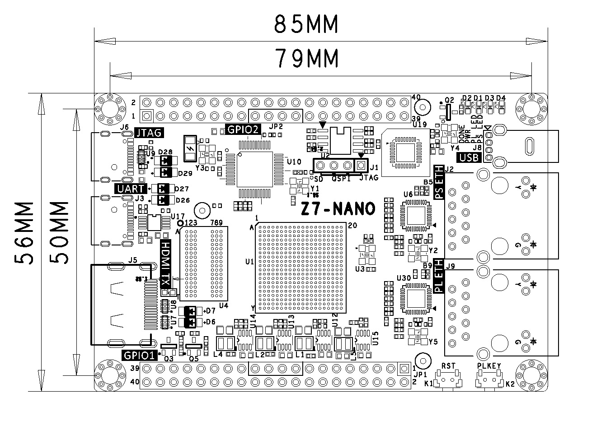
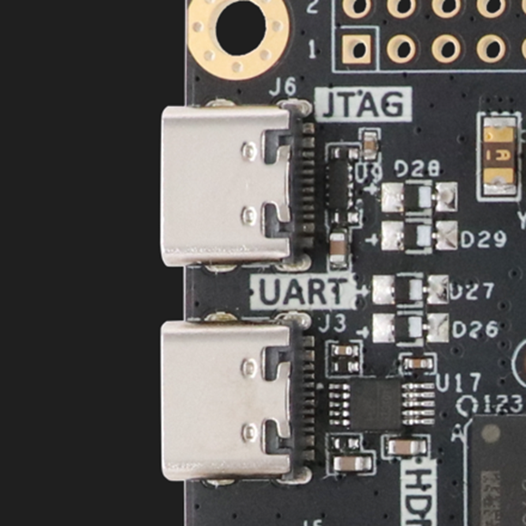

# **Z7-Nano Reference Manual**

[[中文]](https://microphase-doc.readthedocs.io/zh-cn/latest/DEV_BOARD/Z7-NANO/Z7-NANO_Reference_Manual.html)

## Development Environment

Vivado 2018.3 is from Xilinx website

<https://www.xilinx.com>

## WeChat Public Number

## ●1. Overview

​	Z7 Nano is a development board based on Xilinx Zynq-7000 SoCs (XC7Z010 or XC7Z020) with up to 4Gb of DDR3/L SDRAM, 128MB of SPI flash memory, Gigabit Ethernet PHY transceiver, a USB PHY transceiver and a simple way to provide power. And it is available in commercial (XC7Z010、XC7Z020) and industrial (XC7Z020) versions, with customizable variants available upon request，customised requirements may be subject to minimum order quantities,  please contact our sales team for more information: sales@microphase.cn.

​	It is suitable for software verification and hardware development, helping to accelerate project progress.

### ○Board Layout

### ○Key Features

- Xilinx Zynq™ XC7Z010-1CLG400C (7010 Version Only),  
Xilinx Zynq™ XC7Z020-2CLG400C (7020 Version Only)

- DDR3: 1 4Gbit, DDR3. (MT41J256M16HA-125:K or equivalent)  
  
- KEY: 1 user's key, which is controlled by PL.  
  
- LED: 2 user's LEDs, 1 PS control, 1 PL control.  
  
- GPIO: 2 40-pin expansion ports (2.54mm pitch), 72 IOs of 3.3V voltage.  
  
- USB JTAG: 1 on-board JTAG circuit, can debug and download the ZYNQ system through a USB cable.  
  
- HDMI: 1 HDMI video output interface, can realize 1080P video image  
  
- PHY ETH: 2 10/100/1000M Ethernet RJ45 interface, which can be used for Ethernet data exchange or other applications.  
  &ensp;&ensp;&ensp;&ensp;&ensp;&ensp;&ensp;&ensp;&ensp;1 PS control, 1 PL control.  
  
- USB Host: 1 USB Host.  
  
- SD Card: 1 SD Card is provided to store the operating system image and file system.  
  
- USB UART:1 USB UART interface, used for serial communication with PC.  
  
- CLOCK: 1 33.33Mhz active crystal oscillator provides a stable clock for the PS system.  
    &ensp;&ensp;&ensp;&ensp;&ensp;&ensp;&ensp;&ensp;1 50Mhz active crystal oscillator provides additional clocks for the PL logic.  

### ○Block diagram

### ○**Mechanical Spec**

## ●2. Function Resources

### ○FPGA

- 667 MHz dual-core Cortex-A9 processor  
  
- DDR3L memory controller with 8 DMA channels and 4   
  
- High-Performance AXI3 Slave ports  
  
- High-bandwidth peripheral controllers: 1G Ethernet, USB 2.0, SDIO  
  
- Low-bandwidth peripheral controllers: SPI, UART, CAN, I2C  
  
- Programmable from JTAG, Quad-SPI flash, and microSD card  
  
- Programmable logic equivalent to Artix-7 FPGA  

  LUTs: 17,600 (7010)  
  	   &ensp;&ensp;&ensp;&ensp;&ensp;53,200(7020)  
  DSP Slices: 80 (7010)   
      	&ensp;&ensp;&ensp;&ensp;&ensp;&ensp;&ensp;&ensp;&ensp;&ensp;220 (7020)  
  Logic Cells: 28K (7010)  
  		  &ensp;&ensp;&ensp;&ensp;&ensp;&ensp;&ensp;&ensp;&ensp;&ensp;85K(7020)  
  Flip-Flops: 35,200 (7010)   
      	 &ensp;&ensp;&ensp;&ensp;&ensp;&ensp;&ensp;&ensp;&ensp;106,400 (7020)  
  Total Block RAM: 2.1Mb (7010)   
&ensp;&ensp;&ensp;&ensp;&ensp;&ensp;&ensp;&ensp;&ensp;&ensp;&ensp;&ensp;&ensp;&ensp;&ensp;&ensp;4.9Mb (7020)  
- Analog Mixed Signal (AMS) / XADC:  2x 12 bit, MSPS ADCs with up to 17 Differential Inputs  
- Security: AES & SHA 256b Decryption & Authentication for Secure Programmable Logic Config

### ○DDR3

​	One on-board 16bit 512M DDR3/L SDRAM chips.

| Position |    Model    |   Capacity   | Factory |
| :------: | :---------: | :----------: | :-----: |
|    U4    | MT41K256M16 | 256M x 16bit | Micron  |

| Signal Name   | PIN Number | Signal Name    | PIN Number |
| ------------- | ---------- | -------------- | ---------- |
| PS_DDR3_A0    | N2         | PS_DDR3_D0     | C3         |
| PS_DDR3_A1    | K2         | PS_DDR3_D1     | B3         |
| PS_DDR3_A2    | M3         | PS_DDR3_D2     | A2         |
| PS_DDR3_A3    | K3         | PS_DDR3_D3     | A4         |
| PS_DDR3_A4    | M4         | PS_DDR3_D4     | D3         |
| PS_DDR3_A5    | L1         | PS_DDR3_D5     | D1         |
| PS_DDR3_A6    | L4         | PS_DDR3_D6     | C1         |
| PS_DDR3_A7    | K4         | PS_DDR3_D7     | E1         |
| PS_DDR3_A8    | K1         | PS_DDR3_D8     | E2         |
| PS_DDR3_A9    | J4         | PS_DDR3_D9     | E3         |
| PS_DDR3_A10   | F5         | PS_DDR3_D10    | G3         |
| PS_DDR3_A11   | G4         | PS_DDR3_D11    | H3         |
| PS_DDR3_A12   | E4         | PS_DDR3_D12    | J3         |
| PS_DDR3_A13   | D4         | PS_DDR3_D13    | H2         |
| PS_DDR3_A14   | F4         | PS_DDR3_D14    | H1         |
| PS_DDR3_BA0   | L5         | PS_DDR3_D15    | J1         |
| PS_DDR3_BA1   | R4         | PS_DDR3_DQS_N0 | B2         |
| PS_DDR3_BA2   | J5         | PS_DDR3_DQS_N1 | F2         |
| PS_DDR3_NCAS  | P5         | PS_DDR3_DQS_P0 | C2         |
| PS_DDR3_CKE   | N3         | PS_DDR3_DQS_P1 | G2         |
| PS_DDR3_CLK_N | M2         | PS_DDR3_NRST   | B4         |
| PS_DDR3_CLK_P | L2         | PS_DDR3_ODT    | N5         |
| PS_DDR3_NCS   | N1         | PS_DDR3_NRAS   | P4         |
| PS_DDR3_DM0   | A1         | PS_DDR3_NWE    | M5         |
| PS_DDR3_DM1   | F1         |                |            |

### ○Giga ETH

​	The RTL8211F chip supports a 10/100/1000M network transfer rate and communicates with the MAC layer of the Zynq7000 PS system via the RGMII interface. It also supports MDI/MDX adaptation, multiple speed adaptation, master/slave adaptation, and MDIO bus support for PHY register management.

### ○USB Host

​	The USB 2.0 transceiver on-board is the USB3320C-EZK, which supports the ULPI standard interface. It's connected with ZYNQ's bus interface to enable high-speed USB2.0 Host mode data communications.

### ○USB UART

​	A USB to UART chip, the CH340, is provided for user connection to the host PC.

| Signal Name |   Pin Name   | Pin Number |     Explain      |
| :---------: | :----------: | :--------: | :--------------: |
|   UART_TX   | PS_MIO15_500 |     C8     | UART data output |
|   UART_RX   | PS_MIO14_500 |     C5     | UART data output |

### ○USB JTAG

​	We have incorporated the JTAG download and debug circuitry into the board, enabling users to develop and debug ZYNQ through a USB cable.

### ○Boot Config

​	The Z7-Nano startup settings include JTAG, QSPI and SD modes, which are controlled by the MODE input signal from the J1. The user has the option to change mode through the jumper cap. The startup mode is configured as shown in the table below.

### ○Quad-SPI Flash

​	On-board 128M Quad-SPI Flash memory W25Q128JVSIQ is used to store initial FPGA configuration and user’s application as well as data.

| Position |    Model     | Capacity  | Factory |
| :------: | :----------: | :-------: | :-----: |
|    U2    | W25Q128JVSIQ | 128M Byte | Winbond |

### ○Clock

​	One 33.33Mhz active crystal oscillator provides a stable clock for the PS system. The other 50Mhz active  crystal oscillator provides additional clocks for the PL logic.

| Position | Signal Name | Frequency | Pin Number |
| :------: | :---------: | :-------: | :--------: |
|    Y1    | PS_CLK_33d3 | 33.333Mhz |     E7     |
|    U3    | PL_CLK_50M  |   50Mhz   |    N18     |

### ○Reset

​	We provide a key (K1) that can be used as a 'reset' signal for designs running on FPGA.

### ○Micro SD

​	The board provides a Micro SD card interface, allowing users to access the SD card memory. It also provides storage for the ZYNQ chip's bootloader, Linux operating system kernels, file systems, and other user data files.

### ○HDMI

​	One HDMI video output interface can realize 1080P video images.

### ○LED

​	We provide two LEDs for user to use. When the corresponding pin of the FPGA is in a low state, the LED is illuminated.

| Position | Signal Name | Pin Number | Explain |
| :------: | :---------: | :--------: | :-----: |
|    D4    |   PS_LED1   |     E6     | PS LED1 |
|    D3    |  GPIO1_17N  |    R14     | PL LED1 |

### ○Key

​	We provide one key for user to use. Once the key is pressed, it will be on the low level.

| Position | Signal Name | Pin Number | Explain |
| :------: | :---------: | :--------: | :-----: |
|    K2    |  GPIO1_17P  |    P14     | PL KEY1 |

### ○GPIO

​	This device is equipped with a maximum of 72 user IO pins that can be used for various custom applications. All user IOs are length-matched and can be used as differential pairs.  
**JP1:**  

| Pin | Signal Name  | Pin Number | Pin | Signal Name  | Pin Number |
| :--: | :-------: | :------: | :--: | :-------: | :------: |
|  1   | GPIO1_0P  |   N17    |  2   | GPIO1_0N  |   P18    |
|  3   | GPIO1_1P  |   R16    |  4   | GPIO1_1N  |   R17    |
|  5   | GPIO1_2P  |   T17    |  6   | GPIO1_2N  |   R18    |
|  7   | GPIO1_3P  |   T16    |  8   | GPIO1_3N  |   U17    |
|  9   | GPIO1_4P  |   W18    |  10  | GPIO1_4N  |   W19    |
|  11  |  VCC_5V   |          |  12  |    GND    |          |
|  13  | GPIO1_5P  |   Y18    |  14  | GPIO1_5N  |   Y19    |
|  15  | GPIO1_6P  |   Y16    |  16  | GPIO1_6N  |   Y17    |
|  17  | GPIO1_7P  |   V17    |  18  | GPIO1_7N  |   V18    |
|  19  | GPIO1_8P  |   V16    |  20  | GPIO1_8N  |   W16    |
|  21  | GPIO1_9P  |   V15    |  22  | GPIO1_9N  |   W15    |
|  23  | GPIO1_10P |   U14    |  24  | GPIO1_10N |   U15    |
|  25  | GPIO1_11P |   U13    |  26  | GPIO1_11N |   V13    |
|  27  | GPIO1_12P |   T12    |  28  | GPIO1_12N |   U12    |
|  29  |  VCC_3V3  |          |  30  |    GND    |          |
|  31  | GPIO1_13P |   W14    |  32  | GPIO1_13N |   Y14    |
|  33  | GPIO1_14P |   V12    |  34  | GPIO1_14N |   W13    |
|  35  | GPIO1_15P |   T14    |  36  | GPIO1_15N |   T15    |
|  37  | GPIO1_16P |   T11    |  38  | GPIO1_16N |   T10    |
|  39  | GPIO1_17P |   P14    |  40  | GPIO1_17N |   R14    |

**JP2:**  

| Pin | Signal Name  | Pin Number | Pin | Signal Name  | Pin Number |
| :--: | :-------: | :------: | :--: | :-------: | :------: |
|  1   | GPIO2_0P  |   H15    |  2   | GPIO2_0N  |   G15    |
|  3   | GPIO2_1P  |   F16    |  4   | GPIO2_1N  |   F17    |
|  5   | GPIO2_2P  |   E17    |  6   | GPIO2_2N  |   D18    |
|  7   | GPIO2_3P  |   E18    |  8   | GPIO2_3N  |   E19    |
|  9   | GPIO2_4P  |   G17    |  10  | GPIO2_4N  |   G18    |
|  11  |  VCC_5V   |          |  12  |    GND    |          |
|  13  | GPIO2_5P  |   H16    |  14  | GPIO2_5N  |   H17    |
|  15  | GPIO2_6P  |   B19    |  16  | GPIO2_6N  |   A20    |
|  17  | GPIO2_7P  |   C20    |  18  | GPIO2_7N  |   B20    |
|  19  | GPIO2_8P  |   D19    |  20  | GPIO2_8N  |   D20    |
|  21  | GPIO2_9P  |   J18    |  22  | GPIO2_9N  |   H18    |
|  23  | GPIO2_10P |   F19    |  24  | GPIO2_10N |   F20    |
|  25  | GPIO2_11P |   G19    |  26  | GPIO2_11N |   G20    |
|  27  | GPIO2_12P |   J20    |  28  | GPIO2_12N |   H20    |
|  29  |  VCC_3V3  |          |  30  |    GND    |          |
|  31  | GPIO2_13P |   K16    |  32  | GPIO2_13N |   J16    |
|  33  | GPIO2_14P |   K19    |  34  | GPIO2_14N |   J19    |
|  35  | GPIO2_15P |   L16    |  36  | GPIO2_15N |   L17    |
|  37  | GPIO2_16P |   M19    |  38  | GPIO2_16N |   M20    |
|  39  | GPIO2_17P |   L19    |  40  | GPIO2_17N |   L20    |

### ○Power

​	The board uses a +5V supply from USB. The Figure shows the USB can be used to provide power.  

## ●3.Related Documents 

- [Z7-NANO_R21_Schematic](https://github.com/MicroPhase/fpga-docs/blob/master/schematic/Z7-NANO_R21.pdf)(PDF)
- [Z7-NANO_R20_Dimensions](https://github.com/MicroPhase/fpga-docs/blob/master/mechanical/Z7-NANO/Z7-Nano_R20_Dimensions.pdf)(PDF)
- [Z7-NANO_R20_Dimensions source file](https://github.com/MicroPhase/fpga-docs/blob/master/mechanical/Z7-NANO/Z7-NANO_R20_Dimensions.dxf) (DXF) 
