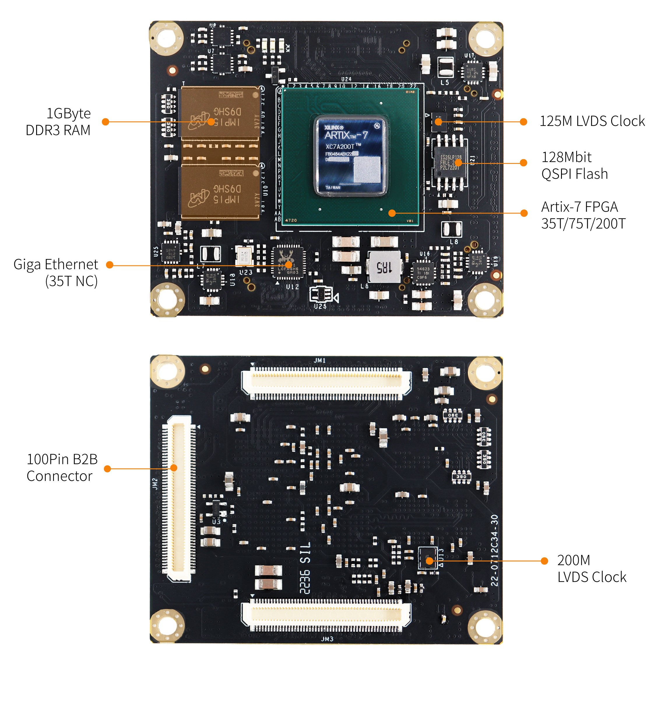
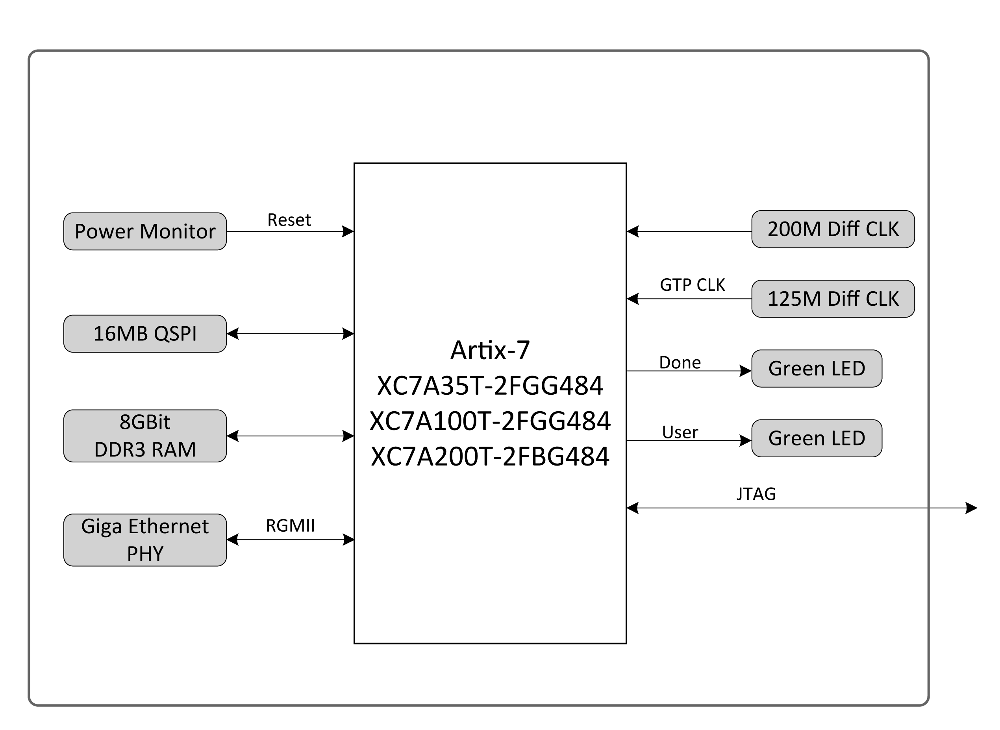
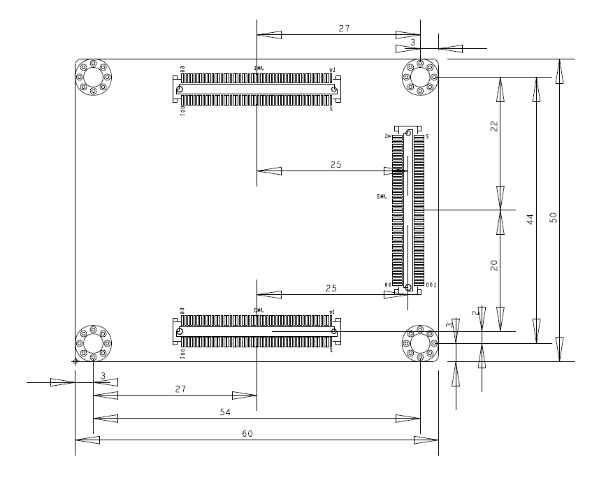

# **XME0712用户手册**

[[English]](https://microphase-doc.readthedocs.io/en/latest/SoM/XME0712/XME0712-Reference_Manual.html)

### 开发环境:

赛灵思Vivado 2018.3

<https://www.xilinx.com>

### 微信公众号:

## ●1. 概述

​	XME0712 是微相科技推出的一款基于赛灵思 Artix-7 系列的工业级系统模块。该模块集成XC7A35T/75T/200T FPGA 芯片、DDR3 内存、16MByte QSPI 闪存、千兆以太网 PHY 收发器以及电源管理功能，并通过高速连接器扩展了大量可配置的 I/O 接口。模块尺寸仅为 5 x 6 cm，且价格极具竞争力，非常适合集成到客户的产品中。所有微相科技尺寸为 5 x 6 cm的核心模块，机械结构兼容。

### ○板卡布局

### ○资源特性

- Xilinx Artix-7 XC7A35T-2FGG484,

  Xilinx Artix-7 XC7A100T-2FGG484, 

  Xilinx Artix-7 XC7A200T-2FBG484.

- DDR3: 8Gbit, DDR3 (MT41K256M16TW-107 IT:P).

- LED: 1个电源 LED,1个FPGA 配置状态指示灯, 1个用户LED。

- Flash: 128Mbit QSPI Flash。

- PHY ETH: 10/100/1000M 自适应。

- CLOCK: 2路差分时钟。

### ○系统框图

​          

### ○机械尺寸

## ●2. 硬件资源

### ○FPGA

- Logic Cells: 33,280(35T)

  &ensp;&ensp;&ensp;&ensp;&ensp;&ensp;&ensp;&ensp;&ensp;&ensp;&ensp;101,440(100T)

  &ensp;&ensp;&ensp;&ensp;&ensp;&ensp;&ensp;&ensp;&ensp;&ensp;&ensp;215,360(200T)
- Slices: 5,200(35T)

  &ensp;&ensp;&ensp;&ensp;&ensp;&ensp;15,850(100T)

  &ensp;&ensp;&ensp;&ensp;&ensp;&ensp;33,650(200T)

- CLB Flip-Flops: 41,600(35T)  
  &ensp;&ensp;&ensp;&ensp;&ensp;&ensp;&ensp;&ensp;&ensp;&ensp;&ensp;&ensp;&ensp;&ensp;126,800(100T)  
  &ensp;&ensp;&ensp;&ensp;&ensp;&ensp;&ensp;&ensp;&ensp;&ensp;&ensp;&ensp;&ensp;&ensp;269,200(200T)

- Maximum Distributed RAM(Kb): 400(35T)

  &ensp;&ensp;&ensp;&ensp;&ensp;&ensp;&ensp;&ensp;&ensp;&ensp;&ensp;&ensp;&ensp;&ensp;&ensp;&ensp;&ensp;&ensp;&ensp;&ensp;&ensp;&ensp;&ensp;&ensp;&ensp;&ensp;&ensp;&ensp;&ensp;1,188(100T)

  &ensp;&ensp;&ensp;&ensp;&ensp;&ensp;&ensp;&ensp;&ensp;&ensp;&ensp;&ensp;&ensp;&ensp;&ensp;&ensp;&ensp;&ensp;&ensp;&ensp;&ensp;&ensp;&ensp;&ensp;&ensp;&ensp;&ensp;&ensp;&ensp;2,888(200T)

- Block RAM/FIFO w/ ECC (36 Kb each): 50(35T)

  &ensp;&ensp;&ensp;&ensp;&ensp;&ensp;&ensp;&ensp;&ensp;&ensp;&ensp;&ensp;&ensp;&ensp;&ensp;&ensp;&ensp;&ensp;&ensp;&ensp;&ensp;&ensp;&ensp;&ensp;&ensp;&ensp;&ensp;&ensp;&ensp;&ensp;&ensp;&ensp;&ensp;&ensp;&ensp;135(100T)

  &ensp;&ensp;&ensp;&ensp;&ensp;&ensp;&ensp;&ensp;&ensp;&ensp;&ensp;&ensp;&ensp;&ensp;&ensp;&ensp;&ensp;&ensp;&ensp;&ensp;&ensp;&ensp;&ensp;&ensp;&ensp;&ensp;&ensp;&ensp;&ensp;&ensp;&ensp;&ensp;&ensp;&ensp;&ensp;365(200T)

- Total Block RAM (Kb): 1,800(35T)

  &ensp;&ensp;&ensp;&ensp;&ensp;&ensp;&ensp;&ensp;&ensp;&ensp;&ensp;&ensp;&ensp;&ensp;&ensp;&ensp;&ensp;&ensp;&ensp;&ensp;4,860(100T)

  &ensp;&ensp;&ensp;&ensp;&ensp;&ensp;&ensp;&ensp;&ensp;&ensp;&ensp;&ensp;&ensp;&ensp;&ensp;&ensp;&ensp;&ensp;&ensp;&ensp;13,140(200T)

- CMTs (1 MMCM + 1 PLL): 5(35T)  
  &ensp;&ensp;&ensp;&ensp;&ensp;&ensp;&ensp;&ensp;&ensp;&ensp;&ensp;&ensp;&ensp;&ensp;&ensp;&ensp;&ensp;&ensp;&ensp;&ensp;   &ensp;&ensp;&ensp;6(100T)  
  &ensp; &ensp;  &ensp; &ensp;&ensp;&ensp;&ensp;&ensp;&ensp;&ensp;&ensp;&ensp;&ensp;&ensp;&ensp;&ensp;&ensp;&ensp;&ensp;&ensp;&ensp;&ensp;10(200T)

- Maximum Single-Ended I/O:250(35T)

  &ensp; &ensp;  &ensp; &ensp;&ensp;&ensp;&ensp;&ensp;&ensp;&ensp;&ensp;&ensp;&ensp;&ensp;&ensp;&ensp;&ensp;&ensp;&ensp;&ensp;&ensp;&ensp;&ensp;300(100T)

  &ensp; &ensp;  &ensp; &ensp;&ensp;&ensp;&ensp;&ensp;&ensp;&ensp;&ensp;&ensp;&ensp;&ensp;&ensp;&ensp;&ensp;&ensp;&ensp;&ensp;&ensp;&ensp;&ensp;500(200T)

- Maximum Differential I/O Pairs: 120(35T)

  &ensp; &ensp;  &ensp; &ensp;&ensp;&ensp;&ensp;&ensp;&ensp;&ensp;&ensp;&ensp;&ensp;&ensp;&ensp;&ensp;&ensp;&ensp;&ensp;&ensp;&ensp;&ensp;&ensp;&ensp;&ensp;&ensp;&ensp;144(100T)

  &ensp; &ensp;  &ensp; &ensp;&ensp;&ensp;&ensp;&ensp;&ensp;&ensp;&ensp;&ensp;&ensp;&ensp;&ensp;&ensp;&ensp;&ensp;&ensp;&ensp;&ensp;&ensp;&ensp;&ensp;&ensp;&ensp;&ensp;240(200T)

- DSP Slices: 90(35T)

  &ensp;&ensp;&ensp;&ensp;&ensp;&ensp;&ensp;&ensp;&ensp;&ensp;&ensp;240(100T)

  &ensp;&ensp;&ensp;&ensp;&ensp;&ensp;&ensp;&ensp;&ensp;&ensp;&ensp;740(200T)

- PCIe® Gen2: 1

- Analog Mixed Signal (AMS) / XADC: 1

- Configuration AES / HMAC Blocks: 1

- GTP Transceivers (6.6 Gb/s Max Rate): 4(35T)

  &ensp;&ensp;&ensp;&ensp;&ensp;&ensp;&ensp;&ensp;&ensp;&ensp;&ensp;&ensp;&ensp;&ensp;&ensp;&ensp;&ensp;&ensp;&ensp;&ensp;&ensp;&ensp;&ensp;&ensp;&ensp;&ensp;&ensp;&ensp;&ensp;&ensp;&ensp;&ensp;&ensp;&ensp;8(100T)

  &ensp;&ensp;&ensp;&ensp;&ensp;&ensp;&ensp;&ensp;&ensp;&ensp;&ensp;&ensp;&ensp;&ensp;&ensp;&ensp;&ensp;&ensp;&ensp;&ensp;&ensp;&ensp;&ensp;&ensp;&ensp;&ensp;&ensp;&ensp;&ensp;&ensp;&ensp;&ensp;&ensp;&ensp;16(200T)

### ○DDR3

​	该模块采用 2 片 16 位 DDR3 内存芯片。单颗 DDR3 芯片的容量为 4Gbit，两片总容量为 8Gbit，位宽为 32 位。DDR3 RAM 型号为 MT41K256M16TW-107 IT:P ，兼容 MT41K256M16HA-125。DDR3 SDRAM 的最高工作时钟频率为 400MHz（数据速率为 800Mbps），DDR3 芯片连接至 FPGA 的 BANK 34 和 BANK 35 的 IO 接口。

| Signal Name | Pin Number | Signal Name | Pin Number |
| ----------- | ---------- | ----------- | ---------- |
| DDR3_A0     | R3         | DDR3_D9     | H2         |
| DDR3_A1     | Y6         | DDR3_D10    | J5         |
| DDR3_A2     | U6         | DDR3_D11    | G2         |
| DDR3_A3     | R6         | DDR3_D12    | H3         |
| DDR3_A4     | AA5        | DDR3_D13    | H5         |
| DDR3_A5     | T6         | DDR3_D14    | J1         |
| DDR3_A6     | Y2         | DDR3_D15    | G3         |
| DDR3_A7     | W2         | DDR3_D16    | L3         |
| DDR3_A8     | AB2        | DDR3_D17    | K6         |
| DDR3_A9     | W1         | DDR3_D18    | K3         |
| DDR3_A10    | W6         | DDR3_D19    | M3         |
| DDR3_A11    | AB5        | DDR3_D20    | J4         |
| DDR3_A12    | W5         | DDR3_D21    | M2         |
| DDR3_A13    | V5         | DDR3_D22    | J6         |
| DDR3_A14    | AB1        | DDR3_D23    | K4         |
| DDR3_BA0    | R2         | DDR3_D24    | P1         |
| DDR3_BA1    | AB3        | DDR3_D25    | N4         |
| DDR3_BA2    | U3         | DDR3_D26    | P6         |
| DDR3_NCAS   | U1         | DDR3_D27    | M6         |
| DDR3_CKE    | AA1        | DDR3_D28    | R1         |
| DDR3_CLK_N  | AA3        | DDR3_D29    | M5         |
| DDR3_CLK_P  | Y3         | DDR3_D30    | P2         |
| DDR3_NCS    | V3         | DDR3_D31    | N2         |
| DDR3_DM0    | F3         | DDR3_ODT    | U2         |
| DDR3_DM1    | H4         | DDR3_NRAS   | V2         |
| DDR3_DM2    | L5         | DDR3_NWE    | T1         |
| DDR3_DM3    | N5         | DDR3_DQS_N0 | D1         |
| DDR3_D0     | C2         | DDR3_DQS_N1 | J2         |
| DDR3_D1     | E2         | DDR3_DQS_N2 | L1         |
| DDR3_D2     | B2         | DDR3_DQS_N3 | P4         |
| DDR3_D3     | F1         | DDR3_DQS_P0 | E1         |
| DDR3_D4     | B1         | DDR3_DQS_P1 | K2         |
| DDR3_D5     | G1         | DDR3_DQS_P2 | M1         |
| DDR3_D6     | A1         | DDR3_DQS_P3 | P5         |
| DDR3_D7     | D2         | DDR3_NRST   | Y1         |
| DDR3_D8     | K1         |             |            |

### ○Giga ETH

​	XME0712 集成了 REALTEK REL8211FI 千兆以太网 PHY 芯片，用户可以轻松实现以太网相关应用。以太网 PHY 芯片连接到 FPGA 的 Bank13，**但由于 XC7A35T-FGG484 没有 Bank13 ，因此 XME0712-35T 模块并不直接支持以太网功能。**

​	以太网 PHY 通过 RGMII 接口 与 FPGA 连接，FPGA 可以通过 MDIO 网络端口管理接口 读写 PHY 芯片的寄存器。MDI 发送和接收信号连接到B2B连接器 JM3。用户只需将这些信号连接到 RJ45 接口 即可完成网络端口的设计。

| Signal Name | FPGA PIN |          Explain           |
| :---------: | :------: | :------------------------: |
|  ETH0_NRST  |   Y17    |        Reset signal        |
|  ETH0_TXCK  |   Y11    |        RGMII TX CLK        |
| ETH0_TXCTL  |   AB11   |  RGMII TX Control Single   |
|  ETH0_TXD0  |   AB12   |      RGMII Tx Date 0       |
|  ETH0_TXD1  |   AA9    |      RGMII Tx Date 1       |
|  ETH0_TXD2  |   AB10   |      RGMII Tx Date 2       |
|  ETH0_TXD3  |   AA10   |      RGMII Tx Date 3       |
|  ETH0_RXCK  |   W11    |        RGMII Rx CLK        |
| ETH0_RXCTL  |   AA11   |  RGMII RX Control Single   |
|  ETH0_RXD0  |   V10    |      RGMII Rx Date 0       |
|  ETH0_RXD1  |   W10    |      RGMII Rx Date 0       |
|  ETH0_RXD2  |   Y12    |      RGMII Rx Date 0       |
|  ETH0_RXD3  |   W12    |      RGMII Rx Date 0       |
|  ETH0_MDC   |   AA13   | Management Interface Clock |
|  ETH0_MDIO  |   AB13   | Management  Interface Date |

### ○复位

​	RESET_N 低电平有效，复位信号由底板产生。复位信号通过电源和复位监控芯片输出到 FPGA 引脚。当 POR_nRST 为低电平时，表示存在复位信号或 3.3V 电源电压低于 2.93V。如果未使用复位信号，可以将其悬空。

### ○JTAG

​	FPGA的JTAG信号连接到扩展端口上，该端口还提供了一个3.3V的JTAG VREF电压输出信号。

| Signal Name | JM3 Pin Number | Explain                        |
| :---------: | :------------: | ------------------------------ |
|   VCC_3V3   |    Pin11,13    | **模块电压输出**，JTAG参考电压 |
|  FPGA_TDI   |     Pin21      | Input (3.3V)                   |
|  FPGA_TDO   |     Pin17      | Output (3.3V)                  |
|  FPGA_TCK   |     Pin15      | Input (3.3V)                   |
|  FPGA_TMS   |     Pin23      | Input (3.3V)                   |
|     GND     |      ---       | 连接到模块的GND信号            |

### ○Quad-SPI Flash

​	板载 128M Quad-SPI Flash 存储器 IS25LP128F-JBLE-TR 用于存储初始 FPGA 配置、用户应用程序及数据。

| Position |       Model        | Capacity | Factory |
| :------: | :----------------: | :------: | :-----: |
|   U21    | IS25LP128F-JBLE-TR | 128 Byte |  ISSI   |

### ○Clock

​	XME0712核心板提供了两个有源差分时钟。其中一个200 MHz的时钟连接到Bank 34的时钟引脚，可用作FPGA的逻辑时钟和DDR3的控制时钟。另一个125 MHz的时钟连接到Bank 216，作为GTP收发器的参考输入时钟。

​	200M差分时钟输入的分配如下表所示：

| Signal Name | FPGA Pin |       Explain        |
| :---------: | :------: | :------------------: |
|  SYS_CLK_P  |    V4    | Differential clock P |
|  SYS_CLK_N  |    W4    | Differential clock N |

​	125M差分时钟输入的分配如下表所示：

| Signal Name | FPGA Pin |       Explain        |
| :---------: | :------: | :------------------: |
| MGT_CLK1_P  |   F10    | Differential clock P |
| MGT_CLK1_N  |   E10    | Differential clock N |

### ○Power

​	**XME0712 支持宽电源输入 (4.5V~17V) ， 推荐设计使用电源输入为 +12V 。**

​	模块上电后，按顺序级联，以 1.0V->1.8V->1.5V->3.3V 的顺序完成上电过程。3.3V 最后上电， 同时提供系统电源状态 PG 信号。

### ○LED

XME0712 开发板包含三个 LED 指示灯：电源指示灯、FPGA 配置状态指示灯以及由 PL 控制的用户 LED。
LED 信号描述如下表所示。

| LED  | FPGA Pin | Note                                          |
| :--: | -------- | --------------------------------------------- |
|  D4  | --       | 电源指示灯                                    |
|  D1  | G11      | FPGA 配置状态指示灯，在 FPGA 配置成功后点亮。 |
|  D3  | T16      | 当FPGA的T16为高电平的时候LED灯点亮。          |

### ○拓展口

XME0712 使用三组连接器 JM1、JM2 和 JM3，用于拓展 FPGA IO 和以太网接口的信号。  
3 x AXK600337YG, 100Pin, 0.5mm 间距。 

| 核心板连接器型号 | 底板连接器型号 | 厂商      | 配对高度 |
| ---------------- | -------------- | --------- | -------- |
| AXK600337YG      | AXK500137YG    | Panasonic | 3mm      |

说明:  

1. Bank15 IO 电平取决于 JM1 Pin11,13的电压输入, 输入范围为1.2V-3.3V.
2. Bank16 IO 电平取决于 JM2 Pin91,93 的电压输入, 输入范围为1.2V-3.3V.
3. Bank13,14 为 3.3V.
4. 请参阅《[XME0712_Pinout_Table_R12](https://swnatyr2ph.feishu.cn/file/RcZPbu9Qio1N3Ux32fyc1dJInCf)》 以获取详细的引脚定义信息。

## ●3. 相关文档

#### ○XME0712

- [XME0712_R12 原理图](https://swnatyr2ph.feishu.cn/file/O9PGbsDdooOvqexW11wcC1Wnnae) (PDF)
- [XME0712_R12 尺寸](https://swnatyr2ph.feishu.cn/file/U5UDbGwhlokeXhxkm0NcPKEPnWc) (PDF)  
- [XME0712_R12 尺寸源文件](https://swnatyr2ph.feishu.cn/file/SOlvbOQN2oYwcQxJ6fAcu6SDnAg) (DXF)  

#### ○PE100

- [PE100 用户手册](https://microphase-doc.readthedocs.io/en/latest/CARRIER_BOARD/PE100/PE100-Reference_Manual.html)(HTML)
- [PE100_R11 原理图](https://swnatyr2ph.feishu.cn/file/Fm2rb5mJ7otdLAxOoRVcpSgxnph) (PDF)
- [PE100_R11 尺寸](https://swnatyr2ph.feishu.cn/file/Vl5obIknwotyyOxTbFKcsKtTnLh) (PDF)  
- [PE100_R11 板源文件](https://swnatyr2ph.feishu.cn/file/INtobXEK6osHGlxoBA9c111HnOh) (Brd) 

#### ○PE300

- [PE300 用户手册](https://microphase-doc.readthedocs.io/en/latest/CARRIER_BOARD/PE300/PE300-Reference_Manual.html)(HTML)
- [PE300_R11 原理图](https://swnatyr2ph.feishu.cn/file/G8KEbUPXLodnT3xnoNgcoRinnCe)(PDF)
- [PE300_R11 尺寸](https://swnatyr2ph.feishu.cn/file/U8pNboEMmowM2gxE04scYYLpn9d) (PDF)  
- [PE300_R11 板源文件](https://swnatyr2ph.feishu.cn/file/PirvbL1b6opvmIxGWYLc98vmn9e) (Brd) 
