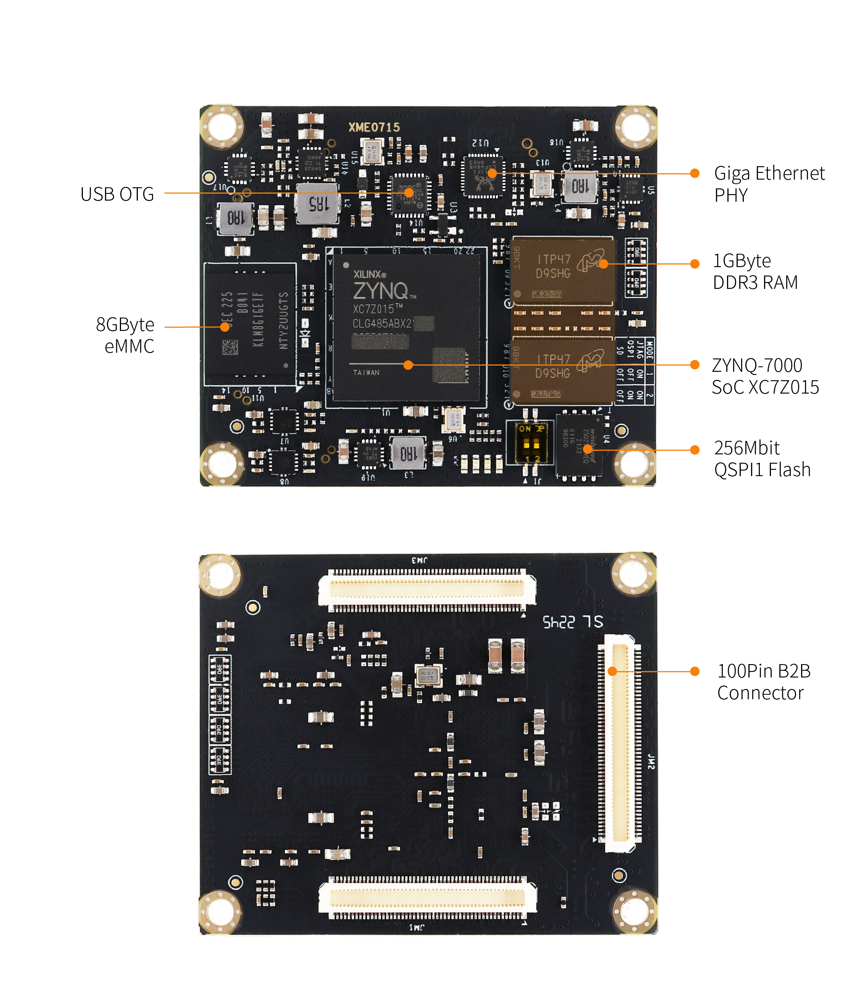
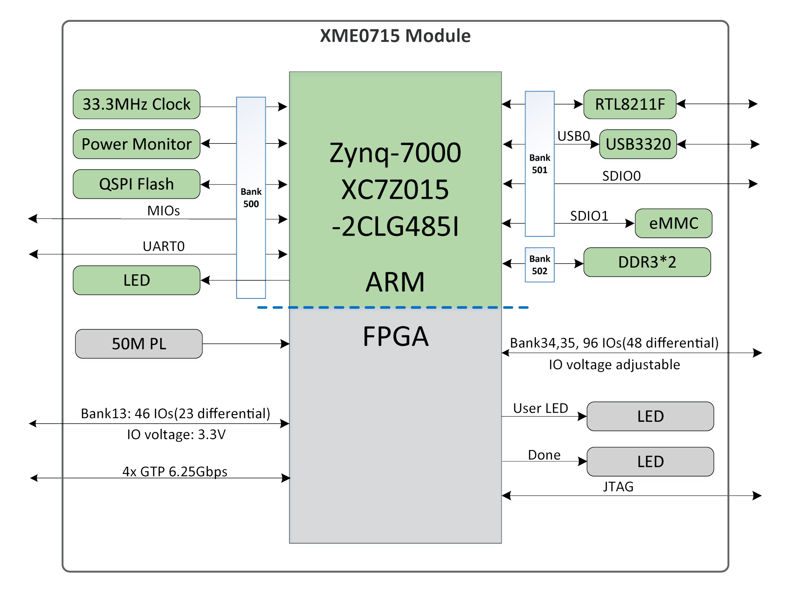
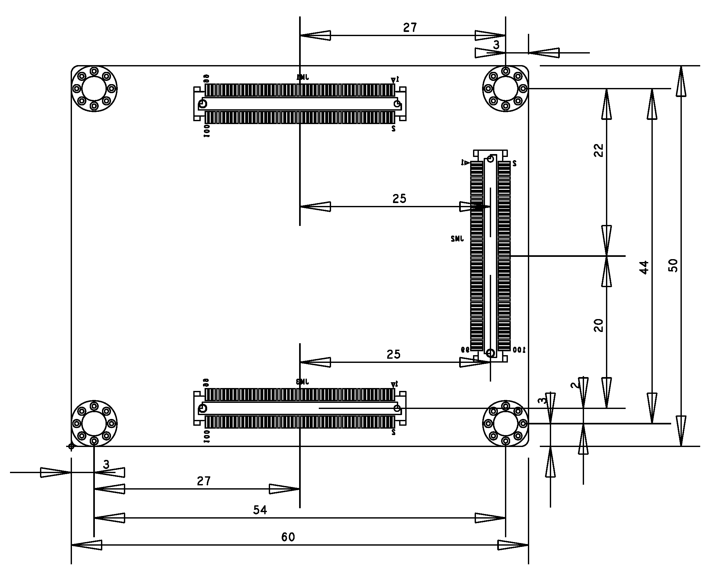
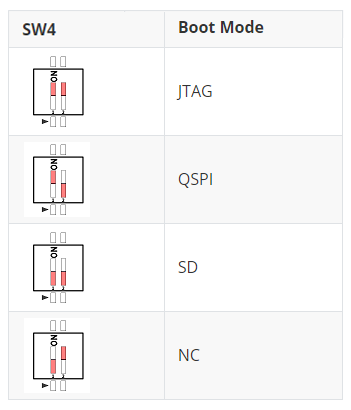

# **XME0715用户手册**

[English](https://microphase-doc.readthedocs.io/en/latest/SoM/XME0715/XME0715-Reference_Manual.html)

## 开发环境:

赛灵思Vivado 2018.3

<https://www.xilinx.com>

## 微信公众号:

## ●1. 概述

​	XME0715 是微相科技推出的一款基于赛灵思 Zynq-7000系列 的 SoC 工业级系统模块。该模块集成了 1GB DDR3 内存、32MB SPI 闪存、8GB eMMC 闪存、千兆以太网 PHY 收发器、USB PHY 收发器，以及大量可通过高速连接器扩展的可配置 I/O。模块尺寸仅为 5 x 6 厘米，小巧灵活，适用于广泛的应用场景。所有微相科技尺寸为 5 x 6 cm的核心板，机械结构兼容。

### ○板卡布局

### ○资源特性

- Xilinx XC7Z015-2CLG485I  
- DDR3: 1GB DDR3 RAM 
- Flash: 256Mbit QSPI Flash, 8GB eMMC Flash.  
- LED: 1个电源 指示灯,1个FPGA 配置状态指示灯;  
  &ensp;&ensp;&ensp;&ensp;&ensp;2 个用户LED, 1个由PS侧控制, 1个由PL侧控制. 。
- PL GPIO: 142, 96个电压可调的GPIO,  
  &ensp;&ensp;&ensp;&ensp;&ensp;&ensp;&ensp;&ensp;&ensp;可配置为71对差分对。  
- Giga ETH: 10/100/1000M 自适应。  
- USB Host: USB2.0 PHY(USB3320)  
- CLOCK: 1 个 33.33MHz 有源晶振为 PS 系统提供稳定的时钟。
        1 个 50MHz 有源晶振为 PL 逻辑提供额外的时钟信号。  

### ○系统框图

### ○机械尺寸

## ●2. 硬件资源

### ○FPGA

- 766 MHz dual-core Cortex-A9 processor

- DDR3L memory controller with 8 DMA channels and 4 

- High Performance AXI3 Slave ports

- High-bandwidth peripheral controllers: 1G Ethernet, USB 2.0, SDIO

- Low-bandwidth peripheral controllers: SPI, UART, CAN, I2C

- Programmable from JTAG, Quad-SPI flash, and microSD card

- Programmable logic equivalent to Artix-7 FPGA  
  LUTs: 46,200  
  DSP Slices: 160   
  Logic Cells: 74K   
  Flip-Flops: 92,400  
  Total Block RAM: 3.3Mb 
  
- Analog Mixed Signal (AMS) / XADC:  2x 12 bit, MSPS ADCs with up to 17 Differential Inputs

- Security: AES & SHA 256b Decryption & Authentication for Secure Programmable Logic Config

### ○DDR3

该模块采用两片 16 位 DDR3 内存芯片，组成 32 位位宽，总容量为 1GB。

| Signal Name   | PIN Number | Signal Name    | PIN Number |
| ------------- | ---------- | -------------- | ---------- |
| PS_DDR3_A0    | M19        | PS_DDR3_D9     | G22        |
| PS_DDR3_A1    | M18        | PS_DDR3_D10    | L22        |
| PS_DDR3_A2    | K19        | PS_DDR3_D11    | L21        |
| PS_DDR3_A3    | L19        | PS_DDR3_D12    | L20        |
| PS_DDR3_A4    | K17        | PS_DDR3_D13    | K22        |
| PS_DDR3_A5    | K18        | PS_DDR3_D14    | J22        |
| PS_DDR3_A6    | J16        | PS_DDR3_D15    | K20        |
| PS_DDR3_A7    | J17        | PS_DDR3_D16    | M22        |
| PS_DDR3_A8    | J18        | PS_DDR3_D17    | T20        |
| PS_DDR3_A9    | H18        | PS_DDR3_D18    | N20        |
| PS_DDR3_A10   | J20        | PS_DDR3_D19    | T22        |
| PS_DDR3_A11   | G18        | PS_DDR3_D20    | R20        |
| PS_DDR3_A12   | H19        | PS_DDR3_D21    | T21        |
| PS_DDR3_A13   | F19        | PS_DDR3_D22    | M21        |
| PS_DDR3_A14   | G19        | PS_DDR3_D23    | R22        |
| PS_DDR3_BA0   | L16        | PS_DDR3_D24    | Y20        |
| PS_DDR3_BA1   | L17        | PS_DDR3_D25    | U22        |
| PS_DDR3_BA2   | M17        | PS_DDR3_D26    | AA22       |
| PS_DDR3_NCAS  | P20        | PS_DDR3_D27    | U21        |
| PS_DDR3_CKE   | T19        | PS_DDR3_D28    | W22        |
| PS_DDR3_CLK_N | N18        | PS_DDR3_D29    | W20        |
| PS_DDR3_CLK_P | N19        | PS_DDR3_D30    | V20        |
| PS_DDR3_NCS   | P17        | PS_DDR3_D31    | Y22        |
| PS_DDR3_DM0   | B22        | PS_DDR3_DQS_N0 | D21        |
| PS_DDR3_DM1   | H20        | PS_DDR3_DQS_N1 | J21        |
| PS_DDR3_DM2   | P22        | PS_DDR3_DQS_N2 | P21        |
| PS_DDR3_DM3   | AA21       | PS_DDR3_DQS_N3 | W21        |
| PS_DDR3_D0    | D22        | PS_DDR3_DQS_P0 | C21        |
| PS_DDR3_D1    | C20        | PS_DDR3_DQS_P1 | H21        |
| PS_DDR3_D2    | B21        | PS_DDR3_DQS_P2 | N21        |
| PS_DDR3_D3    | D20        | PS_DDR3_DQS_P3 | V21        |
| PS_DDR3_D4    | E20        | PS_DDR3_NRST   | F20        |
| PS_DDR3_D5    | E22        | PS_DDR3_ODT    | P18        |
| PS_DDR3_D6    | F21        | PS_DDR3_NRAS   | R18        |
| PS_DDR3_D7    | F22        | PS_DDR3_NWE    | R19        |
| PS_DDR3_D8    | G21        |                |            |

### ○Giga ETH

RTL8211F芯片支持10/100/1000M网络传输速率，并通过RGMII接口与Zynq7000 PS的MAC层通信。它支持MDI/MDX自适应、多种速率自适应、主/从自适应以及MDIO总线支持，用于PHY寄存器管理。

### ○USB Host

RTL8211F 芯片支持 10/100/1000M 网络传输速率，并通过 RGMII 接口与 Zynq7000 PS 系统的 MAC 层进行通信。它支持 MDI/MDX 自适应、多种速率自适应、主/从模式自适应，并支持通过 MDIO 总线进行 PHY 寄存器管理。

### ○USB UART

A USB to UART chip, the CH340, is provided for user connection to the host PC.

| Signal Name |   Pin Name   | Pin Number |    Explain    |
| :---------: | :----------: | :--------: | :-----------: |
|   UART_TX   | PS_MIO15_500 |     C5     | UART 数据输出 |
|   UART_RX   | PS_MIO14_500 |     C8     | UART 数据输入 |

### ○eMMC

本模块包含一个 8GB eMMC 接口（PS_SDIO1），用于存储系统文件或数据。它还可以与 QSPI 闪存一起作为辅助启动设备。该接口连接到 PS BANK501 的 MIO[46-51]。

| Signal Name  | Pin Name  | Pin Number |
| ------------ | --------- | ---------- |
| PS_MIO48_501 | MMC_CLK   | D12        |
| PS_MIO47_501 | MMC_CMD   | B13        |
| PS_MIO46_501 | MMC_DATA0 | D11        |
| PS_MIO49_501 | MMC_DATA1 | C9         |
| PS_MIO50_501 | MMC_DATA2 | D10        |
| PS_MIO51_501 | MMC_DATA3 | C13        |

### ○JTAG

XME0715 的 JTAG 信号连接到扩展口上，该端口还提供了一个3.3V的JTAG VREF电压输出信号。

|  Signal  | JM3 Pin Number | Explain                        |
| :------: | :------------: | ------------------------------ |
| VCC_3V3  |       13       | **模块电压输出**，JTAG参考电压 |
| FPGA_TDI |       21       | Input (3.3V)                   |
| FPGA_TDO |       17       | Output (3.3V)                  |
| FPGA_TCK |       15       | Input (3.3V)                   |
| FPGA_TMS |       23       | Input (3.3V)                   |
|   GND    |       19       | 连接到模块的GND信号            |

### ○启动配置

通过核心模块上的开关(SW4)来配置ZYNQ启动模式。

### ○Quad-SPI Flash

板载一路256M SPI闪存W25Q256FVEI用于存储FPGA的初始配置、用户应用程序以及数据。

| Position |    Model    | Capacity | Factory |
| :------: | :---------: | :------: | :-----: |
|    U4    | W25Q256FVEI | 256 Byte | Winbond |

### ○时钟

XME0715核心板为PS提供了一路33.3MHz的有源时钟，并为PL提供了一路50MHz的有源时钟。

| Position | Signal Name | Frequency | Pin Number/Pin Name |
| :------: | :---------: | :-------: | :-----------------: |
|    U2    | PS_CLK_33d3 | 33.333Mhz |     PS_CLK_500      |
|    U6    | PL_CLK_50M  |   50Mhz   |         Y14         |

### ○电源

**XME0715支持宽电源输入(5V~15V)，推荐设计使用电源输入+12V。**

模块上电后，按顺序级联，以 1.0V->1.8V->1.5V->3.3V的顺序完成上电过程。3.3V最后上电，同时提供系统电源状态PG信号。

### ○LED

XME0715 开发板包含四个 LED 指示灯：电源指示灯、FPGA 配置状态指示灯、PL 控制的用户 LED 以及 PS 控制的用户 LED。

LED 信号描述如下表所示。

| LED  | FPGA Pin/ FPGA Name | Note                                |
| :--: | ------------------------ | ----------------------------------- |
|  D4  | --                       | Power LED                           |
|  D1  | T10                      | FPGA配置状态LED，FPGA配置成功后点亮 |
|  D2  | G14/PS_MIO0_500          | PS侧用户LED，输出低时，LED亮        |
|  D3  | T16                      | PL侧用户LED，输出低时，LED亮        |

### ○拓展口

XME0715使用三组连接器JM1、JM2和JM3来连接FPGA的IO信号和以太网接口信号。  
3 x AXK600337YG, 100Pin, 0.5mm 间距 

| 核心板连接器型号 | 底板连接器型号 | 厂商      | 配对高度 |
| ---------------- | -------------- | --------- | -------- |
| AXK600337YG      | AXK500137YG    | Panasonic | 3mm      |

Description:  
1. Bank34 IO 电平取决于 JM1 Pin11,13 的电压输入, 输入范围为1.2V-3.3V.
2. Bank35 IO 电平取决于 JM2 Pin91,93 的电压输入, 输入范围为 1.2V-3.3V.
3. SD 信号 (JM3 Pin73,75,77-Pin85) 电压为1.8V.
4. MIO9-MIO13, UART, JTAG, RESET 电压为3.3V.
5. 请参阅《[XME0715_Pinout_Table_R20](https://github.com/MicroPhase/fpga-docs/blob/master/others/XME0715_Pinout_Table_R20.xlsx)》 以获取详细的引脚定义信息。

## ●3. 相关文档

### ○XME0715
- [XME0715_R20 原理图](https://github.com/MicroPhase/fpga-docs/blob/master/schematic/XME0715_R20.pdf) (PDF)
- [XME0715_R20 尺寸](https://github.com/MicroPhase/fpga-docs/blob/master/mechanical/XME0715/XME0715_R20_Dimensions.pdf) (PDF)  
- [XME0715_R20 尺寸源文件](https://github.com/MicroPhase/fpga-docs/blob/master/mechanical/XME0715/XME0715_R20_Dimensions_source_file.dxf) (DXF)  
### ○PE100
- [PE100 用户手册](https://microphase-doc.readthedocs.io/en/latest/CARRIER_BOARD/PE100/PE100-Reference_Manual.html)(HTML)
- [PE100_R11 原理图](https://github.com/MicroPhase/fpga-docs/blob/master/schematic/PE100_R11.pdf) (PDF)
- [PE100_R11 尺寸](https://github.com/MicroPhase/fpga-docs/blob/master/mechanical/PE100/PE100_R11_Dimensions.pdf) (PDF)  
- [PE100_R11 尺寸源文件](https://github.com/MicroPhase/fpga-docs/blob/master/others/PE100_R11_Board_source_file.brd) (Brd) 
### ○PE300
- [PE300 用户手册](https://microphase-doc.readthedocs.io/en/latest/CARRIER_BOARD/PE300/PE300-Reference_Manual.html)(HTML)
- [PE300_R11 原理图](https://github.com/MicroPhase/fpga-docs/blob/master/schematic/PE300_R11.pdf)(PDF)
- [PE300_R11 尺寸](https://github.com/MicroPhase/fpga-docs/blob/master/mechanical/PE300/PE300_R11_Dimensions.pdf) (PDF)  
- [PE300_R11 尺寸源文件](https://github.com/MicroPhase/fpga-docs/blob/master/others/PE300_R11_Board_source_file.brd) (Brd) 