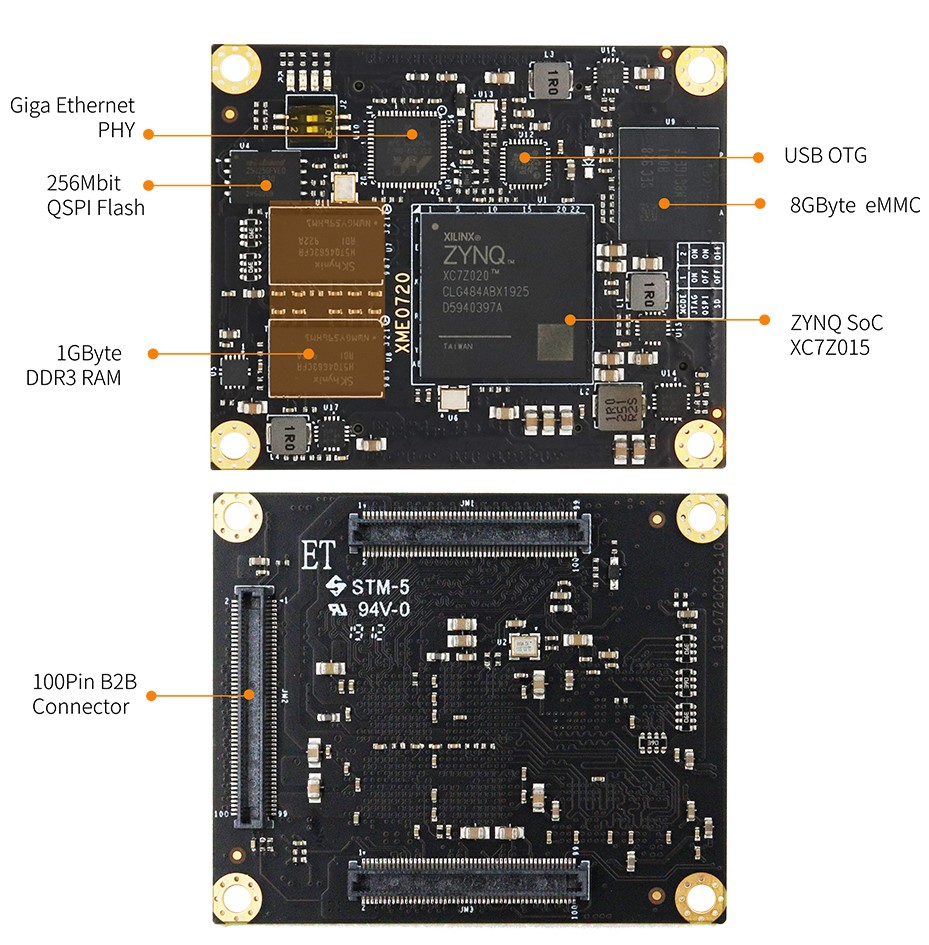
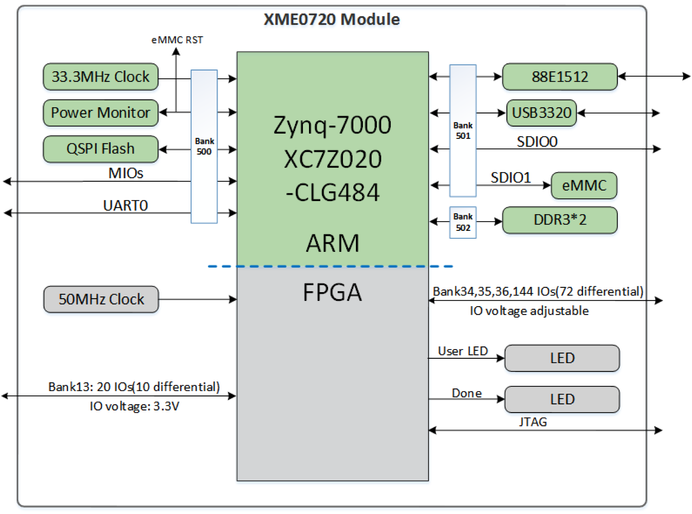
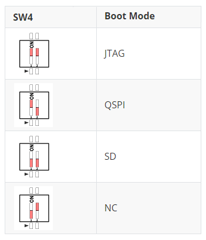

# **XME0720用户手册**

[[English]](https://microphase-doc.readthedocs.io/en/latest/SoM/XME0720/XME0720-Reference_Manual.html)

## 开发环境:

赛灵思Vivado 2018.3

<https://www.xilinx.com>

## 微信公众号:

## ●1. 概述

XME0720是微相科技推出的一款基于Xilinx Zynq-7000的SoC工业级系统模块。
它集成了1GB DDR3 RAM、32MB SPI闪存、8GB eMMC闪存、千兆以太网PHY收发器、USB PHY收发器以及大量可通过高速连接器扩展的可配置I/O。模块尺寸仅为5 x 6厘米，小巧灵活，适用于广泛的应用场景。

### ○板卡布局

### ○资源特性

- Xilinx XC7Z020-2CLG484I

- DDR3: 1GB DDR3 RAM 

- Flash: 256Mbit QSPI Flash, 8GB eMMC Flash.  

- LED: 1个电源 LED,1个FPGA 配置状态指示灯，  

  &ensp;&ensp;&ensp;&ensp;&ensp;2个用户LED, 1个PS侧控制, 1个PL侧控制。  

- PL GPIO: 164, 144个电压可调的GPIO,  
  
   &ensp;&ensp;&ensp;&ensp;&ensp;&ensp;&ensp;&ensp;&ensp;可配置为82对差分对。  
  
- Giga ETH: 10/100/1000M自适应。  

- USB Host: USB2.0 PHY(USB3320)  

- CLOCK: 1 33.33Mhz 有源晶振为 PS 系统提供稳定的时钟。  
&ensp;&ensp;&ensp;&ensp;&ensp;&ensp;&ensp; 1 50Mhz 有源晶振为 PL 逻辑提供额外的时钟信号。    

### ○系统框图

### ○机械尺寸

## ●2.硬件资源

### ○FPGA

- 667 MHz dual-core Cortex-A9 processor

- DDR3L memory controller with 8 DMA channels and 4 

- High Performance AXI3 Slave ports

- High-bandwidth peripheral controllers: 1G Ethernet, USB 2.0, SDIO

- Low-bandwidth peripheral controllers: SPI, UART, CAN, I2C

- Programmable from JTAG, Quad-SPI flash, and microSD card

- Programmable logic equivalent to Artix-7 FPGA  
  LUTs: 53,200  
  DSP Slices: 220   
  Logic Cells:85K  
  Flip-Flops: 106,400   
  Total Block RAM:   4.9Mb

- Analog Mixed Signal (AMS) / XADC:  2x 12 bit, MSPS ADCs with up to 17 Differential Inputs

- Security: AES & SHA 256b Decryption & Authentication for Secure Programmable Logic Config

### ○DDR3

该模块采用两片 16 位 DDR3 内存芯片，组成 32 位位宽，总容量为 1GB。

| Signal Name   | PIN Number | Signal Name    | PIN Number |
| ------------- | ---------- | -------------- | ---------- |
| PS_DDR3_A0    | M4         | PS_DDR3_D9     | G1         |
| PS_DDR3_A1    | M5         | PS_DDR3_D10    | L1         |
| PS_DDR3_A2    | K4         | PS_DDR3_D11    | L2         |
| PS_DDR3_A3    | L4         | PS_DDR3_D12    | L3         |
| PS_DDR3_A4    | K6         | PS_DDR3_D13    | K1         |
| PS_DDR3_A5    | K5         | PS_DDR3_D14    | J1         |
| PS_DDR3_A6    | J7         | PS_DDR3_D15    | K3         |
| PS_DDR3_A7    | J6         | PS_DDR3_D16    | M1         |
| PS_DDR3_A8    | J5         | PS_DDR3_D17    | T3         |
| PS_DDR3_A9    | H5         | PS_DDR3_D18    | N3         |
| PS_DDR3_A10   | J3         | PS_DDR3_D19    | T1         |
| PS_DDR3_A11   | G5         | PS_DDR3_D20    | R3         |
| PS_DDR3_A12   | H4         | PS_DDR3_D21    | T2         |
| PS_DDR3_A13   | F4         | PS_DDR3_D22    | M2         |
| PS_DDR3_A14   | G4         | PS_DDR3_D23    | R1         |
| PS_DDR3_BA0   | L7         | PS_DDR3_D24    | AA3        |
| PS_DDR3_BA1   | L6         | PS_DDR3_D25    | U1         |
| PS_DDR3_BA2   | M6         | PS_DDR3_D26    | AA1        |
| PS_DDR3_NCAS  | P3         | PS_DDR3_D27    | U2         |
| PS_DDR3_CKE   | V3         | PS_DDR3_D28    | W1         |
| PS_DDR3_CLK_N | N5         | PS_DDR3_D29    | Y3         |
| PS_DDR3_CLK_P | N4         | PS_DDR3_D30    | W3         |
| PS_DDR3_NCS   | P6         | PS_DDR3_D31    | Y1         |
| PS_DDR3_DM0   | B1         | PS_DDR3_DQS_N0 | D2         |
| PS_DDR3_DM1   | H3         | PS_DDR3_DQS_N1 | J2         |
| PS_DDR3_DM2   | P1         | PS_DDR3_DQS_N2 | P2         |
| PS_DDR3_DM3   | AA2        | PS_DDR3_DQS_N3 | W2         |
| PS_DDR3_D0    | D1         | PS_DDR3_DQS_P0 | C2         |
| PS_DDR3_D1    | C3         | PS_DDR3_DQS_P1 | H2         |
| PS_DDR3_D2    | B2         | PS_DDR3_DQS_P2 | N2         |
| PS_DDR3_D3    | D3         | PS_DDR3_DQS_P3 | V2         |
| PS_DDR3_D4    | E3         | PS_DDR3_NRST   | F3         |
| PS_DDR3_D5    | E1         | PS_DDR3_ODT    | P5         |
| PS_DDR3_D6    | F2         | PS_DDR3_NRAS   | R5         |
| PS_DDR3_D7    | F1         | PS_DDR3_NWE    | R4         |
| PS_DDR3_D8    | G2         |                |            |

### ○Giga ETH

88E1512 芯片支持 10/100/1000M 网络传输速率，并通过 RGMII 接口与 Zynq7000 PS 系统的 MAC 层通信。它具有 MDI/MDX 自动交叉、多速率自动协商以及主/从配置功能。此外，它还支持通过 MDIO 总线管理 PHY 寄存器，并通过 IEEE 802.3az 能效以太网 (EEE) 提供先进的节能功能。88E1512 针对低功耗进行了优化，并为高速网络应用提供了强大的性能。

### ○USB Host

板载的 USB2.0 收发器为 USB3320C-EZK，支持 ULPI 标准接口。它与 ZYNQ 的总线接口连接，以实现高速 USB2.0 主机模式的数据通信。

### ○eMMC

该模块包含一个 8GB eMMC 接口（PS_SDIO1），用于系统文件或数据存储。它还可以与 QSPI 闪存一起作为辅助启动设备。该接口信号连接到 PS BANK501 MIO[46-51]。

| Signal Name  | Pin Name  | Pin Number |
| ------------ | --------- | ---------- |
| PS_MIO48_501 | MMC_CLK   | D11        |
| PS_MIO47_501 | MMC_CMD   | B10        |
| PS_MIO46_501 | MMC_DATA0 | D12        |
| PS_MIO49_501 | MMC_DATA1 | C14        |
| PS_MIO50_501 | MMC_DATA2 | D13        |
| PS_MIO51_501 | MMC_DATA3 | C10        |

### ○JTAG

XME0720 的 JTAG 信号连接到扩展口上，该端口还提供了一个3.3V的JTAG VREF电压输出信号。

|  Signal  | JM3 Pin Number | Explain                        |
| :------: | :------------: | ------------------------------ |
| VCC_3V3  |       13       | **模块电压输出**，JTAG参考电压 |
| FPGA_TDI |       21       | Input (3.3V)                   |
| FPGA_TDO |       17       | Output (3.3V)                  |
| FPGA_TCK |       15       | Input (3.3V)                   |
| FPGA_TMS |       23       | Input (3.3V)                   |
|   GND    |       19       | 连接到模块的GND信号            |

### ○启动配置

通过核心模块上的开关(SW4)来配置ZYNQ启动模式。

### ○Quad-SPI Flash

板载256M Quad-SPI Flash 存储器W25Q256FVEI用于存储初始 FPGA 配置、用户应用程序及数据。

| Position |    Model    | Capacity | Factory |
| :------: | :---------: | :------: | :-----: |
|    U4    | W25Q256FVEI | 256 Byte | Winbond |

### ○Clock

XME0720核心板提供一路33.3Mhz有源时钟给PS以及一路50Mhz有源时钟给PL。

| Position | Signal Name | Frequency | Pin Number/Pin Name |
| :------: | :---------: | :-------: | :-----------------: |
|    U2    | PS_CLK_33d3 | 33.333Mhz |     PS_CLK_500      |
|    U6    | PL_CLK_50M  |   50Mhz   |         Y9          |

### ○Power

**XME0720支持宽电源输入(5V~15V)，推荐设计使用电源输入+12V。**

模块上电后，按顺序级联，以 1.0V->1.8V->1.5V->3.3V的顺序完成上电过程。3.3V最后上电，同时提供系统电源状态PG信号。

### ○LED

XME0720 开发板包含四个 LED 指示灯：电源指示灯、FPGA 配置状态指示灯、PL 控制的用户 LED 以及 PS 控制的用户 LED。

LED 信号描述如下表所示。

| LED  | FPGA Pin/ FPGA Name | Note                                          |
| :--: | ------------------------ | --------------------------------------------- |
|  D4  | --                       | 电源指示灯                                    |
|  D1  | T12/DONE_0               | FPGA 配置状态指示灯，在 FPGA 配置成功后点亮。 |
|  D2  | G6/PS_MIO0_500           | 当FPGA的PS_MIO0_500为高电平的时候LED灯点亮。  |
|  D3  | T16                      | 当FPGA的T16为高电平的时候LED灯点亮。          |

### ○拓展口

XME0720 使用三组连接器 JM1、JM2 和 JM3，用于拓展 FPGA IO 和以太网接口的信号。  
3 x QT50A01-29200-7H, 100Pin, 0.5mm 间距。 

| 核心板连接器型号 | 底板连接器型号   | 厂商    |
| ---------------- | ---------------- | ------- |
| QT50A01-29200-7H | QT51A01-38200-7H | FOXCONN |

Description:  
1. Bank34 IO 电平取决于 JM1 Pin11,13 的电压输入, 输入范围为1.2V-3.3V.
2. Bank35 IO level depends on JM2 Pin91,93 的电压输入, 输入范围为1.2V-3.3V.
3. SD Signal (JM3 Pin73,75,77-Pin85) 为 1.8V.
4. MIO9-MIO13, UART, JTAG, RESET l为 3.3V.
5. 请参阅《[XME0720_Pinout_Table_R10](https://github.com/MicroPhase/fpga-docs/blob/master/others/XME0720_Pinout_Table_R10.xlsx)》 以获取详细的引脚定义信息。
6. **XME0720 仅兼容旧版本（黑色连接器版本）PE100 和 PE300的 。在购买配套的底板时，请咨询销售人员以确认库存中是否有此版本**

## ●3. 相关文档  

### ○XME0720
- [XME0720_R10 原理图](https://github.com/MicroPhase/fpga-docs/blob/master/schematic/XME0720_R10.pdf) (PDF)
- [XME0720_R10 尺寸](https://github.com/MicroPhase/fpga-docs/blob/master/mechanical/XME0720/XME0720_R10_Dimensions.pdf) (PDF)  
- [XME0720_R10 尺寸源文件](https://github.com/MicroPhase/fpga-docs/blob/master/mechanical/XME0720/XME0720_R10_Dimensions_source_file.dxf) (DXF)  
### ○PE100
- [PE100 用户手册](https://microphase-doc.readthedocs.io/zh-cn/latest/CARRIER_BOARD/PE100/PE100-Reference_Manual.html)(HTML)
- [PE100_R11 原理图](https://github.com/MicroPhase/fpga-docs/blob/master/schematic/PE100_R11.pdf) (PDF)
- [PE100_R11 尺寸](https://github.com/MicroPhase/fpga-docs/blob/master/mechanical/PE100/PE100_R11_Dimensions.pdf) (PDF)  
- [PE100_R11 板源文件](https://github.com/MicroPhase/fpga-docs/blob/master/others/PE100_R11_Board_source_file.brd) (Brd) 
### ○PE300
- [PE300 用户手册](https://microphase-doc.readthedocs.io/zh-cn/latest/CARRIER_BOARD/PE300/PE300-Reference_Manual.html)(HTML)
- [PE300_R11 原理图](https://github.com/MicroPhase/fpga-docs/blob/master/schematic/PE300_R11.pdf)(PDF)
- [PE300_R11 尺寸](https://github.com/MicroPhase/fpga-docs/blob/master/mechanical/PE300/PE300_R11_Dimensions.pdf) (PDF)  
- [PE300_R11 板源文件](https://github.com/MicroPhase/fpga-docs/blob/master/others/PE300_R11_Board_source_file.brd) (Brd) 

