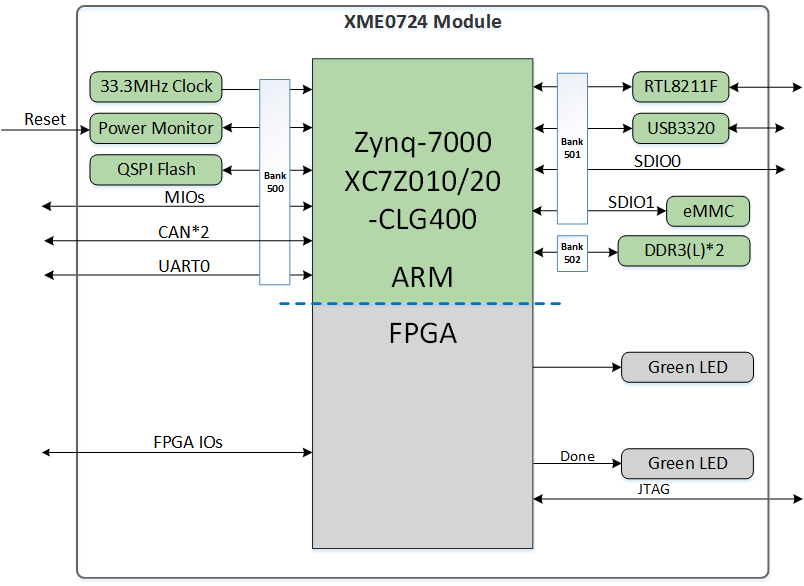
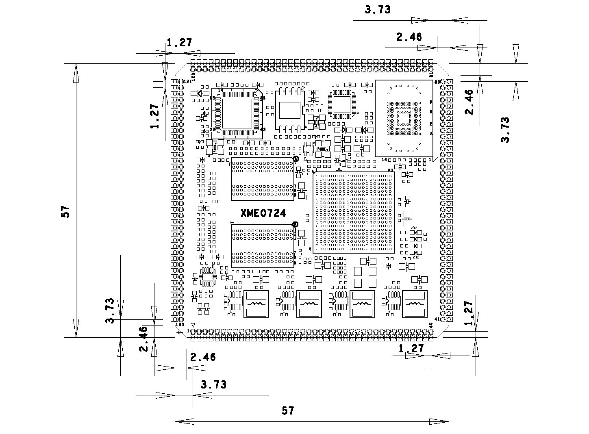

# **XME0724 Reference Manual**

## Revision History

| Revision | Time       | Description   |
| :------- | :--------- | :------------ |
| Rev. 1.0 | 2024.08.17 | First Release |
|          |            |               |

## CopyRight Notice:

Copyright ©2015 by MicroPhase Technologies (Shanghai) Co. Ltd. All rights are reserved.

## Development Environment:

Vivado 2018.3 is from Xilinx website

<https://www.xilinx.com>

## WeChat Public Number:

## ●1. Overview

​	XME0724 is a system module based on Xilinx Zynq-SoC (XC7Z010 or XC7Z020) from Microphase Technology. 

​	It integrates 1GB DDR3 RAM, 32MB SPI flash, 8GB eMMC flash, Gigabit Ethernet PHY transceiver, USB PHY transceiver, and the XME0724 core board is available in commercial (XC7Z010) and industrial (XC7Z020) versions, with customizable variants available upon request, customised requirements may be subject to minimum order quantities,  please contact our sales team for more information: sales@microphase.cn.

### ○Board Layout

### ○Key Features

- Xilinx Zynq™ XC7Z010-1CLG400C (7010 Version Only),

&ensp;&ensp;&ensp;&ensp;Xilinx Zynq™ XC7Z020-2CLG400C (7020 Version Only).

- DDR3: 512MB DDR3 RAM((7010 Version Only), 

&ensp;&ensp;&ensp;&ensp;&ensp;&ensp;&ensp;&ensp;&ensp;&ensp;1GB DDR3 RAM(7020 Version Only).

- Flash: 256Mbit QSPI Flash, 8GB eMMC Flash.

- LED: 1 Power LED, 1 FPGA Done LED;

&ensp;&ensp;&ensp;&ensp;&ensp;&ensp;&ensp;&ensp; 2 user's LED, 1 PS(Processing System ) control, 1 PL(Programmable Logic) control.

- GPIO: 160 Pin, 1.27mm Pin Pitch Stamp Hole, Compatible with 160pin, 1.27mm Pin Extension.

- USB JTAG: 1 on board JTAG circuit, can debug and download the ZYNQ system through a USB cable.

- HDMI: 1 HDMI video output interface, can realize 1080P video image

- Giga ETH: 10/100/1000M Adaptive

- USB Host: USB2.0 PHY(USB3320)

- CLOCK: 1 33.33Mhz active crystal oscillator provides a stable clock for the PS system. 

### ○Block diagram

​                               

### ○Mechanical Spec

## ●2. Function Resources

### ○FPGA

- 667 MHz dual-core Cortex-A9 processor

- DDR3L memory controller with 8 DMA channels and 4 

- High Performance AXI3 Slave ports

- High-bandwidth peripheral controllers: 1G Ethernet, USB 2.0, SDIO

- Low-bandwidth peripheral controllers: SPI, UART, CAN, I2C

- Programmable from JTAG, Quad-SPI flash, and microSD card

- Programmable logic equivalent to Artix-7 FPGA

  LUTs: 17,600 (7010)

  ​	   53,200(7020)

  DSP Slices: 80 (7010) 

  ​    		220 (7020)

  Logic Cells: 28K (7010)

  ​		     85K(7020)

  Flip-Flops: 35,200 (7010) 

  ​    	       106,400 (7020)

  Total Block RAM: 2.1Mb (7010) 

  ​           		    4.9Mb (7020)

- Analog Mixed Signal (AMS) / XADC:  2x 12 bit, MSPS ADCs with up to 17 Differential Inputs

- Security: AES & SHA 256b Decryption & Authentication for Secure Programmable Logic Config

### ○DDR3

​	The module uses two 16-bit DDR3 memory chips, 512MB for the XME0724-10 version and 1GB for the XME0724-20 version.

| Signal Name   | PIN Number | Signal Name    | PIN Number |
| ------------- | ---------- | -------------- | ---------- |
| PS_DDR3_A0    | N2         | PS_DDR3_D9     | E3         |
| PS_DDR3_A1    | K2         | PS_DDR3_D10    | G3         |
| PS_DDR3_A2    | M3         | PS_DDR3_D11    | H3         |
| PS_DDR3_A3    | K3         | PS_DDR3_D12    | J3         |
| PS_DDR3_A4    | M4         | PS_DDR3_D13    | H2         |
| PS_DDR3_A5    | L1         | PS_DDR3_D14    | H1         |
| PS_DDR3_A6    | L4         | PS_DDR3_D15    | J1         |
| PS_DDR3_A7    | K4         | PS_DDR3_D16    | P1         |
| PS_DDR3_A8    | K1         | PS_DDR3_D17    | P3         |
| PS_DDR3_A9    | J4         | PS_DDR3_D18    | R3         |
| PS_DDR3_A10   | F5         | PS_DDR3_D19    | R1         |
| PS_DDR3_A11   | G4         | PS_DDR3_D20    | T4         |
| PS_DDR3_A12   | E4         | PS_DDR3_D21    | U4         |
| PS_DDR3_A13   | D4         | PS_DDR3_D22    | U2         |
| PS_DDR3_A14   | F4         | PS_DDR3_D23    | U3         |
| PS_DDR3_BA0   | L5         | PS_DDR3_D24    | V1         |
| PS_DDR3_BA1   | R4         | PS_DDR3_D25    | Y3         |
| PS_DDR3_BA2   | J5         | PS_DDR3_D26    | W1         |
| PS_DDR3_NCAS  | P5         | PS_DDR3_D27    | Y4         |
| PS_DDR3_CKE   | N3         | PS_DDR3_D28    | Y2         |
| PS_DDR3_CLK_N | M2         | PS_DDR3_D29    | W3         |
| PS_DDR3_CLK_P | L2         | PS_DDR3_D30    | V2         |
| PS_DDR3_NCS   | N1         | PS_DDR3_D31    | V3         |
| PS_DDR3_DM0   | A1         | PS_DDR3_DQS_N0 | B2         |
| PS_DDR3_DM1   | F1         | PS_DDR3_DQS_N1 | F2         |
| PS_DDR3_DM2   | T1         | PS_DDR3_DQS_N2 | T2         |
| PS_DDR3_DM3   | Y1         | PS_DDR3_DQS_N3 | W4         |
| PS_DDR3_D0    | C3         | PS_DDR3_DQS_P0 | C2         |
| PS_DDR3_D1    | B3         | PS_DDR3_DQS_P1 | G2         |
| PS_DDR3_D2    | A2         | PS_DDR3_DQS_P2 | R2         |
| PS_DDR3_D3    | A4         | PS_DDR3_DQS_P3 | W5         |
| PS_DDR3_D4    | D3         | PS_DDR3_NRST   | B4         |
| PS_DDR3_D5    | D1         | PS_DDR3_ODT    | N5         |
| PS_DDR3_D6    | C1         | PS_DDR3_NRAS   | P4         |
| PS_DDR3_D7    | E1         | PS_DDR3_NWE    | M5         |
| PS_DDR3_D8    | E2         |                |            |

### ○Giga ETH

​	The RTL8211F chip supports 10/100/1000M network transfer rate and communicates with the MAC layer of the Zynq7000 PS system via the RGMII interface. It supports MDI/MDX adaptation, multiple speed adaptation, master/slave adaptation and MDIO bus support for PHY register management.

### ○USB Host

​	The USB2.0 transceiver on-board is the USB3320C-EZK, which is supports the ULPI standard interface. It's connected with ZYNQ's bus interface to enable high-speed USB2.0 Host mode data communications.

### ○USB UART

​	A USB to UART chip, the CH340, is provided for user connection to the host PC.

| Signal Name |   Pin Name   | Pin Number |     Explain      |
| :---------: | :----------: | :--------: | :--------------: |
|   UART_TX   | PS_MIO15_500 |     C5     | UART data output |
|   UART_RX   | PS_MIO14_500 |     C8     | UART data output |

### ○eMMC

​	he module includes an 8GB eMMC interface (PS_SDIO1) for system files or data storage. It can also serve as a secondary boot device alongside the QSPI flash. The interface is PS BANK501 MIO[46-51].

| Signal Name | Pin Number |
| ----------- | ---------- |
| MMC_CLK     | B12        |
| MMC_CMD     | B14        |
| MMC_DATA0   | D16        |
| MMC_DATA1   | C12        |
| MMC_DATA2   | B13        |
| MMC_DATA3   | B9         |

### ○JTAG

​	The ZYNQ SoC's JTAG signals are connected to the expansion port, which also provides a 3.3V JTAG VREF voltage output signal

|  Signal  | Module Pin Number | Explain                                           |
| :------: | :---------------: | ------------------------------------------------- |
| VCC_3V3  |      Pin 152      | **Module voltage output**, JTAG reference voltage |
| FPGA_TDI |      Pin 153      | Input                                             |
| FPGA_TDO |      Pin 154      | Output                                            |
| FPGA_TCK |      Pin 155      | Input                                             |
| FPGA_TMS |      Pin 156      | Input                                             |
|   GND    |        ---        | Connect to the GND signal on the module           |

### ○Boot Config

​	Configure the ZYNQ startup mode using core module pins PIN119 (MODE0) and PIN120 (MODE1). The ZYNQ configuration schematic is shown below.

| Mode |   MODE1(PIN120)   |   MODE0(PIN119)   |
| :--: | :---------------: | :---------------: |
| JTAG | Connection to GND | Connection to GND |
| QSPI |        NC         | Connection to GND |
|  SD  |        NC         |        NC         |

### ○Quad-SPI Flash

​	On-board 256M Quad-SPI Flash memory W25Q256FVEI is used to store initial FPGA configuration and user’s application as well as data.

| Position |    Model    | Capacity | Factory |
| :------: | :---------: | :------: | :-----: |
|    U7    | W25Q256FVEI | 256 Byte | Winbond |

### ○Clock

​	The XME0724 core board provides a 33.3Mhz active clock for the PS system. 

​	The clock for the PL section can be generated by the PLL in the PS section, or the user can use it as a clock input to the PL section by connecting an external clock source to the dedicated clock pin of the module.

| Position | Signal Name | Frequency | Pin Number |
| :------: | :---------: | :-------: | :--------: |
|    Y2    | PS_CLK_33d3 | 33.333Mhz |     E7     |

### ○Power

​	**Please note that the power input of XME0724 is +5V. We recommend using a 5V/2A power supply.** 

​	The module powers up in a cascading sequence: 1.0V > 1.8V > 1.5V > 3.3V. The 3.3V output will be powered up last, and at the same time, it will provide the PG signal of system power status.

### ○LED

​	The XME0724 board includes four LEDs: a power indicator, an FPGA configuration status light, a PL-controlled user LED, and a PS-controlled user LED.

​	The LED signals are described in the following table.

| LED  | ZYNQ Pin | Note                                                         |
| :--: | -------- | ------------------------------------------------------------ |
|  D5  | --       | Power LED                                                    |
|  D2  | R11      | FPGA configuration status LED, lit after successful FPGA configuration |
|  D4  | G14      | LED on when FPGA G14 output is low                           |
|  D3  | E6       | LED on when FPGA E6 output is low                            |

### ○GPIO

​	The XME0724 features a 1.27mm pitch stamp hole connection, which ensures optimal electrical characteristics and anti-interference performance. Additionally, a single row of 1.27mm pitch holes is provided on the interior of the stamp hole, and the two-in-one structure of the stamp hole and the 1.27mm row of pins offers enhanced flexibility in the utilisation of the XME0724. The stamp holes can be used for soldering, while the row of pins can be connected according to the user's requirements.

Description:

1. Bank34 IO level depends on Pin31 voltage input, input range 1.2V~3.3V.
2. Bank35 IO level depends on Pin71 voltage input, input range 1.2V~3.3V.
3. SD Signal (Pin139~Pin144) voltage is 1.8V.
4. MIO9~MIO13, UART, JTAG, RESET(Pin145~Pin157) level is 3.3V.
5. Please refer to the ‘[XME0724_Pinout _Table](https://github.com/rabbitjiump/doc_test/blob/main/others/XME0724_Pinout_Table.pdf)’ for detailed pin definitions of the XME0724.

## ●Related Documents  
### ○XME0724:  

- [XME0724_R30 Schematic](https://github.com/rabbitjiump/doc_test/blob/main/schematic/XME0724_R30.pdf) (PDF)
- [XME0724_R30 Dimensions](../../../mechanical/XME0724/XME0724_R30_Dimensions.pdf) (PDF)  
### ○XME0724CB:
- XME0724CB_Reference Manual(MD)-To be added
- [XME0724CB_R21 Schematic](https://github.com/rabbitjiump/doc_test/blob/main/schematic/XME0724CB_R21.pdf)(PDF)
- [XME0724CB_R21 Dimensions](../../../mechanical/XME0724/XME0724CB_R21_Dimensions.pdf)(PDF)
### ○XME0724CB-NET:
- XME0724CB-NET_Reference Manual(MD)-To be added
- [XME0724CB-NET_R30 Schematic](https://github.com/rabbitjiump/doc_test/blob/main/schematic/XME0724CB-NET_R30.pdf)(PDF)
- [XME0724CB-NET_R30 Dimensions](../../../mechanical/XME0724/XME0724CB-NET_R30_Dimensions.pdf)(PDF)