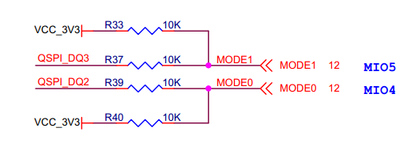

# **XME0724 参考手册**

[[English]](https://microphase-doc.readthedocs.io/en/latest/SoM/XME0724/XME0724-Reference_Manual.html)

  ## 开发环境：

  赛灵思Vivado 2018.3

  <https://www.xilinx.com>

## 微信公众号：

  

  

## ●1. 概述

  XME0724 是微相科技基于 Xilinx Zynq-SoC（XC7Z010 或 XC7Z020）开发的系统模块。  

  它集成了 1GB DDR3 RAM、32MB SPI 闪存、8GB eMMC 闪存、千兆以太网 PHY 收发器、USB PHY 收发器。XME0724 核心板提供商用（XC7Z010）和工业（XC7Z020）版本，可根据需求定制，定制可能需要满足最低订购量，详情请联系我们的销售团队了解：<sales@microphase.cn>。

### ○板卡布局

  

### ○资源特性

  - Xilinx Zynq™ XC7Z010-1CLG400C（仅 7010 版本），  
    Xilinx Zynq™ XC7Z020-2CLG400C（仅 7020 版本）。    
  - DDR3：512MB DDR3 RAM（仅 7010 版本），  
    &ensp;&ensp;&ensp;&ensp;&ensp;&ensp;1GB DDR3 RAM（仅 7020 版本）。  
  - 闪存：256Mbit QSPI 闪存，8GB eMMC 闪存。  
  - LED：1 个电源 LED，1 个 FPGA 配置状态指示灯；  
    &ensp;&ensp;&ensp;&ensp;&ensp;2 个用户 LED，1个PS侧控制, 1个PL侧控制。    
  - GPIO：160 Pin, 1.27mm Pin Pitch 邮票孔，兼容 160pin，1.27mm 排针扩展。  
  - 千兆以太网：10/100/1000M 自适应。  
  - USB 主机：USB2.0 PHY（USB3320）。  
  - 时钟：1 个 33.33Mhz 有源晶振为 PS 系统提供稳定时钟。  

### ○系统框图

  

### ○机械尺寸

  

  ## ●2. 硬件资源

### ○FPGA

  - 667 MHz dual-core Cortex-A9 processor

  - DDR3L memory controller with 8 DMA channels and 4 

  - High Performance AXI3 Slave ports

  - High-bandwidth peripheral controllers: 1G Ethernet, USB 2.0, SDIO

  - Low-bandwidth peripheral controllers: SPI, UART, CAN, I2C

  - Programmable from JTAG, Quad-SPI flash, and microSD card

  - Programmable logic equivalent to Artix-7 FPGA  
    LUTs: 17,600 (7010)  
    	   &ensp;&ensp;&ensp;&ensp;&ensp;53,200(7020)  
    DSP Slices: 80 (7010)   
        	&ensp;&ensp;&ensp;&ensp;&ensp;&ensp;&ensp;&ensp;&ensp;&ensp;220 (7020)  
    Logic Cells: 28K (7010)  
    		  &ensp;&ensp;&ensp;&ensp;&ensp;&ensp;&ensp;&ensp;&ensp;&ensp;85K(7020)  
    Flip-Flops: 35,200 (7010)   
        	 &ensp;&ensp;&ensp;&ensp;&ensp;&ensp;&ensp;&ensp;&ensp;106,400 (7020)  
    Total Block RAM: 2.1Mb (7010)    
    &ensp;&ensp;&ensp;&ensp;&ensp;&ensp;&ensp;&ensp;&ensp;&ensp;&ensp;&ensp;&ensp;&ensp;&ensp;&ensp;4.9Mb (7020)  
    
  - Analog Mixed Signal (AMS) / XADC:  2x 12 bit, MSPS ADCs with up to 17 Differential Inputs

  - Security: AES & SHA 256b Decryption & Authentication for Secure Programmable Logic Config

  ### ○DDR3

  该模块使用两个 16 位 DDR3 内存芯片，XME0724-10 版本为 512MB，XME0724-20 版本为 1GB。

| 信号名称      | 引脚编号 | 信号名称       | 引脚编号 |
| ------------- | -------- | -------------- | -------- |
| PS_DDR3_A0    | N2       | PS_DDR3_D9     | E3       |
| PS_DDR3_A1    | K2       | PS_DDR3_D10    | G3       |
| PS_DDR3_A2    | M3       | PS_DDR3_D11    | H3       |
| PS_DDR3_A3    | K3       | PS_DDR3_D12    | J3       |
| PS_DDR3_A4    | M4       | PS_DDR3_D13    | H2       |
| PS_DDR3_A5    | L1       | PS_DDR3_D14    | H1       |
| PS_DDR3_A6    | L4       | PS_DDR3_D15    | J1       |
| PS_DDR3_A7    | K4       | PS_DDR3_D16    | P1       |
| PS_DDR3_A8    | K1       | PS_DDR3_D17    | P3       |
| PS_DDR3_A9    | J4       | PS_DDR3_D18    | R3       |
| PS_DDR3_A10   | F5       | PS_DDR3_D19    | R1       |
| PS_DDR3_A11   | G4       | PS_DDR3_D20    | T4       |
| PS_DDR3_A12   | E4       | PS_DDR3_D21    | U4       |
| PS_DDR3_A13   | D4       | PS_DDR3_D22    | U2       |
| PS_DDR3_A14   | F4       | PS_DDR3_D23    | U3       |
| PS_DDR3_BA0   | L5       | PS_DDR3_D24    | V1       |
| PS_DDR3_BA1   | R4       | PS_DDR3_D25    | Y3       |
| PS_DDR3_BA2   | J5       | PS_DDR3_D26    | W1       |
| PS_DDR3_NCAS  | P5       | PS_DDR3_D27    | Y4       |
| PS_DDR3_CKE   | N3       | PS_DDR3_D28    | Y2       |
| PS_DDR3_CLK_N | M2       | PS_DDR3_D29    | W3       |
| PS_DDR3_CLK_P | L2       | PS_DDR3_D30    | V2       |
| PS_DDR3_NCS   | N1       | PS_DDR3_D31    | V3       |
| PS_DDR3_DM0   | A1       | PS_DDR3_DQS_N0 | B2       |
| PS_DDR3_DM1   | F1       | PS_DDR3_DQS_N1 | F2       |
| PS_DDR3_DM2   | T1       | PS_DDR3_DQS_N2 | T2       |
| PS_DDR3_DM3   | Y1       | PS_DDR3_DQS_N3 | W4       |
| PS_DDR3_D0    | C3       | PS_DDR3_DQS_P0 | C2       |
| PS_DDR3_D1    | B3       | PS_DDR3_DQS_P1 | G2       |
| PS_DDR3_D2    | A2       | PS_DDR3_DQS_P2 | R2       |
| PS_DDR3_D3    | A4       | PS_DDR3_DQS_P3 | W5       |
| PS_DDR3_D4    | D3       | PS_DDR3_NRST   | B4       |
| PS_DDR3_D5    | D1       | PS_DDR3_ODT    | N5       |
| PS_DDR3_D6    | C1       | PS_DDR3_NRAS   | P4       |
| PS_DDR3_D7    | E1       | PS_DDR3_NWE    | M5       |
| PS_DDR3_D8    | E2       |                |          |

  ### ○千兆以太网

RTL8211F 芯片支持 10/100/1000M 网络传输速率，并通过 RGMII 接口与 Zynq7000 PS 系统的 MAC 层进行通信。它支持 MDI/MDX 自适应、多种速率自适应、主/从模式自适应，并支持通过 MDIO 总线进行 PHY 寄存器管理。

  ### ○USB Host

 板载 USB2.0 收发器为 USB3320C-EZK，支持 ULPI 标准接口。它与 ZYNQ 的总线接口连接，以实现高速 USB2.0 主机模式数据通信。

  ### ○USB UART

通过一个 USB 转 UART 芯片 CH340连接到主机 PC。

| 信号名称 |   引脚名称   | 引脚编号 |     说明      |
| :------: | :----------: | :------: | :-----------: |
| UART_TX  | PS_MIO15_500 |    C5    | UART 数据输出 |
| UART_RX  | PS_MIO14_500 |    C8    | UART 数据输出 |

  ### ○eMMC

本模块包含一个 8GB eMMC ，接口PS_SDIO1，用于存储系统文件或数据。它还可以与 QSPI 闪存一起作为辅助启动设备。该接口连接到 PS BANK501 的 MIO[46-51]。

  | 信号名称  | 引脚编号 |
  | --------- | -------- |
  | MMC_CLK   | B12      |
  | MMC_CMD   | B14      |
  | MMC_DATA0 | D16      |
  | MMC_DATA1 | C12      |
  | MMC_DATA2 | B13      |
  | MMC_DATA3 | B9       |

  ### ○JTAG

  ZYNQ SoC 的 JTAG 信号连接到扩展端口，该端口还提供 3.3V JTAG VREF 电压输出信号。

  |   信号   | 模块引脚编号 | 说明                            |
  | :------: | :----------: | ------------------------------- |
  | VCC_3V3  |   Pin 152    | **模块电压输出**，JTAG 参考电压 |
  | FPGA_TDI |   Pin 153    | 输入（3.3V）                    |
  | FPGA_TDO |   Pin 154    | 输出（3.3V）                    |
  | FPGA_TCK |   Pin 155    | 输入（3.3V）                    |
  | FPGA_TMS |   Pin 156    | 输入（3.3V）                    |
  |   GND    |     ---      | 连接到模块的 GND 信号           |

  ### ○启动配置

  使用核心模块引脚 PIN119（MODE0）和 PIN120（MODE1）配置 ZYNQ 启动模式。ZYNQ 配置原理图如下所示。

  

  | 模式 | MODE1(PIN120) | MODE0(PIN119) |
  | :--: | :-----------: | :-----------: |
  | JTAG |  连接到 GND   |  连接到 GND   |
  | QSPI |      NC       |  连接到 GND   |
  |  SD  |      NC       |      NC       |

  ### ○Quad-SPI

  板载 256M Quad-SPI 闪存 W25Q256FVEI 用于存储初始 FPGA 配置和用户应用程序及数据。

  | 位置 |    型号     |   容量   |  厂商   |
  | :--: | :---------: | :------: | :-----: |
  |  U7  | W25Q256FVEI | 256 字节 | Winbond |

  ### ○时钟

XME0724 核心板为 PS 系统提供 33.3Mhz 有源时钟。  
PL 部分的时钟可以由 PS 部分的 PLL 生成，或者用户可以通过将外部时钟源连接到模块的专用时钟引脚来将其用作 PL 部分的时钟输入。

  | 位置 |  信号名称   |   频率    | 引脚编号 |
  | :--: | :---------: | :-------: | :------: |
  |  Y2  | PS_CLK_33d3 | 33.333Mhz |    E7    |

  ### ○电源

  **请注意，XME0724 的电源输入为 +5V。我们建议使用 5V/2A 电源。**

  模块上电顺序为：1.0V -> 1.8V -> 1.5V -> 3.3V。3.3V 输出将最后上电，同时提供系统电源状态PG信号。

  ### ○LED

  XME0724 板包括四个 LED：电源指示灯、FPGA 配置状态指示灯、PL 控制的用户 LED 和 PS 控制的用户 LED。  
  LED 信号如下表所述。

| LED  | ZYNQ 引脚 | 说明                                 |
| :--: | --------- | ------------------------------------ |
|  D5  | --        | 电源 LED                             |
|  D2  | R11       | FPGA 配置状态 LED，FPGA 配置成功点亮 |
|  D4  | G14       | 当 FPGA G14 输出为低电平时 LED 点亮  |
|  D3  | E6        | 当 FPGA E6 输出为低电平时 LED 点亮   |

  ### ○GPIO

XME0724 采用 1.27mm 间距邮票孔连接，确保最佳电气特性和抗干扰性能。此外，邮票孔内部提供一排1.27mm 间距的排针孔，邮票孔和 1.27mm 排针孔的二合一结构为 XME0724 的使用提供了更大的灵活性。用户可以根据需求使用邮票孔焊接， 或者使用排针连接。  

  说明：  
  1. Bank34 IO 电平取决于 Pin31 电压输入，输入范围为 1.2V-3.3V。  
  2. Bank35 IO 电平取决于 Pin71 电压输入，输入范围为 1.2V-3.3V。  
  3. SD 信号（Pin139-Pin144）电压为 1.8V。  
  4. MIO9-MIO13、UART、JTAG、RESET（Pin145-Pin157）电平为 3.3V。  
  5. 有关 XME0724 的详细引脚定义，请参阅《[XME0724_Pinout _Table](https://swnatyr2ph.feishu.cn/file/CHHRbiNSqozH67xvEGscG2i6nVe)》。

  ## ●3. 相关文档  
  ### ○XME0724
  - [XME0724_R30 原理图](https://swnatyr2ph.feishu.cn/file/JYtybEyWooePwTxUEAUcTfqvndb) (PDF)
  - [XME0724_R30 尺寸](https://swnatyr2ph.feishu.cn/file/MfFQbcd7mo0FpAxEpNhcsMGcnYe) (PDF)  
  - [XME0724_R30 尺寸源文件](https://swnatyr2ph.feishu.cn/file/EOf2bN3Vbo2krnxNALScAfBWnEd) (DXF)  
  ### ○XME0724CB
  - [XME0724CB 用户手册](https://fpga-docs.microphase.cn/zh-cn/latest/DEV_BOARD/XME0724CB/XME0724CB-Reference_Manual.html)(HTML)
  - [XME0724CB_R21 原理图](https://swnatyr2ph.feishu.cn/file/RTkTb8JuXo0QBAxfMYEckDqbnlb)(PDF)
  - [XME0724CB_R21 尺寸](https://swnatyr2ph.feishu.cn/file/VMQ4bcZNvojPVWxrjJBc6RgIn4g)(PDF)
  - [XME0724CB_R21 板源文件](https://swnatyr2ph.feishu.cn/file/FoCXbJ2IKo3Y6UxgFPDcF4vSndf)(Brd)
  ### ○XME0724-NET
  - XME0724-NET 用户手册(HTML)-待添加
  - [XME0724-NET_R30 原理图](https://swnatyr2ph.feishu.cn/file/SP7lbSA1ooeMTTxbMJ3cKlJInbg)(PDF)
  - [XME0724-NET_R30 尺寸](https://swnatyr2ph.feishu.cn/file/Xw4obyJoQoyEJ8x7CQzcrwvrnHd)(PDF)