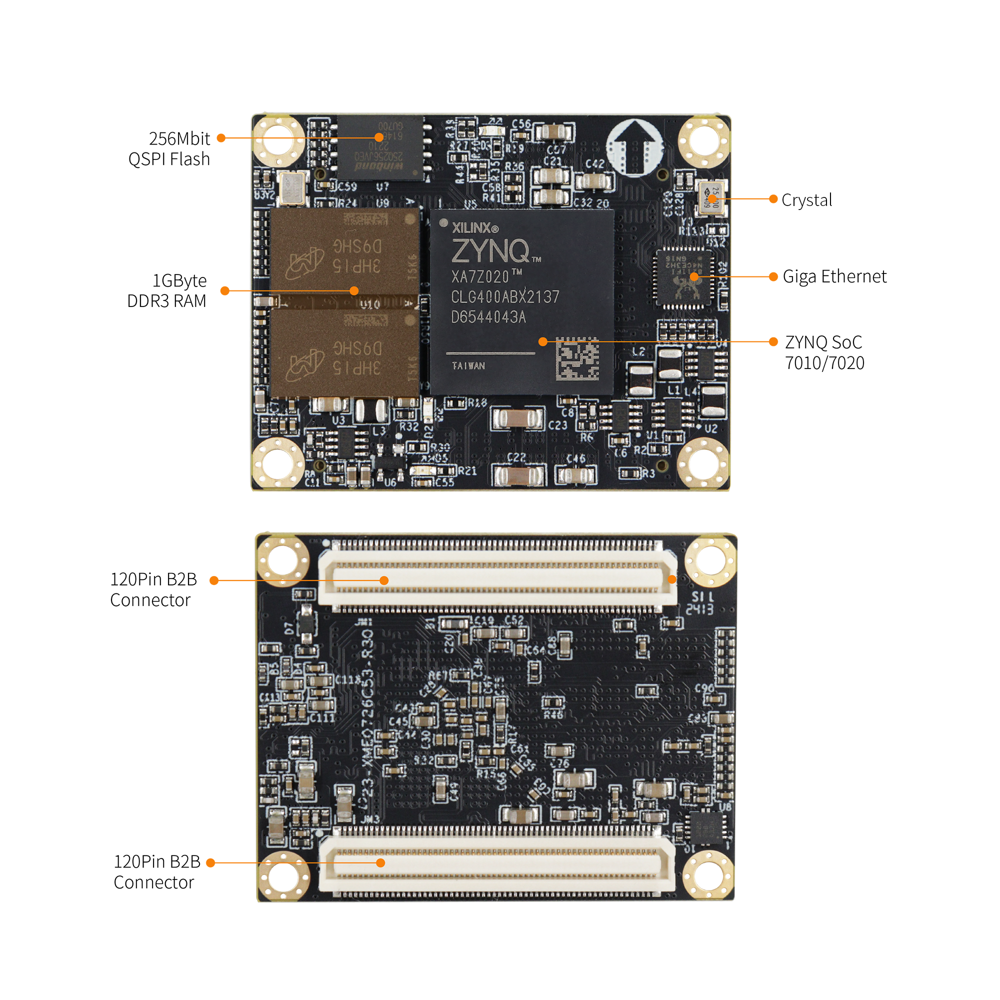
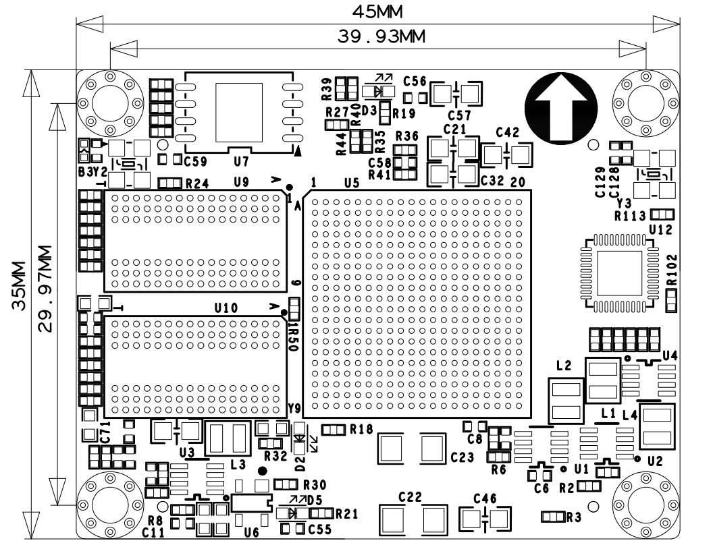

# **XME0726 Reference Manual**

## Revision History

| Revision | Time       | Description   |
| :------- | :--------- | :------------ |
| Rev. 1.0 | 2024.10.13 | First Release |
|          |            |               |

## CopyRight Notice:

Copyright ©2015 by MicroPhase Technologies (Shanghai) Co. Ltd. All rights are reserved.

## Development Environment:

Vivado 2018.3 is from Xilinx website

<https://www.xilinx.com>

## WeChat Public Number:

## ●1. Overview

XME0726 is a system module based on Xilinx Zynq-SoC (XC7Z010 or XC7Z020) from Microphase Technology. 

It integrates 1GByte DDR3 RAM, 32MByte SPI flash, Gigabit Ethernet PHY transceiver and a large number of configurable I/Os expandable via high-speed connectors. With a size of only 4.5 x 3.5cm, the module is small and flexible enough to be used in a wide range of applications.

The core board extends 120 single-ended IOs on the PL side (can be configured as 60 pairs of differential IOs), with adjustable IO voltages; 32 IOs on the PS side, and a Gigabit Ethernet PHY, with equal-length differential processing of the FPGA pin-to-connector alignment, and impedance of 50 ohms single-ended and 100 ohms differential. This is very important for high-speed signal transmission application scenarios.

### ○Board Layout

### ○Key Features

- Xilinx Zynq™ XC7Z010-1CLG400C (7010 Version Only),  
Xilinx Zynq™ XC7Z020-2CLG400C (7020 Version Only).  
- DDR3: PS 1GB DDR3 RAM.  
- Flash: 256Mbit QSPI Flash.  
- LED: 1 Power LED, 1 FPGA Done LED;  
1 PS users LED.  
- MIO: 32 MIOs, 8 IOs at 3.3V, 24 IOs at 1.8V.  
- PL GPIO: 120, Adjustable Voltage, 60 LVDS Pairs.  
- Giga ETH: 10/100/1000M Adaptive  
- USB Host: USB2.0 PHY(USB3320)  
- CLOCK: 1 33.33Mhz active crystal oscillator provides a stable clock for the PS system.   
- Connectors: 2 * 120pin High Speed B2B Connectors  

### ○Block diagram

### ○Mechanical Spec

### ○FPGA

- 667 MHz dual-core Cortex-A9 processor  
- DDR3L me  mory controller with 8 DMA channels and 4   

- High-Performance AXI3 Slave ports  

- High-bandwidth peripheral controllers: 1G Ethernet, USB 2.0, SDIO  

- Low-bandwidth peripheral controllers: SPI, UART, CAN, I2C  

- Programmable from JTAG, Quad-SPI flash, and microSD card  

- Programmable logic equivalent to Artix-7 FPGA  

  LUTs: 17,600 (7010)  
  ​	   &ensp;&ensp;&ensp;&ensp;&ensp;53,200(7020)  
  DSP Slices: 80 (7010)   
  ​    	&ensp;&ensp;&ensp;&ensp;&ensp;&ensp;&ensp;&ensp;&ensp;&ensp;220 (7020)  
  Logic Cells: 28K (7010)  
  ​		  &ensp;&ensp;&ensp;&ensp;&ensp;&ensp;&ensp;&ensp;&ensp;&ensp;85K(7020)  
  Flip-Flops: 35,200 (7010)   
  ​    	 &ensp;&ensp;&ensp;&ensp;&ensp;&ensp;&ensp;&ensp;&ensp;106,400 (7020)  
  Total Block RAM: 2.1Mb (7010)   
  &ensp;&ensp;&ensp;&ensp;&ensp;&ensp;&ensp;&ensp;&ensp;&ensp;&ensp;&ensp;&ensp;&ensp;&ensp;4.9Mb (7020)  

- Analog Mixed Signal (AMS) / XADC:  2x 12 bit, MSPS ADCs with up to 17 Differential Inputs  

- Security: AES & SHA 256b Decryption & Authentication for Secure Programmable Logic Config

### ○DDR3

The module uses two 16-bit DDR3 memory chips, with a capacity of 512MB for a single chip and 1GB for two chips.

| Signal Name   | PIN Number | Signal Name    | PIN Number |
| ------------- | ---------- | -------------- | ---------- |
| PS_DDR3_A0    | N2         | PS_DDR3_D9     | E3         |
| PS_DDR3_A1    | K2         | PS_DDR3_D10    | G3         |
| PS_DDR3_A2    | M3         | PS_DDR3_D11    | H3         |
| PS_DDR3_A3    | K3         | PS_DDR3_D12    | J3         |
| PS_DDR3_A4    | M4         | PS_DDR3_D13    | H2         |
| PS_DDR3_A5    | L1         | PS_DDR3_D14    | H1         |
| PS_DDR3_A6    | L4         | PS_DDR3_D15    | J1         |
| PS_DDR3_A7    | K4         | PS_DDR3_D16    | P1         |
| PS_DDR3_A8    | K1         | PS_DDR3_D17    | P3         |
| PS_DDR3_A9    | J4         | PS_DDR3_D18    | R3         |
| PS_DDR3_A10   | F5         | PS_DDR3_D19    | R1         |
| PS_DDR3_A11   | G4         | PS_DDR3_D20    | T4         |
| PS_DDR3_A12   | E4         | PS_DDR3_D21    | U4         |
| PS_DDR3_A13   | D4         | PS_DDR3_D22    | U2         |
| PS_DDR3_A14   | F4         | PS_DDR3_D23    | U3         |
| PS_DDR3_BA0   | L5         | PS_DDR3_D24    | V1         |
| PS_DDR3_BA1   | R4         | PS_DDR3_D25    | Y3         |
| PS_DDR3_BA2   | J5         | PS_DDR3_D26    | W1         |
| PS_DDR3_NCAS  | P5         | PS_DDR3_D27    | Y4         |
| PS_DDR3_CKE   | N3         | PS_DDR3_D28    | Y2         |
| PS_DDR3_CLK_N | M2         | PS_DDR3_D29    | W3         |
| PS_DDR3_CLK_P | L2         | PS_DDR3_D30    | V2         |
| PS_DDR3_NCS   | N1         | PS_DDR3_D31    | V3         |
| PS_DDR3_DM0   | A1         | PS_DDR3_DQS_N0 | B2         |
| PS_DDR3_DM1   | F1         | PS_DDR3_DQS_N1 | F2         |
| PS_DDR3_DM2   | T1         | PS_DDR3_DQS_N2 | T2         |
| PS_DDR3_DM3   | Y1         | PS_DDR3_DQS_N3 | W4         |
| PS_DDR3_D0    | C3         | PS_DDR3_DQS_P0 | C2         |
| PS_DDR3_D1    | B3         | PS_DDR3_DQS_P1 | G2         |
| PS_DDR3_D2    | A2         | PS_DDR3_DQS_P2 | R2         |
| PS_DDR3_D3    | A4         | PS_DDR3_DQS_P3 | W5         |
| PS_DDR3_D4    | D3         | PS_DDR3_NRST   | B4         |
| PS_DDR3_D5    | D1         | PS_DDR3_ODT    | N5         |
| PS_DDR3_D6    | C1         | PS_DDR3_NRAS   | P4         |
| PS_DDR3_D7    | E1         | PS_DDR3_NWE    | M5         |
| PS_DDR3_D8    | E2         |                | ****       |

### ○Giga ETH

The RTL8211F chip supports 10/100/1000M network transfer rate and communicates with the MAC layer of the Zynq7000 PS system via the RGMII interface. It supports MDI/MDX adaptation, multiple speed adaptation, master/slave adaptation and MDIO bus support for PHY register management.

### ○JTAG

The JTAG signal link of the XME0726 is connected to the expansion connector.

|  Signal  | JM3 Pin Number | Explain       |
| :------: | :------------: | ------------- |
| FPGA_TCK |     Pin103     | Input (3.3V)  |
| FPGA_TDI |     Pin99      | Input (3.3V)  |
| FPGA_TDO |     Pin101     | Output (3.3V) |
| FPGA_TMS |     Pin105     | Output (3.3V) |

### ○Boot Config

ZYNQ startup mode by configuring the core module pins PIN119 (MODE0), PIN120 (MODE1), the core module ZYNQ configuration schematic is shown below.

| Mode | MODE1(JM3 PIN108) | MODE0(JM3 PIN106) |
| :--: | :---------------: | :---------------: |
| JTAG | Connection to GND | Connection to GND |
| QSPI |        NC         | Connection to GND |
|  SD  |        NC         |        NC         |

### ○Quad-SPI Flash

On-board 256M Quad-SPI Flash memory W25Q256FVEI is used to store initial FPGA configuration and user’s application as well as data.

| Position |    Model    | Capacity | Factory |
| :------: | :---------: | :------: | :-----: |
|    U7    | W25Q256FVEI | 256 Byte | Winbond |

### ○Clock

The XME0726 core board provides a 33.3Mhz active clock for the PS system. 

The clock for the PL section can be generated by the PLL in the PS section, or the user can use it as a clock input to the PL section by connecting an external clock source to the dedicated clock pin of the module.

| Position | Signal Name | Frequency | Pin Number |
| :------: | :---------: | :-------: | :--------: |
|    Y2    | PS_CLK_33d3 | 33.333Mhz |     E7     |

### ○Power

**Please note that the power input of XME0726 is +5V. We recommend using a 5V/2A power supply.** 

Once the module is powered up, it will be cascaded in order to complete the power-up process in the following sequence: 1.0V > 1.8V > 1.5V > 3.3V. The 3.3V output will be powered up last, and at the same time, it will provide the PG signal of system power status.

### ○LED

The XME0726 board provides three LEDs, the power indicator, the FPGA configuration status light and  the PS-controlled user LED.

The LED signals are described in the following table.

| LED  | FPGA Pin | Explain                                                      |
| :--: | :------: | ------------------------------------------------------------ |
|  D5  |    \-    | Power LED                                                    |
|  D2  |   R11    | FPGA configuration status LED, LED on when FPGA successful configuration |
|  D3  |    E6    | LED on when Bank500 MIO0 output is                           |

### ○Expansion Ports

The XME0726 uses two sets of connectors, JM1 and JM3, for the FPGA IO signals and Ethernet interface.

2 x AXK5A2137YG, 120Pin, 0.5mm Pitch

| Core Board Connector Models | Based Board Connector Models | Manufacturers | Mated height |
| :-------------------------: | :--------------------------: | :-----------: | :----------: |
|         AXK5A2137YG         |         AXK6A2337YG          |   Panasonic   |     3mm      |

FPGA Bank, Number of IOs vs. B2B Connector Table

| FPGA Bank | B2B Connector | IO Number |  Voltage   |                        Explain                         |
| :-------: | :-----------: | :-------: | :--------: | :----------------------------------------------------: |
|  Bank500  |      JM1      |     8     |    3.3V    |                                                        |
|  BANK501  |      JM1      |    24     |    1.8V    |                                                        |
|  Bank35   |      JM1      |    48     | Adjustable | 48 single-ended, can be mated to 24 differential pairs |
|  Bank12   |      JM3      |    48     | Adjustable | 48 single-ended, can be mated to 24 differential pairs |
|  Bank13   |      JM3      |    24     | Adjustable | 24 single-ended, can be mated to 12 differential pairs |

Description:

1. Bank35 IO level depends on JM1 Pin29&30 voltage input, input range 1.2V~3.3V.
2. Bank34 IO level depends on JM3 Pin29&30 voltage input, input range 1.2V~3.3V.
3. Bank13 IO level depends on JM3 Pin89&90 voltage input, input range 1.2V~3.3V.
4. MIO8~MIO15 (JM1 Pin111~Pin118), JTAG,RESET (JM1 Pin99~Pin108) level is 3.3V.
5. MIO28~MIO51 (JM1 Pin81~Pin108) level is 1.8V.
6. Please refer to the ‘[XME0726_Pinout _Table]()’ for detailed pin definitions of the XME0726.  

## ●3. Related Documents  
### ○XME0726
- [XME0726_R10 Schematic]() (PDF)
- [XME0726_R10 Dimensions]() (PDF) 
- [XME0726_R10 Dimensions source file]() (PDF) 
### ○XME0726CB 
- [XME0726CB_R10 Schematic]()(PDF)
- [XME0726CB_R10 Dimensions]()(PDF)
- [XME0726CB_R10 Board source file]()(Brd)