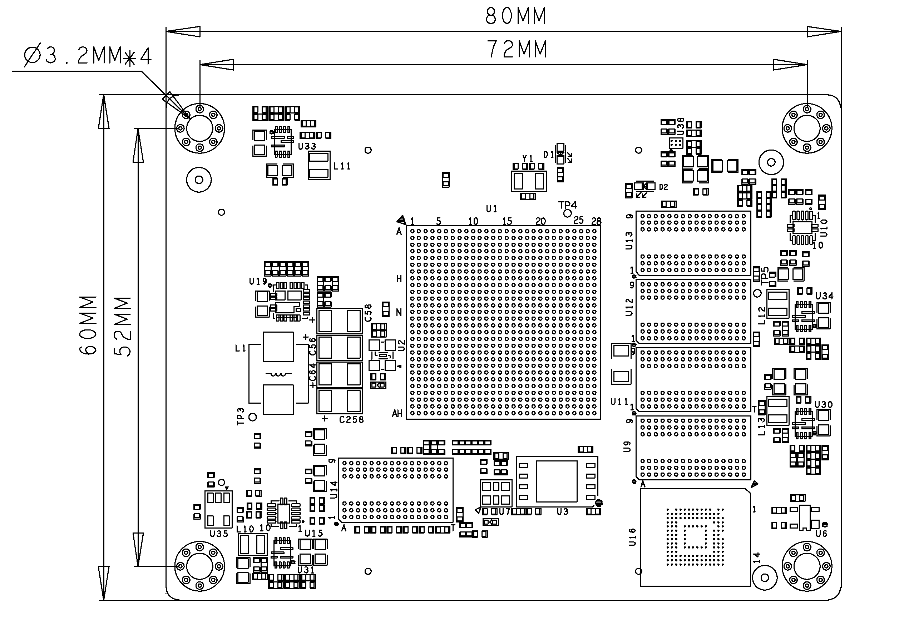
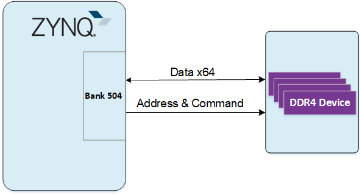
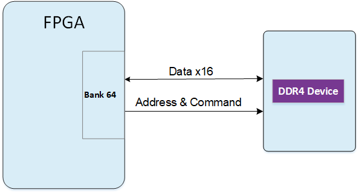

- # **XME0803(4EV) 用户手册**

  ## 开发环境：

  赛灵思Vivado 2022.2

  <https://www.xilinx.com>

  ## 微信公众号：

  

  ## ●1. 概述

  XME0803(4EV) 是微相科技基于 Xilinx Zynq UltraScale+ SoC 的工业级系统模块。可根据需求提供定制化版本，定制需求可能需要满足最小订单量，请联系我们的销售团队获取更多信息：<sales@microphase.cn>。  
  该板的 PS 侧配备了 4 个 DDR4 SDRAM 芯片，PL 侧集成了 1 个 DDR4 SDRAM 芯片。ZYNQ 与 DDR4 之间的数据读写时钟频率最高可达 1200 MHz（数据速率：2400 Mbps），FPGA 与 DDR4 之间的数据读写时钟频率最高可达 1066 MHz（数据速率：2132 Mbps）。此外，核心板还集成了 256Mbit QSPI 闪存、8GB eMMC 闪存和电源管理。

  核心板具有 168 个单端 IO（可配置为 84 对差分对），IO 电压可调，4 对 PS-GTR 高速 RX/TX 对，16 对 GTH 高速 RX/TX 对，FPGA 引脚到连接器的走线经过等长差分处理，单端阻抗为 50 欧姆，差分阻抗为 100 欧姆。

  ### ○板卡布局

  

  ### ○主要特性

  - Xilinx Zynq™ XCZU4EV-SFVC784 Soc  
  - DDR4：PS 2GB DDR4 RAM，64 位；  
    &ensp;&ensp;&ensp;&ensp;&ensp;&ensp;PL 512MB DDR4 RAM，16 位  
  - 闪存：256Mbit QSPI 闪存，8GB eMMC 闪存。  
  - LED：1 个电源 LED，1个FPGA 配置状态指示灯
  - GTR：4  
  - GTH：16  
  - MIO：58 个 MIO，1.8V  
  - PL GPIO：168 ，可配置为 84 对差分对，电压均可调，72 个 HD BANK IO，96 个HR BANK IO
  - 连接器：3 x 120pin 高速 B2B 连接器  
  
  ### ○机械尺寸
  
  
  
  ## ●2. 硬件资源
  
  ### ○FPGA
  
  - PS:
  
    - Up to 1.5GHz quad-core Cortex-A53 MPCore;
  
      Up to 600MHz dual-core Cortex-R5 MPCore
  
    - x32/x64: DDR4, LPDDR4, DDR3, DDR3L, LPDDR3 with ECC
  
    - 2x AXI 32b Master, 2x AXI 32b Slave 4x AXI 64b/32b Memory AXI 64b ACP 16 Interrupts
  
    - High-Speed Connectivity: PCIe® Gen2 x4, 2x USB3.0, SATA 3.1, DisplayPort, 4x Tri-mode Gigabit Ethernet
  
    - General Connectivity: 2xUSB 2.0, 2x SD/SDIO, 2x UART, 2x CAN 2.0B, 2x I2C, 2x SPI, 4x 32b GPIO
  
    - Programmable from JTAG, Quad-SPI flash, microSD card, and eMMC.
  
    PL:
  
    - LUTs: 88K
  
    - DSP Slices: 728
  
    - Logic Cells: 192K
  
    - Flip-Flops: 176K
  
    - Total Block RAM: 4.5Mb
  
    - UltraRAM:14Mb
  
    - MAX. Distributed RAM: 2.6Mb
  
    - Clock Management Tiles(CMTs): 4
  
    - Video Codec Unit(VCU): 1
  
    - PCI Express Gen 3x16/Gen4x8: 2
  
    - AMS-System Monitor: 1
  
    - GTH 16.3Gb/s Transceivers: 16
  
  ### ○DDR4
  
  PS 侧模块使用四个 16 位 DDR4 内存芯片，总容量为 512MB，数据宽度为 64 位。DDR4 型号为 **MT40A512M16LY-062E**。DDR4 SDRAM 的最大工作时钟速度为 **1200MHz**（数据速率高达 **2400Mbps**）。PS 侧的 DDR4 芯片连接到 **PS BANK 504** 。
  
  
  
  PL 侧模块使用单个 16 位 DDR4 内存芯片，总容量为 512MB。DDR4 型号为 **MT40A512M16LY-062E**。DDR4 SDRAM 的最大工作时钟速度为 **1066MHz**（数据速率高达 **2132Mbps**）。PL 侧的 DDR4 芯片连接到 **PL BANK 64** 。
  
  
  
  ### ○eMMC
  
  该模块具有 8GB eMMC 接口（PS_SDIO1），可用于系统文件或其他数据文件的存储。它还可以与 QSPI 闪存一起用作系统启动的辅助启动设备。接口为 PS BANK501 MIO[46-51]。  
  
  | 信号名称  | 引脚号 / 引脚名称   |
  | --------- | ------------------- |
  | MMC_DATA0 | AH18 / PS_MIO13_500 |
  | MMC_DATA1 | AG18 / PS_MIO14_500 |
  | MMC_DATA2 | AE18 / PS_MIO15_500 |
  | MMC_DATA3 | AF18 / PS_MIO16_500 |
  | MMC_DATA4 | AC18 / PS_MIO17_500 |
  | MMC_DATA5 | AC19 / PS_MIO18_500 |
  | MMC_DATA6 | AE19 / PS_MIO19_500 |
  | MMC_DATA7 | AD19 / PS_MIO20_500 |
  | MMC_CMD   | AC21 / PS_MIO21_500 |
  | MMC_CLK   | AB20 / PS_MIO22_500 |
  | MMC_NRST  | AB18 / PS_MIO23_500 |
  
  ### ○JTAG
  
  XME0803(4EV) 的 JTAG 信号链路连接到扩展连接器。
  
  | 信号     | JM3 引脚号 | 说明         |
  | -------- | ---------- | ------------ |
  | FPGA_TCK | Pin13      | 输入（3.3V） |
  | FPGA_TDI | Pin15      | 输入（3.3V） |
  | FPGA_TDO | Pin17      | 输出（3.3V） |
  | FPGA_TMS | Pin19      | 输出（3.3V） |
  
  ### ○启动配置
  
  XME0803 支持四种启动模式：JTAG 启动、QSPI 启动、SD 卡启动和 eMMC 启动。上电时，系统根据引脚电平状态确定启动模式。用户可以通过调整底板上的开关设置来选择所需的启动模式。
  
  | 模式 | PS_MODE3 (JM3 PIN20) | PS_MODE2 (JM3 PIN18) | PS_MODE1 (JM3 PIN16) | PS_MODE0 (JM1 PIN14) |
  | ---- | ------------------------- | ------------------------- | ------------------------- | ------------------------- |
  | JTAG | 0                         | 0                         | 0                         | 0                         |
  | QSPI | 0                         | 0                         | 0                         | 1                         |
  | SD   | 0                         | 1                         | 0                         | 1                         |
  | eMMC | 0                         | 1                         | 1                         | 0                         |
  
  ### ○Quad-SPI 
  
  板载 256M Quad-SPI 闪存 MT25QU256ABA1EW9-0SIT 用于存储初始 FPGA 配置和用户应用程序及数据。  
  
  | 位置 | 型号                  | 容量  | 厂商   |
  | ---- | --------------------- | ----- | ------ |
  | U4   | MT25QU256ABA1EW9-0SIT | 256MB | Micron |
  
  ### ○时钟
  
  XME0803(4EV) 核心板为 PS 系统提供 33.3MHz 有源时钟，为 PL 系统提供 200MHz 有源时钟。  
  
  | 位置 | 信号名称    | 频率      | 引脚号 |
  | ---- | ----------- | --------- | ------ |
  | U2   | PS_CLK_33d3 | 33.333MHz | R16    |
  | U7   | SYS_CLK_P   | 200MHz    | AF7    |
  | U7   | SYS_CLK_N   | 200MHz    | AF6    |
  
  ### ○电源
  
  **请注意，XME0803(4EV) 的电源输入为 +12V。建议使用 5V/2A 电源。**  
  
  ### ○LED
  
  XME0803(4EV) 板提供两个 LED，电源指示灯和 FPGA 配置状态灯。
  
  | LED  | ZYNQ 引脚 | 说明                                   |
  | ---- | --------- | -------------------------------------- |
  | D4   | --        | 电源 LED                               |
  | D1   | AA9       | FPGA 配置状态 LED，FPGA 成功配置后点亮 |
  
  ### ○扩展端口
  
  XME0803(4EV) 使用三组连接器 JM1、JM3 和 JM4 用于拓展 FPGA IO 和以太网接口信号。  
  3 x AXK5A2137YG，120Pin，0.5mm 间距    
  
  | 核心板连接器型号 | 底板连接器型号 | 制造商    | 配对高度 |
  | ---------------- | -------------- | --------- | -------- |
  | AXK5A2137YG      | AXK6A2337YG    | Panasonic | 3mm      |
  
  FPGA Bank、IO 数量与 B2B 连接器表   
  
  | FPGA Bank | B2B 连接器 | IO 数量 | 电压 | 说明                            |
  | --------- | ---------- | ------- | ---- | ------------------------------- |
  | BANK505   | JM1        | 24      | -    | 4 对 CLK，4 对 TX 和 RX         |
  | BANK502   | JM1        | 26      | 1.8V | 26 个单端，可配对为 13 对差分对 |
  | BANK501   | JM1        | 26      | 1.8V | 26 个单端，可配对为 13 对差分对 |
  | BANK45    | JM1        | 24      | 3.3V | 24 个单端，可配对为 12 对差分对 |
  | BANK44    | JM3        | 24      | 可调 | 24 个单端，可配对为 12 对差分对 |
  | BANK43    | JM3        | 24      | 可调 | 24 个单端，可配对为 12 对差分对 |
  | BANK224   | JM3        | 20      | -    | 2 对 CLK，4 对 TX 和 RX         |
  | BANK66    | JM4        | 48      | 可调 | 48 个单端，可配对为 24 对差分对 |
  | BANK65    | JM4        | 48      | 可调 | 48 个单端，可配对为 24 对差分对 |
  
  说明：  
  
  1. Bank44、43 IO 电平取决于 JM1 Pin61&62 电压输入，输入范围 1.2V-1.8V。
  2. Bank66 IO 电平取决于 JM4 Pin31&32 电压输入，输入范围 1.2V-3.3V。
  3. Bank65 IO 电平取决于 JM4 Pin91&92 电压输入，输入范围 1.2V-3.3V。
  4. MIO8、MIO9、MIO10、MIO11、MIO24 和 MIO25（JM1 Pin20、55、57）电平为 1.8V。
  5. JTAG、RESET（JM1 Pin18、Pin23-Pin29）
  6. 请参考 《[XME0803_Pinout Table](https://github.com/MicroPhase/fpga-docs/blob/master/others/XME0803_Pinout_Table_R11.xlsx)》 获取 XME0803(4EV) 的详细引脚定义。  
  
  ## ●3. 相关文档  
  
  ### ○XME0803
  
  - [XME0803_R20 原理图](https://github.com/MicroPhase/fpga-docs/blob/master/schematic/XME0803_R20.pdf) (PDF)
  - [XME0803_R20 尺寸](https://github.com/MicroPhase/fpga-docs/blob/master/mechanical/XME0803/XME0803_R20_Dimensions.pdf) (PDF)  
  - [XME0803_R20 尺寸源文件](https://github.com/MicroPhase/fpga-docs/blob/master/mechanical/XME0803/XME0803_R20_Dimensions_source_file.dxf) (DXF)  
  
  ### ○XPE-ZU100 
  - [XPE-ZU100 参考手册](https://documentation-of-microphase-fpga-board.readthedocs.io/en/latest/CARRIER_BOARD/XPE_ZU100/XPE_ZU100-Reference_Manual.html)(HTML)
  - [XPE-ZU100_R40 原理图](https://github.com/MicroPhase/fpga-docs/blob/master/schematic/XPE-ZU100_R40.pdf)(PDF)
  - [XPE-ZU100_R40 尺寸](https://github.com/MicroPhase/fpga-docs/blob/master/mechanical/XPE-ZU100/XPE-ZU100_R40_Dimensions.pdf)(PDF)
  - [XPE-ZU100_R40 板源文件](https://github.com/MicroPhase/fpga-docs/blob/master/others/XPE-ZU100_R40 Board source file.brd)(Brd)