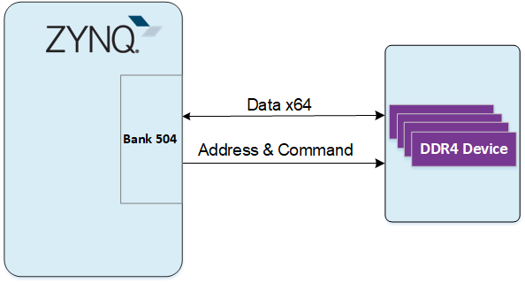
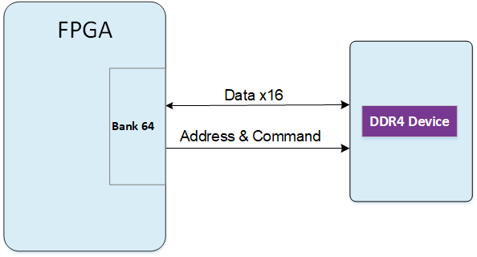

# **XME0803(4EV) Reference Manual**

[[中文]](https://microphase-doc.readthedocs.io/zh-cn/latest/SoM/XME0803/XME0803_4EV-Reference_Manual.html)

## Development Environment:

Vivado 2022.2 is from Xilinx website

<https://www.xilinx.com>

## WeChat Public Number:

## ●1. Overview

XME0803(4EV) is a industrial-grade system module based on Xilinx Zynq UltraScale+   SoC from Microphase Technology. With customizable variants available upon request, customised requirements may be subject to minimum order quantities,  please contact our sales team for more information: [sales@microphase.cn](sales@microphase.cn).  
The board's PS side is equipped with 4 DDR4 SDRAM chips, while the PL side integrates 1 DDR4 SDRAM chip. The data read/write clock frequency between the ZYNQ and DDR4 reaches up to 1200 MHz (data rate: 2400 Mbps), and the data read/write clock frequency between the FPGA and DDR4 reaches up to 1066 MHz (data rate: 2132 Mbps). Additionally, the core board integrates a 256-Mbit QSPI flash, 8GByte eMMC flash, and power management.

The core board features 168 single-ended IOs (configurable as 84 differential pairs), adjustable IO voltages, 4 PS-GTR high-speed RX/TX pairs, 16 GTH high-speed RX/TX pairs, and equal-length differential alignments with 50-ohm single-ended and 100-ohm differential impedance.

### ○Board Layout

### ○Key Features

- Xilinx Zynq™ XCZU4EV-SFVC784 Soc  
- DDR4: PS 2GB DDR4 RAM, 64Bit;  
&ensp;&ensp;&ensp;&ensp;&ensp;&ensp;PL 512MB DDR4 RAM, 16Bit  
- Flash: 256Mbit QSPI Flash, 8GB eMMC Flash.  
- LED: 1 Power LED, 1 FPGA Done LED  
- GTR: 4
- GTH:16
- MIO: 58 MIOs, 1.8V 
- PL GPIO: 168, Adjustable Voltage, 72 for HD BANK, 96 for HR BANK,  
&ensp;&ensp;&ensp;&ensp;&ensp;&ensp;&ensp;&ensp;&ensp;Can be configured as 84 differential pairs  
- Connectors: 3 x 120pin High Speed B2B Connectors  

### ○Mechanical Spec  

## ●2. Function Resources  

### ○FPGA  

PS:

- Up to 1.5GHz quad-core Cortex-A53 MPCore;

  Up to 600MHz dual-core Cortex-R5 MPCore

- x32/x64: DDR4, LPDDR4, DDR3, DDR3L, LPDDR3 with ECC

- 2x AXI 32b Master, 2x AXI 32b Slave 4x AXI 64b/32b Memory AXI 64b ACP 16 Interrupts

- High-Speed Connectivity: PCIe® Gen2 x4, 2x USB3.0, SATA 3.1, DisplayPort, 4x Tri-mode Gigabit Ethernet

- General Connectivity: 2xUSB 2.0, 2x SD/SDIO, 2x UART, 2x CAN 2.0B, 2x I2C, 2x SPI, 4x 32b GPIO

- Programmable from JTAG, Quad-SPI flash, microSD card, and eMMC.

PL:

- LUTs: 88K

- DSP Slices: 728

- Logic Cells: 192K

- Flip-Flops: 176K

- Total Block RAM: 4.5Mb

- UltraRAM:14Mb

- MAX. Distributed RAM: 2.6Mb

- Clock Management Tiles(CMTs): 4

- Video Codec Unit(VCU): 1

- PCI Express Gen 3x16/Gen4x8: 2

- AMS-System Monitor: 1

- GTH 16.3Gb/s Transceivers: 16

### ○DDR4  

The PS-side module uses four 16-bit DDR4 memory chips, totaling 512MB, with a data width of 64 bits. The DDR4 model is **MT40A512M16LY-062E**. The maximum operating clock speed of the DDR4 SDRAM is **1200MHz** (data rate up to **2400Mbps**). The DDR4 chips on the PS side are connected to the **PS BANK 504** memory interface.

The PL-side module uses a single 16-bit DDR4 memory chip, totaling 512MB. The DDR4 model is **MT40A512M16LY-062E**. The maximum operating clock speed of the DDR4 SDRAM is **1066MHz** (data rate up to **2132Mbps**). The DDR4 chip on the PL side is connected to the **PL BANK 64** memory interface.

### ○eMMC  

The module features an 8GB eMMC interface (PS_SDIO1) that can be utilised for system files or other data file storage. It can also be employed as a secondary boot device in conjunction with the QSPI flash for system boot. The interface is PS BANK501 MIO[46-51].  

| Signal Name | Pin Number / Pin Name |
| ----------- | --------------------- |
| MMC_DATA0   | AH18 / PS_MIO13_500   |
| MMC_DATA1   | AG18 / PS_MIO14_500   |
| MMC_DATA2   | AE18 / PS_MIO15_500   |
| MMC_DATA3   | AF18 / PS_MIO16_500   |
| MMC_DATA4   | AC18 / PS_MIO17_500   |
| MMC_DATA5   | AC19 / PS_MIO18_500   |
| MMC_DATA6   | AE19 / PS_MIO19_500   |
| MMC_DATA7   | AD19 / PS_MIO20_500   |
| MMC_CMD     | AC21 / PS_MIO21_500   |
| MMC_CLK     | AB20 / PS_MIO22_500   |
| MMC_NRST    | AB18 / PS_MIO23_500   |

### ○JTAG  

The JTAG signal link of the XME0803(4EV) is connected to the expansion connector.

| Signal   | JM3 Pin Number | Explain       |
| -------- | -------------- | ------------- |
| FPGA_TCK | Pin13          | Input (3.3V)  |
| FPGA_TDI | Pin15          | Input (3.3V)  |
| FPGA_TDO | Pin17          | Output (3.3V) |
| FPGA_TMS | Pin19          | Output (3.3V) |

### ○Boot Config  

The XME0803 supports four boot modes: JTAG boot, QSPI boot, SD card boot, and eMMC boot. Upon power-up, the system determines the boot mode based on the pin level states. Users can select the desired boot mode by adjusting the DIP switch settings on the carrier board.

| Mode | PS_MODE3 (JM3 PIN20) | PS_MODE2 (JM3 PIN18) | PS_MODE1 (JM3 PIN16) | PS_MODE0 (JM1 PIN14) |
| ---- | ------------------------- | ------------------------- | ------------------------- | ------------------------- |
| JTAG | 0                         | 0                         | 0                         | 0                         |
| QSPI | 0                         | 0                         | 0                         | 1                         |
| SD   | 0                         | 1                         | 0                         | 1                         |
| eMMC | 0                         | 1                         | 1                         | 0                         |

### ○Quad-SPI Flash  

One-board 256M Quad-SPI Flash memory MT25QU256ABA1EW9-0SIT is used to store initial FPGA configuration and user’s application as well as data.  

| Position | Model                 | Capacity | Factory |
| -------- | --------------------- | -------- | ------- |
| U4       | MT25QU256ABA1EW9-0SIT | 256 Byte | Micron  |

### ○Clock  

The XME0803(4EV) core board provides a 33.3Mhz active clock for the PS system, a 200Mhz active clock for the PL system.  

| Position | Signal Name | Frequency | Pin Number |
| -------- | ----------- | --------- | ---------- |
| U2       | PS_CLK_33d3 | 33.333Mhz | R16        |
| U7       | SYS_CLK_P   | 200Mhz    | AF7        |
| U7       | SYS_CLK_N   | 200Mhz    | AF6        |

### ○Power  

**Please note that the power input of XME0803(4EV) is +5V. We recommend using a 5V/2A power supply.**  

### ○LED  

The XME0803(4EV) board provides two LEDs, the power indicator and the FPGA configuration status light.

| LED  | ZYNQ Pin | Note                                                         |
| ---- | -------- | ------------------------------------------------------------ |
| D4   | --       | Power LED                                                    |
| D1   | AA9      | FPGA configuration status LED, lit after successful FPGA configuration |

### ○Expansion Ports  

The XME0803(4EV) uses three sets of connectors, JM1, JM3 and JM4, for the FPGA IO signals and Ethernet interface.  
3 x AXK5A2137YG, 120Pin, 0.5mm Pitch    

| Core Board Connector Models | Based Board Connector Models | Manufacturers | Mated height |
| --------------------------- | ---------------------------- | ------------- | ------------ |
| AXK5A2137YG                 | AXK6A2337YG                  | Panasonic     | 3mm          |

FPGA Bank, Number of IOs vs. B2B Connector Table   

| FPGA Bank | B2B Connector | IO Number | Voltage    | Explain                                                |
| --------- | ------------- | --------- | ---------- | ------------------------------------------------------ |
| BANK505   | JM1           | 24        | -          | 4 pairs of CLK, 4 pairs of TX and RX                   |
| BANK502   | JM1           | 26        | 1.8V       | 26 single-ended, can be mated to 13 differential pairs |
| BANK501   | JM1           | 26        | 1.8V       | 26 single-ended, can be mated to 13 differential pairs |
| BANK45    | JM1           | 24        | 3.3V       | 24 single-ended, can be mated to 12 differential pairs |
| BANK44    | JM3           | 24        | Adjustable | 24 single-ended, can be mated to 12 differential pairs |
| BANK43    | JM3           | 24        | Adjustable | 24 single-ended, can be mated to 12 differential pairs |
| BANK224   | JM3           | 20        | -          | 2 pairs of CLK, 4 pairs of TX and RX                   |
| BANK66    | JM4           | 48        | Adjustable | 48 single-ended, can be mated to 24 differential pairs |
| BANK65    | JM4           | 48        | Adjustable | 48 single-ended, can be mated to 24 differential pairs |

Description:  

1. Bank44、43 IO level depends on JM1 Pin61&62 voltage input, input range 1.2V-1.8V.
2. Bank66 IO level depends on JM4 Pin31&32 voltage input, input range 1.2V-3.3V.
3. Bank65 IO level depends on JM4 Pin91&92 voltage input, input range 1.2V-3.3V.
4. MIO8,MIO9,MIO10,MIO11,MIO24 and MIO25 (JM1 Pin20,55,57) level is 1.8V.
5.  JTAG,RESET (JM1 Pin18, Pin23-Pin29)level is 3.3V.
6. Please refer to the ‘[XME0803_Pinout Table](https://github.com/MicroPhase/fpga-docs/blob/master/others/XME0803_Pinout_Table_R10.xlsx)’ for detailed pin definitions of the XME0803.  

## ●3. Related Documents  

### ○XME0803

- [XME0803_R20 Schematic](https://github.com/MicroPhase/fpga-docs/blob/master/schematic/XME0803_R20.pdf) (PDF)
- [XME0803_R20 Dimensions](https://github.com/MicroPhase/fpga-docs/blob/master/mechanical/XME0803/XME0803_R20_Dimensions.pdf) (PDF)  
- [XME0803_R20 Dimensions source file](https://github.com/MicroPhase/fpga-docs/blob/master/mechanical/XME0803/XME0803_R20_Dimensions_source_file.dxf) (DXF)  

### ○XPE-ZU100 
- [XPE-ZU100 Reference_Manual](https://microphase-doc.readthedocs.io/en/latest/CARRIER_BOARD/XPE_ZU100/XPE_ZU100-Reference_Manual.html)(HTML)
- [XPE-ZU100_R40 Schematic](https://github.com/MicroPhase/fpga-docs/blob/master/schematic/XPE-ZU100_R40.pdf)(PDF)
- [XPE-ZU100_R40 Dimensions](https://github.com/MicroPhase/fpga-docs/blob/master/mechanical/XPE-ZU100/XPE-ZU100_R40_Dimensions.pdf)(PDF)
- [XPE-ZU100_R40 Dimensions  source file](https://github.com/MicroPhase/fpga-docs/tree/master/mechanical/XPE-ZU100/XPE-ZU100_R40_Dimensions.dxf)(DXF)