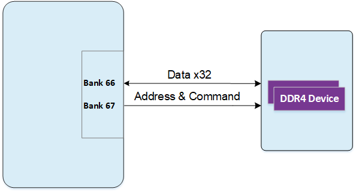
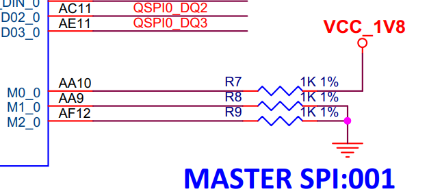
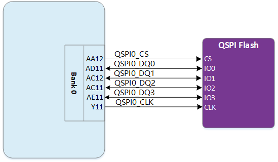

# **XME0835 用户手册**

[[English]](https://microphase-doc.readthedocs.io/en/latest/SoM/XME0835/XME0835-Reference_Manual.html)

## 微信公众号：

## ●1. 概述

XME0835 是微相科技基于 Xilinx Kintex UltraScale+ SoC 推出的工业级系统模块。可根据需求定制，定制需求可能需要满足最小订单量，请联系我们的销售团队获取更多信息：<sales@microphase.cn>。  
该模块集成了 2 片 1GB DDR4，组成 32 位数据总线，容量为 2GB。最高运行时钟速度可达1333MHz(数据速率2666Mbps)，能够满足系统对高带宽数据处理的需求。同时，核心板上集成了1片32MB QSPI FLASH, 在使用中，它可以作为系统大容量的存储设备。  
核心板扩展出152个单端IO（可配置成76对差分IO）；其中HD IO 64个，可配置为32对差分，24对电压可调；HP IO 88个，可配置为44对差分，电压均可调。 同时引出了 16对GTY高速RX/TX差分信号，FPGA Pin到连接器的走线都做了等长差分处理，阻抗单端50欧姆，差分100欧姆。

### ○板卡布局

### ○资源特性

- FPGA：Xilinx XCKU5P- 2FFVB676I
- DDR4：2GB DDR4 RAM, 32bit
- 时钟：1 100MHz系统单端时钟  
  &ensp;&ensp;&ensp;&ensp;&ensp;&ensp;1 200MHz系统差分时钟
- Flash：32MB
- LED：2个LED, 1个显示配置状态，1个显示电源状态
- GTY收发器：16
- GPIO：HD IO: 64, 32对LVDS, 24对电压可调, 8对电压3V3  
  &ensp;&ensp;&ensp;&ensp;&ensp;&ensp;&ensp;HP IO: 88, 44对LVDS, 电压均可调
- 连接器：2 x 168 pin 高速B2B连接器

   

### ○机械尺寸

## ●2. 功能资源

### ○FPGA

-  逻辑单元Logic Cells:475K； 

-  查找表LUTs: 217K 

-  触发器(flip-flops): 434K 

-  Block RAM：16.9Mb；

-  UltraRAM：18.0Mb；

-  DSP Slices：1,824

### ○DDR4

XME0835板载了两片镁光的DDR4，每片1GB, 组成数据位宽为32位，使用DDR4型号: MT40A512M16LY-062E。DDR4 SDRAM的最高运行时钟速度可达1333MHz(数据速率2666Mbps)， DDR4芯片连接到BANK66、67存储器接口上。

DDR4的硬件设计需要严格考虑信号完整性，我们在电路设计和PCB设计的时候已经充分考虑了匹配电阻/终端电阻，走线阻抗控制，走线等长控制，保证DDR4的高速稳定的工作。

ZYNQ Bank66、67与DDR4硬件连接示意图如下图所示

DDR4与FPGA连接分配表如下：

| 信号名称       | 引脚号 | 信号名称       | 引脚号 |
| -------------- | ------ | -------------- | ------ |
| PL_DDR4_D0     | C22    | PL_DDR4_DQS_N1 | A18    |
| PL_DDR4_D1     | B24    | PL_DDR4_DQS_P0 | C21    |
| PL_DDR4_D2     | C23    | PL_DDR4_DQS_P1 | A17    |
| PL_DDR4_D3     | A24    | PL_DDR4_DQS_N2 | E20    |
| PL_DDR4_D4     | D21    | PL_DDR4_DQS_N3 | E17    |
| PL_DDR4_D5     | B22    | PL_DDR4_DQS_P2 | F20    |
| PL_DDR4_D6     | E21    | PL_DDR4_DQS_P3 | E16    |
| PL_DDR4_D7     | A25    | PL_DDR4_ODT    | H24    |
| PL_DDR4_D8     | A19    | PL_DDR4_PAR    | J25    |
| PL_DDR4_D9     | C17    | PL_DDR4_NRST   | L25    |
| PL_DDR4_D10    | A20    | PL_DDR4_NWE    | H26    |
| PL_DDR4_D11    | B17    | PL_DDR4_A0     | D25    |
| PL_DDR4_D12    | B20    | PL_DDR4_A1     | D23    |
| PL_DDR4_D13    | A15    | PL_DDR4_A2     | D26    |
| PL_DDR4_D14    | B19    | PL_DDR4_A3     | D24    |
| PL_DDR4_D15    | B15    | PL_DDR4_A4     | E26    |
| PL_DDR4_D16    | F18    | PL_DDR4_A5     | C26    |
| PL_DDR4_D17    | G21    | PL_DDR4_A6     | G22    |
| PL_DDR4_D18    | F19    | PL_DDR4_A7     | B25    |
| PL_DDR4_D19    | D20    | PL_DDR4_A8     | F22    |
| PL_DDR4_D20    | E18    | PL_DDR4_A9     | C24    |
| PL_DDR4_D21    | D19    | PL_DDR4_A10    | E25    |
| PL_DDR4_D22    | G20    | PL_DDR4_A11    | F23    |
| PL_DDR4_D23    | D18    | PL_DDR4_A12    | E23    |
| PL_DDR4_D24    | H17    | PL_DDR4_A13    | B26    |
| PL_DDR4_D25    | D16    | PL_DDR4_NACT   | J26    |
| PL_DDR4_D26    | G16    | PL_DDR4_NALERT | L24    |
| PL_DDR4_D27    | D15    | PL_DDR4_BA0    | H22    |
| PL_DDR4_D28    | E15    | PL_DDR4_BA1    | H21    |
| PL_DDR4_D29    | C16    | PL_DDR4_BG0    | G26    |
| PL_DDR4_D30    | H16    | PL_DDR4_NCAS   | F25    |
| PL_DDR4_D31    | G17    | PL_DDR4_NRAS   | F24    |
| PL_DDR4_DM0    | A22    | PL_DDR4_CKE    | M24    |
| PL_DDR4_DM1    | C18    | PL_DDR4_CKN    | G25    |
| PL_DDR4_DM2    | H18    | PL_DDR4_CKP    | G24    |
| PL_DDR4_DM3    | G15    | PL_DDR4_NCS    | H23    |
| PL_DDR4_DQS_N0 | B21    |                |        |

### ○JTAG

XME0835 的 JTAG 信号链路连接到扩展连接器。

| 信号     | JM1 引脚号 | 说明         |
| -------- | ---------- | ------------ |
| FPGA_TCK | 25         | 输入（1.8V） |
| FPGA_TDI | 24         | 输入（1.8V） |
| FPGA_TDO | 21         | 输出（1.8V） |
| FPGA_TMS | 23         | 输出（1.8V） |

### ○启动配置

XME0835启动模式为MASTER SPI。

XME0835的启动方式配置原理图如下图所示:

### ○Quad-SPI 闪存

板载 1片32MB QSPI Flash用于存储初始 FPGA 配置和用户应用程序及数据。  

| 位置 | 型号            | 容量 | 厂商 |
| ---- | --------------- | ---- | ---- |
| U3   | IS25WP256D-JLLE | 32MB | ISSI |

### ○时钟

XME0835核心板分别提供了1路100MHz单端时钟和1路200MHz差分时钟。

100MHz时钟输入分配如下表所示：

| 信号名  | FPGA  Pin Name            | Pin  Num |
| ------- | ------------------------- | -------- |
| SYS_CLK | IO_L12P_T1U_N10_GC_66     | J23      |
| EMCCLK  | IO_L24P_T3U_N10_EMCCLK_65 | N21      |

200MHz时钟输入分配如下表所示：

| 信号名    | FPGA Pin Num. | 描述         |
| --------- | ------------- | ------------ |
| SYS_CLK_P | K22           | 差分信号正极 |
| SYS_CLK_N | K23           | 差分信号负极 |

### ○电源

支持宽电源输入(8V~14V)，推荐设计使用电源输入+12V。

### ○LED

XME0835核心板上有两个LED灯。一个是电源指示灯，另一个 FPGA 配置状态灯。

### ○扩展端口

XME0835使用了两个高速连接器来引出FPGA的信号。

2 x FX10A-168P-SV，168Pin，0.5mm间距

| 核心板连接器型号 | 底板连接器型号 | 厂商   | 合高 |
| ---------------- | -------------- | ------ | ---- |
| FX10A-168P-SV    | FX10A-168S-SV  | HIROSE | 4mm  |

FPGA Bank，IO数量与B2B连接器的关系表

| FPGA  Bank | B2B  Connector | IO数量 | 电压 | 说明                    |
| ---------- | -------------- | ------ | ---- | ----------------------- |
| Bank87     | JM1            | 24     | 可调 | 24个单端,可配成12对差分 |
| Bank86     | JM1            | 24     | 可调 | 24个单端,可配成12对差分 |
| Bank84     | JM1            | 16     | 3.3V | 16个单端,可配成8对差分  |
| Bank227    | JM1            | 18     | -    | 1对CLK,4对TX和RX        |
| Bank226    | JM1            | 18     | -    | 1对CLK,4对TX和RX        |
| Bank65     | JM2            | 40     | 可调 | 40个单端,可配成20对差分 |
| Bank64     | JM2            | 48     | 可调 | 48个单端,可配成24对差分 |
| Bank224    | JM2            | 18     | -    | 1对CLK,4对TX和RX        |
| Bank225    | JM2            | 18     | -    | 1对CLK,4对TX和RX        |

说明：

1. JTAG(JM1 Pin21-25)电平为1.8V
2. Bank87 IO电平取决于JM1 Pin49,50的电压输入，输入范围为1.2-3.3V
3. Bank86 IO电平取决于JM1 Pin79,80的电压输入，输入范围为1.2-3.3V
4. Bank84 IO电平为3.3V
5. Bank65 IO电平取决于JM2 Pin29,30电压输入，输入范围1.0-1.8V
6. Bank64 IO电平取决于JM2 Pin69,70电压输入，输入范围1.0-1.8V
7. XME0835的管脚详细定义请查看[《XME0835_Pinout_Table》](https://swnatyr2ph.feishu.cn/file/V3TnbAgCTokkBlxI3bFcuaACnTg)文档

## ●3. 相关文档  

### ○XME0835  

- [XME0835_R10 原理图(PDF)](https://swnatyr2ph.feishu.cn/file/YAi4byxQjofPb9xyJekctzf0nTd)
- [XME0835_R10 尺寸(PDF)  ](https://swnatyr2ph.feishu.cn/file/H5X9bfkdsopKl9xBNxgcyIkBn3f)
- [XME0835_R10 尺寸源文件 (DXF)  ](https://swnatyr2ph.feishu.cn/file/FmaPbHOXVoJfq0xSZHEcDPaZnZb)

