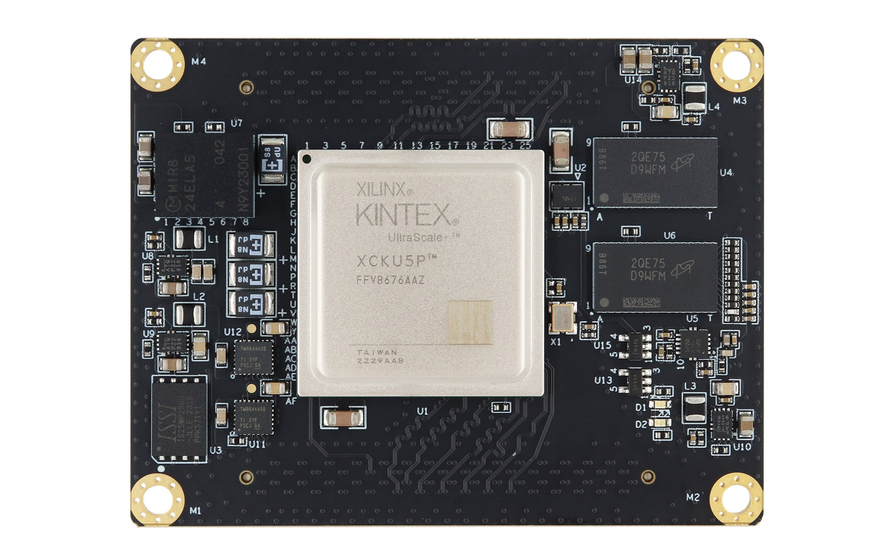
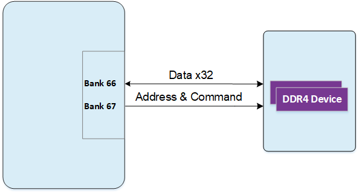
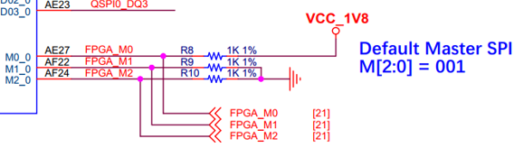
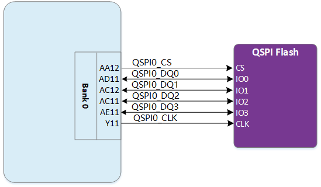

# **XME0835 Reference Manual**

[[中文]](https://microphase-doc.readthedocs.io/zh-cn/latest/SoM/XME0835/XME0835-Reference_Manual.html)

## WeChat Public Number:

## ●1. Overview

The XME0835 is an industrial-grade System on Module (SoM) developed by Microphase Technology based on the Xilinx Kintex UltraScale+ SoC. Customization options are available, subject to minimum order quantity requirements. Please contact our sales team for more information: <sales@microphase.cn>.

This module integrates two 1 GB DDR4 chips, forming a 32-bit data bus with a total capacity of 2 GB. It supports a maximum operating clock frequency of 1333 MHz (data rate 2666 Mbps), meeting system requirements for high-bandwidth data processing. Additionally, the core board includes a 32 MB QSPI flash that serves as a large-capacity storage device for system use.

The core board provides 152 single-ended I/O lines (configurable as 76 pairs of differential I/O):

- HD I/O: 64 single-ended (configurable as 32 pairs of differential), 24 pairs with adjustable voltage
- HP I/O: 88 single-ended (configurable as 44 pairs of differential), all pairs with adjustable voltage

Furthermore, 16 pairs of GTY high-speed differential RX/TX signals are routed to the connector. All traces from FPGA I/O pins to the connector are length-matched differential pairs, designed with 50-ohm single-ended and 100-ohm differential impedance.

### ○ Board Layout

### ○ Key Features

- FPGA: Xilinx XCKU5P-2FFVB676I

- DDR4: 2 GB DDR4 RAM, 32-bit

- Clocks:1 100 MHz single-ended system clock
  
   &ensp;&ensp;&ensp;&ensp;&ensp;&ensp;1 200 MHz differential system clock
  
- Flash: 32 MB

- LEDs: 1 Power LED, 1 FPGA Done LED

- GTY Transceivers: 16 channels

- GPIO:
  - HD I/O: 64 (32 LVDS pairs), 24 adjustable-voltage pairs, 8 × 3.3 V pairs
  - HP I/O: 88 (44 LVDS pairs), all with adjustable voltage levels
  
- Connectors: 2 × 168-pin high-speed board-to-board connectors

### ○ Mechanical Spec

## ●2. Functional Resources

### ○ FPGA

- Logic Cells: 475 K
- Look-Up Tables (LUTs): 217 K
- Flip-Flops: 434 K
- Block RAM: 16.9 Mb
- UltraRAM: 18.0 Mb
- DSP Slices: 1,824

### ○ DDR4

The XME0835 is equipped with two Micron DDR4 SDRAM chips (MT40A512M16LY-062E), each with a capacity of 1 GB, providing a 32-bit data bus. The SDRAM supports an operating clock frequency of up to 1333 MHz (2666 Mbps data rate) and is connected to FPGA I/O banks BANK66 and BANK67.

DDR4 hardware design requires careful attention to signal integrity. Our circuit and PCB layouts incorporate matched series and termination resistors, controlled-impedance routing, and trace length matching to ensure stable high-speed operation.

The connection diagram between the Zynq banks and the DDR4 interface is shown below:

DDR4-to-FPGA pin assignment:

| Signal Name    | Pin  | Signal Name    | Pin  |
| -------------- | ---- | -------------- | ---- |
| PL_DDR4_D0     | C22  | PL_DDR4_DQS_N1 | A18  |
| PL_DDR4_D1     | B24  | PL_DDR4_DQS_P0 | C21  |
| PL_DDR4_D2     | C23  | PL_DDR4_DQS_P1 | A17  |
| PL_DDR4_D3     | A24  | PL_DDR4_DQS_N2 | E20  |
| PL_DDR4_D4     | D21  | PL_DDR4_DQS_N3 | E17  |
| PL_DDR4_D5     | B22  | PL_DDR4_DQS_P2 | F20  |
| PL_DDR4_D6     | E21  | PL_DDR4_DQS_P3 | E16  |
| PL_DDR4_D7     | A25  | PL_DDR4_ODT    | H24  |
| PL_DDR4_D8     | A19  | PL_DDR4_PAR    | J25  |
| PL_DDR4_D9     | C17  | PL_DDR4_NRST   | L25  |
| PL_DDR4_D10    | A20  | PL_DDR4_NWE    | H26  |
| PL_DDR4_D11    | B17  | PL_DDR4_A0     | D25  |
| PL_DDR4_D12    | B20  | PL_DDR4_A1     | D23  |
| PL_DDR4_D13    | A15  | PL_DDR4_A2     | D26  |
| PL_DDR4_D14    | B19  | PL_DDR4_A3     | D24  |
| PL_DDR4_D15    | B15  | PL_DDR4_A4     | E26  |
| PL_DDR4_D16    | F18  | PL_DDR4_A5     | C26  |
| PL_DDR4_D17    | G21  | PL_DDR4_A6     | G22  |
| PL_DDR4_D18    | F19  | PL_DDR4_A7     | B25  |
| PL_DDR4_D19    | D20  | PL_DDR4_A8     | F22  |
| PL_DDR4_D20    | E18  | PL_DDR4_A9     | C24  |
| PL_DDR4_D21    | D19  | PL_DDR4_A10    | E25  |
| PL_DDR4_D22    | G20  | PL_DDR4_A11    | F23  |
| PL_DDR4_D23    | D18  | PL_DDR4_A12    | E23  |
| PL_DDR4_D24    | H17  | PL_DDR4_A13    | B26  |
| PL_DDR4_D25    | D16  | PL_DDR4_NACT   | J26  |
| PL_DDR4_D26    | G16  | PL_DDR4_NALERT | L24  |
| PL_DDR4_D27    | D15  | PL_DDR4_BA0    | H22  |
| PL_DDR4_D28    | E15  | PL_DDR4_BA1    | H21  |
| PL_DDR4_D29    | C16  | PL_DDR4_BG0    | G26  |
| PL_DDR4_D30    | H16  | PL_DDR4_NCAS   | F25  |
| PL_DDR4_D31    | G17  | PL_DDR4_NRAS   | F24  |
| PL_DDR4_DM0    | A22  | PL_DDR4_CKE    | M24  |
| PL_DDR4_DM1    | C18  | PL_DDR4_CKN    | G25  |
| PL_DDR4_DM2    | H18  | PL_DDR4_CKP    | G24  |
| PL_DDR4_DM3    | G15  | PL_DDR4_NCS    | H23  |
| PL_DDR4_DQS_N0 | B21  |                |      |

### ○ JTAG

The JTAG signal link of the XME0835 is connected to the expansion connector.

| Signal   | JM1 Pin | Description    |
| -------- | ------- | -------------- |
| FPGA_TCK | 25      | Input (1.8 V)  |
| FPGA_TDI | 24      | Input (1.8 V)  |
| FPGA_TDO | 21      | Output (1.8 V) |
| FPGA_TMS | 23      | Input (1.8 V)  |

### ○ Boot Configuration

The XME0835 uses MASTER SPI boot mode.

Boot configuration schematic:

### ○ Quad-SPI Flash

The board includes a 32 MB QSPI flash for storing the initial FPGA bitstream, user applications, and data.

| Location | Model           | Capacity | Manufacturer |
| -------- | --------------- | -------- | ------------ |
| U3       | IS25WP256D-JLLE | 32 MB    | ISSI         |

### ○ Clocks

The XME0835 core board provides one 100 MHz single-ended clock and one 200 MHz differential clock.

**100 MHz clock:**

| Signal  | FPGA Pin Name             | Pin Number |
| ------- | ------------------------- | ---------- |
| SYS_CLK | IO_L12P_T1U_N10_GC_66     | J23        |
| EMCCLK  | IO_L24P_T3U_N10_EMCCLK_65 | N21        |

**200 MHz clock:**

| Signal    | FPGA Pin Number | Description                 |
| --------- | --------------- | --------------------------- |
| SYS_CLK_P | K22             | Positive differential input |
| SYS_CLK_N | K23             | Negative differential input |

### ○ Power

Supports a wide input voltage ranging from 8 V to 14 V. A 12 V input is recommended.

### ○ LEDs

The XME0835 board provides two LEDs, the power indicator and the FPGA configuration status light.

### ○ Expansion Ports

The XME0835 uses two high-speed board-to-board connectors to route FPGA signals.

2 × FX10A-168P-SV, 168-pin, 0.5 mm pitch

| Core Connector Model | Carrier Connector Model | Manufacturer | Stack Height |
| -------------------- | ----------------------- | ------------ | ------------ |
| FX10A-168P-SV        | FX10A-168S-SV           | HIROSE       | 4 mm         |

FPGA banks, I/O counts, and board-to-board connector allocation:

| FPGA Bank | Connector | I/O Count | Voltage    | Description                                            |
| --------- | --------- | --------- | ---------- | ------------------------------------------------------ |
| Bank87    | JM1       | 24        | Adjustable | 24 single-ended, configurable as 12 differential pairs |
| Bank86    | JM1       | 24        | Adjustable | 24 single-ended,configurable as 12 differential pairs  |
| Bank84    | JM1       | 16        | 3.3 V      | 16 single-ended, configurable as 8 differential pairs  |
| Bank227   | JM1       | 18        | -          | 1 pair of CLK pair, 4 pairs of TX/RX                   |
| Bank226   | JM1       | 18        | -          | 1pair of  CLK pair, 4 pairs of TX/RX                   |
| Bank65    | JM2       | 40        | Adjustable | 40 single-ended, configurable as 20 differential pairs |
| Bank64    | JM2       | 48        | Adjustable | 48 single-ended, configurable as 24 differential pairs |
| Bank224   | JM2       | 18        | -          | 1 pair of CLK, 4 pairs of TX/RX                        |
| Bank225   | JM2       | 18        | -          | 1 pair of CLK, 4 pairs of TX/RX                        |

**Notes:**

1. JTAG (JM1 Pins 21–25) level is 1.8 V.
2. Bank87 I/O level depends on JM1 Pins 49&50  voltage input, input range 1.2V~3.3V.
3. Bank86 I/O level depends on JM1 Pins 79&80 voltage input, input range 1.2V~3.3V.
4. Bank84 I/O voltage is 3.3 V.
5. Bank65 I/O level depends on JM2 Pins 29&30 voltage input, input range 1.0V~1.8V.
6. Bank64 I/O level depends on JM2 Pins 69&70  voltage input, input range 1.0V~1.8V.
7. Please refer to the ['XME0835 Pinout Table'](https://github.com/MicroPhase/fpga-docs/blob/master/others/XME0835_Pinout_Table.pdf) for detailed pin definitions of the XME0835.  

## ●3. Related Documents

### ○ XME0835

- [XME0835_R10 Schematic ](https://github.com/MicroPhase/fpga-docs/blob/master/schematic/XME0835_R10.pdf)(PDF)
- [XME0835_R10 Dimensions ](https://github.com/MicroPhase/fpga-docs/blob/master/mechanical/XME0835/XME0835_R10_Dimensions.pdf)(PDF)
- [XME0835_R10 Dimensions source file](https://github.com/MicroPhase/fpga-docs/blob/master/mechanical/XME0835/XME0835_R10_Dimensions_source_file.dxf)(DXF)
