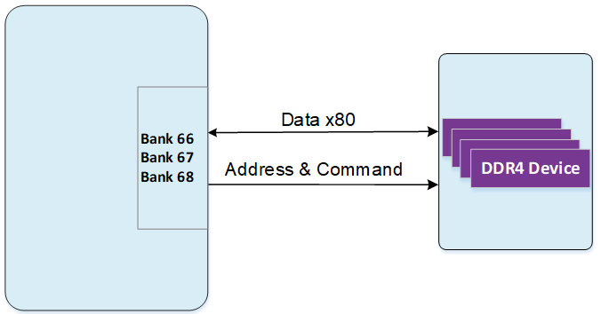

# **XME0835 用户手册**

[[English]](https://microphase-doc.readthedocs.io/en/latest/SoM/XME0835/XME0835-Reference_Manual.html)

## 微信公众号：

## ●1. 概述

XME0835 是微相科技基于 Xilinx Kintex UltraScale+ SoC 推出的工业级系统模块。可根据需求定制，定制需求可能需要满足最小订单量，请联系我们的销售团队获取更多信息：<sales@microphase.cn>。  
该模块集成了 2 片 1GB DDR4，组成 32 位数据总线，容量为 2GB。最高运行时钟速度可达1333MHz(数据速率2666Mbps)，能够满足系统对高带宽数据处理的需求。同时，核心板上集成了1片32MB QSPI FLASH, 在使用中，它可以作为系统大容量的存储设备。  
核心板扩展出152个单端IO（可配置成76对差分IO）；其中HD IO 64个，可配置为32对差分，24对电压可调；HP IO 88个，可配置为44对差分，电压均可调。 同时引出了 16对GTY高速RX/TX差分信号，FPGA Pin到连接器的走线都做了等长差分处理，阻抗单端50欧姆，差分100欧姆。

### ○板卡布局

### ○资源特性

- FPGA：Xilinx XCKU15P- 2FFVB1517I
- DDR4：5GB DDR4 RAM, 80Bit
- 时钟：1 100MHz系统单端时钟
  &ensp;&ensp;&ensp;&ensp;&ensp;&ensp;3 200MHz系统差分时钟
- Flash：2 128MB QSPI Flash
- LED：2个LED, 1个显示配置状态，1个显示电源状态
- 收发器：GTY: 24; GTH: 12
- GPIO：HD IO: 96, 48对LVDS，电压均可调
  &ensp;&ensp;&ensp;&ensp;&ensp;&ensp;&ensp;HP IO: 226, 113对LVDS, 95对电压可调, 18对1.8V
- 连接器：4 x 240pin 高速B2B连接器

   

### ○机械尺寸

## ●2. 功能资源

### ○FPGA

-  逻辑单元Logic Cells:1,143K； 

-  查找表LUTs: 523K 

-  触发器(flip-flops): 1,045K 

-  Block RAM：34.6Mb；

-  UltraRAM：36.0Mb；

-  DSP Slices：1,968

### ○DDR4

XME0835板载了五片镁光的DDR4，每片1GB, 组成数据位宽为80位，使用DDR4型号: MT40A512M16LY-062E。DDR4 SDRAM的最高运行时钟速度可达1333MHz(数据速率2666Mbps)， DDR4芯片连接到BANK66、67、68存储器接口上。

DDR4的硬件设计需要严格考虑信号完整性，我们在电路设计和PCB设计的时候已经充分考虑了匹配电阻/终端电阻，走线阻抗控制，走线等长控制，保证DDR4的高速稳定的工作。

ZYNQ Bank66、67、68与DDR4硬件连接示意图如下图所示

​                               

DDR4与FPGA连接分配表如下：

| 信号名称    | 引脚号 | 信号名称         | 引脚号 |
| ----------- | ------ | ---------------- | ------ |
| DDR4_C1_D0  | AW25   | DDR4_C1_D71      | AN33   |
| DDR4_C1_D1  | AW26   | DDR4_C1_D72      | AJ29   |
| DDR4_C1_D2  | AU23   | DDR4_C1_D73      | AJ30   |
| DDR4_C1_D3  | AV23   | DDR4_C1_D74      | AH31   |
| DDR4_C1_D4  | AT24   | DDR4_C1_D75      | AH32   |
| DDR4_C1_D5  | AU24   | DDR4_C1_D76      | AK32   |
| DDR4_C1_D6  | AV26   | DDR4_C1_D77      | AL32   |
| DDR4_C1_D7  | AV27   | DDR4_C1_D78      | AM32   |
| DDR4_C1_D8  | AT25   | DDR4_C1_D79      | AM33   |
| DDR4_C1_D9  | AT26   | DDR4_C1_DM0      | AW23   |
| DDR4_C1_D10 | AN23   | DDR4_C1_DM1      | AR23   |
| DDR4_C1_D11 | AP23   | DDR4_C1_DM2      | AM23   |
| DDR4_C1_D12 | AP24   | DDR4_C1_DM3      | AL25   |
| DDR4_C1_D13 | AP25   | DDR4_C1_DM4      | AU28   |
| DDR4_C1_D14 | AN25   | DDR4_C1_DM5      | AV35   |
| DDR4_C1_D15 | AP26   | DDR4_C1_DM6      | AR34   |
| DDR4_C1_D16 | AL24   | DDR4_C1_DM7      | AR37   |
| DDR4_C1_D17 | AM25   | DDR4_C1_DM8      | AM28   |
| DDR4_C1_D18 | AK22   | DDR4_C1_DM9      | AH30   |
| DDR4_C1_D19 | AK23   | DDR4_C1_DQS_N0   | AV25   |
| DDR4_C1_D20 | AH23   | DDR4_C1_DQS_N1   | AR27   |
| DDR4_C1_D21 | AJ23   | DDR4_C1_DQS_P0   | AU25   |
| DDR4_C1_D22 | AJ24   | DDR4_C1_DQS_P1   | AR26   |
| DDR4_C1_D23 | AK24   | DDR4_C1_DQS2_N   | AJ25   |
| DDR4_C1_D24 | AJ28   | DDR4_C1_DQS2_P   | AH25   |
| DDR4_C1_D25 | AK28   | DDR4_C1_DQS3_N   | AH27   |
| DDR4_C1_D26 | AJ26   | DDR4_C1_DQS3_P   | AH26   |
| DDR4_C1_D27 | AK26   | DDR4_C1_DQS4_N   | AW30   |
| DDR4_C1_D28 | AN26   | DDR4_C1_DQS4_P   | AV30   |
| DDR4_C1_D29 | AN27   | DDR4_C1_DQS5_N   | AV33   |
| DDR4_C1_D30 | AK27   | DDR4_C1_DQS5_P   | AV32   |
| DDR4_C1_D31 | AL27   | DDR4_C1_DQS6_N   | AP35   |
| DDR4_C1_D32 | AT30   | DDR4_C1_DQS6_P   | AP34   |
| DDR4_C1_D33 | AU30   | DDR4_C1_DQS7_N   | AV38   |
| DDR4_C1_D34 | AW28   | DDR4_C1_DQS7_P   | AU38   |
| DDR4_C1_D35 | AW29   | DDR4_C1_DQS8_N   | AN31   |
| DDR4_C1_D36 | AT29   | DDR4_C1_DQS8_P   | AN30   |
| DDR4_C1_D37 | AU29   | DDR4_C1_DQS9_N   | AL31   |
| DDR4_C1_D38 | AV31   | DDR4_C1_DQS9_P   | AK31   |
| DDR4_C1_D39 | AW31   | DDR4_C1_ODT      | AJ31   |
| DDR4_C1_D40 | AW34   | DDR4_C1_PAR      | AN28   |
| DDR4_C1_D41 | AW35   | DDR4_C1_A16_NRAS | AL35   |
| DDR4_C1_D42 | AT35   | DDR4_C1_NRST     | AV28   |
| DDR4_C1_D43 | AT36   | DDR4_C1_A14_NWE  | AM35   |
| DDR4_C1_D44 | AU32   | DDR4_C1_A0       | AK36   |
| DDR4_C1_D45 | AU33   | DDR4_C1_A1       | AK39   |
| DDR4_C1_D46 | AU34   | DDR4_C1_A2       | AJ39   |
| DDR4_C1_D47 | AU35   | DDR4_C1_A3       | AL37   |
| DDR4_C1_D48 | AR32   | DDR4_C1_A4       | AL36   |
| DDR4_C1_D49 | AT32   | DDR4_C1_A5       | AK38   |
| DDR4_C1_D50 | AR31   | DDR4_C1_A6       | AK37   |
| DDR4_C1_D51 | AT31   | DDR4_C1_A7       | AN38   |
| DDR4_C1_D52 | AP33   | DDR4_C1_A8       | AM38   |
| DDR4_C1_D53 | AR33   | DDR4_C1_A9       | AM39   |
| DDR4_C1_D54 | AP36   | DDR4_C1_A10      | AL39   |
| DDR4_C1_D55 | AR36   | DDR4_C1_A11      | AN37   |
| DDR4_C1_D56 | AU37   | DDR4_C1_A12      | AM37   |
| DDR4_C1_D57 | AV37   | DDR4_C1_A13      | AH34   |
| DDR4_C1_D58 | AR38   | DDR4_C1_NACT     | AM34   |
| DDR4_C1_D59 | AR39   | DDR4_C1_NALERT   | AW24   |
| DDR4_C1_D60 | AP38   | DDR4_C1_BA0      | AH33   |
| DDR4_C1_D61 | AP39   | DDR4_C1_BA1      | AK35   |
| DDR4_C1_D62 | AT39   | DDR4_C1_BG0      | AJ34   |
| DDR4_C1_D63 | AU39   | DDR4_C1_A15_NCAS | AJ33   |
| DDR4_C1_D64 | AL30   | DDR4_C1_CKE      | AK29   |
| DDR4_C1_D65 | AM30   | DDR4_C1_CKN      | AN36   |
| DDR4_C1_D66 | AP28   | DDR4_C1_CKP      | AN35   |
| DDR4_C1_D67 | AP29   | 200M_CLK1_N      | AK34   |
| DDR4_C1_D68 | AL29   | 200M_CLK1_P      | AK33   |
| DDR4_C1_D69 | AM29   | DDR4_C1_NCS      | AL34   |
| DDR4_C1_D70 | AN32   |                  |        |

### ○JTAG

XME0835 的 JTAG 信号链路连接到扩展连接器。

| 信号     | JM1 引脚号 | 说明         |
| -------- | ---------- | ------------ |
| FPGA_TCK | A4         | 输入（1.8V） |
| FPGA_TDI | A3         | 输入（1.8V） |
| FPGA_TDO | A2         | 输出（1.8V） |
| FPGA_TMS | A1         | 输出（1.8V） |

### ○启动配置

XME0835启动模式为MASTER SPI。

XME0835的启动方式配置原理图如下图所示:

### ○Quad-SPI 闪存

板载 2片128MB QSPI Flash用于存储初始 FPGA 配置和用户应用程序及数据。  

| 位置 | 型号                  | 容量  | 厂商    |
| ---- | --------------------- | ----- | ------- |
| U2   | MT25QU01GBBB8E12-0SIT | 256MB | Winbond |
| U3   | MT25QU01GBBB8E12-0SIT | 256MB | Winbond |

QSPI与FPGA管脚连接分配表

| Signal  Name | FPGA  Pin | Pin  Name                      |
| ------------ | --------- | ------------------------------ |
| QSPI_CLK     | AD23      | CCLK_0                         |
| QSPI0_CS_B   | AG22      | RDWR_FCS_B_0                   |
| QSPI0_DQ0    | AD25      | D00_MOSI_0                     |
| QSPI0_DQ1    | AD26      | D01_DIN_0                      |
| QSPI0_DQ2    | AE22      | D02_0                          |
| QSPI0_DQ3    | AE23      | D03_0                          |
| QSPI1_CS_B   | AV11      | IO_L2N_T0L_N3_FWE_FCS2_B_65    |
| QSPI1_DQ0    | AM12      | IO_L22P_T3U_N6_DBC_AD0P_D04_65 |
| QSPI1_DQ1    | AN12      | IO_L22N_T3U_N7_DBC_AD0N_D05_65 |
| QSPI1_DQ2    | AR13      | IO_L21P_T3L_N4_AD8P_D06_65     |
| QSPI1_DQ3    | AR12      | IO_L21N_T3L_N5_AD8N_D07_65     |

### ○时钟

XME0835核心板分别提供了1路100MHz单端时钟和3路200MHz差分时钟。

XME0835核心板上提供了1路100MHz单端时钟，时钟的输入连接到芯片的BANK65的BANK65的AM14管脚上。

时钟输入分配如下表所示：

| 信号名 | FPGA  Pin Name            | Pin  Num |
| ------ | ------------------------- | -------- |
| EMCCLK | IO_L24P_T3U_N10_EMCCLK_65 | AM14     |

XME0835核心板上提供了3路200MHz差分时钟，用于为FPGA逻辑以及DDR4控制器提供参考时钟。三路时钟分别连接在BANK65、68、71的全局时钟上。

200MHz时钟输入分配如下表所示：

| 信号名      | FPGA Pin Num. | 描述         |
| ----------- | ------------- | ------------ |
| 200M_CLK0_P | AL15          | 差分信号正极 |
| 200M_CLK0_N | AL14          | 差分信号负极 |
| 200M_CLK1_P | AK33          | 差分信号正极 |
| 200M_CLK1_N | AK34          | 差分信号负极 |
| 200M_CLK2_P | F19           | 差分信号正极 |
| 200M_CLK2_N | F18           | 差分信号负极 |

### ○电源

支持宽电源输入(5V~15V)，推荐设计使用电源输入+12V。

### ○LED

XME0835核心板上有两个LED灯。其中一个是电源指示灯，为红色。另一个为配置LED灯，为绿色。核心板上电时D1、D2会亮起，当板卡配置完成后D2会熄灭。

### ○扩展端口

XME0835使用了四个高速连接器来引出FPGA的信号。

4 x ADF6-60-03.5-L-4-2-FR，168Pin，0.64mm间距

 | 核心板连接器型号      | 底板连接器型号          | 厂商   | 合高 |
   | --------------------- | ----------------------- | ------ | ---- |
   | ADF6-60-03.5-L-4-2-FR | ADM6-60-01.5-L-4-2-A-FR | SAMTEC | 5mm  |

FPGA Bank，IO数量与B2B连接器的关系表

   | FPGA  Bank | B2B  Connector | IO数量 | 电压 | 说明                    |
   | ---------- | -------------- | ------ | ---- | ----------------------- |
   | Bank64     | JM1            | 48     | 可调 | 48个单端,可配成24对差分 |
   | Bank132    | JM1            | 18     | -    | 1对CLK, 4对TX和RX       |
   | Bank131    | JM1            | 18     | -    | 1对CLK, 4对TX和RX       |
   | Bank130    | JM1            | 18     | -    | 1对CLK,4对TX和RX        |
   | Bank129    | JM1            | 18     | -    | 1对CLK,4对TX和RX        |
   | Bank128    | JM1            | 18     | -    | 1对CLK,4对TX和RX        |
   | Bank127    | JM1            | 18     | -    | 1对CLK,4对TX和RX        |
   | Bank65     | JM2            | 36     | 1.8V | 36个单端,可配成18对差分 |
   | Bank231    | JM2            | 18     | -    | 1对CLK,4对TX和RX        |
   | Bank230    | JM2            | 18     | -    | 1对CLK,4对TX和RX        |
   | Bank229    | JM2            | 18     | -    | 1对CLK,4对TX和RX        |
   | Bank90     | JM3            | 24     | 可调 | 36个单端,可配成18对差分 |
   | Bank91     | JM3            | 24     | 可调 | 36个单端,可配成18对差分 |
   | Bank228    | JM3            | 18     | -    | 1对CLK,4对TX和RX        |
   | Bank227    | JM3            | 18     | -    | 1对CLK,4对TX和RX        |
   | Bank226    | JM3            | 18     | -    | 1对CLK,4对TX和RX        |
   | Bank225    | JM3            | 18     | -    | 1对CLK,4对TX和RX        |
   | Bank224    | JM3            | 18     | -    | 1对CLK,4对TX和RX        |
   | Bank69     | JM4            | 48     | 可调 | 36个单端,可配成18对差分 |
   | Bank70     | JM4            | 48     | 可调 | 36个单端,可配成18对差分 |
   | Bank71     | JM4            | 46     | 可调 | 36个单端,可配成18对差分 |
   | Bank93     | JM4            | 48     | 可调 | 36个单端,可配成18对差分 |

说明：

   1. Bank64 IO电平取决于JM1 A50电压输入，输入范围1.0-1.8V
   2. Bank65 IO, JTAG(JM1 A1-A4)电平为1.8V
   3. Bank90、91 IO电平取决于JM3 A10电压输入，输入范围1.2-3.3V
   4. Bank69电平取决于JM4 A10电压输入，输入范围1.0-1.8V
   5. Bank70电平取决于JM4 A20电压输入，输入范围1.0-1.8V
   6. Bank71电平取决于JM4 A40电压输入，输入范围1.0-1.8V
   7. Bank93、94电平取决于JM4 A50电压输入，输入范围1.2-3.3V
   8. XME0835的管脚详细定义请查看《XME0835_Pinout Table》文档

## ●3. 相关文档  

### ○XME0835  

- XME0835_R10 Schematic(PDF)
- XME0835_R10 Dimensions(PDF)  
- XME0835_R10 Dimensions Source File (DXF)  
