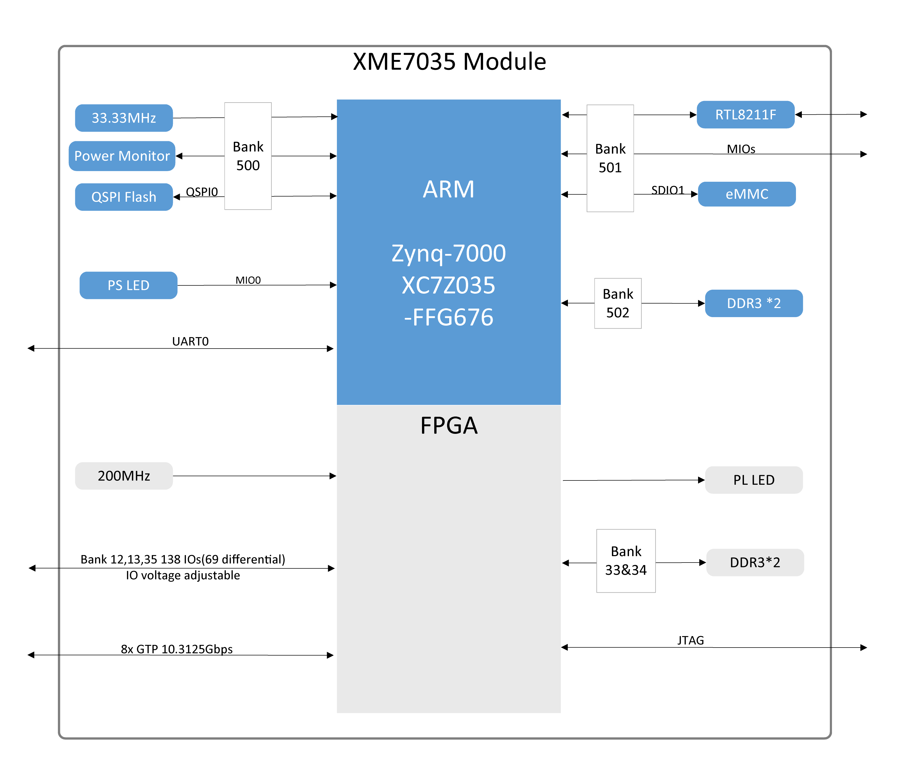
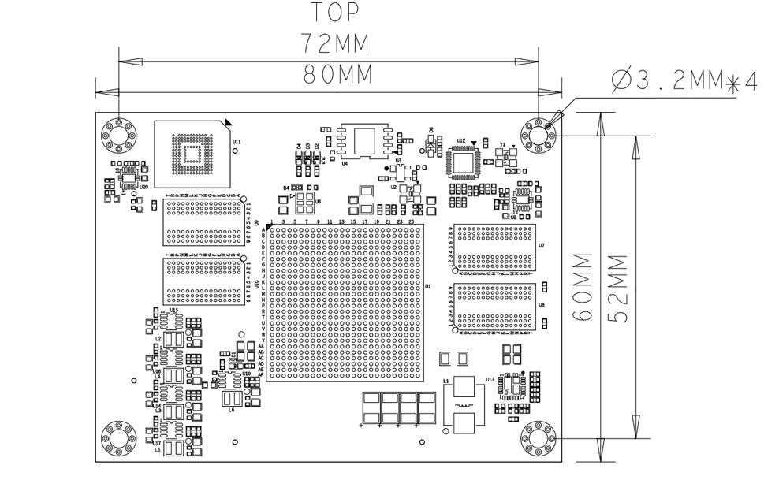

- # **XME7035 参考手册**

  ## 开发环境：

  赛灵思Vivado 2021.1

  <https://www.xilinx.com>

  ## 微信公众号：

  

  ## ●1. 概述

  XME7035 是微相科技基于 Xilinx Zynq-SoC 的工业级系统模块。可根据需求定制，定制需求可能需要满足最小订单量，请联系我们的销售团队获取更多信息：<sales@microphase.cn>。  
  该模块集成了 4 个 DDR3 SDRAM 芯片，其中两个形成一个 32 位数据总线，容量为 8Gbit。PS与 DDR3 之间的数据读写时钟频率最高可达 533MHz，PL与 DDR3 之间的数据读写时钟频率最高可达 800MHz，能够满足系统对高带宽数据处理的需求。同时，核心板上集成了 REALTEK RTL8211F 千兆以太网 PHY 芯片，用户可以轻松实现以太网相关应用。  
  核心板有 138 个单端 IO（可配置为 69 对差分对），IO 电压均可调，8 对 GTX 高速 RX/TX 对，FPGA Pin到连接器的走线都做了等长差分处理，阻抗单端50欧姆，差分100欧姆。

  ### ○板卡布局

  

  ### ○主要特性

  - Xilinx Zynq™ XC7Z035-FFG676 Soc  
  - DDR3：PS 8Gbit DDR3 RAM，32 位；  
    &ensp;&ensp;&ensp;&ensp;&ensp;&ensp;PL 8Gbit DDR3 RAM，32 位  
  - 闪存：256Mbit QSPI 闪存，8GB eMMC 闪存。  
  - LED：1 个电源 LED，1个FPGA 配置状态指示灯；  
    &ensp;&ensp;&ensp;&ensp;&ensp;2 个用户 LED，1 个由 PS 控制，1 个由 PL 控制。  
  - GTX：8  
  - MIO：21 个 MIO，3 个 IO 为 3.3V，18 个 IO 为 1.8V  
  - PL GPIO：138 个，电压均可调，46HP BANK，92 HR BANK，  
    &ensp;&ensp;&ensp;&ensp;&ensp;&ensp;&ensp;&ensp;&ensp;共可配置为 69 对差分对  
  - 连接器：3 x 120pin 高速 B2B 连接器  

  ### ○框图

  

  ### ○机械尺寸

  

  ## ●2. 硬件资源

### ○FPGA

  - Up to 1GHz MHz dual-core Cortex-A9 processor

  - DDR3L memory controller with 8 DMA channels and 4

  - High Performance AXI3 Slave ports

  - High-bandwidth peripheral controllers: 1G Ethernet, USB 2.0, SDIO

  - Low-bandwidth peripheral controllers: SPI, UART, CAN, I2C

  - Programmable from JTAG, Quad-SPI flash, and microSD card

  - Programmable logic equivalent to Kintex-7 FPGA

    LUTs: 171,900

    DSP Slices: 900

    Logic Cells: 275K

    Flip-Flops: 343,800

    Total Block RAM: 17.6Mb

  - Analog Mixed Signal (AMS) / XADC: 2x 12 bit, MSPS ADCs with up to 17 Differential Inputs

  - Security: AES & SHA 256b Decryption & Authentication for Secure Programmable Logic Configs  

  ### ○DDR3

  模块的 PS 有两个 16 位 DDR3 内存芯片，单个芯片容量为 512MB，两个芯片容量为 1GB。

  | 信号名称      | 引脚号 | 信号名称       | 引脚号 |
  | ------------- | ------ | -------------- | ------ |
  | PS_DDR3_A0    | K22    | PS_DDR3_D9     | L23    |
  | PS_DDR3_A1    | K20    | PS_DDR3_D10    | M26    |
  | PS_DDR3_A2    | N21    | PS_DDR3_D11    | K23    |
  | PS_DDR3_A3    | L22    | PS_DDR3_D12    | M25    |
  | PS_DDR3_A4    | M20    | PS_DDR3_D13    | N24    |
  | PS_DDR3_A5    | N22    | PS_DDR3_D14    | M24    |
  | PS_DDR3_A6    | L20    | PS_DDR3_D15    | N23    |
  | PS_DDR3_A7    | J21    | PS_DDR3_D16    | R26    |
  | PS_DDR3_A8    | T20    | PS_DDR3_D17    | P24    |
  | PS_DDR3_A9    | U20    | PS_DDR3_D18    | N26    |
  | PS_DDR3_A10   | M22    | PS_DDR3_D19    | P23    |
  | PS_DDR3_A11   | H21    | PS_DDR3_D20    | T24    |
  | PS_DDR3_A12   | P20    | PS_DDR3_D21    | T25    |
  | PS_DDR3_A13   | J20    | PS_DDR3_D22    | T23    |
  | PS_DDR3_A14   | R20    | PS_DDR3_D23    | R23    |
  | PS_DDR3_BA0   | U22    | PS_DDR3_D24    | V24    |
  | PS_DDR3_BA1   | T22    | PS_DDR3_D25    | U26    |
  | PS_DDR3_BA2   | R22    | PS_DDR3_D26    | U24    |
  | PS_DDR3_NCAS  | Y23    | PS_DDR3_D27    | U25    |
  | PS_DDR3_CKE   | U21    | PS_DDR3_D28    | W26    |
  | PS_DDR3_CLK_N | P21    | PS_DDR3_D29    | Y25    |
  | PS_DDR3_CLK_P | R21    | PS_DDR3_D30    | Y26    |
  | PS_DDR3_NCS   | Y21    | PS_DDR3_D31    | W23    |
  | PS_DDR3_DM0   | G24    | PS_DDR3_DQS_N0 | G25    |
  | PS_DDR3_DM1   | K25    | PS_DDR3_DQS_N1 | L25    |
  | PS_DDR3_DM2   | P26    | PS_DDR3_DQS_N2 | R25    |
  | PS_DDR3_DM3   | V26    | PS_DDR3_DQS_N3 | W25    |
  | PS_DDR3_D0    | J26    | PS_DDR3_DQS_P0 | H24    |
  | PS_DDR3_D1    | F25    | PS_DDR3_DQS_P1 | L24    |
  | PS_DDR3_D2    | J25    | PS_DDR3_DQS_P2 | P25    |
  | PS_DDR3_D3    | G26    | PS_DDR3_DQS_P3 | W24    |
  | PS_DDR3_D4    | H26    | PS_DDR3_NRST   | H22    |
  | PS_DDR3_D5    | H23    | PS_DDR3_ODT    | Y22    |
  | PS_DDR3_D6    | J24    | PS_DDR3_NRAS   | V23    |
  | PS_DDR3_D7    | J23    | PS_DDR3_nWE    | V22    |
  | PS_DDR3_D8    | K26    |                |        |

  模块的 PL 有两个 16 位 DDR3 内存芯片，单个芯片容量为 512MB，两个芯片容量为 1GB。  

  | 信号名称      | 引脚号 | 信号名称       | 引脚号 |
  | ------------- | ------ | -------------- | ------ |
  | PL_DDR3_A0    | E5     | PL_DDR3_D9     | J1     |
  | PL_DDR3_A1    | A8     | PL_DDR3_D10    | H1     |
  | PL_DDR3_A2    | E6     | PL_DDR3_D11    | H3     |
  | PL_DDR3_A3    | B6     | PL_DDR3_D12    | H4     |
  | PL_DDR3_A4    | A7     | PL_DDR3_D13    | G1     |
  | PL_DDR3_A5    | A3     | PL_DDR3_D14    | L3     |
  | PL_DDR3_A6    | B7     | PL_DDR3_D15    | H2     |
  | PL_DDR3_A7    | B4     | PL_DDR3_D16    | M4     |
  | PL_DDR3_A8    | A9     | PL_DDR3_D17    | L4     |
  | PL_DDR3_A9    | E8     | PL_DDR3_D18    | N4     |
  | PL_DDR3_A10   | D9     | PL_DDR3_D19    | L5     |
  | PL_DDR3_A11   | A10    | PL_DDR3_D20    | M2     |
  | PL_DDR3_A12   | C2     | PL_DDR3_D21    | L2     |
  | PL_DDR3_A13   | B10    | PL_DDR3_D22    | M6     |
  | PL_DDR3_A14   | D8     | PL_DDR3_D23    | M5     |
  | PL_DDR3_BA0   | B1     | PL_DDR3_D24    | J5     |
  | PL_DDR3_BA1   | C6     | PL_DDR3_D25    | J6     |
  | PL_DDR3_BA2   | F5     | PL_DDR3_D26    | N6     |
  | PL_DDR3_NCAS  | C9     | PL_DDR3_D27    | M7     |
  | PL_DDR3_CKE   | F9     | PL_DDR3_D28    | K6     |
  | PL_DDR3_CLK_N | F7     | PL_DDR3_D29    | N7     |
  | PL_DDR3_CLK_P | G7     | PL_DDR3_D30    | K8     |
  | PL_DDR3_NCS   | A4     | PL_DDR3_D31    | K5     |
  | PL_DDR3_DM0   | E2     | PL_DDR3_DQS_N0 | F2     |
  | PL_DDR3_DM1   | J4     | PL_DDR3_DQS_N1 | K1     |
  | PL_DDR3_DM2   | N1     | PL_DDR3_DQS_N2 | N2     |
  | PL_DDR3_DM3   | K7     | PL_DDR3_DQS_N3 | L8     |
  | PL_DDR3_D0    | E1     | PL_DDR3_DQS_P0 | G2     |
  | PL_DDR3_D1    | G4     | PL_DDR3_DQS_P1 | K2     |
  | PL_DDR3_D2    | F4     | PL_DDR3_DQS_P2 | N3     |
  | PL_DDR3_D3    | F3     | PL_DDR3_DQS_P3 | M8     |
  | PL_DDR3_D4    | D4     | PL_DDR3_NRST   | B5     |
  | PL_DDR3_D5    | C1     | PL_DDR3_ODT    | A5     |
  | PL_DDR3_D6    | D1     | PL_DDR3_NRAS   | B9     |
  | PL_DDR3_D7    | D3     | PL_DDR3_NWE    | B2     |
  | PL_DDR3_D8    | K3     |                |        |

  ### ○千兆以太网

RTL8211F 芯片支持 10/100/1000M 网络传输速率，并通过 RGMII 接口与 Zynq7000 PS 系统的 MAC 层进行通信。它支持 MDI/MDX 自适应、多种速率自适应、主/从模式自适应，并支持通过 MDIO 总线进行 PHY 寄存器管理。

  ### ○eMMC

该模块具有 8GB eMMC 接口（PS_SDIO0），可用于系统文件或其他数据文件的存储。它还可以与 QSPI 闪存一起用作系统启动的辅助启动设备。接口信号连接到 PS BANK501 MIO[46-51]。  

  | 信号名称  | 引脚号 |
  | --------- | ------ |
  | MMC_CLK   | B21    |
  | MMC_CMD   | B19    |
  | MMC_DATA0 | E17    |
  | MMC_DATA1 | A18    |
  | MMC_DATA2 | B22    |
  | MMC_DATA3 | B20    |

  ### ○JTAG

  XME7035 的 JTAG 信号链路连接到扩展连接器。

  | 信号     | JM1 引脚号 | 说明         |
  | -------- | ---------- | ------------ |
  | FPGA_TCK | Pin23      | 输入（3.3V） |
  | FPGA_TDI | Pin25      | 输入（3.3V） |
  | FPGA_TDO | Pin27      | 输出（3.3V） |
  | FPGA_TMS | Pin29      | 输出（3.3V） |

  ### ○启动配置

  通过配置核心模块引脚 PIN119（MODE0）、PIN120（MODE1）来设置 ZYNQ 启动模式，核心模块 ZYNQ 配置原理图如下所示。  

  

  | 模式 | MODE1（JM1 PIN19） | MODE0（JM1 PIN17） |
  | ---- | ------------------ | ------------------ |
  | JTAG | 连接到 GND         | 连接到 GND         |
  | QSPI | NC                 | 连接到 GND         |
  | SD   | NC                 | NC                 |

  ### ○Quad-SPI 闪存

  板载 256M Quad-SPI 闪存 W25Q256FVEI 用于存储初始 FPGA 配置和用户应用程序及数据。  

  | 位置 | 型号        | 容量  | 厂商    |
  | ---- | ----------- | ----- | ------- |
  | U4   | W25Q256FVEI | 256MB | Winbond |

  ### ○时钟

  XME7035 核心板为 PS 系统提供 33.3MHz 有源时钟，为 PL 系统提供 200MHz 有源时钟。  

  | 位置 | 信号名称    | 频率      | 引脚号 |
  | ---- | ----------- | --------- | ------ |
  | U2   | PS_CLK_33d3 | 33.333MHz | B24    |
  | U6   | SYS_CLK_P   | 200MHz    | C8     |
  | U6   | SYS_CLK_N   | 200MHz    | C7     |

  ### ○电源

**请注意，XME0726 的电源输入为 +5V。我们建议使用 5V/2A 电源。**

模块上电顺序为：1.0V -> 1.8V -> 1.5V -> 3.3V。3.3V 输出将最后上电，同时提供系统电源状态PG信号。

  ### ○LED

  XME7035 板提供四个 LED，电源指示灯、FPGA 配置状态指示灯、PL 控制的用户 LED 和 PS 用户控制的 LED。  
  LED 信号如下表所述。    

| LED  | ZYNQ 引脚 | 说明                                       |
| ---- | --------- | ------------------------------------------ |
| D4   | --        | 电源 LED                                   |
| D1   | W9        | FPGA 配置状态 LED，FPGA 成功配置后点亮     |
| D2   | G14       | 当 FPGA E26（MIO0）输出为低电平时 LED 亮起 |
| D3   | H16       | 当 FPGA H16 输出为低电平时 LED 亮起        |

  ### ○扩展端口

  XME7035 使用三组连接器 JM1、JM3 和 JM4 用于拓展 FPGA IO 信号和以太网接口信号。  
  3 x AXK5A2137YG，120Pin，0.5mm 间距    

  | 核心板连接器型号 | 底板连接器型号 | 制造商    | 配对高度 |
  | ---------------- | -------------- | --------- | -------- |
  | AXK5A2137YG      | AXK6A2337YG    | Panasonic | 3mm      |

  FPGA Bank、IO 数量与 B2B 连接器表   

  | FPGA Bank | B2B 连接器 | IO 数量 | 电压 | 说明                            |
  | --------- | ---------- | ------- | ---- | ------------------------------- |
  | Bank500   | JM1        | 3       | 3.3V |                                 |
  | BANK501   | JM1        | 18      | 1.8V |                                 |
  | Bank35    | JM1        | 44      | 可调 | 44 个单端，可配对为 22 对差分对 |
  | Bank12    | JM3        | 44      | 可调 | 44 个单端，可配对为 22 对差分对 |
  | Bank13    | JM3        | 44      | 可调 | 44 个单端，可配对为 22 对差分对 |
  | BANK111   | JM4        | 20      | -    | 2 对 CLK，4 对 TX 和 RX         |
  | BANK112   | JM4        | 20      | -    | 2 对 CLK，4 对 TX 和 RX         |

  说明：  

  1. Bank35 IO 电平取决于 JM1 Pin29&30 电压输入，输入范围 1.2V-1.8V。
  2. Bank12 IO 电平取决于 JM3 Pin29&30 电压输入，输入范围 1.2V-3.3V。
  3. Bank13 IO 电平取决于 JM3 Pin89&90 电压输入，输入范围 1.2V-3.3V。
  4. MIO8、MIO14 和 MIO15（JM1 Pin20、55、57），JTAG、RESET（JM1 Pin18、Pin23-Pin29）电平为 3.3V。
  5. MIO28~MIO45（JM1 Pin24、26、28···-Pin108）电平为 1.8V。
  6. 请参阅 <[XME7035_Pinout Table](https://github.com/MicroPhase/fpga-docs/blob/master/others/XME7035_Pinout_Table.pdf)> 获取 XME7035 的详细引脚定义。  

  ## ●3. 相关文档  

  ### ○XME7035  

  - [XME7035_R12 原理图](https://github.com/MicroPhase/fpga-docs/blob/master/schematic/XME7035_R12.pdf) (PDF)
  - [XME7035_R12 尺寸](https://github.com/MicroPhase/fpga-docs/blob/master/mechanical/XME7035/XME7035_R12_Dimensions.pdf) (PDF)  
  - [XME7035_R12 尺寸源文件](https://github.com/MicroPhase/fpga-docs/blob/master/mechanical/XME7035/XME7035_R12_Dimensions_source_file.dxf) (DXF)  

  ### ○PE500    
  - [PE500 用户手册](https://documentation-of-microphase-fpga-board.readthedocs.io/en/latest/CARRIER_BOARD/PE500/PE500-Reference_Manual.html)(HTML)
  - [PE500_R10 原理图](https://github.com/MicroPhase/fpga-docs/blob/master/schematic/PE500_R10.pdf)(PDF)
  - [PE500_R10 尺寸](https://github.com/MicroPhase/fpga-docs/blob/master/mechanical/PE500/PE500_R10_Dimensions.pdf)(PDF)
  - [PE500_R10 板源文件](https://github.com/MicroPhase/fpga-docs/blob/master/others/PE500_R10_Board_source_file.brd)(Brd)