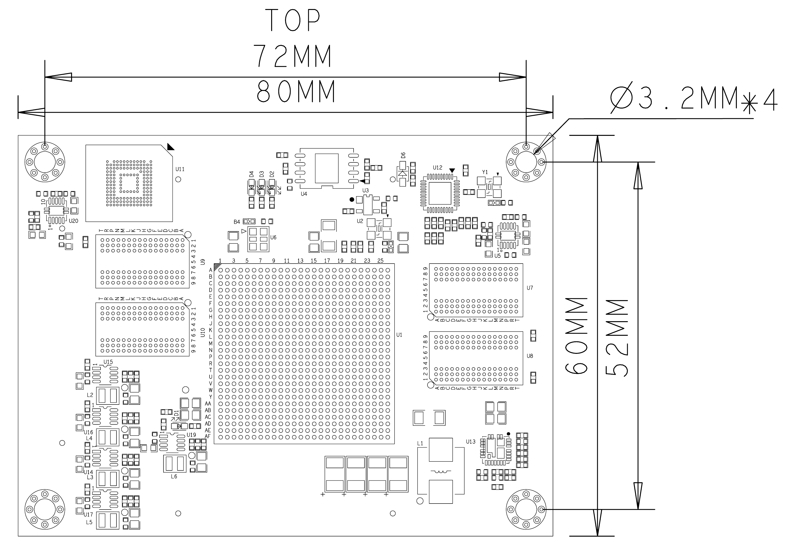
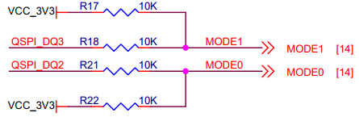

# **XME7100 Reference Manual**

## Revision History

| Revision | Time       | Description   |
| :------- | :--------- | :------------ |
| Rev. 1.0 | 2025.01.08 | First Release |
|          |            |               |

## CopyRight Notice:

Copyright ©2025 by MicroPhase Technologies (Shanghai) Co. Ltd. All rights are reserved.

## Development Environment:

Vivado 2021.1 is from Xilinx website

<https://www.xilinx.com>

## WeChat Public Number:

## ●1. Overview

XME7100 is a industrial-grade system module based on Xilinx Zynq-SoC from Microphase Technology. With customizable variants available upon request, customised requirements may be subject to minimum order quantities,  please contact our sales team for more information: [sales@microphase.cn](sales@microphase.cn).  
It integrates 4 DDR3 SDRAM chips, with two forming a 32-bit data bus and 8Gbit capacity. The read/write data clock frequency between the PS(Processing System) and the DDR3 is up to 533MHz, and the read/write data clock frequency between the PL(Programmable Logic) and the DDR3 is up to 800MHz, which can satisfy the system's demand for high-bandwidth data processing. At the same time, a REALTEK RTL8211F Gigabit Ethernet PHY chip is integrated on the core board, which can be easily used by users to realised Ethernet related applications.  
The core board features 230 single-ended IOs (configurable as 115 differential pairs), adjustable IO voltages, 8 GTX high-speed RX/TX pairs, and equal-length differential alignments with 50-ohm single-ended and 100-ohm differential impedance.

### ○Board Layout

### ○Key Features

- Xilinx Zynq™ XC7Z100-2FFG900I Soc  
- DDR3: PS 8Gbit DDR3 RAM, 32Bit;  
&ensp;&ensp;&ensp;&ensp;&ensp;&ensp;PL 8Gbit DDR3 RAM, 32Bit  
- Flash: Flash: 512Mbit QSPI Flash, 8GB eMMC Flash.  
- LED: 1 Power LED, 1 FPGA Done LED  
- GTX: 16
- MIO: 21 MIOs, 3 IO at 3.3V, 18 IOs at 1.8V  
- PL GPIO: 230, Adjustable Voltage, 46 for HP BANK, 184 for HR BANK,  
&ensp;&ensp;&ensp;&ensp;&ensp;&ensp;&ensp;&ensp;&ensp;Can be configured as 115 differential pairs  
- Connectors: 4 x 120pin High Speed B2B Connectors  

### ○Mechanical Spec  

## ●2. Function Resources  

### ○FPGA  

- Up to 1GHz MHz dual-core Cortex-A9 processor

- DDR3L memory controller with 8 DMA channels and 4

- High Performance AXI3 Slave ports

- High-bandwidth peripheral controllers: 1G Ethernet, USB 2.0, SDIO

- Low-bandwidth peripheral controllers: SPI, UART, CAN, I2C

- Programmable from JTAG, Quad-SPI flash, and microSD card

- Programmable logic equivalent to Kintex-7 FPGA

  LUTs: 277,400

  DSP Slices: 2,020

  Logic Cells: 444K

  Flip-Flops: 554,800

  Total Block RAM: 26.5Mb

- Analog Mixed Signal (AMS) / XADC: 2x 12 bit, MSPS ADCs with up to 17 Differential Inputs

- Security: AES & SHA 256b Decryption & Authentication for Secure Programmable Logic Configs  

### ○DDR3  

The PS of the module uses two 16-bit DDR3 memory chips, with a capacity of 512MB for a single chip and 1GB for two chips.

| Signal Name   | PIN Number | Signal Name    | PIN Number |
| ------------- | ---------- | -------------- | ---------- |
| PS_DDR3_A0    | L25        | PS_DDR3_D9     | A27        |
| PS_DDR3_A1    | K26        | PS_DDR3_D10    | A30        |
| PS_DDR3_A2    | L27        | PS_DDR3_D11    | A28        |
| PS_DDR3_A3    | G25        | PS_DDR3_D12    | C28        |
| PS_DDR3_A4    | J26        | PS_DDR3_D13    | D30        |
| PS_DDR3_A5    | G24        | PS_DDR3_D14    | D28        |
| PS_DDR3_A6    | H26        | PS_DDR3_D15    | D29        |
| PS_DDR3_A7    | K22        | PS_DDR3_D16    | H27        |
| PS_DDR3_A8    | F27        | PS_DDR3_D17    | G27        |
| PS_DDR3_A9    | J23        | PS_DDR3_D18    | H28        |
| PS_DDR3_A10   | G26        | PS_DDR3_D19    | E28        |
| PS_DDR3_A11   | H24        | PS_DDR3_D20    | E30        |
| PS_DDR3_A12   | K23        | PS_DDR3_D21    | F28        |
| PS_DDR3_A13   | H23        | PS_DDR3_D22    | G30        |
| PS_DDR3_A14   | J24        | PS_DDR3_D23    | F30        |
| PS_DDR3_BA0   | M27        | PS_DDR3_D24    | J29        |
| PS_DDR3_BA1   | M26        | PS_DDR3_D25    | K27        |
| PS_DDR3_BA2   | M25        | PS_DDR3_D26    | J30        |
| PS_DDR3_NCAS  | M24        | PS_DDR3_D27    | J28        |
| PS_DDR3_CKE   | M22        | PS_DDR3_D28    | K30        |
| PS_DDR3_CLK_N | J25        | PS_DDR3_D29    | M29        |
| PS_DDR3_CLK_P | K25        | PS_DDR3_D30    | L30        |
| PS_DDR3_NCS   | N22        | PS_DDR3_D31    | M30        |
| PS_DDR3_DM0   | C27        | PS_DDR3_DQS_N0 | B26        |
| PS_DDR3_DM1   | B30        | PS_DDR3_DQS_N1 | B29        |
| PS_DDR3_DM2   | H29        | PS_DDR3_DQS_N2 | F29        |
| PS_DDR3_DM3   | K28        | PS_DDR3_DQS_N3 | L29        |
| PS_DDR3_D0    | A25        | PS_DDR3_DQS_P0 | C26        |
| PS_DDR3_D1    | E25        | PS_DDR3_DQS_P1 | C29        |
| PS_DDR3_D2    | B27        | PS_DDR3_DQS_P2 | G29        |
| PS_DDR3_D3    | D25        | PS_DDR3_DQS_P3 | L28        |
| PS_DDR3_D4    | B25        | PS_DDR3_NRST   | F25        |
| PS_DDR3_D5    | E26        | PS_DDR3_ODT    | L23        |
| PS_DDR3_D6    | D26        | PS_DDR3_NRAS   | N24        |
| PS_DDR3_D7    | E27        | PS_DDR3_NWE    | N23        |
| PS_DDR3_D8    | A29        |                |            |

The PL of the module uses two 16-bit DDR3 memory chips, with a capacity of 512MB for a single chip and 1GB for two chips.  

| Signal Name   | PIN Number | Signal Name    | PIN Number |
| ------------- | ---------- | -------------- | ---------- |
| PL_DDR3_A0    | L10        | PL_DDR3_D9     | F2         |
| PL_DDR3_A1    | E8         | PL_DDR3_D10    | H4         |
| PL_DDR3_A2    | J10        | PL_DDR3_D11    | G6         |
| PL_DDR3_A3    | K10        | PL_DDR3_D12    | H3         |
| PL_DDR3_A4    | F8         | PL_DDR3_D13    | G2         |
| PL_DDR3_A5    | J11        | PL_DDR3_D14    | H6         |
| PL_DDR3_A6    | E10        | PL_DDR3_D15    | G1         |
| PL_DDR3_A7    | L12        | PL_DDR3_D16    | E2         |
| PL_DDR3_A8    | E11        | PL_DDR3_D17    | F4         |
| PL_DDR3_A9    | K11        | PL_DDR3_D18    | D4         |
| PL_DDR3_A10   | E7         | PL_DDR3_D19    | F5         |
| PL_DDR3_A11   | G11        | PL_DDR3_D20    | E3         |
| PL_DDR3_A12   | J8         | PL_DDR3_D21    | F3         |
| PL_DDR3_A13   | H12        | PL_DDR3_D22    | D3         |
| PL_DDR3_A14   | D11        | PL_DDR3_D23    | E5         |
| PL_DDR3_BA0   | J9         | PL_DDR3_D24    | C1         |
| PL_DDR3_BA1   | H8         | PL_DDR3_D25    | B1         |
| PL_DDR3_BA2   | L9         | PL_DDR3_D26    | B4         |
| PL_DDR3_NCAS  | G7         | PL_DDR3_D27    | A3         |
| PL_DDR3_CKE   | F7         | PL_DDR3_D28    | C2         |
| PL_DDR3_CLK_N | D8         | PL_DDR3_D29    | B5         |
| PL_DDR3_CLK_P | D9         | PL_DDR3_D30    | C4         |
| PL_DDR3_NCS   | K8         | PL_DDR3_D31    | B2         |
| PL_DDR3_DM0   | K5         | PL_DDR3_DQS_N0 | K2         |
| PL_DDR3_DM1   | G5         | PL_DDR3_DQS_N1 | H1         |
| PL_DDR3_DM2   | E1         | PL_DDR3_DQS_N2 | D5         |
| PL_DDR3_DM3   | A2         | PL_DDR3_DQS_N3 | A4         |
| PL_DDR3_D0    | J3         | PL_DDR3_DQS_P0 | K3         |
| PL_DDR3_D1    | K6         | PL_DDR3_DQS_P1 | J1         |
| PL_DDR3_D2    | J5         | PL_DDR3_DQS_P2 | E6         |
| PL_DDR3_D3    | L1         | PL_DDR3_DQS_P3 | A5         |
| PL_DDR3_D4    | K1         | PL_DDR3_NRST   | H11        |
| PL_DDR3_D5    | L3         | PL_DDR3_ODT    | H7         |
| PL_DDR3_D6    | J4         | PL_DDR3_NRAS   | D6         |
| PL_DDR3_D7    | L2         | PL_DDR3_NWE    | L8         |
| PL_DDR3_D8    | H2         |                |            |

### ○Giga ETH  

The 88E1512 chip supports 10/100/1000M network transfer rates and communicates with the MAC layer of the Zynq7000 PS system via the RGMII interface. It features MDI/MDX crossover, auto-negotiation for multiple speeds, and master/slave configuration. Additionally, it supports the MDIO bus for PHY register management and provides advanced energy efficiency with IEEE 802.3az Energy-Efficient Ethernet (EEE). The 88E1512 is optimized for low power consumption and offers robust performance for high-speed network applications.

### ○eMMC  

The module features an 8GB eMMC interface (PS_SDIO1) that can be utilised for system files or other data file storage. It can also be employed as a secondary boot device in conjunction with the QSPI flash for system boot. The interface is PS BANK501 MIO[46-51].  

| Signal Name | Pin Number / Pin Name |
| ----------- | --------------------- |
| MMC_DATA0   | F20 / PS_MIO46_501    |
| MMC_CMD     | A18 / PS_MIO47_501    |
| MMC_CLK     | C19 / PS_MIO48_501    |
| MMC_DATA1   | D18 / PS_MIO49_501    |
| MMC_DATA2   | A19 / PS_MIO50_501    |
| MMC_DATA3   | F19 / PS_MIO51_501    |

### ○JTAG  

The JTAG signal link of the XME7100 is connected to the expansion connector.

| Signal   | JM1 Pin Number | Explain       |
| -------- | -------------- | ------------- |
| FPGA_TCK | Pin23          | Input (3.3V)  |
| FPGA_TDI | Pin25          | Input (3.3V)  |
| FPGA_TDO | Pin27          | Output (3.3V) |
| FPGA_TMS | Pin29          | Output (3.3V) |

### ○Boot Config  

ZYNQ startup mode by configuring the core module pins PIN119 (MODE0), PIN120 (MODE1),the core module ZYNQ configuration schematic is shown below.  

| Mode | MODE1(JM1 PIN19)  | MODE0(JM1 PIN17)  |
| ---- | ----------------- | ----------------- |
| JTAG | Connection to GND | Connection to GND |
| QSPI | NC                | Connection to GND |
| SD   | NC                | NC                |

### ○Quad-SPI Flash  

Two-board 256M Quad-SPI Flash memory W25Q256FVEI is used to store initial FPGA configuration and user’s application as well as data.  

| Position | Model       | Capacity | Factory |
| -------- | ----------- | -------- | ------- |
| U4       | W25Q256FVEI | 256 Byte | Winbond |
| U5       | W25Q256FVEI | 256 Byte | Winbond |

### ○Clock  

The XME7100 core board provides a 33.3Mhz active clock for the PS system, a 200Mhz active clock for the PL system and  a 50MHz active clock as local clock.  

| Position | Signal Name | Frequency | Pin Number |
| -------- | ----------- | --------- | ---------- |
| U2       | PS_CLK_33d3 | 33.333Mhz | B24        |
| U6       | SYS_CLK_P   | 200Mhz    | C8         |
| U6       | SYS_CLK_N   | 200Mhz    | C7         |
| U7       | CLK_50M     | 50Mhz     | AD18       |

### ○Power  

**Please note that the power input of XME7100 is +5V. We recommend using a 5V/2A power supply.**  

The module requires a 5V input, and it automatically follows a cascading power-up sequence:1.0V -> 1.8V -> 1.5V -> 3.3V. The 3.3V output will be powered up last, and at the same time, it will provide the PG signal of system power status.  

### ○LED  

The XME7100 board provides two LEDs, the power indicator and the FPGA configuration status light.

| LED  | ZYNQ Pin | Note                                                         |
| ---- | -------- | ------------------------------------------------------------ |
| D4   | --       | Power LED                                                    |
| D1   | AA9      | FPGA configuration status LED, lit after successful FPGA configuration |

### ○Expansion Ports  

The XME7100 uses four sets of connectors, JM1, JM2, JM3 and JM4, for the FPGA IO signals and Ethernet interface.  
4 x AXK5A2137YG, 120Pin, 0.5mm Pitch    

| Core Board Connector Models | Based Board Connector Models | Manufacturers | Mated height |
| --------------------------- | ---------------------------- | ------------- | ------------ |
| AXK5A2137YG                 | AXK6A2337YG                  | Panasonic     | 3mm          |

FPGA Bank, Number of IOs vs. B2B Connector Table   

| FPGA Bank | B2B Connector | IO Number | Voltage    | Explain                                                |
| --------- | ------------- | --------- | ---------- | ------------------------------------------------------ |
| Bank500   | JM1           | 3         | 3.3V       |                                                        |
| BANK501   | JM1           | 18        | 1.8V       |                                                        |
| Bank35    | JM1           | 46        | Adjustable | 46 single-ended, can be mated to 23 differential pairs |
| Bank12    | JM2           | 46        | Adjustable | 46 single-ended, can be mated to 23 differential pairs |
| Bank13    | JM2           | 46        | Adjustable | 46 single-ended, can be mated to 23 differential pairs |
| Bank10    | JM3           | 46        | Adjustable | 46 single-ended, can be mated to 23 differential pairs |
| Bank11    | JM3           | 46        | Adjustable | 46 single-ended, can be mated to 23 differential pairs |
| BANK109   | JM4           | 20        | -          | 2 pairs of CLK, 4 pairs of TX and RX                   |
| BANK110   | JM4           | 20        | -          | 2 pairs of CLK, 4 pairs of TX and RX                   |
| BANK111   | JM4           | 20        | -          | 2 pairs of CLK, 4 pairs of TX and RX                   |
| BANK112   | JM4           | 20        | -          | 2 pairs of CLK, 4 pairs of TX and RX                   |

Description:  

1. Bank35 IO level depends on JM1 Pin117&119 voltage input, input range 1.2V-1.8V.
2. Bank12 IO level depends on JM2 Pin117&119 voltage input, input range 1.2V-3.3V.
3. Bank13 IO level depends on JM2 Pin57&59 voltage input, input range 1.2V-3.3V.
4. Bank10 IO level depends on JM3 Pin117&119 voltage input, input range 1.2V-3.3V.
5. Bank11 IO level depends on JM3 Pin57&59 voltage input, input range 1.2V-3.3V.
6. MIO8,MIO14 and MIO15 (JM1 Pin20,55,57), JTAG,RESET (JM1 Pin18, Pin23-Pin29) level is 3.3V.
7. MIO28~MIO45 (JM1 Pin24,26,28···-Pin108) level is 1.8V.
8. Please refer to the ‘[XME7100_Pinout Table](https://github.com/MicroPhase/fpga-docs/blob/master/others/XME7100_Pinout_Table.pdf)’ for detailed pin definitions of the XME7100.  

## ●3. Related Documents  

### ○XME7100  

- [XME7100_R11 Schematic](https://github.com/MicroPhase/fpga-docs/blob/master/schematic/XME7100_R11.pdf) (PDF)
- [XME7100_R11 Dimensions](https://github.com/MicroPhase/fpga-docs/blob/master/mechanical/XME7100/XME7100_R11_Dimensions.pdf) (PDF)  
- [XME7100_R11 Dimensions source file](https://github.com/MicroPhase/fpga-docs/blob/master/mechanical/XME7100/XME7100_R11_Dimensions_source_file.dxf) (DXF)  

### ○PE500   
- [PE500 Reference_Manual](https://documentation-of-microphase-fpga-board.readthedocs.io/en/latest/CARRIER_BOARD/PE500/PE500-Reference_Manual.html)(HTML)
- [PE500_R10 Schematic](https://github.com/MicroPhase/fpga-docs/blob/master/schematic/PE500_R10.pdf)(PDF)
- [PE500_R10 Dimensions](https://github.com/MicroPhase/fpga-docs/blob/master/mechanical/PE500/PE500_R10_Dimensions.pdf)(PDF)
- [PE500_R10 Board source file](https://github.com/MicroPhase/fpga-docs/blob/master/others/PE500_R10_Board_source_file.brd)(Brd)